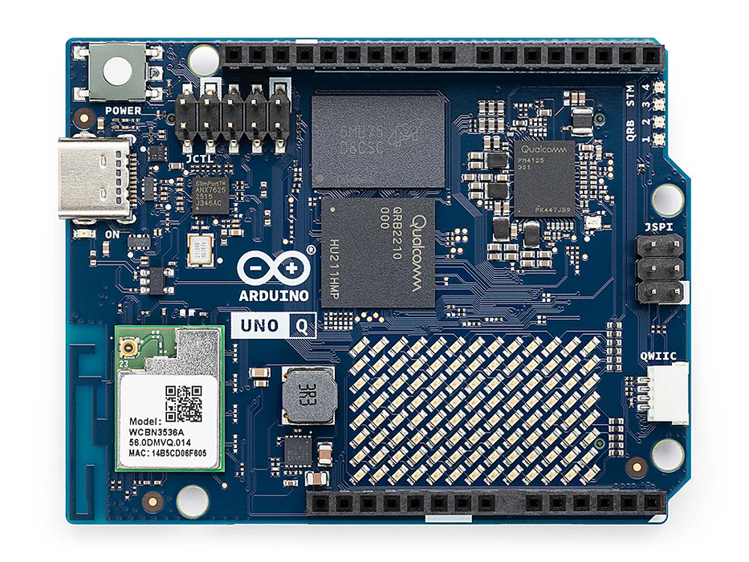
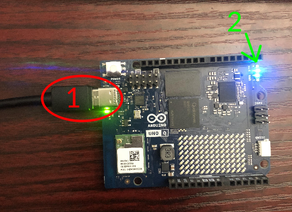

# Arduino Uno Q QuickStart
[Purchase the Arduino Uno Q](https://www.newark.com/arduino/abx00162/uno-q-sbc-2gb-arm-cortex-a53-m33f/dp/59AM1209)

1. [Introduction](#1-introduction)
2. [Requirements](#2-requirements)
3. [Hardware Setup](#3-hardware-setup)
4. [/IOTCONNECT: Cloud Account Setup](#4-iotconnect-cloud-account-setup)
5. [Device Setup](#5-device-setup)
6. [Onboard Device](#6-onboard-device)
7. [Using the Demo](#7-using-the-demo)
8. [Resources](#8-resources)

# 1. Introduction

This guide provides step-by-step instructions to set up the **Arduino Uno Q hardware** and integrate
it with **/IOTCONNECT**, Avnet's robust IoT platform. The Arduino Uno Q provides flexible options
for IoT application development, enabling secure device onboarding, telemetry collection, and over-the-air (OTA) updates.

<table>
  <tr>
    <td></td>
    <td>The Arduino UNO Q unlocks a new level of performance for the Arduino ecosystem, blending robust computing power 
from Qualcomm's advanced Dragonwing™ QRB2210 MPU running a full Debian Linux OS with upstream support, and the real-time 
responsiveness of a dedicated STM32U585 MCU running Arduino sketches over Zephyr OS - all on a single-board computer</td>
  </tr>
</table>

# 2. Requirements

This guide has been written and tested to work on a Windows 10/11 PC. However, there is no reason this can't be
replicated in other environments.

## Hardware

* Arduino Uno Q [Purchase](https://www.newark.com/arduino/abx00162/uno-q-sbc-2gb-arm-cortex-a53-m33f/dp/59AM1209) | [User Manual](https://docs.arduino.cc/tutorials/uno-q/user-manual/) | [All Resources](https://docs.arduino.cc/hardware/uno-q/)
* USB-C Cable (NOT included in kit)

## Software

### Android Debug Bridge (ADB)
To initially communicate with the Arduino Uno Q (until network connectivity is configured), users need to utilize ADB. 

To get ADB on a Windows host PC, users will need to download the Android SDK Platform Tools. It can be downloaded from 
[here](https://developer.android.com/tools/releases/platform-tools).

Unzip the downloaded file package, enter the directory `/platform-tools-latest-windows/platform-tools/` and then right-click and select "Open in Terminal" 
from the dropdown menu.

Leave this terminal window open to connect to the Arduino Uno Q in a later step.

For Linux or Mac host PCs, follow the instructions for install ADB on those platforms [here](https://docs.arduino.cc/tutorials/uno-q/adb/)
> [!IMPORTANT]
> It is not advised to follow the ADB installation instructions from that link for Windows host PCs as `winget` is not 
> always recognized.

# 3. Hardware Setup

See the reference image below for cable connections.
<details>
<summary>Reference Image with Connections</summary>

</details>

Using the above image as reference, make the following connections:

1. Connect the included USB-C cable from your PC to the USB-C connector labeled **#1**.

> [!NOTE]
> The Arduino Uno Q takes 30-60 seconds to boot up. The blue and green LEDs located under the **#2** arrow will 
> illuminate after the board has booted.

# 4. /IOTCONNECT: Cloud Account Setup

An /IOTCONNECT account with AWS backend is required. If you need to create an account, a free trial subscription is
available.
The free subscription may be obtained directly from iotconnect.io or through the AWS Marketplace.

* Option #1 (
  Recommended) [/IOTCONNECT via AWS Marketplace](https://github.com/avnet-iotconnect/avnet-iotconnect.github.io/blob/main/documentation/iotconnect/subscription/iotconnect_aws_marketplace.md) -
  60 day trial; AWS account creation required
* Option #2 [/IOTCONNECT via iotconnect.io](https://subscription.iotconnect.io/subscribe?cloud=aws) - 30 day trial; no
  credit card required

> [!NOTE]
> Be sure to check any SPAM folder for the temporary password after registering.

# 5. Device Setup

In the terminal window that was opened in the ADB setup, execute these commands to connect to the board:

```
./adb devices
```
```
./adb shell
```
> [!NOTE]
> For Linux and Mac host PCs, the device scanning and connection commands may slightly differ or require `sudo` 
> privileges. Reference the earlier-linked [ADB setup page](https://docs.arduino.cc/tutorials/uno-q/adb/) for more 
> instructions regarding these environments.

Once you are in the device's console execute this command (with your wireless network's SSID and password) to configure 
the network settings for your board:

```
sudo nmcli device wifi connect "YOUR-SSID" password "YOUR-PASSWORD"
```
> [!TIP]
> For example if your network's SSID was `HomeOffice` and the password was `Security123!` then the command you would enter 
> would be:
> ```
> sudo nmcli device wifi connect "HomeOffice" password "Security123!"
> ```

After that command you will be prompted to set and confirm a sudo password for your device. After doing so, execute this 
command to make your device autconnect to the network after rebooting in the future (again substituting in your actual SSID):

```
sudo nmcli connection modify "YOUR-SSID" connection.autoconnect-priority 10
```

Next, run these commands to update the core board packages and install necessary /IOTCONNECT packages:

```
sudo apt-get update
```

```
sudo apt-get install python3-pip -y
```

```
python3 -m pip install iotconnect-sdk-lite requests --break-system-packages
```

Then run these commands to create, gain ownership, and move into a directory for your demo files:

```
sudo mkdir -p /home/weston/demo && cd /home/weston/demo
```

```
sudo chown -R $USER:$USER /home/weston/demo
```

# 6. Onboard Device

The next step is to onboard your device into /IOTCONNECT. This will be done via the online /IOTCONNECT user interface.

Follow [this guide](../common/general-guides/UI-ONBOARD.md) to walk you through the process.

> [!TIP]
> If you have obtained a solution key for your /IOTCONNECT account from Softweb Solutions, you can utilize the /IOTCONNECT 
> REST API to automate the device onboarding process via shell scripts. Check out [this guide](../common/general-guides/REST-API-ONBOARD.md) 
> for more info on that.

# 7. Using the Demo

Run the basic demo with this command:

```
python3 app.py
```

> [!NOTE]
> Always make sure you are in the ```/home/weston/demo``` directory before running the demo. You can move to this
> directory with the command: ```cd /home/weston/demo```

View the random-integer telemetry data under the "Live Data" tab for your device on /IOTCONNECT.

# 8. Resources

* [Purchase the Arduino Uno Q](https://www.newark.com/arduino/abx00162/uno-q-sbc-2gb-arm-cortex-a53-m33f/dp/59AM1209)
* [/IOTCONNECT Overview](https://www.iotconnect.io/)
* [/IOTCONNECT Knowledgebase](https://help.iotconnect.io/)
