# Onboarding a Device to /IOTCONNECT via Online User Interface

## Prerequisite: /IOTCONNECT Cloud Account

If you do not yet have an /IOTCONNECT account, a free trial subscription with an AWS backend is available. The free subscription may be obtained directly from iotconnect.io or through the AWS Marketplace.

* Option #1 (Recommended) [/IOTCONNECT via AWS Marketplace](https://github.com/avnet-iotconnect/avnet-iotconnect.github.io/blob/main/documentation/iotconnect/subscription/iotconnect_aws_marketplace.md) - 60 day trial; AWS account creation required
* Option #2 [/IOTCONNECT via iotconnect.io](https://subscription.iotconnect.io/subscribe?cloud=aws) - 30 day trial; no credit card required

> [!NOTE]
> Be sure to check any SPAM folder for the temporary password after registering.

See the /IOTCONNECT [Subscription Information](https://github.com/avnet-iotconnect/avnet-iotconnect.github.io/blob/main/documentation/iotconnect/subscription/subscription.md) for more details on the trial.

## Onboarding Steps

Follow these steps to onboard your device into /IOTCONNECT via the online user interface.

1. In a web browser, navigate to console.iotconnect.io and log into your account.

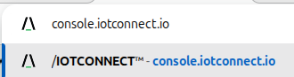

2. In the blue toolbar on the left edge of the page, hover over the "processor" icon and then in the resulting dropdown
   select "Device".

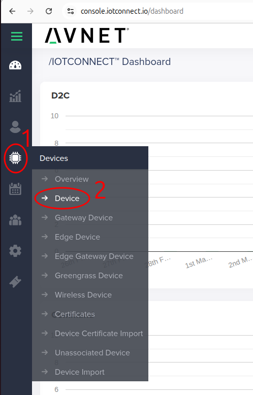

3. Now in the resulting Device page, click on the "Templates" tab of the blue toolbar at the bottom of the screen.

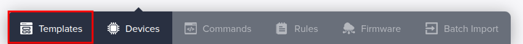

4. Right-click and then click "save link as" on [this link to the default device template](https://raw.githubusercontent.com/avnet-iotconnect/iotc-python-lite-sdk-demos/refs/heads/main/common/templates/plitedemo-template.json)
   to download the raw template file.

5. Back in the /IOTCONNECT browser tab, click on the "Create Template" button in the top-right of the screen.

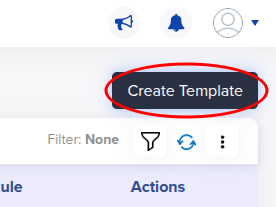

6. Click on the "Import" button in the top-right of the resulting screen.

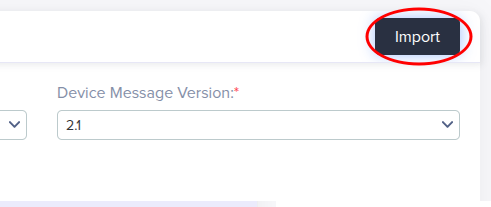

7. Select your downloaded copy of the plitedemo template from sub-step 4 and then click "save".

8. Click on the "Devices" tab of the blue toolbar at the bottom of the screen.

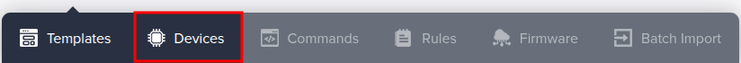

9. In the resulting page, click on the "Create Device" button in the top-right of the screen.

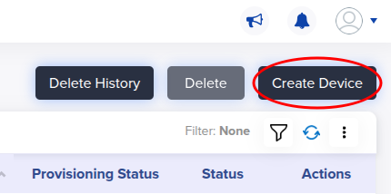

10. Customize the "Unique ID" and "Device Name" fields to your needs (both fields should be identical though).

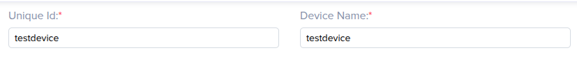

11. Select the most appropriate option for your device from the "Entity" dropdown (only for organization, does not
    affect connectivity).

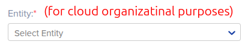

12. Select "plitedemo" from the "Template" dropdown.

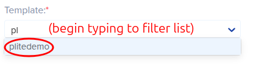

13. In the resulting "Device Certificate" field, select "Use my certificate." Leave this page as-is for now, you will finish it later.

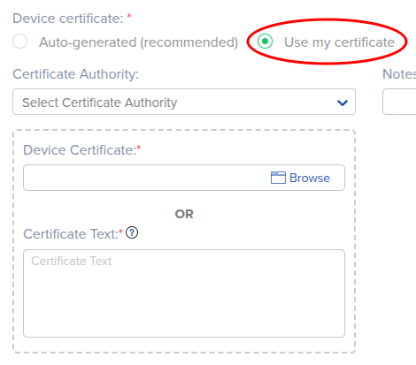

14. Swapping over to the terminal of your device, download and execute the Python Lite SDK QuickStart script:

```
cd /opt/demo && wget https://raw.githubusercontent.com/avnet-iotconnect/iotc-python-lite-sdk-demos/refs/heads/main/common/scripts/quickstart.sh && bash ./quickstart.sh
```

15. When prompted, press ENTER to have the script print out the generated device certificate.

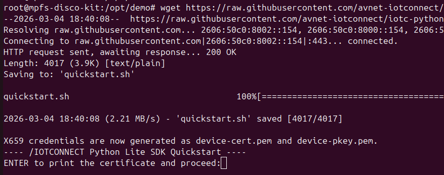

*(before pressing ENTER)*

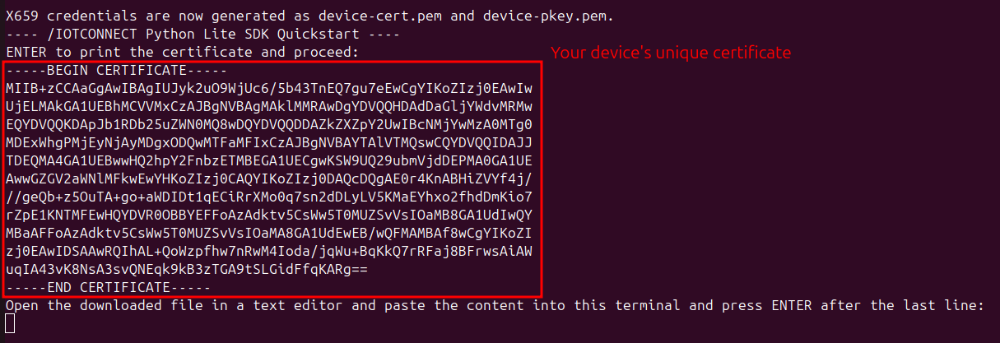

*(after pressing ENTER)*

16. Copy the device certificate text (including BEGIN and END lines) and paste the text into the certificate box in the /IOTCONNECT device creation page.

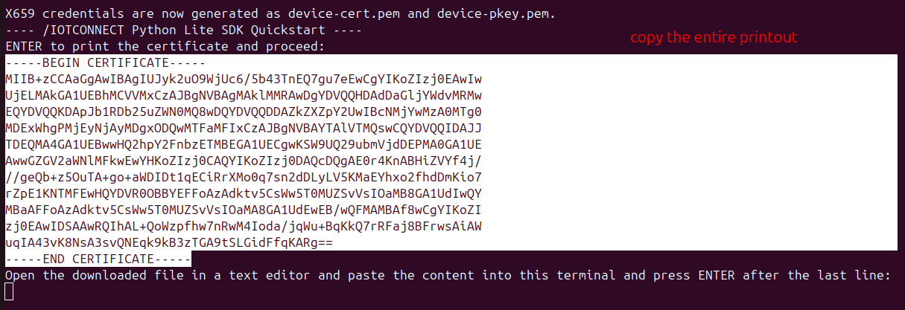

17. Click the "Save and View" button to go to the page for your new device.

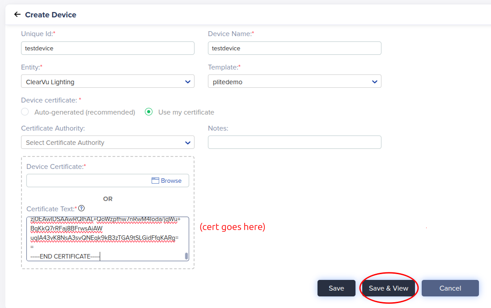

18. Now on your device's page in /IOTCONNECT, click on the black/white/green paper-and-cog icon in the top-right of the
    device page (just above "Connection Info") to download your device's configuration file.

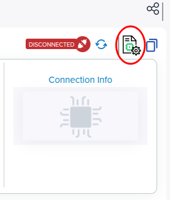

19. Open the configuration file in a text editor and copy its entirety to your clipboard.

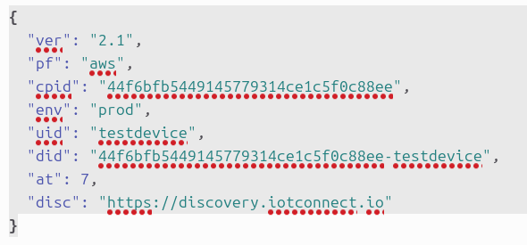

20. Back in the terminal of your device, paste the contents of the configuration file from your clipboard as instructed by the next step
    of the script, and then press ENTER.

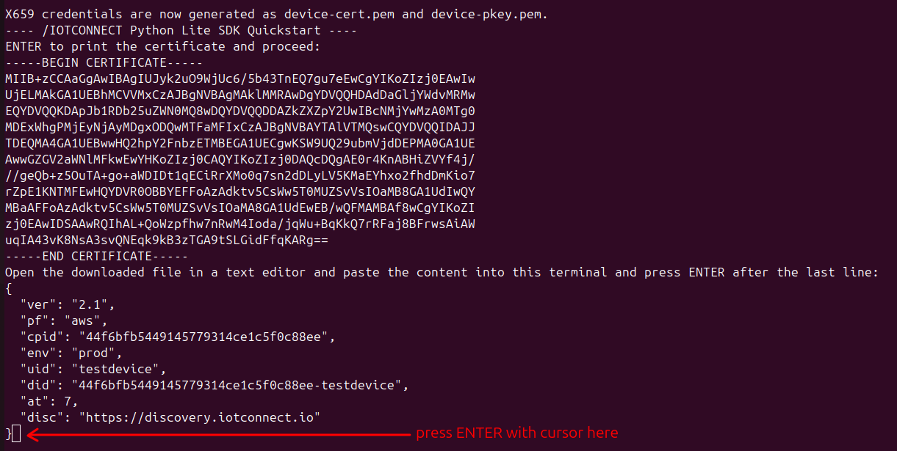

21. The script will then download the basic starter app (app.py). The onboarding process is complete.

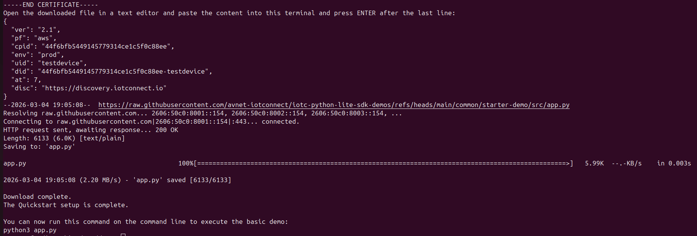