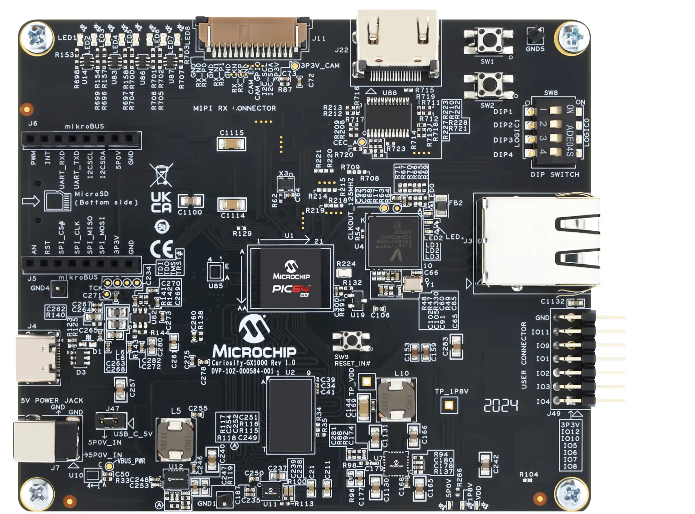
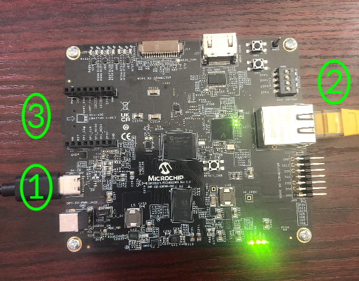

# Microchip Curiosity PIC64GX1000 Kit QuickStart

1. [Introduction](#1-introduction)
2. [Requirements](#2-requirements)
3. [Hardware Setup](#3-hardware-setup)
4. [/IOTCONNECT: Cloud Account Setup](#4-iotconnect-cloud-account-setup)
5. [Device Setup](#5-device-setup)
6. [Onboard Device](#6-onboard-device)
7. [Using the Demo](#7-using-the-demo)
8. [Resources](#8-resources)

# 1. Introduction

This guide provides step-by-step instructions to set up the **Microchip Curiosity PIC64GX1000 Kit hardware** and integrate
it with **/IOTCONNECT**, Avnet's robust IoT platform. The Curiosity PIC64GX1000 Kit hardware platform provides flexible options
for IoT application development, enabling secure device onboarding, telemetry collection, and over-the-air (OTA) updates.

<table>
  <tr>
    <td></td>
    <td>The Curiosity PIC64GX1000 Kit features a quad-core, 64-bit CPU cluster based on the RISC-V application-class 
processor that supports Linux® and real-time applications, a rich set of peripherals. The kit is ready for rapid testing 
of applications in an easy-to-use hardware development platform and offers a MikroBUS™ expansion header for Click boards™, 
a ™ MIPI®  CSI 2 Rx  connector, and an HDMI output. The expansion boards can be controlled using protocols like I2C and SPI. 
1GB of DDR4 memory is available as well as a microSD® card slot for booting Linux. Communication interfaces include one 
Gigabit Ethernet connector and three UART connections via the USB type C connector and debug via the USB-to-JTAG channel.</td>
  </tr>
</table>

# 2. Requirements

This guide has been written and tested to work on a Windows 10/11 PC. However, there is no reason this can't be
replicated in other environments.

## Hardware

* Microchip Curiosity PIC64GX1000 Kit [Purchase](https://www.newark.com/microchip/curiosity-pic64gx1000-kit/curiosity-kit-64bit-risc-v-quad/dp/46AM3917) | [User Manual & Kit Contents](https://ww1.microchip.com/downloads/aemDocuments/documents/MPU64/ProductDocuments/SupportingCollateral/PIC64GX_Curiosity_Kit_User_Guide.pdf) | [All Resources](https://www.microchip.com/en-us/development-tool/curiosity-pic64gx1000-kit)
* Ethernet Cable
* USB-C Cable (included in kit)
* Micro-SD card (included in kit)

## Software

* A serial terminal such as [TeraTerm](https://github.com/TeraTermProject/teraterm/releases)
  or [PuTTY](https://www.putty.org/)
* (**FOR WINDOWS USERS**) Visual Studio with MPLAB PIC64GX SDK Visual Studio Code extension (see [step 4](#4-software-setup))


# 3. Hardware Setup

See the reference image below for cable connections.
<details>
<summary>Reference Image with Connections</summary>

</details>

Using the above image as reference, make the following connections:

1. Connect the included USB-C cable from your PC to the USB-C connector labeled **#1**.
2. Connect an Ethernet cable from your LAN (router/switch) to the Ethernet connector labeled **#2**.
3. Ensure that the included Micro-SD card is fully-seated (should click) into the Micro-SD card slot on the board, labeled **#3**.

# 4. /IOTCONNECT: Cloud Account Setup

An /IOTCONNECT account with AWS backend is required. If you need to create an account, a free trial subscription is
available.
The free subscription may be obtained directly from iotconnect.io or through the AWS Marketplace.

* Option #1 (
  Recommended) [/IOTCONNECT via AWS Marketplace](https://github.com/avnet-iotconnect/avnet-iotconnect.github.io/blob/main/documentation/iotconnect/subscription/iotconnect_aws_marketplace.md) -
  60 day trial; AWS account creation required
* Option #2 [/IOTCONNECT via iotconnect.io](https://subscription.iotconnect.io/subscribe?cloud=aws) - 30 day trial; no
  credit card required

> [!NOTE]
> Be sure to check any SPAM folder for the temporary password after registering.

# 5. Device Setup

To serially communicate with the Curiosity PIC64GX1000 Kit, Windows and Linux users will each need to follow their own 
additional steps laid out in [Microchip's Curiosity PIC64GX1000 Kit Quickstart Guide](https://ww1.microchip.com/downloads/aemDocuments/documents/MPU64/ProductDocuments/UserGuides/production-kit-qsguide/Curiosity-PIC64GX1000-Kit_QSGuide.pdf).

For Windows users, see step 3.1 of the guide.

For Linux users, see step 3.2 of the guide.

> [!IMPORTANT]
> **For Linux users**, when copying the contents of the `70-microchip.rules.` file, ensure that newlines are placed appropriately. 
> In the QuickStart Guide there is an instance of text-wrapping (lines 4-5 should be a single line) that will cause the file to 
> malfunction. To help mitigate this possible issue, the `70-microchip.rules` file has been uploaded to this directory [here](70-microchip.rules) 
> so it can be directly copied from with proper formatting.

After completing those setup steps, move to step 4.1 of the guide to boot and establish serial communication on the 
USB-C port of the board.

> [!NOTE]
> You will be prompted to set a new password after your first login under the `ubuntu` username with the password `ubuntu`.
> Users can set the new password to anything they prefer.

After logging in, run these commands to update the core board packages and install necessary /IOTCONNECT packages:

```
sudo tee /etc/apt/sources.list > /dev/null <<'EOF'
deb http://ports.ubuntu.com/ubuntu-ports noble main restricted universe multiverse
deb http://ports.ubuntu.com/ubuntu-ports noble-updates main restricted universe multiverse
deb http://ports.ubuntu.com/ubuntu-ports noble-security main restricted universe multiverse
deb http://ports.ubuntu.com/ubuntu-ports noble-backports main restricted universe multiverse
EOF
```

```
sudo rm -f /etc/apt/sources.list.d/ubuntu.sources
```

```
sudo apt-get clean
```

```
sudo apt-get update
```

>[!NOTE]
> `sudo apt-get update` may take multiple minutes to complete.

```
sudo apt-get install python3-pip -y
```

```
python3 -m pip install iotconnect-sdk-lite requests --break-system-packages
```

Then run these commands to create and move into a directory for your demo files:

```
sudo mkdir -p /home/weston/demo && cd /home/weston/demo
```

```
sudo chown -R $USER:$USER /home/weston/demo
```

> [!TIP]
> To gain access to "copy" and "paste" functions inside of a Putty terminal window, you can CTRL+RIGHTCLICK within the
> window to utilize a dropdown menu with these commands. This is very helpful for copying/pasting between your browser and
> the terminal.


# 6. Onboard Device

The next step is to onboard your device into /IOTCONNECT. This will be done via the online /IOTCONNECT user interface.

Follow [this guide](../common/general-guides/UI-ONBOARD.md) to walk you through the process.

# 7. Using the Demo

Run the basic demo with this command:

```
python3 app.py
```

> [!NOTE]
> Always make sure you are in the ```/home/weston/demo``` directory before running the demo. You can move to this
> directory with the command: ```cd /home/weston/demo```

View the random-integer telemetry data under the "Live Data" tab for your device on /IOTCONNECT.

# 8. Resources

* [Purchase the Microchip Curiosity PIC64GX1000 Kit](https://www.newark.com/microchip/curiosity-pic64gx1000-kit/curiosity-kit-64bit-risc-v-quad/dp/46AM3917)
* [More /IOTCONNECT Microchip Guides](https://avnet-iotconnect.github.io/partners/microchip/)
* [/IOTCONNECT Overview](https://www.iotconnect.io/)
* [/IOTCONNECT Knowledgebase](https://help.iotconnect.io/)
