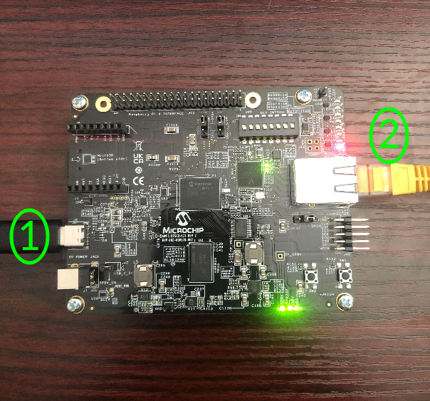

# Microchip PolarFire SoC Discovery Kit QuickStart
 [Purchase Microchip PolarFire SoC Discovery Kit](https://www.newark.com/microchip/mpfs-disco-kit/discovery-kit-64bit-risc-v-polarfire/dp/97AK2474)
1. [Introduction](#1-introduction)
2. [Requirements](#2-requirements)
3. [Hardware Setup](#3-hardware-setup)
4. [Software Setup](#4-software-setup)
5. [/IOTCONNECT: Cloud Account Setup](#5-iotconnect-cloud-account-setup)
6. [Device Setup](#6-device-setup)
7. [Onboard Device](#7-onboard-device)
8. [Using the Demo](#8-using-the-demo)
9. [Going Further](#9-going-further)
10. [Resources](#10-resources)

# 1. Introduction

This guide provides step-by-step instructions to set up the **Microchip PolarFire SoC Discovery Kit hardware** and integrate
it with **/IOTCONNECT**, Avnet's robust IoT platform. The PolarFire SoC Discovery Kit hardware platform provides flexible options
for IoT application development, enabling secure device onboarding, telemetry collection, and over-the-air (OTA) updates.

<table>
  <tr>
    <td></td>
    <td>This open-source development kit features a quad-core, 64-bit CPU cluster based on the RISC-V application-class 
processor that supports Linux® and real-time applications, a rich set of peripherals and 95K of low-power, high-performance 
FPGA logic elements. The kit is ready for rapid testing of applications in an easy-to-use hardware development platform and 
offers a mikroBUS™ expansion header for Click boards™, a 40-pin Raspberry Pi™ connector, and a MIPI® video connector. 
The expansion boards can be controlled using protocols like I2C and SPI. One GB of DDR4 memory is available as well as 
a microSD® card slot for booting Linux. Communication interfaces include one Gigabit Ethernet connector and three UART 
connections via the USB type C connector. An on-board FlashPro5 programmer is available to program and debug the PolarFire 
FPGA through USB-to-JTAG channel.</td>
  </tr>
</table>

# 2. Requirements

This guide has been written and tested to work on a Windows 10/11 PC. However, there is no reason this can't be
replicated in other environments.

## Hardware

* Microchip PolarFire SoC Discovery Kit [Purchase](https://www.newark.com/microchip/mpfs-disco-kit/discovery-kit-64bit-risc-v-polarfire/dp/97AK2474) | [User Manual & Kit Contents](https://ww1.microchip.com/downloads/aemDocuments/documents/FPGA/ProductDocuments/UserGuides/PolarFire_SoC_FPGA_Discovery_Kit_User_Guide.pdf) | [All Resources](https://www.microchip.com/en-us/development-tool/mpfs-disco-kit)
* Ethernet Cable
* USB-C Cable (included in kit)
* SanDisk 8GB UHS-1 Class 10 Micro-SD card (available [here](https://www.amazon.com/SanDisk-Industrial-MicroSD-SDSDQAF3-008G-I-Adapter/dp/B07BZ5SY18/ref=sr_1_4?crid=360H9A81QLNK9&dib=eyJ2IjoiMSJ9.fJWARiyPCzdh0zksHaXihTpM4ELLohYxpV4AVAFi107f7TjrzADYC7tr8UjvghCwfCAk7BLTzbgn6_jTNMDv6lSkED8zjlCYBMLxpwgqLUOmEPb0XXTc0rMbt9MHx7kkFJdKpZ_iFFE7b9XGyvPxElLRvzl7s4GYW7ThzZP2kj1-bcvZg6vp6EDKNBm5NdvW-AlQmk1BfYPHz2-6xyUgP2VTI4HknDTHhY1kUqp9JB4.hOOSnRKZmLV0wJdTT4qFKMg413rz5AnPpEFy07uLurk&dib_tag=se&keywords=sandisk+8gb+micro+sd+card&qid=1759769517&sprefix=sandisk+8gb+micro+sd+card%2Caps%2C147&sr=8-4))

> [!IMPORTANT]
> The PolarFire SoC Discovery Kit **requires a SanDisk-brand Micro-SD card**. Other brands of SD cards **will fail to boot** 
> due to specific memory-mapping requirements in the bootloader.

## Software

* A serial terminal such as [TeraTerm](https://github.com/TeraTermProject/teraterm/releases)
  or [PuTTY](https://www.putty.org/)
* An SD-Card flashing utility such as [Balena Etcher](https://etcher.balena.io/)
* Microchip FlashPro Express
  * Download the latest "Programming and Debug" package for your OS [from this page](https://www.microchip.com/en-us/products/fpgas-and-plds/fpga-and-soc-design-tools/programming-and-debug/lab)
and then run extract/execute the installer (may require admin/sudo privileges).


# 3. Hardware Setup

See the reference image below for cable connections.
<details>
<summary>Reference Image with Connections</summary>

</details>

Using the above image as reference, make the following connections:

1. Connect the included USB-C cable from your PC to the USB-C connector labeled **#1**.
2. Connect an Ethernet cable from your LAN (router/switch) to the Ethernet connector labeled **#2**.

# 4. Software Setup

## Update FPGA

1. Download the latest pre-built programming file (MPFS_DISCOVERY_KIT_XXXX_XX.zip) from [here](https://github.com/polarfire-soc/polarfire-soc-discovery-kit-reference-design/releases)
and then extract the package and locate the **.job** file. 
2. Ensure that the board is connected to your PC via the USB-C cable, as instructed in the Hardware Setup.
3. Open FlashPro Express, and start a new project. In the "Import 
FlashPro Express job file" browse section, select the downloaded .job file. For the project location, simply choose the 
same downloaded/extracted folder that contains the .job file. Select "Ok" to open the new project.
4. After the new project has loaded, click the "RUN" button to flash the board.
5. After the flash has completed, unplug and re-plug in the board to power-cycle and ensure the new programming is in effect.

## Flash Linux Image

1. Download the latest Linux Image release for the PolarFire SoC Discovery Kit by navigating [the linux4microchip PolarFire
SoC Releases page](https://github.com/linux4microchip/meta-mchp/releases), scrolling down to the "Pre-built images for 
the Discovery Kit Reference Design" section and clicking on the "pre-built image" link. The downloaded filename should
be similar to "mchp-base-image-mpfs-disco-kit.rootfs-20250725104508.wic.gz" with only the timestamp potentially being different 
depending on what the latest release is at the time.
2. Extract the downloaded image so that you have a **.wic** file to flash. Attempting to flash the compressed .gz file 
is known to cause issues with the bootloader.
3. Use an SD-Card flashing utility such as Balena Etcher to flash the .wic image file onto your SanDisk-branded micro-SD
card.
4. After flashing, insert the Micro-SD card into the Micro-SD card slot on the PolarFire SoC Discovery Kit.
5. Unplug and replug the board to power-cycle it.

# 5. /IOTCONNECT: Cloud Account Setup

An /IOTCONNECT account with AWS backend is required. If you need to create an account, a free trial subscription is
available.
The free subscription may be obtained directly from iotconnect.io or through the AWS Marketplace.

* Option #1 (
  Recommended) [/IOTCONNECT via AWS Marketplace](https://github.com/avnet-iotconnect/avnet-iotconnect.github.io/blob/main/documentation/iotconnect/subscription/iotconnect_aws_marketplace.md) -
  60 day trial; AWS account creation required
* Option #2 [/IOTCONNECT via iotconnect.io](https://subscription.iotconnect.io/subscribe?cloud=aws) - 30 day trial; no
  credit card required

> [!NOTE]
> Be sure to check any SPAM folder for the temporary password after registering.

# 6. Device Setup

1. Open a serial terminal emulator program such as TeraTerm.
2. Ensure that your serial settings in your terminal emulator are set to:

- Baud Rate: 115200
- Data Bits: 8
- Stop Bits: 1
- Parity: None

3. Check your device manager list and see that there are 3 COM port entries for your PolarFire SoC Discovery Kit. Connect 
to the **middle-numbered port.** For example, given these COM ports:

* COM10
* COM11
* COM12

You would connect to COM11.

> [!NOTE]
> A successful connection may result in just a blank terminal box. If you see a blank terminal box, press the ENTER key
> to get a login prompt. An unsuccessful connection attempt will usually result in an error window popping up.

4. When prompted for a login, type `root` followed by the ENTER key.
5. Run these commands to update the core board packages and install necessary /IOTCONNECT packages:

```
sudo opkg update
```

```
python3 -m pip install iotconnect-sdk-lite requests
```

6. Then run these commands to create and move into a directory for your demo files:

```
mkdir -p /opt/demo && cd /opt/demo
```

> [!TIP]
> To gain access to "copy" and "paste" functions inside of a PuTTY terminal window, you can CTRL+RIGHTCLICK within the
> window to utilize a dropdown menu with these commands. This is very helpful for copying/pasting between your browser and
> the terminal.


# 7. Onboard Device

The next step is to onboard your device into /IOTCONNECT. This will be done via the online /IOTCONNECT user interface.

Follow [this guide](../common/general-guides/UI-ONBOARD.md) to walk you through the process.

# 8. Using the Demo

Run the basic demo with this command:

```
python3 app.py
```

> [!NOTE]
> Always make sure you are in the ```/opt/demo``` directory before running the demo. You can move to this
> directory with the command: ```cd /opt/demo```

View the random-integer telemetry data under the "Live Data" tab for your device on /IOTCONNECT.

# 9. Going Further

Three expansion demos build on this quickstart to demonstrate machine learning inference acceleration on the PolarFire SoC FPGA fabric. Each demo programs a demo-specific FPGA image, deploys a Python + ELF runtime package, and uses `/IOTCONNECT` commands (`classify`, `bench`) to compare software vs hardware inference.

- [Machine Learning Classifier](ml-classifier/): deterministic template-correlation classifier — fastest bring-up path
- [Tiny Neural Network Accelerator](ml-tiny-nn-accelerator/): compact fixed-point neural network — intro to true neural network accelerator flow
- [Complex Neural Network Accelerator](ml-complex-accelerator/): larger model + batching — clearest end-to-end HW acceleration


Expected end state in `/IOTCONNECT` (Complex Neural Network Accelerator dashboard example):


Technical deep dive: [tech-reference.md](tech-reference.md)

# 10. Resources

* [Purchase the Microchip PolarFire SoC Discovery Kit](https://www.newark.com/microchip/mpfs-disco-kit/discovery-kit-64bit-risc-v-polarfire/dp/97AK2474)
* [More /IOTCONNECT Microchip Guides](https://avnet-iotconnect.github.io/partners/microchip/)
* [/IOTCONNECT Overview](https://www.iotconnect.io/)
* [/IOTCONNECT Knowledgebase](https://help.iotconnect.io/)
