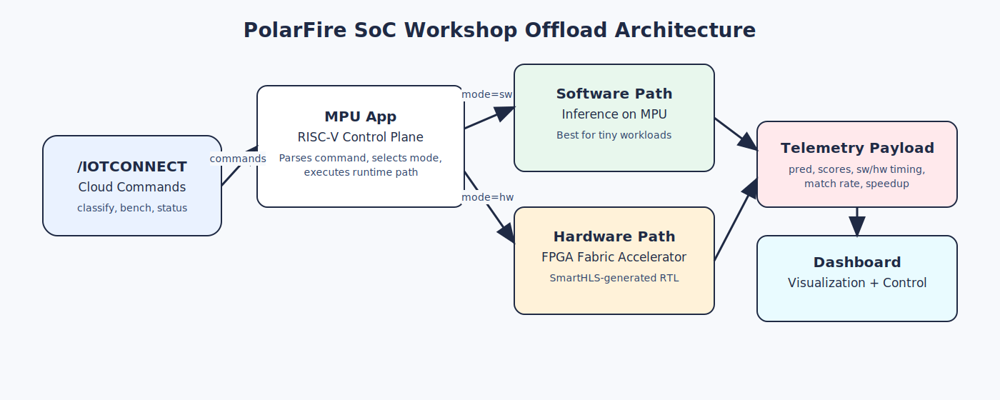
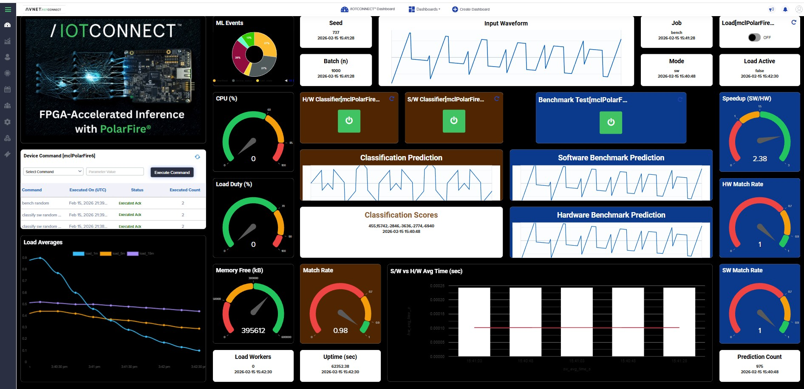
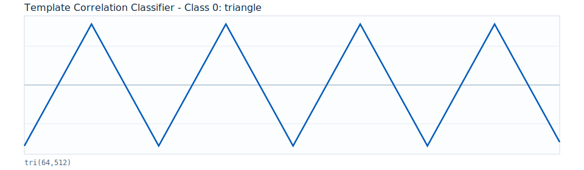
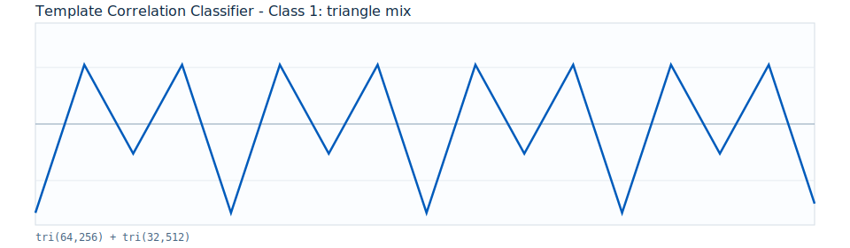
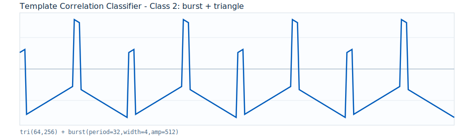
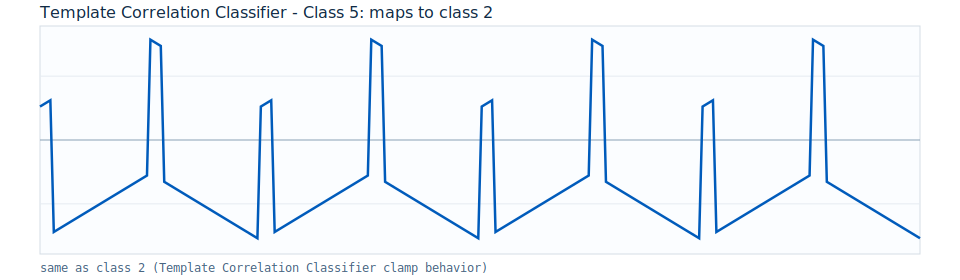

# /IOTCONNECT Template Correlation Classifier Expansion Demo

This is a deterministic template-correlation classifier demo for validating end-to-end cloud command/control and telemetry on the Microchip PolarFire SoC.

This is add-on to the QuickStart which is a prerequsite: [Microchip PolarFire SoC Discovery Kit QuickStart](../README.md)

> [!IMPORTANT]
> You must complete the QuickStart guide, above, before proceeding.

## 1. Introduction

Unlike the other expansion demos, this one does not use a neural network. Classification works by correlating each 256-sample input waveform against three hand-crafted reference templates using dot products — the class whose template scores highest wins. There are no learned weights, no hidden layers, and no training step.

The FPGA accelerator implements the correlation MAC engine in hardware. Because the algorithm is simple and fully deterministic, this demo is the easiest to reason about end-to-end, but classification quality is bounded by how well the hand-crafted templates represent the signal classes.



### Built-In Application Flows

- **`classify`**: functional demonstration — select `sw` or `hw`, choose an input class (or `random`), run inference. Telemetry focuses on prediction behavior (`pred`, `scores_csv`, timing, batch stats).
- **`bench`**: performance demonstration — runs SW, HW, or both and publishes benchmark telemetry (`sw_avg_time_s`, `hw_avg_time_s`, `speedup_sw_over_hw`).

Because the correlation computation is so lightweight, SW and HW timings are close — this demo intentionally exposes that baseline overhead behavior before introducing larger models.

## 2. Program FPGA with Template Correlation Classifier Accelerator Image

The quickstart programmed the board with the stock Microchip reference design. This step replaces it with a demo-specific FPGA image that includes the template-correlation accelerator in the FPGA fabric, which is required for `hw` mode inference.

1. Open FlashPro Express.
2. Download the Template Correlation Classifier FPGA job file [here](https://raw.githubusercontent.com/avnet-iotconnect/iotc-python-lite-sdk-demos/main/microchip-polarfire-soc-dk/ml-template-correlation-classifier/assets/fpga-job/MPFS_DISCOVERY_KIT_TEMPLATE_CLASSIFIER.job) (right-click, "save as").
3. Create/open project with `MPFS_DISCOVERY_KIT_TEMPLATE_CLASSIFIER.job`.
4. Click `RUN` to program board.
5. Power-cycle board after programming.

## 3. Import Template and Dashboard

### Import Device Template

1. In `/IOTCONNECT`, go to `Devices` -> `Device` -> `Templates` -> `Create Template` -> `Import`.
2. Download and import the device template [here](https://raw.githubusercontent.com/avnet-iotconnect/iotc-python-lite-sdk-demos/main/microchip-polarfire-soc-dk/ml-template-correlation-classifier/microchip-polarfire-ml-template.json). (right-click and "save link as")
3. Save.

### Switch Device to New Template

Upgrading from the basic quickstart demo to this demo requires a template change (to `Microchip Polarfire ML`) for the device in /IOTCONNECT. Navigate to your device's page in the online /IOTCONNECT platform and change the device's template from `plitedemo` to `Microchip Polarfire ML`.

> [!TIP]
> All three PolarFire SoC ML demos share the same device template (`Microchip Polarfire ML`), so if you have already set it for one demo you do not need to set it again.

### Import Dashboard

1. Open /IOTCONNECT and go to **Dashboard**.
2. Download dashboard template [here](https://raw.githubusercontent.com/avnet-iotconnect/iotc-python-lite-sdk-demos/main/microchip-polarfire-soc-dk/ml-template-correlation-classifier/mchp-classifier-dashboard.json) (right-click and "save link as"), then click **Import Dashboard** and upload the JSON file.
3. Save the imported dashboard and map it to the correct device/template.

## 4. Deploy and Run

### Download package on board

```bash
wget -P /opt/demo https://raw.githubusercontent.com/avnet-iotconnect/iotc-python-lite-sdk-demos/main/microchip-polarfire-soc-dk/ml-template-correlation-classifier/package.tar.gz
```

### Install and run

```bash
cd /opt/demo && rm -f package.tar.gz.* && tar -xzf package.tar.gz --overwrite && bash ./install.sh && (pkill -f app.py || true) && python3 app.py
```

## 5. Verify Data

Expected dashboard end state:



### What You Are Seeing

- Interactive controls:
  - `H/W Classifier` button sends `classify hw random 1000`
  - `S/W Classifier` button sends `classify sw random 1000`
  - `Benchmark Test` button sends `bench random`
  - `Load` switch sends `load` start/stop actions
  - `Device Command` panel lets you run custom command + parameter pairs
- Key live result widgets:
  - `Input Waveform` shows the selected input class shape
  - `Classification Prediction` shows latest classify prediction (`pred`)
  - `Software Benchmark Prediction` and `Hardware Benchmark Prediction` show `sw_pred` and `hw_pred`
  - `S/W vs H/W Avg Time (sec)` compares SW and HW average time (bar vs line)
  - `Speedup (SW/HW)` shows `sw_avg_time_s / hw_avg_time_s`
  - `HW Match Rate`, `SW Match Rate`, `Match Rate`, `Prediction Count`, `Seed`, `Batch (n)`, `Mode`, and `Job` reflect latest telemetry

### Guided Dashboard Demo

1. Confirm device health and telemetry flow.
   - In `Device Command`, select `status`, enter parameter `basic`, and click `Execute Command`.
   - Expected result:
     - Command table shows `Executed Ack`.
     - `ML Events` includes `device_status`.
     - `CPU (%)`, `Load Averages`, `Memory Free (kB)`, `Load Active`, and `Load Workers` refresh.

2. Run classifier demos from dashboard buttons.
   - Click the green power button in `H/W Classifier`.
   - Click the green power button in `S/W Classifier`.
   - Expected result:
     - `Mode` flips between `hw` and `sw` as commands complete.
     - `Seed`, `Batch (n)`, and `Input Waveform` update.
     - `Classification Prediction`, `Classification Scores`, `Match Rate`, and `Prediction Count` refresh.
     - Command table logs classify acknowledgements.

3. Run benchmark demo and interpret acceleration.
   - Click the green power button in `Benchmark Test`.
   - For deterministic comparison, also run this from `Device Command`:

```text
bench both 2 11 1000
```

   - Expected result:
     - `Software Benchmark Prediction` and `Hardware Benchmark Prediction` update.
     - `S/W vs H/W Avg Time (sec)` adds new points (SW bars, HW line).
     - `Speedup (SW/HW)` rises above `1.0` when HW is faster than SW.
     - `SW Match Rate` and `HW Match Rate` update with the benchmark run.

4. Scale the batch size to make trends easier to observe.
   - Run:

```text
bench both 2 11 2000
bench both 2 11 4000
```

5. Optional stress test while benchmarking.
   - Use the `Load` switch, or run explicit commands from `Device Command`:

```text
load start 2 60
load stop
```

## 6. Command Reference

Use the `Device Command` widget to run any command below.

#### `classify`

Description: run classification in `sw` or `hw` mode.

Valid format:

```text
classify <mode> <class_id> <seed> [batch]
classify <mode> random [batch]
classify mode=<mode> class=<class_id|random> seed=<seed|random> [batch=<n>]
```

Valid values:

- `<mode>`: `sw` or `hw`
- `<class_id>`: integer `0..5`
- Template Correlation Classifier waveform behavior: classes `0..2` are native; `3..5` map to class `2` behavior
- `random` class: current runtime chooses from classes `0..2`
- `<seed>`: integer or `random` (`random` generates `1..1000`)
- `<n>` / `[batch]`: integer `1..10000` (default `1`)

Examples:

```text
classify hw 2 11
classify sw random 1000
classify mode=hw class=2 seed=42 batch=256
```

#### `bench`

Description: run benchmark in `sw`, `hw`, or `both` and publish timing/match metrics.

Valid format:

```text
bench <mode> <class_id> <seed> <batch>
bench random [batch]
bench mode=<mode> class=<class_id|random> seed=<seed|random> batch=<n>
```

Valid values:

- `<mode>`: `sw`, `hw`, or `both`
- `<class_id>`: integer `0..5`
- Template Correlation Classifier waveform behavior: classes `0..2` are native; `3..5` map to class `2` behavior
- `random` class: current runtime chooses from classes `0..2`
- `<seed>`: integer or `random` (`random` generates `1..1000`)
- `<batch>` / `<n>`: integer `1..10000`
- If you use `bench random`, default mode is `both` and default batch is `1000`

Examples:

```text
bench random
bench both 2 11 1000
bench hw 1 77 512
```

#### `status`

Description: publish device status telemetry (CPU, memory, load, uptime, optional LED summary).

```text
status basic
status full
status include_leds=<true|false>
```

#### `load`

Description: start/stop/query synthetic CPU load workers.

```text
load <start|stop|status> [workers] [duty_pct]
```

Examples:

```text
load start 2 60
load status
load stop
```

#### `led`

Description: inspect or control board LEDs.

```text
led list
led get [<index_or_name>]
led set <index_or_name> <on|off|toggle>
led <8-bit-01-string>
led pattern <blink|chase|alternate> [cycles] [interval_ms]
led stop
```

## 7. Waveform Class Reference

| Class | Base waveform |
|---|---|
| `0` | triangle |
| `1` | triangle mix (64 + 32 periods) |
| `2` | burst + triangle |
| `3..5` | accepted by parser, mapped to class `2` behavior in Template Correlation Classifier runtime |

Representative base waveforms:

<p>
  
  
  
</p>

<p>
  
  
  
</p>

## 8. Project Organization

- `developer-guide.md`: full source regeneration flow (SmartHLS + Libero)
- `assets/fpga-job/`: prebuilt FlashPro `.job` and implementation reports
- `assets/smarthls-module/`: SmartHLS accelerator source
- `src/`: runtime Python app, installer, and runtime ELFs
  - `src/runtimes/invert_and_threshold.no_accel.elf`
  - `src/runtimes/invert_and_threshold.accel.elf`
- Technical reference: [tech-reference.md](../tech-reference.md)

## 9. Resources

- Base platform quickstart: [README.md](../README.md)
- Technical white paper: [tech-reference.md](../tech-reference.md)
- [Purchase the Microchip PolarFire SoC Discovery Kit](https://www.newark.com/microchip/mpfs-disco-kit/discovery-kit-64bit-risc-v-polarfire/dp/97AK2474)
