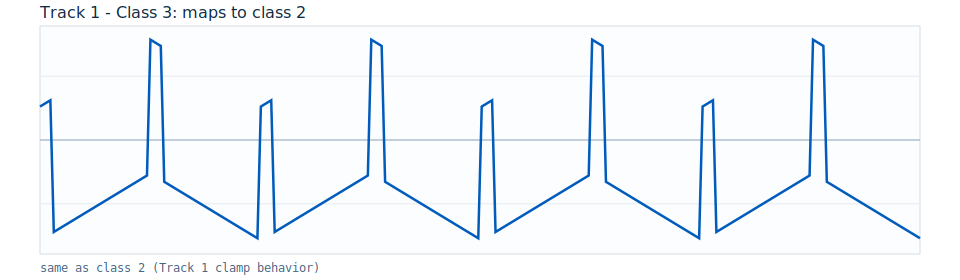
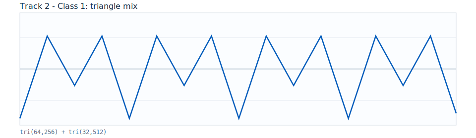
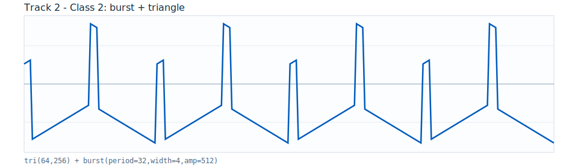
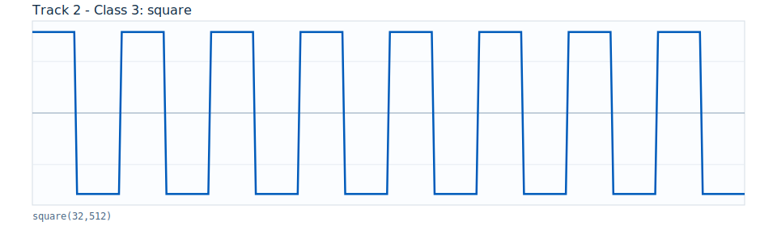
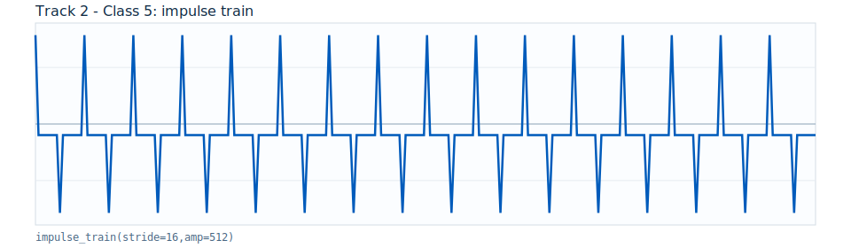
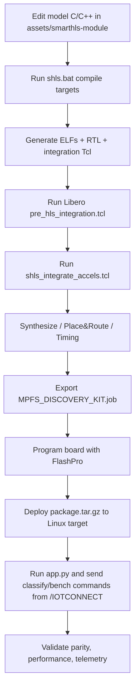

# Technical White Paper: PolarFire SoC TinyML Workshop Stack (Tracks 1-3)

## 1. Purpose and Scope

This document is the single technical reference for the three expansion demo tracks:

- `track1-iotc-ml-classifier`
- `track2-iotc-ml-nn-accelerator`
- `track3-iotc-ml-complex-accelerator`

It explains, from a coding and implementation perspective:

- how synthetic input waveforms are generated
- how each classifier model is implemented in C/C++
- how SmartHLS synthesizes accelerator C/C++ into RTL (`.v`/`.vhd`)
- where integration scripts and generated HDL files are located
- how software and hardware implementations are tested and benchmarked

---

## 2. System-Level Context

The three workshop tracks run the same end-to-end architecture: `/IOTCONNECT` sends commands to a Linux application on the PolarFire SoC processor complex, and that application executes either CPU inference or FPGA-accelerated inference, then publishes telemetry back to cloud dashboards.


The SoC-level view above is useful for understanding partitioning: the RISC-V processor subsystem handles Linux, networking, command parsing, and telemetry, while the FPGA fabric handles deterministic compute kernels synthesized from SmartHLS C/C++.


The project top-level view above is the concrete workshop design integration point in Libero: accelerator RTL is inserted into the existing reference design and connected through AXI/FIC interconnect paths so Linux software can invoke it.

### 2.1 Runtime Control Plane (Cloud to App)

1. `/IOTCONNECT` command arrives (e.g. `classify`, `bench`, `status`, `led`, `load`).
2. `src/app.py` parses command arguments, validates mode/batch/seed/class, and selects operation flow.
3. `src/ml_runner.py` launches the selected ELF and parses its stdout into telemetry fields.
4. App publishes result telemetry (`ml_classify`, `ml_classify_batch`, `ml_bench`, etc.).

### 2.2 Data Plane (CPU-Only vs Fabric-Accelerated)

- **SW path (`*.no_accel.elf`)**: waveform generation + inference execute entirely on RISC-V cores.
- **HW path (`*.accel.elf`)**: software still performs orchestration, but inference kernel execution is offloaded to FPGA fabric logic generated by SmartHLS.

In both paths, the same synthetic-input definition and output schema are used, so results can be compared directly for correctness and performance.

### 2.3 Fabric Integration Model Used in All Tracks

- SmartHLS compiles C/C++ accelerator code to RTL (`.v`/`.vhd`).
- Generated integration Tcl (`shls_integrate_accels.tcl`) instantiates and wires accelerator cores.
- `pre_hls_integration.tcl` normalizes project prerequisites (interconnect/core setup).
- Libero synthesis/place-route produces the job file used by FlashPro.

This is why the workshop can be taught in two modes:

- **Participant quickstart**: consume prebuilt `.job` + prebuilt ELFs.
- **Instructor/developer flow**: regenerate HLS/RTL/ELFs and rebuild fabric.

### 2.4 Responsibility Split by System Block

| System Block | Role in Workshops |
|---|---|
| `/IOTCONNECT` cloud | Command source and telemetry sink |
| Python app (`app.py`) | Command parser, job control, telemetry formatting |
| ELF runtime (`ml_runner.py` + `*.elf`) | Deterministic inference execution and timing output |
| RISC-V/Linux subsystem | OS, networking, process launch, SW inference execution |
| FPGA fabric accelerator | Offloaded inference kernel for HW mode |
| AXI/FIC interconnect | Transport/control path between processor and accelerator |

### 2.5 Why This Context Matters for Benchmark Interpretation

Single-inference latency includes fixed software/orchestration overhead (process launch, interface setup). Batch inference amortizes this overhead and better exposes accelerator throughput. This is the key reason Track 3 emphasizes batch-aware inference and shows clearer HW advantage than simpler kernels.

---

## 3. Repository Structure and Canonical Source Locations

### 3.1 Track-specific source of truth

| Track | SmartHLS C/C++ model source | SmartHLS config/make | Runtime app and benchmark control |
|---|---|---|---|
| Track 1 | `track1-iotc-ml-classifier/assets/smarthls-module/invert_and_threshold/main_variations/main.fifo.cpp` | `track1-iotc-ml-classifier/assets/smarthls-module/invert_and_threshold/Makefile`, `config.tcl` | `track1-iotc-ml-classifier/src/app.py`, `src/ml_runner.py` |
| Track 2 | `track2-iotc-ml-nn-accelerator/assets/smarthls-module/tinyml_nn/main_variations/main.fifo.cpp` | `track2-iotc-ml-nn-accelerator/assets/smarthls-module/tinyml_nn/Makefile`, `config.tcl` | `track2-iotc-ml-nn-accelerator/src/app.py`, `src/ml_runner.py` |
| Track 3 | `track3-iotc-ml-complex-accelerator/assets/smarthls-module/tinyml_complex/main_variations/main.fifo.cpp` | `track3-iotc-ml-complex-accelerator/assets/smarthls-module/tinyml_complex/Makefile`, `config.tcl` | `track3-iotc-ml-complex-accelerator/src/app.py`, `src/ml_runner.py` |

### 3.2 FPGA integration and generated RTL locations

| Artifact Type | Track 1 | Track 2 | Track 3 |
|---|---|---|---|
| Pre-integration Tcl | `track1-iotc-ml-classifier/assets/fpga-source/pre_hls_integration.tcl` | `track2-iotc-ml-nn-accelerator/assets/fpga-source/pre_hls_integration.tcl` | `track3-iotc-ml-complex-accelerator/assets/fpga-source/pre_hls_integration.tcl` |
| Accel integration Tcl | `track1-iotc-ml-classifier/assets/fpga-source/invert_and_threshold/hls_output/scripts/shls_integrate_accels.tcl` | `track2-iotc-ml-nn-accelerator/assets/fpga-source/tinyml_nn/hls_output/scripts/shls_integrate_accels.tcl` | `track3-iotc-ml-complex-accelerator/assets/fpga-source/tinyml_complex/hls_output/scripts/shls_integrate_accels.tcl` |
| Generated Verilog | `track1-iotc-ml-classifier/assets/fpga-source/invert_and_threshold/hls_output/rtl/invert_and_threshold_tinyml_accel.v` | `track2-iotc-ml-nn-accelerator/assets/fpga-source/tinyml_nn/hls_output/rtl/tinyml_nn_tinyml_accel.v` | `track3-iotc-ml-complex-accelerator/assets/fpga-source/tinyml_complex/hls_output/rtl/tinyml_complex_tinyml_accel.v` |
| Generated VHDL | `track1-iotc-ml-classifier/assets/fpga-source/invert_and_threshold/hls_output/rtl/invert_and_threshold_tinyml_accel.vhd` | `track2-iotc-ml-nn-accelerator/assets/fpga-source/tinyml_nn/hls_output/rtl/tinyml_nn_tinyml_accel.vhd` | `track3-iotc-ml-complex-accelerator/assets/fpga-source/tinyml_complex/hls_output/rtl/tinyml_complex_tinyml_accel.vhd` |
| Cycle counter RTL | `track1-iotc-ml-classifier/assets/fpga-source/invert_and_threshold/hls_output/rtl/invert_and_threshold_soc_cycle_counter.v` | `track2-iotc-ml-nn-accelerator/assets/fpga-source/tinyml_nn/hls_output/rtl/tinyml_nn_soc_cycle_counter.v` | `track3-iotc-ml-complex-accelerator/assets/fpga-source/tinyml_complex/hls_output/rtl/tinyml_complex_soc_cycle_counter.v` |
| Memory init files | n/a | `track2-iotc-ml-nn-accelerator/assets/fpga-source/tinyml_nn/hls_output/rtl/mem_init/*.mem` | `track3-iotc-ml-complex-accelerator/assets/fpga-source/tinyml_complex/hls_output/rtl/mem_init/*.mem` |

### 3.3 Programming and implementation artifacts

- FlashPro programming jobs: `*/assets/fpga-job/MPFS_DISCOVERY_KIT.job`
- Fit/timing/utilization reports: `*/assets/fpga-job/reports/`
- Runtime ELFs deployed on Linux target: `*/src/runtimes/*.elf`

---

## 4. Input Synthesis: How Test Data Is Generated

Before any classifier logic runs, each track generates deterministic synthetic waveforms in C/C++ using:

- class ID (`input_class`)
- seed (`seed`)
- fixed sample length (`N_SAMPLES`)
- additive pseudo-random noise from an LCG

This is why test runs are reproducible for a given `(class, seed)` pair.

### 4.1 Common generator pattern

1. Select class-specific base waveform function.
2. Compute sample-by-sample signal for 256 samples.
3. Add bounded noise from linear congruential generator (LCG).
4. Clamp to `int16_t`.

### 4.2 Waveform primitives used across tracks

<p>
  
  
  
</p>

### 4.3 Track-specific synthetic classes

| Track | Classes | Representative waveform composition |
|---|---|---|
| Track 1 | 3 | triangle, mixed triangle frequencies, burst+triangle |
| Track 2 | 6 | triangle, mixed frequencies, burst, square, chirp, impulse-train |
| Track 3 | 6 | richer combinations: triangle+saw, burst trains, damped ringing, impulse+saw |

Track-3 training and inference use the same waveform family definition (`gen_signal`) to keep deployment behavior aligned with training assumptions.

### 4.4 Waveform galleries

#### Track 1

<p>
  
  
</p>
<p>
  
  
</p>
<p>
  
  
</p>

#### Track 2

<p>
  
  
</p>
<p>
  
  
</p>
<p>
  
  
</p>

#### Track 3

<p>
  
  
</p>
<p>
  
  
</p>
<p>
  
  
</p>

---

## 5. Classification/Inference Methods by Track


### 5.1 Track 1: Template-Correlation Classifier (Deterministic Baseline)

Implementation file:

- `track1-iotc-ml-classifier/assets/smarthls-module/invert_and_threshold/main_variations/main.fifo.cpp`

Core operation:

- `score[c] = sum_i(input[i] * template_wave(i, c))`
- `pred = argmax(score)`

Characteristics:

- simple matched-filter style classifier
- minimal compute depth
- useful to validate cloud, command, and telemetry pipeline quickly

### 5.2 Track 2: Compact Fixed-Point NN-Style Classifier

Implementation file:

- `track2-iotc-ml-nn-accelerator/assets/smarthls-module/tinyml_nn/main_variations/main.fifo.cpp`

Pipeline:

1. Feature extraction (`N_FEATURES=32`) by block averaging.
2. Layer-1 projection vs class templates (`W1_POS`) with ReLU and sign split.
3. Layer-2 linear scoring per class.
4. `argmax` classification.

Characteristics:

- true NN-style multi-stage integer pipeline
- still relatively small, so SW/HW speed delta is modest at low batch

### 5.3 Track 3: Deeper Complex NN with Batch-Aware Accelerator Interface

Implementation files:

- Inference: `track3-iotc-ml-complex-accelerator/assets/smarthls-module/tinyml_complex/main_variations/main.fifo.cpp`
- Exported weights: `track3-iotc-ml-complex-accelerator/assets/smarthls-module/tinyml_complex/main_variations/model_weights.h`
- Training/export tool: `track3-iotc-ml-complex-accelerator/tools/train_and_export_complex.py`

Network shape:

- input: 256 samples
- features: 64 engineered features
- hidden1: 96
- hidden2: 48
- output classes: 6

Key implementation detail:

- top function supports batch (`batch_n`) with DMA interfaces and loops over `tinyml_accel_single`.

This increases arithmetic intensity and amortizes offload overhead, which is where HW acceleration becomes more visible.

---

## 6. Track-3 Training and Weight Export Flow

Track 3 includes an explicit training/export stage.

Script:

- `track3-iotc-ml-complex-accelerator/tools/train_and_export_complex.py`

What it does:

1. Generates synthetic train/eval datasets using the same waveform generator logic.
2. Applies fixed feature extractor + fixed hidden layers (`W1/W2`, deterministic functions).
3. Trains classifier head (`W3/B3`) with integer perceptron-style updates.
4. Exports `model_weights.h` consumed by SmartHLS C++ model.

Important outputs:

- `model_weights.h` includes accuracy metadata comments and quantization shifts.
- Header is compiled into both SW and HW builds, ensuring parity when integration is correct.

---

## 7. SmartHLS to HDL/Verilog Flow

### 7.1 Build commands (per module directory)

```powershell
& "C:\Microchip\Libero_SoC_2025.2\SmartHLS\SmartHLS\bin\shls.bat" -a soc_sw_compile_no_accel
& "C:\Microchip\Libero_SoC_2025.2\SmartHLS\SmartHLS\bin\shls.bat" -a soc_sw_compile_accel
```

Run from one of:

- `<REFERENCE_DESIGN_ROOT>/script_support/additional_configurations/smarthls/invert_and_threshold/` (Track 1)
- `<REFERENCE_DESIGN_ROOT>/script_support/additional_configurations/smarthls/tinyml_nn/` (Track 2)
- `<REFERENCE_DESIGN_ROOT>/script_support/additional_configurations/smarthls/tinyml_complex/` (Track 3)

### 7.2 Generated outputs

- SW-only ELF: `hls_output/*.no_accel.elf`
- HW-accelerated ELF: `hls_output/*.accel.elf`
- RTL: `hls_output/rtl/*.v`, `*.vhd`
- Libero integration Tcl: `hls_output/scripts/shls_integrate_accels.tcl`
- Libero HDL-create Tcl scripts: `hls_output/scripts/libero/create_hdl_plus*.tcl`

### 7.3 Libero integration scripts

Run in Libero (with project root set correctly):

1. `script_support/additional_configurations/smarthls/pre_hls_integration.tcl`
2. `script_support/additional_configurations/smarthls/<module>/hls_output/scripts/shls_integrate_accels.tcl`

Where `<module>` is one of:

- `invert_and_threshold`
- `tinyml_nn`
- `tinyml_complex`

---

## 8. FPGA Fabric Composition Across Tracks


Common pattern:

- AXI interconnect and bridge logic
- SmartHLS accelerator core (`tinyml_accel_top`)
- cycle counter/auxiliary support logic
- DMA/AXI initiator path used by accelerated ELF

Differences by track are primarily in accelerator complexity (operator count, memory init usage, and interface behavior such as batch DMA).

---

## 9. Software Verification and Benchmark Methodology

### 9.1 Local ELF parity check (on board)

```bash
./runtimes/<track>.no_accel.elf <class> <seed> [batch]
./runtimes/<track>.accel.elf <class> <seed> [batch]
```

Expected check points:

- same predicted class (`pred`) for SW vs HW
- similar score vectors (exact match for deterministic paths)
- HW timing vs SW timing trend aligns with complexity expectations

### 9.2 Cloud command loop (/IOTCONNECT)

Commands used in workshop app:

- `classify <sw|hw> <class> <seed> [batch]`
- `bench both <class> <seed> <batch>`

Telemetry fields to compare:

- `pred`, `scores_csv`
- `time_s` (single inference)
- `sw_avg_time_s`, `hw_avg_time_s`, `speedup_sw_over_hw` (benchmark)
- `match_rate` for batched runs

### 9.3 Why HW may not always be faster

HW speedup depends on compute-to-overhead ratio:

- Small/simple models: offload setup + transfer overhead can dominate.
- Larger/deeper/batched models: arithmetic dominates, so fabric throughput wins.

Track behavior in this repo reflects that progression:

- Track 1: often SW-competitive
- Track 2: moderate HW gain
- Track 3: stronger and more consistent HW advantage (especially with batch)

---

## 10. End-to-End Build and Validation Flow (Code to Cloud)



---

## 11. Practical Guidance for Modifying Models

1. Change waveform generator and/or model code in `main.fifo.cpp`.
2. For Track 3, regenerate `model_weights.h` with `tools/train_and_export_complex.py`.
3. Re-run SmartHLS compile targets.
4. Re-apply integration Tcl scripts in a clean Libero project.
5. Rebuild `.job` and replace runtime ELFs in workshop package.
6. Re-run `classify` and `bench` parity/performance validation.

This keeps software, hardware, and cloud telemetry behavior aligned after each model revision.
