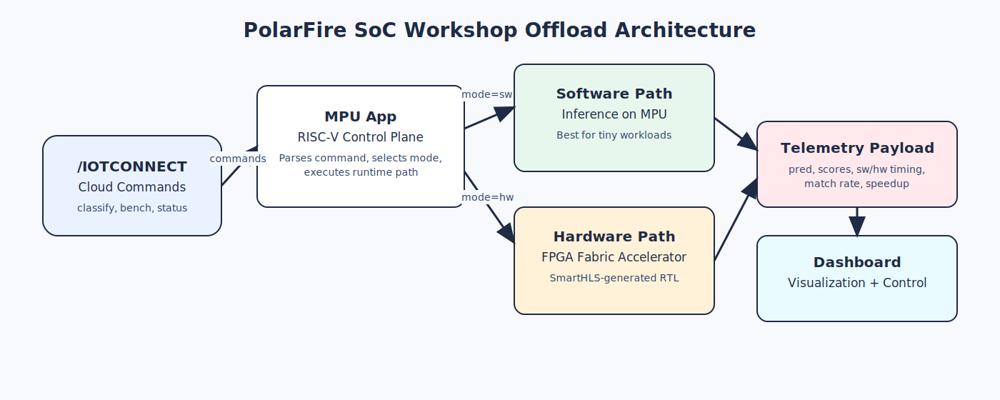
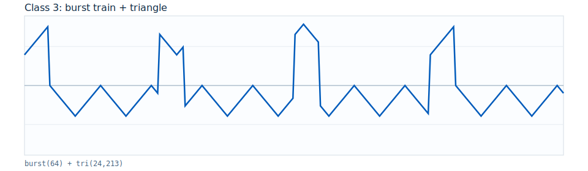

# /IOTCONNECT Complex-NN Accelerator Expansion Demo (Track 3)

Track 3 targets stronger HW acceleration gains by combining a larger model with batched execution.

> [!IMPORTANT]
> If you have not yet followed the [/IOTCONNECT quickstart guide for this board](../README.md),
> complete that first and then return here.


## 1. Introduction

This demo uses the PolarFire SoC hybrid architecture (RISC-V MPU + FPGA fabric) to demonstrate neural-network acceleration by offloading inference from MPU software into FPGA logic.

Track 3 uses a fixed-point multi-layer classifier (`int8` weights with `int16/int32` accumulation). Each inference starts from `256` time-domain samples, extracts `64` features, then runs through two hidden layers (`96`, then `48`) before producing scores for `6` classes. The parameter set includes `W1[96x64]`, `W2[48x96]`, `W3[6x48]` (`11,040` weights) and biases, for an approximate model-parameter footprint of `11.1 KiB`.

The runtime supports up to `1024` inferences per request with DMA-safe buffer allocation.



### Built-In Application Flows

- **`classify`**: functional demonstration — select `sw` or `hw`, classify one of six waveform classes (`0..5`, or `random`). Telemetry focuses on prediction behavior (`pred`, `scores_csv`, timing, batch stats).
- **`bench`**: performance demonstration — runs SW, HW, or both and publishes benchmark telemetry (`sw_avg_time_s`, `hw_avg_time_s`, `speedup_sw_over_hw`).

Track 3 is where HW advantage is usually most visible. For moderate/large batch, `hw_avg_time_s` should improve relative to `sw_avg_time_s` more clearly than Track 1/2.

## 2. Program FPGA with Track 3 Accelerator Image

The quickstart programmed the board with the stock Microchip reference design. This step replaces it with a Track 3-specific FPGA image that includes the complex-NN accelerator in the FPGA fabric, which is required for `hw` mode inference.

1. Open FlashPro Express.
2. Download the Track 3 FPGA job file [here](https://raw.githubusercontent.com/avnet-iotconnect/iotc-python-lite-sdk-demos/main/microchip-polarfire-soc-dk/track3-iotc-ml-complex-accelerator/assets/fpga-job/MPFS_DISCOVERY_KIT.job) (right-click, "save as").
3. Create/open project with `MPFS_DISCOVERY_KIT.job`.
4. Click `RUN` to program board.
5. Power-cycle board after programming.

## 3. Import Template and Dashboard

### Import Device Template

1. In `/IOTCONNECT`, go to `Devices` -> `Device` -> `Templates` -> `Create Template` -> `Import`.
2. Download and import the device template [here](https://raw.githubusercontent.com/avnet-iotconnect/iotc-python-lite-sdk-demos/main/common/templates/microchip-polarfire-tinyml-template.json). (right-click and "save link as")
3. Save.

### Switch Device to New Template

> [!IMPORTANT]
> Upgrading from the basic quickstart demo to this expansion demo requires a template change (to `Microchip Polarfire ML`)
> for the device in /IOTCONNECT. Navigate to your device's page in the online /IOTCONNECT platform and change the
> device's template from `plitedemo` to `Microchip Polarfire ML`.

### Import Dashboard

1. Open /IOTCONNECT and go to **Dashboard**.
2. Download dashboard template [here](https://raw.githubusercontent.com/avnet-iotconnect/iotc-python-lite-sdk-demos/main/microchip-polarfire-soc-dk/track3-iotc-ml-complex-accelerator/mchp-track3-dashboard-template.json). (right-click and "save link as"), then click **Import Dashboard** and upload the JSON file.
3. Save the imported dashboard and map it to the correct device/template.

## 4. Deploy and Run

### Download package on board

```bash
wget https://raw.githubusercontent.com/avnet-iotconnect/iotc-python-lite-sdk-demos/main/microchip-polarfire-soc-dk/track3-iotc-ml-complex-accelerator/package.tar.gz
```

### Install and run

```bash
rm -f package.tar.gz.*
tar -xzf package.tar.gz --overwrite
bash ./install.sh
pkill -f app.py || true
python3 app.py
```

## 5. Verify Data

Expected dashboard end state:


### What You Are Seeing

- Interactive controls:
  - `H/W Classifier` button sends `classify hw random 1000`
  - `S/W Classifier` button sends `classify sw random 1000`
  - `Benchmark Test` button sends `bench random`
  - `Load` switch sends `load` start/stop actions
  - `Device Command` panel lets you run custom command + parameter pairs
- Key live result widgets:
  - `Input Waveform` shows the selected input class shape
  - `Classification Prediction` shows latest classify prediction (`pred`)
  - `Software Benchmark Prediction` and `Hardware Benchmark Prediction` show `sw_pred` and `hw_pred`
  - `S/W vs H/W Avg Time (sec)` compares SW and HW average time (bar vs line)
  - `Speedup (SW/HW)` shows `sw_avg_time_s / hw_avg_time_s`
  - `HW Match Rate`, `SW Match Rate`, `Match Rate`, `Prediction Count`, `Seed`, `Batch (n)`, `Mode`, and `Job` reflect latest telemetry

### Guided Dashboard Demo

1. Confirm device health and telemetry flow.
   - In `Device Command`, select `status`, enter parameter `basic`, and click `Execute Command`.
   - Expected result:
     - Command table shows `Executed Ack`.
     - `ML Events` includes `device_status`.
     - `CPU (%)`, `Load Averages`, `Memory Free (kB)`, `Load Active`, and `Load Workers` refresh.

2. Run classifier demos from dashboard buttons.
   - Click the green power button in `H/W Classifier`.
   - Click the green power button in `S/W Classifier`.
   - Expected result:
     - `Mode` flips between `hw` and `sw` as commands complete.
     - `Seed`, `Batch (n)`, and `Input Waveform` update.
     - `Classification Prediction`, `Classification Scores`, `Match Rate`, and `Prediction Count` refresh.
     - Command table logs classify acknowledgements.

3. Run benchmark demo and interpret acceleration.
   - Click the green power button in `Benchmark Test`.
   - For deterministic comparison, also run this from `Device Command`:

```text
bench both 2 11 1000
```

   - Expected result:
     - `Software Benchmark Prediction` and `Hardware Benchmark Prediction` update.
     - `S/W vs H/W Avg Time (sec)` adds new points (SW bars, HW line).
     - `Speedup (SW/HW)` rises above `1.0` when HW is faster than SW.
     - `SW Match Rate` and `HW Match Rate` update with the benchmark run.

4. Scale the batch size to make HW benefit clearer.
   - Run:

```text
bench both 2 11 2000
bench both 2 11 4000
```

5. Optional stress test while benchmarking.
   - Use the `Load` switch, or run explicit commands from `Device Command`:

```text
load start 2 60
load stop
```

## 6. Command Reference

Use the `Device Command` widget to run any command below.

#### `classify`

Description: run classification in `sw` or `hw` mode.

Valid format:

```text
classify <mode> <class_id> <seed> [batch]
classify <mode> random [batch]
classify mode=<mode> class=<class_id|random> seed=<seed|random> [batch=<n>]
```

Valid values:

- `<mode>`: `sw` or `hw`
- `<class_id>`: integer `0..5`
- `random` class: current runtime chooses from classes `0..2`
- `<seed>`: integer or `random` (`random` generates `1..1000`)
- `<n>` / `[batch]`: integer `1..1024` (default `1`)

Examples:

```text
classify hw 2 11
classify sw random 1000
classify mode=hw class=4 seed=42 batch=256
```

#### `bench`

Description: run benchmark in `sw`, `hw`, or `both` and publish timing/match metrics.

Valid format:

```text
bench <mode> <class_id> <seed> <batch>
bench random [batch]
bench mode=<mode> class=<class_id|random> seed=<seed|random> batch=<n>
```

Valid values:

- `<mode>`: `sw`, `hw`, or `both`
- `<class_id>`: integer `0..5`
- `random` class: current runtime chooses from classes `0..2`
- `<seed>`: integer or `random` (`random` generates `1..1000`)
- `<batch>` / `<n>`: integer `1..1024`
- If you use `bench random`, default mode is `both` and default batch is `1000`

Examples:

```text
bench random
bench both 2 11 1000
bench hw 1 77 512
```

#### `status`

Description: publish device status telemetry (CPU, memory, load, uptime, optional LED summary).

```text
status basic
status full
status include_leds=<true|false>
```

#### `load`

Description: start/stop/query synthetic CPU load workers (built-in Python multiprocessing backend).

```text
load <start|stop|status|off> [workers] [duty_pct]
```

Examples:

```text
load start 2 60
load status
load stop
load off
```

#### `led`

Description: inspect or control board LEDs.

```text
led list
led get [<index_or_name>]
led set <index_or_name> <on|off|toggle>
led <8-bit-01-string>
led pattern <blink|chase|alternate> [cycles] [interval_ms]
led stop
```

## 7. Waveform Class Reference

| Class | Base waveform |
|---|---|
| `0` | triangle + harmonic |
| `1` | square + triangle |
| `2` | triangle + saw mix |
| `3` | burst train + triangle |
| `4` | damped ringing + fast triangle |
| `5` | impulse + saw composite |

Representative base waveforms:

<p>
  
  
  
</p>

<p>
  
  
  
</p>

## 8. Project Organization

- `developer-guide.md`: complete source rebuild flow (SmartHLS + Libero)
- `assets/fpga-job/`: prebuilt FlashPro job + timing/resource reports
- `assets/smarthls-module/tinyml_complex/`: complex accelerator source
- `src/`: runtime app and ELFs
  - `src/runtimes/tinyml_complex.no_accel.elf`
  - `src/runtimes/tinyml_complex.accel.elf`
- `tools/train_and_export_complex.py`: training/weight export tool
- Cross-track technical reference: `../tech-reference.md`

## 9. Resources

- Base platform quickstart: `../README.md`
- Cross-track technical white paper: `../tech-reference.md`
- `/IOTCONNECT` onboarding UI guide: `../../common/general-guides/UI-ONBOARD.md`
- [Purchase the Microchip PolarFire SoC Discovery Kit](https://www.newark.com/microchip/mpfs-disco-kit/discovery-kit-64bit-risc-v-polarfire/dp/97AK2474)
