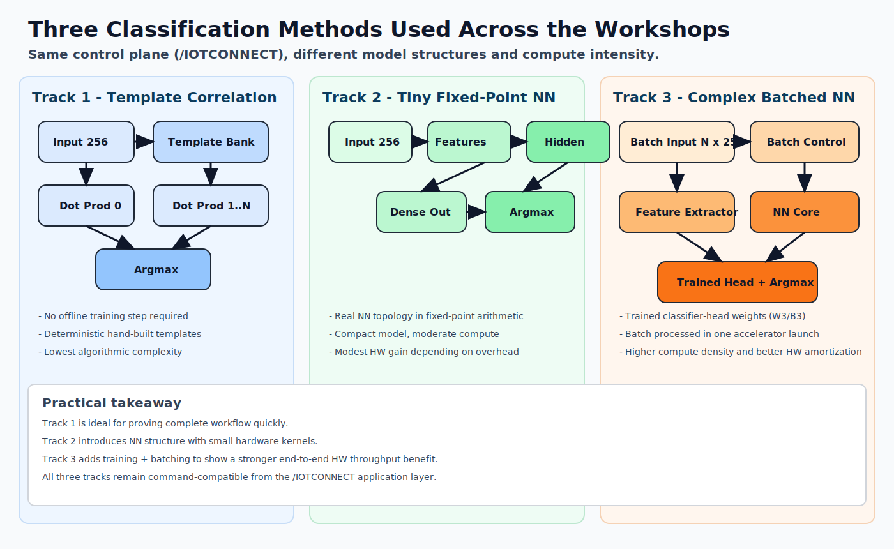
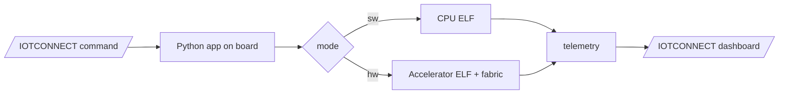

# /IOTCONNECT + PolarFire SoC Workshops

This directory is the main navigation point for all PolarFire SoC ML workshop tracks.

## Workshop Goal

These workshops use the PolarFire SoC hybrid architecture (RISC-V MPU + FPGA fabric) to teach neural network acceleration by offloading compute-heavy inference work from the MPU into FPGA logic.

This is a practical alternative to GPU/NPU acceleration when you need deterministic latency, lower power, and tighter control over dataflow and implementation.

### Workshop Tracks

- [Track 1 - Baseline ML Classifier](track1-iotc-ml-classifier/WORKSHOP.md): fastest bring-up path, command/telemetry flow, and SW/HW parity baseline.
- [Track 2 - Tiny-NN Accelerator](track2-iotc-ml-nn-accelerator/WORKSHOP.md): true NN-style accelerator flow with SmartHLS and Libero integration.
- [Track 3 - Complex Accelerator](track3-iotc-ml-complex-accelerator/WORKSHOP.md): larger model and batching flow to show clearer end-to-end HW acceleration.

## Audience and Outcome

These workshops are written for engineering professionals who want to:

- bring up a board and cloud dashboard quickly
- understand why HW acceleration helps (and when it does not)
- reproduce and modify the full flow using SmartHLS + Libero

By the end, you should be able to run `classify` and `bench`, interpret telemetry in `/IOTCONNECT`, and repeat the process independently for your own workload.

## One-Time Prerequisites (Before Any Track)

### Hardware

- PolarFire SoC Discovery Kit
- USB-C cable
- Ethernet connection
- SanDisk microSD card (recommended by Microchip flow)

### Host software

- Serial terminal (PuTTY or TeraTerm)
- SD flashing tool (Balena Etcher)
- FlashPro Express:
  - https://www.microchip.com/en-us/products/fpgas-and-plds/fpga-and-soc-design-tools/programming-and-debug/lab

### Board baseline

- Reference design releases (FPGA/job baseline):
  - https://github.com/polarfire-soc/polarfire-soc-discovery-kit-reference-design/releases
- Linux image releases:
  - https://github.com/linux4microchip/meta-mchp/releases

### Cloud setup

- `/IOTCONNECT` console:
  - https://console.iotconnect.io
- Account options:
  - https://github.com/avnet-iotconnect/avnet-iotconnect.github.io/blob/main/documentation/iotconnect/subscription/iotconnect_aws_marketplace.md
  - https://subscription.iotconnect.io/subscribe?cloud=aws
- Onboarding UI guide (generic):
  - `../../common/general-guides/UI-ONBOARD.md`
- Workshop template and dashboard assets:
  - `templates-iotconnect/README.md`
  - Device template: `templates-iotconnect/microchip-polarfire-tinyml-template.json`
  - Track 1 dashboard: `templates-iotconnect/mchp-track1-dashboard-template.json`
  - Track 2 dashboard: `templates-iotconnect/mchp-track2-dashboard-template.json`
  - Track 3 dashboard: `templates-iotconnect/mchp-track3-dashboard-template.json`

## Recommended Setup Sequence

1. Install FlashPro Express.
2. Program board with track `.job` file.
3. Import workshop template JSON first.
4. Onboard device in `/IOTCONNECT`.
5. Deploy and run selected track package.
6. Run dashboard commands and review telemetry.

## Track Selection

| Track | Folder | Best For | Workload Style | Typical HW Behavior |
|---|---|---|---|---|
| Track 1 | [`track1-iotc-ml-classifier/`](track1-iotc-ml-classifier/) | Fastest end-to-end bring-up | deterministic template-correlation | SW may be competitive on tiny workloads |
| Track 2 | [`track2-iotc-ml-nn-accelerator/`](track2-iotc-ml-nn-accelerator/) | Intro to true NN accelerator flow | compact fixed-point NN | modest HW gain when batch/workload is sufficient |
| Track 3 | [`track3-iotc-ml-complex-accelerator/`](track3-iotc-ml-complex-accelerator/) | Stronger acceleration demonstration | larger NN-style pipeline + batching | clearer HW gain at medium/large batch sizes |

## Navigation by Intent

- Participant runbook (self-contained): `WORKSHOP.md` in each track folder
- Project organization + technical context: `README.md` in each track folder
- Full rebuild from source: `developer-guide.md` in each track folder
- Cross-track coding + synthesis deep dive: `tech-reference.md`

## Shared Technical Context

`/IOTCONNECT` is the cloud control and telemetry plane in all tracks. It is used to send command strings (`classify`, `bench`, `status`, `led`, `load`) and receive result/performance telemetry.

The same platform and SDK foundation also supports OTA updates, secure connectivity, fleet management, user management, and solution management. Those capabilities are not deeply exercised in the participant flow, but they are part of the platform architecture.

### Architecture snapshots

### SmartHLS and Libero roles

- SmartHLS: C/C++ accelerator to RTL flow and runtime binary generation
- Libero SoC: accelerator integration, synthesis/place-route/timing, and FlashPro `.job` export

### Command and telemetry loop

## Core Telemetry Fields to Interpret

- Classification payloads: `pred`, `scores`, `time`
- Benchmark payloads: `sw_avg_time_s`, `hw_avg_time_s`, `speedup_sw_over_hw`, `batch`
- Parity indicators: `match_rate` (where provided)

## Shared Assets

- Template/dashboard exports: `templates-iotconnect/`
- Images/diagrams: `images/`
- Legacy archive: `archive/`
