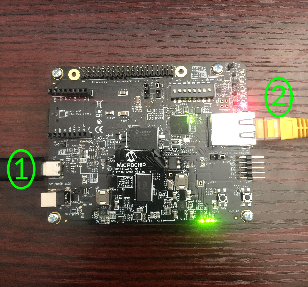
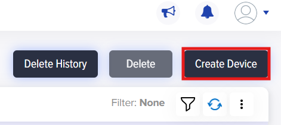
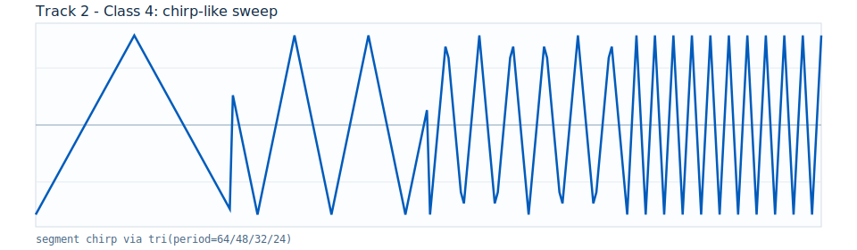

# Getting Started: /IOTCONNECT Tiny-NN Accelerator Workshop (Track 2)

[Purchase the Microchip PolarFire SoC Discovery Kit](https://www.newark.com/microchip/mpfs-disco-kit/discovery-kit-64bit-risc-v-polarfire/dp/97AK2474)


## 1. Introduction

This workshop uses the PolarFire SoC hybrid architecture (RISC-V MPU + FPGA fabric) to demonstrate neural-network acceleration by offloading inference from MPU software into FPGA logic.

The purpose of this demo is twofold: validate classification behavior and validate performance. You run the same model/application in software and hardware, then compare both output quality and execution speed under controlled inputs.

Track 2 is the step-up from Track 1. It introduces a compact Tiny-NN style model while preserving the same command-and-telemetry workflow, so you can focus on how increased model complexity changes behavior and timing.


### 1.1 Model Size and Compute Shape

Track 2 uses a fixed-point Tiny-NN style classifier (`int8` weights with `int16/int32` accumulation). Each inference starts from `256` time-domain samples, extracts `32` features, builds a `12`-element hidden representation (`6` positive + `6` negative channels), then produces scores across `6` classes.

The learned parameter table is `W1_POS[6x32]` (`192` int8 weights, ~`192` bytes), followed by a lightweight deterministic scoring stage. This keeps the model compact while still being richer than the baseline Track 1 classifier.

Inputs are generated with deterministic, seed-controlled noise injection across six waveform families (`0..5`). At the command level, `random` currently selects from classes `0..2`. Batch experiments are supported at the application layer up to `10000` inferences per request.

### 1.2 Built-In Application Flows and Their Purpose

Track 2 includes two complementary runtime flows: `classify` and `bench`.

The `classify` flow is the functional demonstration of the classifier engine. You select `sw` or `hw`, choose an input class (or `random`), and run inference on waveform data with noise injection. Telemetry focuses on prediction behavior (`pred`, `scores_csv`, timing, and batch stats), so you can validate software/hardware consistency at the model-output level.

The `bench` flow is the performance demonstration. It runs SW, HW, or both on equivalent inputs and publishes `ml_bench` telemetry including `sw_avg_time_s`, `hw_avg_time_s`, `sw_total_time_s`, `hw_total_time_s`, `sw_match_rate`, and `hw_match_rate`, plus `speedup_sw_over_hw` when both modes are run.

In practical workshop use, start with `classify` to confirm model behavior and prediction validity, then run `bench` to quantify execution differences. In the end, you are validating both model accuracy parity and performance trends between software and hardware implementations.

## 2. Prerequisites

- Microchip PolarFire SoC Discovery Kit [Purchase](https://www.newark.com/microchip/mpfs-disco-kit/discovery-kit-64bit-risc-v-polarfire/dp/97AK2474)
- Windows 10/11 host PC
- USB-C data cable
- Ethernet connection
- Serial terminal (PuTTY or TeraTerm)
- FlashPro Express v11.6 or newer [Download](https://ww1.microchip.com/downloads/aemdocuments/documents/fpga/media-content/FPGA/v2021.1/prod/Program_Debug_v2021.1_win.exe)
- Reputable-brand Micro-SD card (`<64GB`, UHS-I Class 10, A1 minimum, A2 preferred), preloaded with Linux image:
  - `linux4microchip+fpga-2025.07`
  - `https://github.com/linux4microchip/meta-mchp/releases/tag/linux4microchip%2Bfpga-2025.07`


## 3. Create /IOTCONNECT Account

An `/IOTCONNECT` account with AWS backend is required.

- Option 1 (recommended): [/IOTCONNECT via AWS Marketplace](https://github.com/avnet-iotconnect/avnet-iotconnect.github.io/blob/main/documentation/iotconnect/subscription/iotconnect_aws_marketplace.md)
- Option 2: [/IOTCONNECT direct signup](https://subscription.iotconnect.io/subscribe?cloud=aws)

Sign in at: [https://console.iotconnect.io](https://console.iotconnect.io)


## 4. Setup Development Environment

### Hardware Setup

See the reference image below for cable connections.

<details>
<summary>Reference Image with Connections</summary>

</details>

Using the above image as reference, make the following connections:

1. Connect the included USB-C cable from your PC to the USB-C connector labeled **#1**.
2. Connect an Ethernet cable from your LAN (router/switch) to the Ethernet connector labeled **#2**.


### 4.1 Update FPGA

1. Open FlashPro Express.
2. Download FPGA project [link](https://raw.githubusercontent.com/avnet-iotconnect/iotc-python-lite-sdk-demos/main/microchip-polarfire-soc-dk/workshops/track2-iotc-ml-nn-accelerator/assets/fpga-job/MPFS_DISCOVERY_KIT.job) (right-click, "save as")
3. Create/open project.
   - `MPFS_DISCOVERY_KIT.job`
4. Click `RUN` to program board.
5. Power-cycle board after programming.

### 4.2 Software Setup

1. Open serial terminal (`115200 8N1`, middle COM port).
2. Login as `root`.

#### 4.2.1 Board Runtime Setup

- Using the serial terminal, install /IOTCONNECT Device SDK onto the target device.
```bash
python3 -m pip install iotconnect-sdk-lite requests
```


## 5. Log into /IOTCONNECT and Import Device Template

1. In `/IOTCONNECT`, go to `Devices` -> `Device`.


2. Open `Templates`.


3. Select `Create Template`.


4. Select `Import`.


5. Import /IOTCONNECT device template for this project [here](https://raw.githubusercontent.com/avnet-iotconnect/iotc-python-lite-sdk-demos/main/microchip-polarfire-soc-dk/workshops/templates-iotconnect/microchip-polarfire-tinyml-template.json).  (right-click and "save link as")

6. Save.


## 6. Create an /IOTCONNECT Device

1. Go to `Devices` -> `Create Device`.



2. Set:
   - `Unique ID`
   - `Device Name`
   - `Entity`
3. Select template:
   - `Microchip Polarfire ML`
4. Under device certificate, select:
   - `Use my certificate`
5. Save and keep the device page open.
6. After saving, open device details and download the configuration JSON.


## 7. Onboard /IOTCONNECT Device

This workshop uses the board-side `quickstart.sh` flow to generate and register certificate/config data.

On the board:

```bash
wget https://raw.githubusercontent.com/avnet-iotconnect/iotc-python-lite-sdk-demos/main/common/scripts/quickstart.sh
bash ./quickstart.sh
```

Then:

1. Copy certificate text from terminal and paste into `/IOTCONNECT` device certificate field.
2. Click "Save and View".
3. Download device configuration JSON from the device page.
4. Paste full JSON into terminal when quickstart script prompts.


## 8. Configure Application Software

This workshop uses packaged Python + prebuilt ELF runtimes.

### 8.1 Download package from board (TeraTerm shell)

```bash
wget https://raw.githubusercontent.com/avnet-iotconnect/iotc-python-lite-sdk-demos/main/microchip-polarfire-soc-dk/workshops/track2-iotc-ml-nn-accelerator/package.tar.gz
```

### 8.2 Install and run on board

```bash
rm -f package.tar.gz.*
tar -xzf package.tar.gz --overwrite
bash ./install.sh
pkill -f app.py || true
python3 app.py
```


## 9. Import Dynamic Dashboard

1. Open /IOTCONNECT and go to **Dashboard**.
2. Click **Import Dashboard** and upload the JSON file [../templates-iotconnect/mchp-track2-dashboard-template.json](https://raw.githubusercontent.com/avnet-iotconnect/iotc-python-lite-sdk-demos/main/microchip-polarfire-soc-dk/workshops/templates-iotconnect/mchp-track2-dashboard-template.json).
3. Save the imported dashboard and map it to the correct device/template.
4. Open the dashboard in live mode and verify widgets populate from telemetry.

## 10. Verify Data

Expected dashboard end state:


### 10.1 What You Are Seeing

- Interactive controls:
  - `H/W Classifier` button sends `classify hw random 1000`
  - `S/W Classifier` button sends `classify sw random 1000`
  - `Benchmark Test` button sends `bench random`
  - `Load` switch sends `load` start/stop actions
  - `Device Command` panel lets you run custom command + parameter pairs
- Key live result widgets:
  - `Input Waveform` shows the selected input class shape
  - `Classification Prediction` shows latest classify prediction (`pred`)
  - `Software Benchmark Prediction` and `Hardware Benchmark Prediction` show `sw_pred` and `hw_pred`
  - `S/W vs H/W Avg Time (sec)` compares SW and HW average time (bar vs line)
  - `Speedup (SW/HW)` shows `sw_avg_time_s / hw_avg_time_s`
  - `HW Match Rate`, `SW Match Rate`, `Match Rate`, `Prediction Count`, `Seed`, `Batch (n)`, `Mode`, and `Job` reflect latest telemetry

### 10.2 Guided Dashboard Demo

1. Confirm device health and telemetry flow.
   - In `Device Command`, select `status`, enter parameter `basic`, and click `Execute Command`.
   - Expected result:
     - Command table shows `Executed Ack`.
     - `ML Events` includes `device_status`.
     - `CPU (%)`, `Load Averages`, `Memory Free (kB)`, `Load Active`, and `Load Workers` refresh.

2. Run classifier demos from dashboard buttons.
   - Click the green power button in `H/W Classifier`.
   - Click the green power button in `S/W Classifier`.
   - Expected result:
     - `Mode` flips between `hw` and `sw` as commands complete.
     - `Seed`, `Batch (n)`, and `Input Waveform` update.
     - `Classification Prediction`, `Classification Scores`, `Match Rate`, and `Prediction Count` refresh.
     - Command table logs classify acknowledgements.

3. Run benchmark demo and interpret acceleration.
   - Click the green power button in `Benchmark Test`.
   - For deterministic comparison, also run this from `Device Command`:

```text
bench both 2 11 1000
```

   - Expected result:
     - `Software Benchmark Prediction` and `Hardware Benchmark Prediction` update.
     - `S/W vs H/W Avg Time (sec)` adds new points (SW bars, HW line).
     - `Speedup (SW/HW)` rises above `1.0` when HW is faster than SW.
     - `SW Match Rate` and `HW Match Rate` update with the benchmark run.

4. Scale the batch size to make trends easier to observe.
   - Run:

```text
bench both 2 11 2000
bench both 2 11 4000
```

   - Expected result:
     - SW/HW average-time separation is clearer over larger batches.
     - `Speedup (SW/HW)` and benchmark prediction widgets continue to update each run.

5. Optional stress test while benchmarking.
   - Use the `Load` switch, or run explicit commands from `Device Command`:

```text
load start 2 60
load stop
```

   - Expected result:
     - While load is active: `Load Active=true`, `Load Workers=2`, and `Load Duty (%)=60`.
     - `CPU (%)` and `Load Averages` increase under load, then settle after `load stop`.
     - Benchmark timing widgets reflect system stress effects.

### 10.3 Command Reference 

Use the `Device Command` widget to run any command below.

#### `classify`

Description: run classification in `sw` or `hw` mode.

Valid format:

```text
classify <mode> <class_id> <seed> [batch]
classify <mode> random [batch]
classify mode=<mode> class=<class_id|random> seed=<seed|random> [batch=<n>]
```

Valid values:

- `<mode>`: `sw` or `hw`
- `<class_id>`: integer `0..5`
- `random` class: current runtime chooses from classes `0..2`
- `<seed>`: integer or `random` (`random` generates `1..1000`)
- `<n>` / `[batch]`: integer `1..10000` (default `1`)

Examples:

```text
classify hw 2 11
classify sw random 1000
classify mode=hw class=4 seed=42 batch=256
```

#### `bench`

Description: run benchmark in `sw`, `hw`, or `both` and publish timing/match metrics.

Valid format:

```text
bench <mode> <class_id> <seed> <batch>
bench random [batch]
bench mode=<mode> class=<class_id|random> seed=<seed|random> batch=<n>
```

Valid values:

- `<mode>`: `sw`, `hw`, or `both`
- `<class_id>`: integer `0..5`
- `random` class: current runtime chooses from classes `0..2`
- `<seed>`: integer or `random` (`random` generates `1..1000`)
- `<batch>` / `<n>`: integer `1..10000`
- If you use `bench random`, default mode is `both` and default batch is `1000`

Examples:

```text
bench random
bench both 2 11 1000
bench hw 1 77 512
```

#### `status`

Description: publish device status telemetry (CPU, memory, load, uptime, optional LED summary).

Valid format:

```text
status basic
status full
status include_leds=<true|false>
```

Valid values:

- `basic`: status without LED bitstring
- `full`: includes LED summary fields
- `include_leds=<true|false>`: explicit LED summary toggle

Examples:

```text
status basic
status full
status include_leds=true
```

#### `load`

Description: start/stop/query synthetic CPU load workers.

Valid format:

```text
load <start|stop|status> [workers] [duty_pct]
load action=<start|stop|status> [workers=<n>] [duty=<pct>]
```

Valid values:

- `action`: `start`, `stop`, or `status`
- `workers` / `<n>`: requested worker count (effective range `1..8`)
- `duty_pct` / `<pct>`: requested busy duty cycle (effective range `1..100`)
- If omitted, defaults are `workers=1` and `duty_pct=95`

Examples:

```text
load start 2 60
load status
load stop
```

#### `led` 

Description: inspect or control board LEDs.

Valid format:

```text
led list
led get [<index_or_name>]
led set <index_or_name> <on|off|toggle>
led <8-bit-01-string>
led pattern <blink|chase|alternate> [cycles] [interval_ms]
led stop
```

Valid values:

- `<index_or_name>`: LED index or sysfs LED name
- `<8-bit-01-string>`: exactly 8 characters, each `0` or `1`
- `pattern`: `blink`, `chase`, or `alternate`

Examples:

```text
led list
led 10101010
led pattern chase 10 120
```

### 10.4 Waveform Class Reference

| Class | Base waveform |
|---|---|
| `0` | triangle |
| `1` | triangle mix (64 + 32 periods) |
| `2` | burst + triangle |
| `3` | square |
| `4` | chirp-like sweep |
| `5` | impulse train |

Representative base waveforms:

<p>
  
  
  
</p>

<p>
  
  
  
</p>

## 11. Resources

- Workshop runbook: `WORKSHOP.md`
- Track quick reference: `README.md`
- Cross-track reference: `../tech-reference.md`
- Templates notes: `../templates-iotconnect/README.md`
- Base platform guide: `../../README.md`
- `/IOTCONNECT` onboarding UI guide: `../../../common/general-guides/UI-ONBOARD.md`


