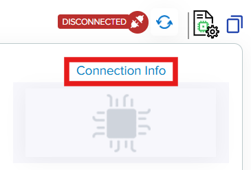
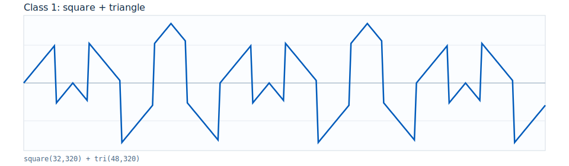
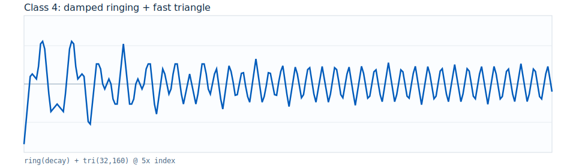

# Getting Started: /IOTCONNECT Complex-NN Accelerator Workshop (Track 3)

[Purchase the Microchip PolarFire SoC Discovery Kit](https://www.newark.com/microchip/mpfs-disco-kit/discovery-kit-64bit-risc-v-polarfire/dp/97AK2474)


## 1. Introduction

Track 3 demonstrates:

- `/IOTCONNECT` command and telemetry control
- software versus hardware inference comparison
- clearer hardware acceleration at larger batch sizes

## 2. Prerequisites

- Microchip PolarFire SoC Discovery Kit [Purchase](https://www.newark.com/microchip/mpfs-disco-kit/discovery-kit-64bit-risc-v-polarfire/dp/97AK2474)
- Windows 10/11 host PC
- USB-C data cable
- Ethernet connection
- Serial terminal (PuTTY or TeraTerm)
- FlashPro Express v11.6 or newer [Download](https://ww1.microchip.com/downloads/aemdocuments/documents/fpga/media-content/FPGA/v2021.1/prod/Program_Debug_v2021.1_win.exe)
- Workshop repository on host:
  - [github.com/avnet-iotconnect/iotc-python-lite-sdk-demos](https://github.com/avnet-iotconnect/iotc-python-lite-sdk-demos)
  - clone command:
    ```bash
    git clone https://github.com/avnet-iotconnect/iotc-python-lite-sdk-demos.git
    ```
- A2-class microSD card (64GB or less), preloaded with Linux image:
  - `linux4microchip+fpga-2025.07`
  - `https://github.com/linux4microchip/meta-mchp/releases/tag/linux4microchip%2Bfpga-2025.07`


## 3. Create /IOTCONNECT Account

An `/IOTCONNECT` account with AWS backend is required.

- Option 1 (recommended): [/IOTCONNECT via AWS Marketplace](https://github.com/avnet-iotconnect/avnet-iotconnect.github.io/blob/main/documentation/iotconnect/subscription/iotconnect_aws_marketplace.md)
- Option 2: [/IOTCONNECT direct signup](https://subscription.iotconnect.io/subscribe?cloud=aws)

Sign in at: [https://console.iotconnect.io](https://console.iotconnect.io)


## 4. Setup Development Environment

### Hardware Setup

See the reference image below for cable connections.

<details>
<summary>Reference Image with Connections</summary>

</details>

Using the above image as reference, make the following connections:

1. Connect the included USB-C cable from your PC to the USB-C connector labeled **#1**.
2. Connect an Ethernet cable from your LAN (router/switch) to the Ethernet connector labeled **#2**.


### 4.1 Update FPGA

1. Open FlashPro Express.
2. Create/open project from Track 3 job file:
   - `assets/fpga-job/MPFS_DISCOVERY_KIT.job`
3. Click `RUN` to program board.
4. Power-cycle board after programming.

### 4.2 Software Setup

1. Open serial terminal (`115200 8N1`, middle COM port).
2. Login as `root`.

#### 4.2.1 Board Runtime Setup

```bash
sudo opkg update
python3 -m pip install iotconnect-sdk-lite requests
mkdir -p /home/weston/demo
cd /home/weston/demo
```


## 5. Log into /IOTCONNECT and Import Device Template

1. In `/IOTCONNECT`, go to `Devices` -> `Device`.


2. Open `Templates`.


3. Select `Create Template`.


4. Select `Import`.


5. Import file:
   - `../templates-iotconnect/microchip-polarfire-tinyml-template.json`
6. Save.


## 6. Create a Device

1. Go to `Devices` -> `Create Device`.


2. Set:
   - `Unique ID`
   - `Device Name`
   - `Entity`
3. Select template:
   - `Microchip Polarfire ML`
4. Under device certificate, select:
   - `Use my certificate`
5. Save and keep the device page open.
6. After saving, open device details and download the configuration JSON.


## 7. Obtain Device Certificates

This workshop uses the board-side `quickstart.sh` flow to generate and register certificate/config data.

Certificate/config download locations in `/IOTCONNECT` device page:




On the board:

```bash
cd /home/weston/demo
wget https://raw.githubusercontent.com/avnet-iotconnect/iotc-python-lite-sdk-demos/refs/heads/main/common/scripts/quickstart.sh
bash ./quickstart.sh
```

Then:

1. Copy certificate text from terminal and paste into `/IOTCONNECT` device certificate field.
2. Click "Save and View".
3. Download device configuration JSON from the device page.
4. Paste full JSON into terminal when quickstart script prompts.


## 8. Configure Application Software

This workshop uses packaged Python + prebuilt ELF runtimes.

### 8.1 Start local package server on host (PowerShell)

1. In Windows File Explorer, browse to the folder that contains `package.tar.gz`.
2. Right-click in that folder and select **Open in Terminal** (PowerShell).
3. Find your host IPv4 address:

```powershell
ipconfig
```

4. Start a local HTTP server and keep this terminal open:

```powershell
python -m http.server 8000
```

### 8.2 Download package from board (TeraTerm shell)

```bash
cd /home/weston/demo
wget http://<HOST_IP>:8000/package.tar.gz -O /home/weston/demo/package.tar.gz
```

### 8.3 Install and run on board

```bash
cd /home/weston/demo
rm -f package.tar.gz.*
tar -xzf package.tar.gz --overwrite
bash ./install.sh
pkill -f app.py || true
python3 app.py
```


## 9. Import Dynamic Dashboard

1. Go to `/IOTCONNECT` `Dashboards`.
2. Import:
   - `../templates-iotconnect/mchp-track3-dashboard-template.json`
3. Bind dashboard to your device.
4. Verify widgets populate with `ml_classify`, `ml_bench`, and `device_status` telemetry.

## 10. Verify Data

Expected dashboard end state:


Run these c2d commands from the `/IOTCONNECT` Dynamic Dashboard or from the Commands tab on the device view:

```text
status basic
classify sw 2 11
classify hw 2 11
bench random
bench both 2 11 1000
```

Then run additional checks:

```text
bench both 2 11 2000
bench both 2 11 4000
```

Waveform classes used by Track 3:

| Class | Base waveform |
|---|---|
| `0` | triangle + harmonic |
| `1` | square + triangle |
| `2` | triangle + saw mix |
| `3` | burst train + triangle |
| `4` | damped ringing + fast triangle |
| `5` | impulse + saw composite |

Representative base waveforms:

<p>
  
  
  
</p>

<p>
  
  
  
</p>

## 11. Resources

- Workshop runbook: `WORKSHOP.md`
- Track quick reference: `README.md`
- Cross-track reference: `../tech-reference.md`
- Templates notes: `../templates-iotconnect/README.md`
- Base platform guide: `../../README.md`
- `/IOTCONNECT` onboarding UI guide: `../../../common/general-guides/UI-ONBOARD.md`


