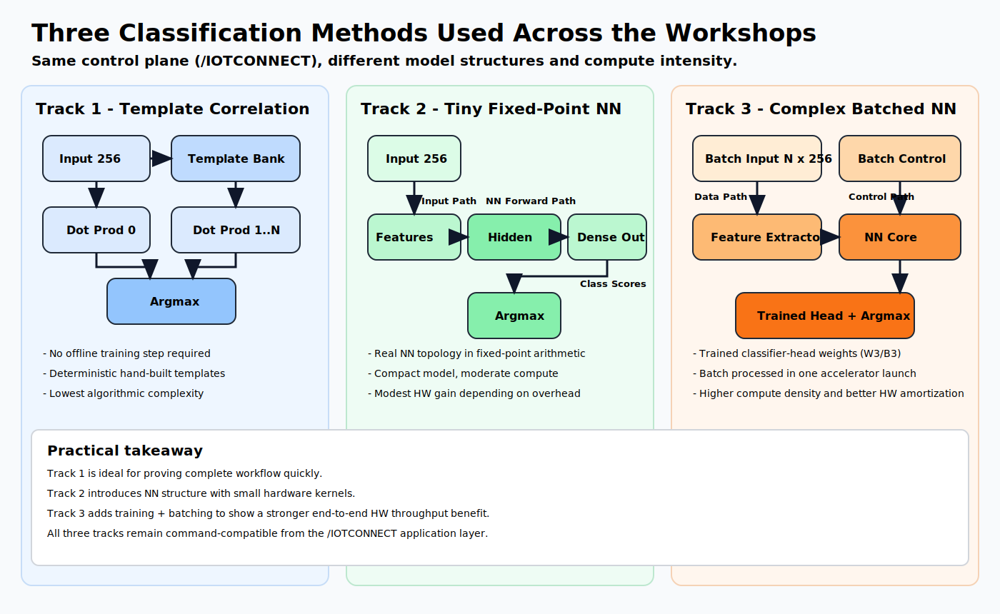

# Microchip PolarFire SoC Video Kit QuickStart
 [Purchase Microchip PolarFire SoC Video Kit](https://www.avnet.com/americas/product/microchip/mpfs250-video-kit/evolve-56820956/)
1. [Introduction](#1-introduction)
2. [Requirements](#2-requirements)
3. [Hardware Setup](#3-hardware-setup)
4. [Software Setup](#4-software-setup)
5. [Device Setup](#5-device-setup)
6. [Onboard Device](#6-onboard-device)
7. [Using the Demo](#7-using-the-demo)
8. [Deploying Additional Demos](#8-deploying-additional-demos)
9. [Resources](#9-resources)

# 1. Introduction

This guide provides step-by-step instructions to set up the **Microchip PolarFire SoC Video Kit hardware** and integrate
it with **/IOTCONNECT**, Avnet's robust IoT platform. The PolarFire SoC Video Kit hardware platform provides flexible options
for IoT application development, enabling secure device onboarding, telemetry collection, and over-the-air (OTA) updates.

<table>
  <tr>
    <td></td>
    <td>This open-source development kit features a quad-core, 64-bit CPU cluster based on the RISC-V application-class
processor that supports Linux® and real-time applications, a rich set of peripherals and 95K of low-power, high-performance
FPGA logic elements. The kit is ready for rapid testing of applications in an easy-to-use hardware development platform and
offers a mikroBUS™ expansion header for Click boards™, a 40-pin Raspberry Pi™ connector, and a MIPI®  connector.
The expansion boards can be controlled using protocols like I2C and SPI. One GB of DDR4 memory is available as well as
a microSD® card slot for booting Linux. Communication interfaces include one Gigabit Ethernet connector and three UART
connections via the USB type C connector. An on-board FlashPro5 programmer is available to program and debug the PolarFire
FPGA through USB-to-JTAG channel.</td>
  </tr>
</table>

# 2. Requirements

This guide has been written and tested to work on a Windows 10/11 PC. However, there is no reason this can't be
replicated in other environments.

## Hardware

* Microchip PolarFire SoC Video Kit [Purchase](https://www.avnet.com/americas/product/microchip/mpfs250-video-kit/evolve-56820956/)
* Ethernet Cable
* USB-C Cable (included in kit)
* UHS-1 Class 10 Micro-SD card (Such as [SanDisk Industrial](https://www.amazon.com/SanDisk-Industrial-MicroSD-SDSDQAF3-008G-I-Adapter/dp/B07BZ5SY18/))

> [!IMPORTANT]
> The PolarFire SoC Video Kit **requires a high quality U1 Micro-SD card**.

## Software

* A serial terminal such as [TeraTerm](https://github.com/TeraTermProject/teraterm/releases)
  or [PuTTY](https://www.putty.org/)
* An SD-Card flashing utility such as [Balena Etcher](https://etcher.balena.io/)
* Latest Microchip "Programming and Debug" package for your OS [from this page](https://www.microchip.com/en-us/products/fpgas-and-plds/fpga-and-soc-design-tools/programming-and-debug/lab). Click the "Software Download Archive" to find the download link. Do NOT download the Libero SoC Design Suite.


# 3. Hardware Setup

Make the following connections:

1. Connect the USB-C/USB-A cables from your PC to the Micro USB connectors J5(FPGA programming) and J12(UART).
2. Connect an Ethernet cable from your LAN (router/switch) to the Ethernet connector J7 or J6.
3. Connect the power cord to J39 connector.

# 4. Software Setup

## Update FPGA
1. Download the latest pre-built programming file (MPFS_VIDEO_KIT_TSN_DESIGN_XXXX_XX.zip) from [here](https://github.com/polarfire-soc/polarfire-soc-video-kit-reference-design/releases)
and then extract the package and locate the **.job** file.
2. Ensure that the board is connected to your PC via the USB-C cable, as instructed in the Hardware Setup.
3. Open FlashPro Express, and click  **New Job Project**
4. For the "Import FlashPro Express job file", click **Browse...** and select the downloaded `.job` file. For the "FlashPro Express job project location" click **Browse...** and choose the same downloaded/extracted folder that contains the .job file and click **OK**
5. After the new project has loaded, click the **RUN** button to flash the board.
6. After the flash has completed, unplug and re-plug in the board to power-cycle and ensure the new programming is in effect.

## Flash Linux Image

1. Download the latest Linux Image release for the PolarFire SoC Video Kit by navigating [the linux4microchip PolarFire
SoC Releases page](https://github.com/linux4microchip/meta-mchp/releases), scrolling down to the "Pre-built images for
the Video Kit Reference Design" section and clicking on the "pre-built image" link. The downloaded filename should
be similar to "mchp-base-image-mpfs-video-kit.rootfs-20251030154504.wic.gz" with only the timestamp potentially being different
depending on what the latest release is at the time.
2. Extract the downloaded image so that you have a **.wic** file to flash. Attempting to flash the compressed .gz file
is known to cause issues with the bootloader.
3. Use an SD-Card flashing utility such as Balena Etcher to flash the .wic image file onto your SanDisk-branded micro-SD
card.
4. After flashing, insert the Micro-SD card into the Micro-SD card slot on the PolarFire SoC Video Kit.
5. Unplug and replug the board to power-cycle it.

# 5. Device Setup

1. Open a serial terminal emulator program such as TeraTerm.
2. Ensure that your serial settings in your terminal emulator are set to:

- Baud Rate: 115200
- Data Bits: 8
- Stop Bits: 1
- Parity: None

3. Check your device manager list and see that there are a few COM port entries for your PolarFire SoC Video Kit. Connect
to the **second-numbered port.** For example, given these COM ports:

* COM10
* COM11
* COM12

You would connect to COM11.

> [!NOTE]
> A successful connection may result in just a blank terminal box. If you see a blank terminal box, press the ENTER key
> to get a login prompt. An unsuccessful connection attempt will usually result in an error window popping up.

4. When prompted for a login, type `root` followed by the ENTER key.
5. Run these commands to update the core board packages and install necessary /IOTCONNECT packages:

```
sudo opkg update
```

```
python3 -m pip install iotconnect-sdk-lite requests
```

6. Then run these commands to create and move into a directory for your demo files:

```
mkdir -p /opt/demo && cd /opt/demo
```

> [!TIP]
> To gain access to "copy" and "paste" functions inside of a PuTTY terminal window, you can CTRL+RIGHTCLICK within the
> window to utilize a dropdown menu with these commands. This is very helpful for copying/pasting between your browser and
> the terminal.


# 6. Onboard Device

The next step is to onboard your device into /IOTCONNECT. This will be done via the online /IOTCONNECT user interface.

Follow [this guide](../common/general-guides/UI-ONBOARD.md) to walk you through the process.

# 7. Using the Demo

Run the basic demo with this command:

```
cd /opt/demo && python3 app.py
```

View the random-integer telemetry data under the "Live Data" tab for your device on /IOTCONNECT.

# 8. Deploying Additional Demos

Three demos are available that each utilize a different inference approach implemented in the FPGA fabric, progressing from a simple hand-crafted classifier up to a trained multi-layer neural network with batch processing.

- [Track 1 - Baseline ML Classifier](track1-iotc-ml-classifier/):
Classifies by dot-product correlation against three hand-crafted waveform templates. No neural network, no training required.
- [Track 2 - Tiny-NN Accelerator](track2-iotc-ml-nn-accelerator/):
Demo with a real neural network in FPGA fabric. One hidden layer with fixed integer weights, no training required.
- [Track 3 - Complex Accelerator](track3-iotc-ml-complex-accelerator/):
Two hidden layers with ~11K trained weights and batch-aware DMA execution. Hardware acceleration throughput is most visible

## Demo Block Diagrams:



# 9. Resources

* [Technical Deep Dive](tech-reference.md)
* [Purchase the Microchip PolarFire SoC Video Kit](https://www.avnet.com/americas/product/microchip/mpfs250-video-kit/evolve-56820956/)
* [More /IOTCONNECT Microchip Guides](https://avnet-iotconnect.github.io/partners/microchip/)
* [/IOTCONNECT Overview](https://www.iotconnect.io/)
* [/IOTCONNECT Knowledgebase](https://help.iotconnect.io/)
