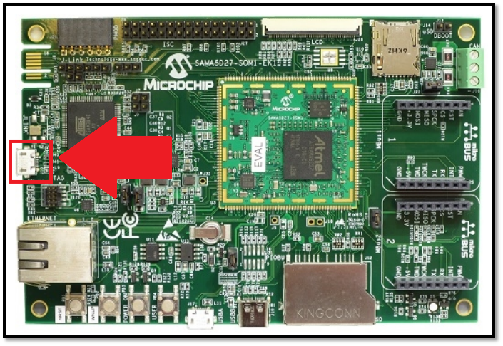
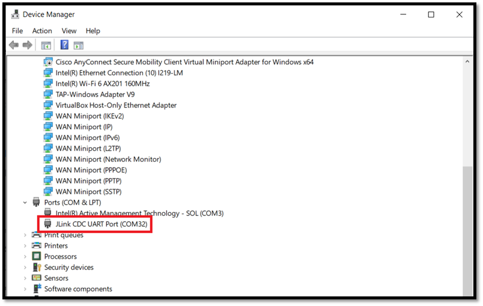
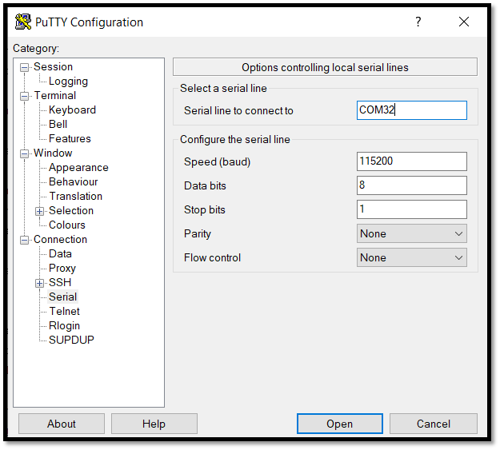
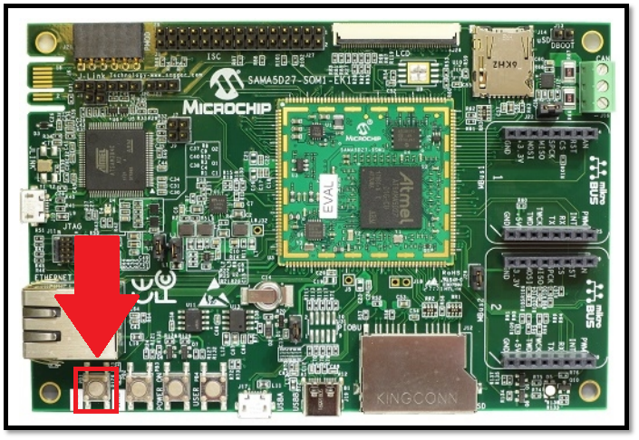

# SAMA5D27 IoTConnect Integration Quickstart Guide

This guide provides step-by-step instructions to set up the **Microchip SAMA5D27 hardware** and integrate it with **IoTConnect**, Avnet's robust IoT platform. The SAMA5D27 hardware platform provides flexible options for IoT application development, enabling secure device onboarding, telemetry collection, and over-the-air (OTA) updates.

---

## Table of Contents
1. [Overview](#overview)
2. [Hardware Description](#hardware-description)
   - [Datasheet](#datasheet)
   - [Standard Kit Contents](#standard-kit-contents)
   - [User-Provided Items](#user-provided-items)
   - [3rd-Party Accessories](#3rd-party-accessories)
3. [Set Up Your Development Environment](#set-up-your-development-environment)
   - [Supported Operating Systems](#supported-operating-systems)
   - [Tools Installation](#tools-installation)
4. [Set Up Device Hardware](#set-up-device-hardware)
5. [Integration with IoTConnect](#integration-with-iotconnect)
6. [Additional Documentation](#additional-documentation)
7. [Troubleshooting](#troubleshooting)
8. [Revision Info](#revision-info)

---

## Overview

The SAMA5D27 hardware platform is based on the **Microchip SAMA5D27 System on Module (SOM)**, providing robust performance for IoT applications. Paired with **IoTConnect**, this platform enables secure connectivity, real-time data collection, and device management for various use cases, including industrial automation, healthcare, and smart home solutions.

---

## Hardware Description

### Datasheet
For detailed technical specifications of the SAMA5D27 hardware, refer to the official [Microchip SAMA5D27 SOM1 Evaluation Kit Datasheet](https://www.microchip.com/en-us/development-tool/atsama5d27-som1-ek1).

### Standard Kit Contents
The standard SAMA5D27 Evaluation Kit includes:
1. **SAMA5D27 Evaluation Board**.
2. **Power Adapter** (5V DC).
3. **Micro-USB Cable** for debugging and communication.
4. **Quick Start Guide** with initial setup instructions.

*Note: The contents may vary depending on the distributor. Verify with your vendor.*

### User-Provided Items
To use the SAMA5D27 hardware, you will need:
1. **Host Computer**: For configuration and development.
2. **Ethernet Cable**: For network connectivity.
3. **MicroSD Card**: Required for booting or storing application data.

### 3rd-Party Accessories
Optional accessories to enhance the functionality of the SAMA5D27 platform include:
1. **USB-to-UART Adapters**: For debugging (e.g., FTDI cables).
2. **Expansion Boards**: Add-on boards to extend I/O or peripheral connectivity.

---

## Set Up Your Development Environment

### Supported Operating Systems
The SAMA5D27 platform supports the following operating systems:
1. **Host OS**:
   - Windows 10/11
   - Ubuntu 20.04 or later
   - macOS 11.0 or later
2. **Device OS**:
   - Yocto-based Linux distribution for the SAMA5D27 (Linux4SAM).

### Tools Installation
To develop and debug applications for the SAMA5D27, the following tools are required:
1. **Yocto Build Tools**:
   - Follow the instructions for setting up the Yocto build environment on the [Linux4SAM Documentation](https://www.linux4sam.org/bin/view/Linux4SAM/Sama5d27Som1EKMainPage#eMMC_support_on_SDMMC0).
2. **SDKs**:
   - Install the IoTConnect SDK available from the [IoTConnect Python Lite SDK](https://github.com/avnet-iotconnect/iotc-python-lite-sdk).
3. **Optional IDEs**:
   - VS Code or other text editors for development.

---

## Set Up Device Hardware

### Step 1: Flash Yocto Image to SD Card
1. [Click here](https://www.linux4sam.org/bin/view/Linux4SAM/Sama5d27Som1EKMainPage#eMMC_support_on_SDMMC0) to download the image for the SAMA5D27.
2. Download the image:

    

3. Follow the "Create a SD card with the demo" section of the instructions to flash the image to an SD card.

    > **Important**: Must use a full-size SD card or a micro-SD card with a full-size adapter.

---

### Step 2: Connect to the SAMA5D27 over Serial

1. Connect the Ethernet cable to the onboard Ethernet port for internet access.
2. Use the provided micro-USB cable to connect the SAMA5D27 to your computer via the **J10** micro-USB port:

    

    > **Note**: The USB connection also powers the board.

3. Check the COM port of the board in the Device Manager:

    

4. Connect to the board using a terminal emulator (e.g., PuTTY) with the following settings:

    

5. Insert the SD card into the SD card slot.
6. Press the **NRST** button to reboot the board and boot from the SD card:

    

---

### Step 3: Set Up and Run the Python Lite SDK Demo

Follow the instructions in the [Python Lite SDK Quickstart Guide](https://github.com/avnet-iotconnect/iotc-python-lite-sdk/blob/main/QUICKSTART.md) to complete the demo setup and execution.

---

## Integration with IoTConnect

The SAMA5D27 Evaluation Kit supports seamless integration with **IoTConnect**. Using the IoTConnect SDK, you can:
- Provision devices for secure communication with AWS IoT Core.
- Send and receive telemetry data in real-time.
- Manage device firmware with over-the-air (OTA) updates.

Refer to the [IoTConnect SDK Documentation](https://github.com/avnet-iotconnect/iotc-python-lite-sdk) for more details.

---

## Additional Documentation

For further resources, visit:
- [SAMA5D27 Evaluation Kit Datasheet](https://www.microchip.com/en-us/development-tool/atsama5d27-som1-ek1)
- [Linux4SAM Documentation](https://www.linux4sam.org/bin/view/Linux4SAM/Sama5d27Som1EKMainPage#eMMC_support_on_SDMMC0)
- [IoTConnect SDK Documentation](https://github.com/avnet-iotconnect/iotc-python-lite-sdk)

---

## Troubleshooting

### Common Issues
#### No Power:
   **Symptom**: The board does not power on; power LED is off. 
   **Solutions**:
1) Power Supply Verification: Ensure the USB cable is securely connected to the J10 micro-USB port and a functioning power source. 
2) Power Switch: Confirm that any onboard power switches are in the "ON" position. 
3) Inspect for Damage: Check the board for visible signs of damage or component issues. 

#### No Debug Output:

**Symptom**: No output appears in the terminal emulator during boot-up or operation.

**Solutions**:
1) Serial Connection: Verify the micro-USB cable is connected to the J10 port.
2) COM Port Identification: On Windows, check Device Manager for the assigned COM port under "Ports (COM & LPT)".
3) Terminal Settings: Configure your terminal emulator (e.g., PuTTY) with the following settings:
   - Baud Rate: 115200
   - Data Bits: 8
   - Parity: None
   - Stop Bits: 1
   - Flow Control: None
4) Driver Installation: Ensure that the necessary USB-to-serial drivers are installed on your host machine. 

#### Boot Issues:

**Symptom**: The device fails to boot from the SD card or eMMC.

**Solutions**:
1) Boot Medium Preparation: Ensure the boot medium (SD card or eMMC) is properly flashed with a compatible image.
2) Boot Mode Selection: Verify that the boot mode switches or jumpers are configured correctly for the intended boot source.
3) SD Card Integrity: Use high-quality SD cards and check for errors using appropriate tools.
4) Log Analysis: Observe boot logs via the serial console for error messages that can provide clues to the failure point.

---

## Revision Info

- View the complete [Commit History](https://github.com/avnet-iotconnect/iotc-python-lite-sdk-demos/commits/main) for this repository.
- View changes to this document: [README.md History](https://github.com/avnet-iotconnect/iotc-python-lite-sdk-demos/commits/main/microchip-sama5d27/README.md).
