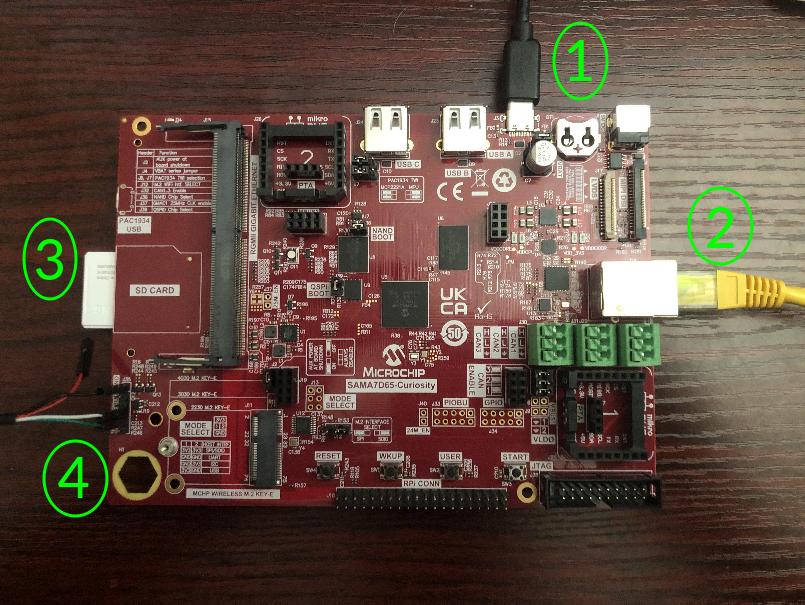

# Microchip SAMA7D65-Curiosity Kit Quickstart
[Purchase Microchip EV63J76A (SAMA7D65 Curiosity Kit)](https://www.newark.com/microchip/ev63j76a/development-kit-arm-cortex-a7/dp/46AM2853)
1. [Introduction](#1-introduction)
2. [Requirements](#2-requirements)
3. [Hardware Setup](#3-hardware-setup)
4. [/IOTCONNECT: Cloud Account Setup](#4-iotconnect-cloud-account-setup)
5. [Device Setup](#5-device-setup)
6. [Onboard Device](#6-onboard-device)
7. [Using the Demo](#7-using-the-demo)
8. [Resources](#8-resources)

# 1. Introduction

This guide provides step-by-step instructions to set up the **Microchip SAMA7D65-Curiosity Kit hardware** and integrate
it
with **/IOTCONNECT**, Avnet's robust IoT platform. The SAMA7D65-Curiosity Kit hardware platform provides flexible options
for IoT
application development, enabling secure device onboarding, telemetry collection, and over-the-air (OTA) updates.

<table>
  <tr>
    <td></td>
    <td>The SAMA7D65-Curiosity Kit is a development board for evaluating  and prototyping with Microchip SAMA7D65 microprocessor (MPU).  
The SAMA7D65 MPU is a high-performance  ARM Cortex-A7 CPU-based embedded MPU running up to 1GHz.  The board allows 
evaluation of powerful peripherals for connectivity, audio and user interface applications, including MIPI-DSI and 
LVDS w/ 2D graphics, dual Gigabit Ethernet w/ TSN and CAN-FD.</td>
  </tr>
</table>

# 2. Requirements

This guide has been written and tested to work on a Windows 10/11 PC. However, there is no reason this can't be
replicated in other environments.

## Hardware

* Microchip EV63J76A (SAMA7D65 Curiosity Kit) [Purchase](https://www.newark.com/microchip/ev63j76a/development-kit-arm-cortex-a7/dp/46AM2853) | [User Manual & Kit Contents](https://ww1.microchip.com/downloads/aemDocuments/documents/MPU32/ProductDocuments/UserGuides/SAMA7D65-Curiosity-Kit-User-Guide-DS50003806.pdf) | [All Resources](https://www.microchip.com/en-us/development-tool/EV63J76A)
* Ethernet Cable
* USB-C Cable (included in kit)
* Standard SD Card or Micro-SD Card with Standard-Size Adapter (included in kit)
* USB to TTL Serial 3.3V Adapter Cable (must be purchased separately,
  click [here](https://www.amazon.com/Serial-Adapter-Signal-Prolific-Windows/dp/B07R8BQYW1/ref=sr_1_1_sspa?dib=eyJ2IjoiMSJ9.FmD0VbTCaTkt1T0GWjF9bV9JG8X8vsO9mOXf1xuNFH8GM1jsIB9IboaQEQQBGJYV_o_nruq-GD0QXa6UOZwTpk1x_ISqW9uOD5XoQcFwm3mmgmOJG--qv3qo5MKNzVE4aKtjwEgZcZwB_d7hWTgk11_JJaqLFd1ouFBFoU8aMUWHaEGBbj5TtX4T6Z_8UMSFS4H1lh2WF5LRprjLkSLUMF656W-kCM4MGU5xLU5npMw.oUFW_sOLeWrhVW0VapPsGa03-dpdq8k5rL4asCbLmDs&dib_tag=se&keywords=detch+usb+to+ttl+serial+cable&qid=1740167263&sr=8-1-spons&sp_csd=d2lkZ2V0TmFtZT1zcF9hdGY&psc=1)
  to see the cable used by Avnet's engineer)

> [!NOTE]
> The USB to TTL Serial 3.3V Adapter Cable may require you to install a specific driver onto your host machine. The
> example cable linked above requires
> a [PL2303 driver](https://www.prolific.com.tw/us/showproduct.aspx?p_id=225&pcid=41).

## Software

* A serial terminal such as [TeraTerm](https://github.com/TeraTermProject/teraterm/releases)
  or [PuTTY](https://www.putty.org/)
* Flash Yocto Image to SD Card:
    1. [Click here](https://developerhelp.microchip.com/xwiki/bin/view/applications/linux4sam/Boards/sama7d65curosity/#HDemoarchives)
       to get to the page to download the latest image for the SAMA7D65.
    2. Download the image (link may have updated name that slightly differs from screenshot):

    

    3. Follow the "Create a SD card with the demo" section of the instructions to flash the image to an SD card.

# 3. Hardware Setup

See the reference image below for cable connections.
<details>
<summary>Reference Image with Connections</summary>

</details>

Using the above image as reference, make the following connections:

1. Connect the included USB-C cable from your PC to the USB-C connector labeled **#1**.
2. Connect an Ethernet cable from your LAN (router/switch) to the Ethernet connector labeled **#2**.
3. Insert the SD card (or Micro-SD card with an adapter) into the slot labeled **#3**.
4. Connect your USB to TTL Serial 3.3V Adapter Cable to the appropriate pins on the J35 debug header labeled **#4**.

J35 Pinout: GND - OPEN - OPEN - RX - TX - OPEN

Color-coded connections from suggested USB to TTL adapter cable: BLACK - OPEN - OPEN - WHITE - GREEN - OPEN

> [!NOTE]
> If your USB to TTL adapter cable has one larger connector (usually all 6 pins) instead of individual wires, that is
> still fine as long as the GND, RX, and TX pins line up correctly. It should also be noted that usually on USB to TTL
> adapters, **the RX female slot should line up with the TX pin on the board (and vice versa).** If you are unsure, try
> RX-to-TX and TX-to-RX first and if the serial connection does not work, then try RX-to-RX and TX-to-TX.

# 4. /IOTCONNECT: Cloud Account Setup

An /IOTCONNECT account with AWS backend is required. If you need to create an account, a free trial subscription is
available.
The free subscription may be obtained directly from iotconnect.io or through the AWS Marketplace.

* Option #1 (
  Recommended) [/IOTCONNECT via AWS Marketplace](https://github.com/avnet-iotconnect/avnet-iotconnect.github.io/blob/main/documentation/iotconnect/subscription/iotconnect_aws_marketplace.md) -
  60 day trial; AWS account creation required
* Option #2 [/IOTCONNECT via iotconnect.io](https://subscription.iotconnect.io/subscribe?cloud=aws) - 30 day trial; no
  credit card required

> [!NOTE]
> Be sure to check any SPAM folder for the temporary password after registering.

# 5. Device Setup

1. Open a serial terminal emulator program such as TeraTerm.
2. Ensure that your serial settings in your terminal emulator are set to:

- Baud Rate: 115200
- Data Bits: 8
- Stop Bits: 1
- Parity: None

3. Noting the new COM port in your Device Manager list, attempt to connect to your board via
   the terminal emulator

> [!NOTE]
> A successful connection may result in just a blank terminal box. If you see a blank terminal box, press the ENTER key
> to get a login prompt. An unsuccessful connection attempt will usually result in an error window popping up.

4. When prompted for a login, type `root` followed by the ENTER key.
5. Run these commands to update the core board packages and install necessary /IOTCONNECT packages:

```
sudo opkg update
```

```
python3 -m pip install iotconnect-sdk-lite requests
```

6. Then run these commands to create and move into a directory for your demo files:

```
mkdir -p /home/weston/demo && cd /home/weston/demo
```

> [!TIP]
> To gain access to "copy" and "paste" functions inside of a PuTTY terminal window, you can CTRL+RIGHTCLICK within the
> window to utilize a dropdown menu with these commands. This is very helpful for copying/pasting between your browser and
> the terminal.

# 6. Onboard Device

The next step is to onboard your device into /IOTCONNECT. This will be done via the online /IOTCONNECT user interface.

Follow [this guide](../common/general-guides/UI-ONBOARD.md) to walk you through the process.

> [!TIP]
> If you have obtained a solution key for your /IOTCONNECT account from Softweb Solutions, you can utilize the /IOTCONNECT 
> REST API to automate the device onboarding process via shell scripts. Check out [this guide](../common/general-guides/REST-API-ONBOARD.md) 
> for more info on that.

# 7. Using the Demo

Run the basic demo with this command:

```
python3 app.py
```

> [!NOTE]
> Always make sure you are in the ```/home/weston/demo``` directory before running the demo. You can move to this
> directory with the command: ```cd /home/weston/demo```

View the random-integer telemetry data under the "Live Data" tab for your device on /IOTCONNECT.

# 8. Resources

* [Purchase the Microchip EV63J76A (SAMA7D65 Curiosity Kit)](https://www.avnet.com/americas/product/microchip/ev63j76a/evolve-118945047/)
* [More /IOTCONNECT Microchip Guides](https://avnet-iotconnect.github.io/partners/microchip/)
* [/IOTCONNECT Overview](https://www.iotconnect.io/)
* [/IOTCONNECT Knowledgebase](https://help.iotconnect.io/)
