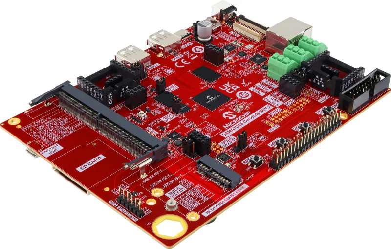
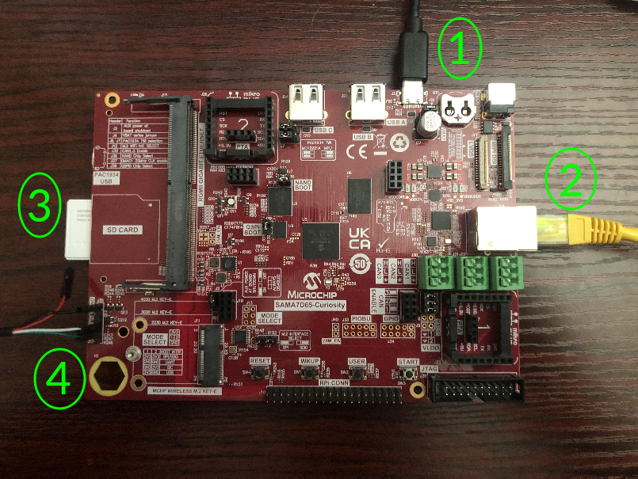
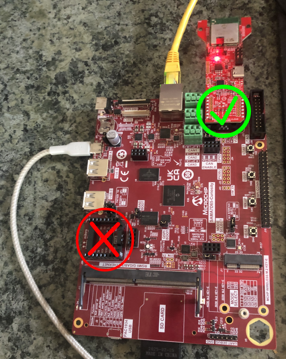
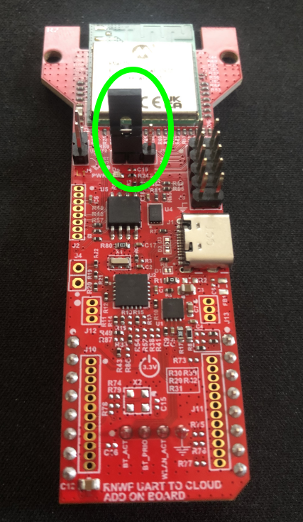
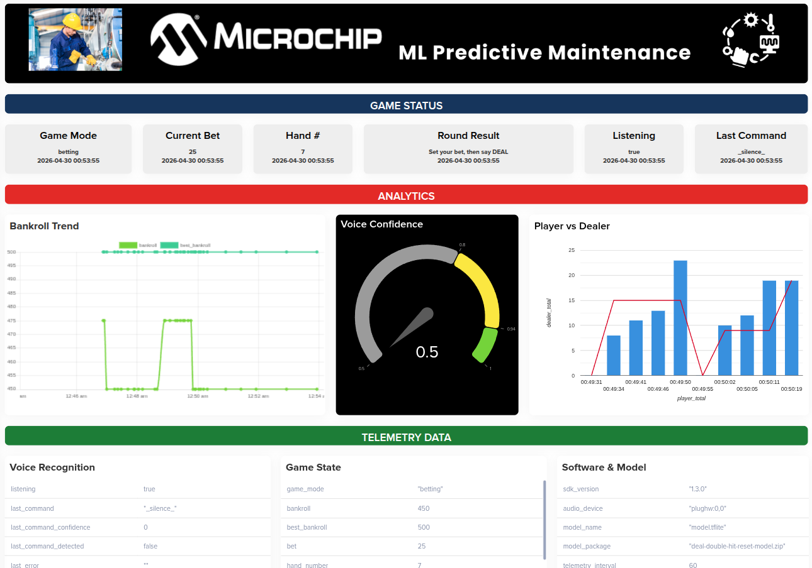
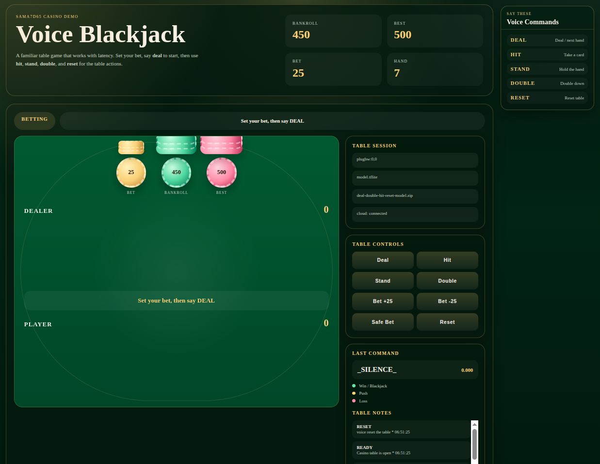

# Microchip SAMA7D65-Curiosity Kit Quickstart
[Purchase Microchip EV63J76A (SAMA7D65 Curiosity Kit)](https://www.newark.com/microchip/ev63j76a/development-kit-arm-cortex-a7/dp/46AM2853)
1. [Introduction](#1-introduction)
2. [Requirements](#2-requirements)
3. [Hardware Setup](#3-hardware-setup)
4. [Device Setup](#4-device-setup)
5. [Onboard Device](#5-onboard-device)
6. [Using the Demo](#6-using-the-demo)
7. [Resources](#7-resources)

# 1. Introduction

This guide provides step-by-step instructions to set up the **Microchip SAMA7D65-Curiosity Kit hardware** and integrate it with **/IOTCONNECT**, Avnet's robust IoT platform. The SAMA7D65-Curiosity Kit hardware platform provides flexible options for IoT application development, enabling secure device onboarding, telemetry collection, and over-the-air (OTA) updates.

<table>
  <tr>
    <td></td>
    <td>The SAMA7D65-Curiosity Kit is a development board for evaluating and prototyping with the Microchip SAMA7D65 microprocessor (MPU).
The SAMA7D65 MPU is a high-performance ARM Cortex-A7 CPU-based embedded MPU running up to 1GHz. The board allows
evaluation of powerful peripherals for connectivity, audio and user interface applications, including MIPI-DSI and
LVDS w/ 2D graphics, dual Gigabit Ethernet w/ TSN and CAN-FD.</td>
  </tr>
</table>

# 2. Requirements

This guide has been written and tested to work on a Windows 10/11 PC. However, there is no reason this can't be
replicated in other environments.

## Hardware

* Microchip EV63J76A (SAMA7D65 Curiosity Kit) [Purchase](https://www.newark.com/microchip/ev63j76a/development-kit-arm-cortex-a7/dp/46AM2853) | [User Manual & Kit Contents](https://ww1.microchip.com/downloads/aemDocuments/documents/MPU32/ProductDocuments/UserGuides/SAMA7D65-Curiosity-Kit-User-Guide-DS50003806.pdf) | [All Resources](https://www.microchip.com/en-us/development-tool/EV63J76A)
* Ethernet Cable
* USB-C Cable (included in kit)
* Standard SD Card or Micro-SD Card with Standard-Size Adapter (included in kit)
* USB to TTL Serial 3.3V Adapter Cable (must be purchased separately,
  click [here](https://www.amazon.com/Serial-Adapter-Signal-Prolific-Windows/dp/B07R8BQYW1/ref=sr_1_1_sspa?dib=eyJ2IjoiMSJ9.FmD0VbTCaTkt1T0GWjF9bV9JG8X8vsO9mOXf1xuNFH8GM1jsIB9IboaQEQQBGJYV_o_nruq-GD0QXa6UOZwTpk1x_ISqW9uOD5XoQcFwm3mmgmOJG--qv3qo5MKNzVE4aKtjwEgZcZwB_d7hWTgk11_JJaqLFd1ouFBFoU8aMUWHaEGBbj5TtX4T6Z_8UMSFS4H1lh2WF5LRprjLkSLUMF656W-kCM4MGU5xLU5npMw.oUFW_sOLeWrhVW0VapPsGa03-dpdq8k5rL4asCbLmDs&dib_tag=se&keywords=detch+usb+to+ttl+serial+cable&qid=1740167263&sr=8-1-spons&sp_csd=d2lkZ2V0TmFtZT1zcF9hdGY&psc=1)
  to see the cable used by Avnet's engineer)

> [!NOTE]
> The USB to TTL Serial 3.3V Adapter Cable may require you to install a specific driver onto your host machine. The
> example cable linked above requires
> a [PL2303 driver](https://www.prolific.com.tw/us/showproduct.aspx?p_id=225&pcid=41).

## Software

* A serial terminal such as [TeraTerm](https://github.com/TeraTermProject/teraterm/releases)
  or [PuTTY](https://www.putty.org/)
* Flash Yocto Image to SD Card:
    1. [Click here](https://developerhelp.microchip.com/xwiki/bin/view/applications/linux4sam/Boards/sama7d65curiosity/)
       to get to the page to download the latest image for the SAMA7D65.
    2. Download the image (link may have updated name that slightly differs from screenshot):

    

    3. Follow the "Create a SD card with the demo" section of the instructions to flash the image to an SD card.

# 3. Hardware Setup

See the reference image below for cable connections.
<details>
<summary>Reference Image with Connections</summary>

</details>

Using the above image as reference, make the following connections:

1. Connect the included USB-C cable from your PC to the USB-C connector labeled **#1**.
2. Connect an Ethernet cable from your LAN (router/switch) to the Ethernet connector labeled **#2**.
3. Insert the SD card (or Micro-SD card with an adapter) into the slot labeled **#3**.
4. Connect your USB to TTL Serial 3.3V Adapter Cable to the appropriate pins on the J35 debug header labeled **#4**.

J35 Pinout: GND - OPEN - OPEN - RX - TX - OPEN

Color-coded connections from suggested USB to TTL adapter cable: BLACK - OPEN - OPEN - WHITE - GREEN - OPEN

> [!NOTE]
> If your USB to TTL adapter cable has one larger connector (usually all 6 pins) instead of individual wires, that is
> still fine as long as the GND, RX, and TX pins line up correctly. It should also be noted that usually on USB to TTL
> adapters, **the RX female slot should line up with the TX pin on the board (and vice versa).** If you are unsure, try
> RX-to-TX and TX-to-RX first and if the serial connection does not work, then try RX-to-RX and TX-to-TX.

## Optional: Add WiFi Connectivity (EV12H55A WiFi Module)

If Ethernet is not available at your deployment location, you can add WiFi connectivity to the
SAMA7D65 Curiosity Kit using the Microchip
[EV12H55A (RNWF11 "UART to Cloud" Add-on Board)](https://www.microchipdirect.com/dev-tools/EV12H55A?allDevTools=true).
This is a mikroBUS™ "Click" board, so it plugs directly into one of the board's mikroBUS sockets — no
soldering required.

> [!NOTE]
> This module exposes its WiFi connection through simple ASCII AT commands over a UART, not as a
> standard Linux network interface (there is no `wlan0`). The steps below get the module talking to
> your network and confirm it can obtain an IP address. Routing the demo application's
> /IOTCONNECT traffic through this module instead of Ethernet would require additional application-level
> integration and is outside the scope of this guide.

### Step 1: Attach the module to the mikroBUS1 connector

The board has two mikroBUS sockets (J25/mikroBUS1 and J26/mikroBUS2). **This module must be plugged
into mikroBUS1** (the socket nearest the Ethernet connectors) — mikroBUS2 will not work with the setup
in this guide. Align the WiFi module's pins with the mikroBUS1 socket as shown below (green check) and
press it down firmly until it is fully seated.



> [!NOTE]
> It's easy for one row of pins to sit slightly proud if the module goes in at a slight angle. Check
> that all 8 pins on both rows of the connector are fully inserted before powering on the board.

### Step 2: Set the module's power-source jumper

The WiFi module has its own 3-pin power-selection header (labeled **J5** on the module, not to be
confused with anything on the main board) that selects whether it draws 3.3V from a USB cable or from
the mikroBUS connector. Since we're powering it from the mikroBUS connector, the jumper cap must be
moved to the position circled below.



> [!WARNING]
> These modules typically ship with the jumper in the *other* position (set up for USB power), which
> will **not** work for this setup — WiFi connectivity will silently fail with no obvious error. Check
> the jumper position against the photo above before continuing, even if you haven't touched it.

### Step 3: Enable the mikroBUS1 UART on the board

The mikroBUS1 RX/TX pins are not enabled as a UART by default — out of the box, the board's device
tree leaves them unconfigured. The [`wifi-module`](./wifi-module) folder in this repo contains a
device tree overlay and a setup script that enables them permanently.

1. Power on the board (with the Ethernet cable connected, per the main hardware setup above) and let
   it finish booting.
2. From your PC, copy the `wifi-module` folder to the board (replace `<board-ip>` with your board's IP
   address):

   ```
   scp -r wifi-module root@<board-ip>:/root/wifi-module
   ```

3. SSH into the board (or use your serial terminal) and run the setup script:

   ```
   ssh root@<board-ip>
   cd /root/wifi-module
   python3 apply_wifi_overlay.py
   ```

   This backs up the board's existing boot environment, patches it to load the WiFi UART overlay on
   every boot, and copies the overlay file onto the boot partition.

4. Power-cycle the board (unplug and replug the USB-C power cable — a soft reset is not enough). After
   it boots back up, confirm the new serial port exists:

   ```
   ls /dev/ttyS1
   ```

   If `/dev/ttyS1` exists, the UART is enabled and ready to talk to the module.

> [!TIP]
> If you ever need to undo this change, the original boot environment was backed up to
> `/uboot.env.bak` on the boot partition before it was modified.

### Step 4: Test WiFi connectivity

With the module attached, powered, and the overlay applied, you can talk to it directly with AT
commands. The following Python snippet (run on the board) scans for networks, connects to one, and
prints the IP address it receives:

```python
import serial, time

ser = serial.Serial('/dev/ttyS1', 230400, timeout=1)

def send(cmd, wait=1):
    ser.write((cmd + '\r\n').encode())
    time.sleep(wait)
    print(cmd, '->', ser.read(2000).decode(errors='replace'))

send('AT+GMM')                          # confirm the module responds
send('AT+WSCN=0', wait=5)               # scan for networks - note the security type (the
                                         # second number) reported next to your SSID
send('AT+WSTAC=1,"YOUR_SSID"')
send('AT+WSTAC=2,YOUR_SECURITY_TYPE')   # from the AT+WSCN scan output above
send('AT+WSTAC=3,"YOUR_PASSWORD"')
send('AT+WSTAC=4,0')
send('AT+WSTA=1', wait=10)              # look for a +WSTAAIP: line with an IPv4 address
```

A successful connection prints a `+WSTAAIP:` line containing an IP address from your network.

# 4. Device Setup

1. Open a serial terminal emulator program such as TeraTerm.
2. Ensure that your serial settings in your terminal emulator are set to:

- Baud Rate: 115200
- Data Bits: 8
- Stop Bits: 1
- Parity: None

3. Noting the new COM port in your Device Manager list, attempt to connect to your board via
   the terminal emulator

> [!NOTE]
> A successful connection may result in just a blank terminal box. If you see a blank terminal box, press the ENTER key
> to get a login prompt. An unsuccessful connection attempt will usually result in an error window popping up.

4. When prompted for a login, type `root` followed by the ENTER key.
5. Run these commands to update the core board packages and install necessary /IOTCONNECT packages:

```
sudo opkg update
```

```
python3 -m pip install --break-system-packages iotconnect-sdk-lite requests
```

6. Then run these commands to create and move into a directory for your demo files:

```
mkdir -p /opt/demo && cd /opt/demo
```

> [!TIP]
> To gain access to "copy" and "paste" functions inside of a PuTTY terminal window, you can CTRL+RIGHTCLICK within the
> window to utilize a dropdown menu with these commands. This is very helpful for copying/pasting between your browser and
> the terminal.

# 5. Onboard Device

The next step is to onboard your device into /IOTCONNECT. This will be done via the online /IOTCONNECT user interface.

Follow [this guide](../common/general-guides/UI-ONBOARD.md) to walk you through the process.

> [!TIP]
> If you have obtained a solution key for your /IOTCONNECT account from Softweb Solutions, you can utilize the /IOTCONNECT 
> REST API to automate the device onboarding process via shell scripts. Check out [this guide](../common/general-guides/REST-API-ONBOARD.md) 
> for more info on that.

# 6. Using the Demo

Run the basic demo with this command:

```
python3 app.py
```

> [!NOTE]
> Always make sure you are in the ```/opt/demo``` directory before running the demo. You can move to this
> directory with the command: ```cd /opt/demo```

View the random-integer telemetry data under the "Live Data" tab for your device on /IOTCONNECT.

# 7. Going Further: Expansion Demos

Now that you have completed the basic quickstart, you can install a specialized expansion demo on top of it using a software package. The following expansion demos are available for this board:

* **[PAC1934 Power Monitoring Demo](./pac1934-demo/README.md)**: Reads voltage, current, and power measurements from the on-board PAC1934 four-channel DC power monitor IC over I2C and publishes them to /IOTCONNECT. No additional hardware required.
* **[Keyword Spotting Demo](./kws-demo/README.md)**: Captures one-second audio clips from a USB microphone, runs a TensorFlow Lite DS-CNN speech-command classifier on-device, and publishes the top prediction and confidence score to /IOTCONNECT in real time.
* **[Voice Blackjack (KWS Game)](./kws-game/README.md)**: Runs a browser-hosted blackjack game on the board using the same USB microphone keyword spotting pipeline. Voice commands control gameplay while game state and inference results are streamed as telemetry to /IOTCONNECT.

<table>
  <tr>
    <td width="50%"></td>
    <td width="50%"></td>
  </tr>
</table>

# 8. Resources

* [Purchase the Microchip EV63J76A (SAMA7D65 Curiosity Kit)](https://www.newark.com/microchip/ev63j76a/development-kit-arm-cortex-a7/dp/46AM2853)
* [More /IOTCONNECT Microchip Guides](https://avnet-iotconnect.github.io/partners/microchip/)
* [/IOTCONNECT Overview](https://www.iotconnect.io/)
* [/IOTCONNECT Knowledgebase](https://help.iotconnect.io/)
