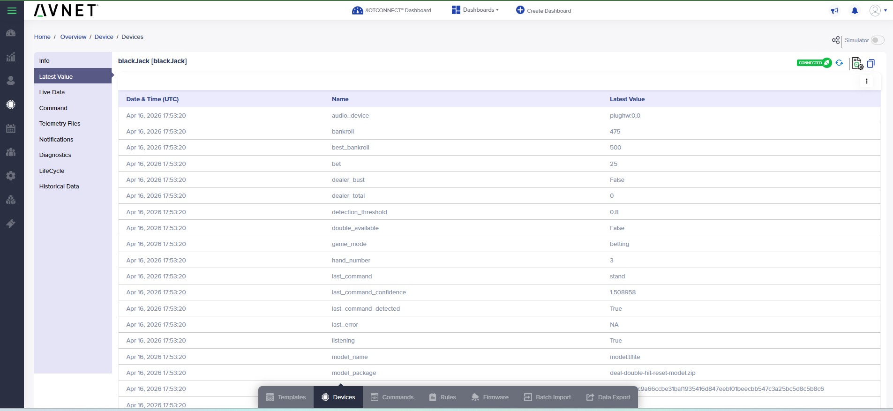

# KWS Game

Adds a browser-hosted blackjack game to the Microchip SAMA7D65-Curiosity Kit and connects it to `/IOTCONNECT` for telemetry, cloud commands, and package download updates.

> [!IMPORTANT]
> Complete the [/IOTCONNECT quickstart guide for the Microchip SAMA7D65-Curiosity Kit](https://github.com/avnet-iotconnect/iotc-python-lite-sdk-demos/blob/main/microchip-sama7d65-curiosity/README.md) before proceeding.

## 1. Introduction

`Voice Blackjack` is a familiar, strategic table game that tolerates command latency much better than a reflex game. The game runs locally on the board, exposes a Flask UI to a browser, and uses the same USB microphone keyword spotter pipeline as the keyword demo.

The current recommended voice actions are:

- `deal`
- `hit`
- `stand`
- `double`
- `reset`

Bet control is intentionally manual:

- on-screen buttons
- arrow keys
- `F` for a safe default bet

The bundled fallback model in `src/models/` matches the current five-keyword custom package:

- `_silence_`
- `_unknown_`
- `deal`
- `double`
- `hit`
- `reset`
- `stand`

When `/opt/demo/models` exists, the game prefers that shared runtime model directory so it stays aligned with the latest installed KWS package.

## 2. Visual Tour

These snapshots show the browser UI plus the `/IOTCONNECT` views that pair with the game.

<table>
  <tr>
    <td width="50%">
      
      <br />
      <sub>Main game view with the active bankroll, bet, hand state, and current voice command list.</sub>
    </td>
    <td width="50%">
      
      <br />
      <sub>Table controls and the event log make it easy to test voice actions against keyboard and button fallbacks.</sub>
    </td>
  </tr>
  <tr>
    <td width="50%">
      
      <br />
      <sub>The Latest Value view shows the current game state, active model package, detection threshold, and last command outcome.</sub>
    </td>
    <td width="50%">
      
      <br />
      <sub>The Commands view lets operators trigger actions like <code>deal</code>, <code>hit</code>, and <code>reset</code> from the cloud.</sub>
    </td>
  </tr>
  <tr>
    <td width="50%">
      
      <br />
      <sub>Live Data shows the raw telemetry stream exactly as the board publishes it during gameplay.</sub>
    </td>
    <td width="50%">
      
      <br />
      <sub>The tabular view is useful when you want to scan game-mode, totals, bankroll, and command history as structured fields.</sub>
    </td>
  </tr>
</table>

## 3. Set Up Hardware and Template

1. Plug a USB microphone into one of the board's USB host ports.
2. Confirm the microphone is visible to ALSA:

```bash
arecord -l
```

3. Create your device in `/IOTCONNECT` with [kws-game-template.json](./kws-game-template.json).

Notes:

- The template `code` is `sama7d6Bj`. That shortened value is intentional because `/IOTCONNECT` template codes are limited to `10` characters.
- The template exposes game state, bankroll, current command outcome, audio/model metadata, threshold, and telemetry interval.
- The template commands include both game actions and runtime controls:
  - `deal`
  - `hit`
  - `stand`
  - `double`
  - `reset`
  - `bet-up`
  - `bet-down`
  - `safe-bet`
  - `listen-start`
  - `listen-stop`
  - `set-threshold`
  - `set-interval`
  - `refresh-state`
  - `file-download`

## 4. Telemetry Behavior

The game sends telemetry in these cases:

- on startup after the `/IOTCONNECT` connection is established
- on a periodic heartbeat every `60` seconds by default
- after an accepted voice detection
- after a cloud or local control action

Key telemetry fields:

- `game_mode`
- `bankroll`
- `best_bankroll`
- `bet`
- `hand_number`
- `player_total`
- `dealer_total`
- `round_result`
- `last_command`
- `last_command_confidence`
- `last_command_detected`
- `audio_device`
- `model_name`
- `model_package`
- `model_sha256`
- `detection_threshold`
- `telemetry_interval`
- `last_error`

## 5. Deploy and Install

Build the board package from the repo:

```bash
bash ./create-package.sh
```

That produces `package.zip` containing the app, installer, static assets, and fallback model.

On the board, unpack and install it:

```bash
mkdir -p /root/kws-game
cd /root/kws-game
python3 -m zipfile -e /path/to/package.zip .
bash ./install.sh
```

The installer:

- verifies `Flask`, `iotconnect-sdk-lite`, and `requests`
- checks whether `numpy` is already importable before attempting a best-effort install
- checks whether `tflite-runtime` is already importable before attempting a best-effort install
- copies bundled model assets into `/opt/demo/models`
- keeps both `model.tflite` and `ds_cnn_s_quantized.tflite` available for compatibility

## 6. Run On The Board

```bash
cd /root/kws-game
LD_LIBRARY_PATH=/root/kws-demo/libs:$LD_LIBRARY_PATH \
KWS_ARECORD_DEVICE=plughw:0,0 \
KWS_MODEL_DIR=/opt/demo/models \
KWS_CONFIG_DIR=/root/blackJack-config \
KWS_GAME_PORT=8081 \
/root/kws-venv/bin/python -u /root/kws-game/game_app.py
```

Then open:

```text
http://<board-ip>:8081
```

`KWS_CONFIG_DIR` should point at the directory containing:

- `iotcDeviceConfig.json`
- `device-cert.pem`
- `device-pkey.pem`

The game also accepts the blackjack-specific filenames directly:

- `cert_blackJack.crt`
- `pk_blackJack.pem`
- any `iotcDeviceConfig*.json` file in the config directory

If those files are missing, the game still starts locally but reports `cloud_status` as not configured.

## 7. Commands

Game actions:

- `deal`
- `hit`
- `stand`
- `double`
- `reset`
- `bet-up`
- `bet-down`
- `safe-bet`

Runtime controls:

- `listen-start`
- `listen-stop`
- `set-threshold`
- `set-interval`
- `refresh-state`
- `file-download`

## 8. Keyboard Fallback

- `Enter` or `Space`: `deal`
- `H`: `hit`
- `S`: `stand`
- `D`: `double`
- `Arrow Up` or `Arrow Right`: `bet-up`
- `Arrow Down` or `Arrow Left`: `bet-down`
- `F`: `safe-bet`
- `Esc`: `reset`

## 9. Environment Overrides

```bash
export KWS_AUTOSTART=1
export KWS_DETECTION_THRESHOLD=0.80
export KWS_COOLDOWN_SECS=1.2
export KWS_GAME_TELEMETRY_SECS=60
export KWS_ARECORD_DEVICE=plughw:0,0
export KWS_MODEL_DIR=/opt/demo/models
export KWS_CONFIG_DIR=/root
export KWS_GAME_PORT=8081
```

Notes:

- `KWS_AUTOSTART=0` starts the game with voice listening disabled until a cloud command enables it.
- `KWS_GAME_TELEMETRY_SECS` sets the default heartbeat interval before any cloud command changes it.
- `KWS_MODEL_DIR` should usually be `/opt/demo/models` on a board already running the custom KWS workflow.
- If `/root/blackJack-config` exists, the game prefers it by default for `/IOTCONNECT` identity files even when `KWS_CONFIG_DIR` is not set.
- If `/opt/demo/models` is missing, the game falls back to `src/models/`.
- The browser UI now shows both the active model package and the current cloud connection status.
