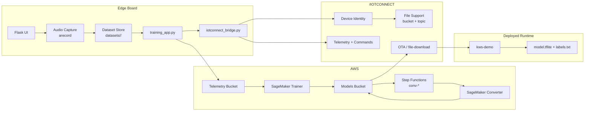
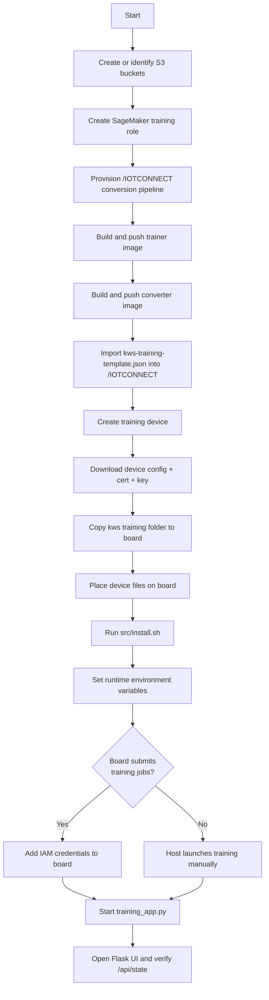
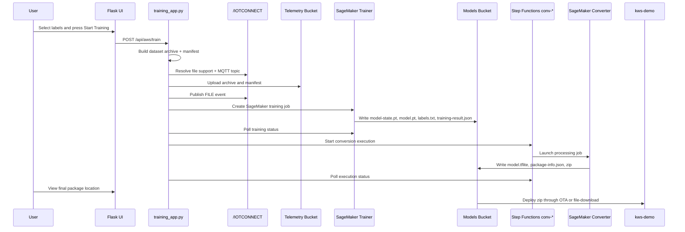
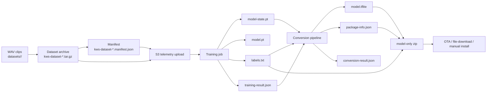
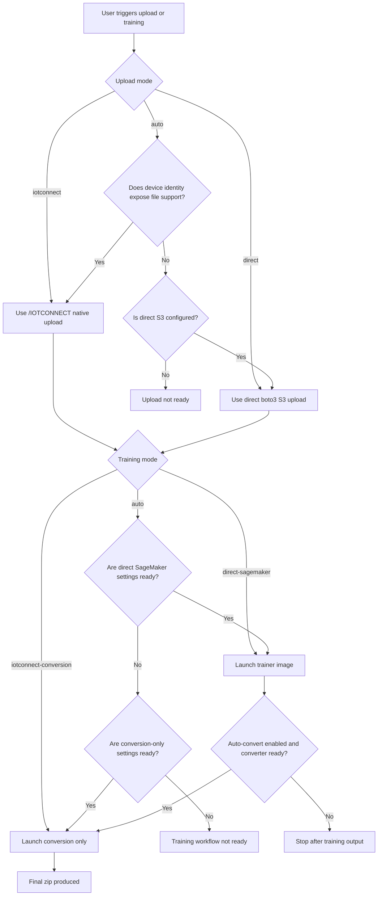
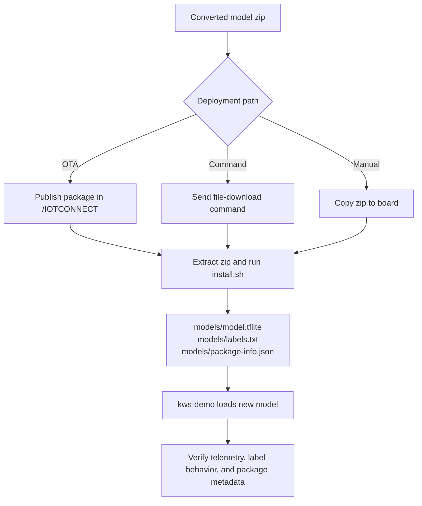
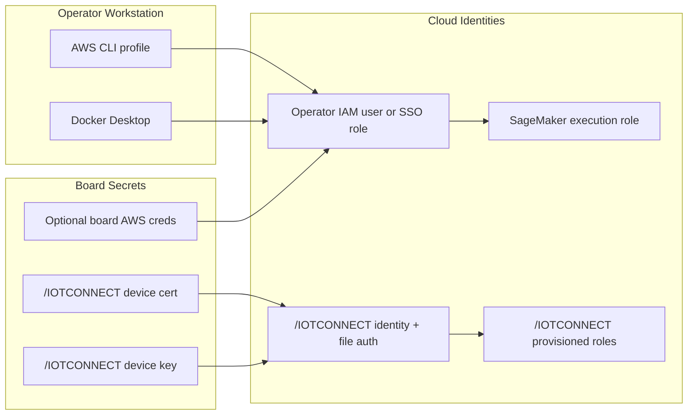

# Diagrams

These diagrams describe the full `kws training` system in Mermaid format so they stay editable in the repository.

If your Markdown viewer does not render Mermaid, copy a block into the Mermaid Live Editor or any Markdown tool that supports Mermaid and export it as SVG or PDF.

## 1. System Architecture

## 2. Initial Provisioning And Setup

## 3. Board-Driven Retraining With Auto-Conversion

## 4. Artifact Lifecycle

## 5. Upload And Training Mode Selection

## 6. Deployment Back To `kws-demo`

## 7. Credential Boundaries

## Suggested Uses

- use diagram 1 in the top-level project overview
- use diagram 2 when onboarding someone to the setup sequence
- use diagram 3 in demos and design reviews
- use diagram 4 when discussing artifact contracts between stages
- use diagram 5 when debugging why a workflow did or did not start
- use diagram 6 when handing off model deployment to the team running `kws-demo`
- use diagram 7 when discussing security and credential placement
