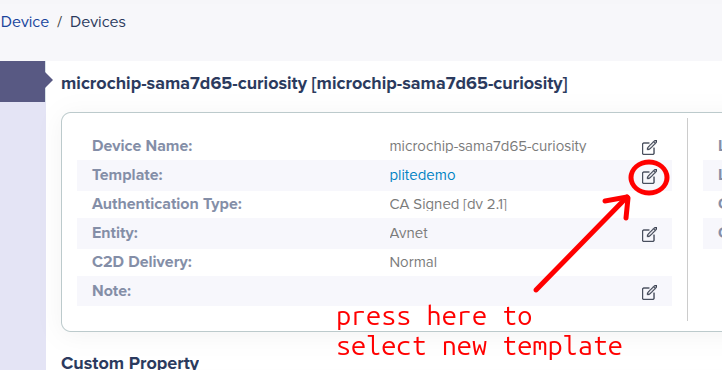

# Keyword Spotting Demo

Upgrades the /IOTCONNECT Starter Demo on the Microchip SAMA7D65-Curiosity Kit to a USB microphone keyword spotter that publishes inference results to /IOTCONNECT.

> [!IMPORTANT]
> Complete the [/IOTCONNECT quickstart guide for the Microchip SAMA7D65-Curiosity Kit](https://github.com/avnet-iotconnect/iotc-python-lite-sdk-demos/blob/main/microchip-sama7d65-curiosity/README.md) before proceeding.

## 1. Introduction

This demo replaces the random-number telemetry loop with a lightweight speech-command classifier. The application captures one-second audio clips from a USB microphone, computes MFCC features locally, runs a TensorFlow Lite keyword spotting model on the board CPU, and pushes the top prediction to /IOTCONNECT.

The bundled model is Arm's quantized `DS-CNN Small` Speech Commands model. The default recognized keywords are:

`_silence_`, `_unknown_`, `yes`, `no`, `up`, `down`, `left`, `right`, `on`, `off`, `stop`, `go`

## 2. Set Up Hardware and Template

1. Plug a USB microphone into one of the board's USB host ports.

   > **Microphone requirements:** For best performance, use a USB UAC (USB Audio Class) condenser microphone with a built-in pre-amp. Set the microphone's volume knob to between 50% and 75% — higher settings can cause clipping. A USB audio dongle with an analog mic jack will work but typically produces a weaker signal. [This microphone](https://www.amazon.com/dp/B06XCKGLTP) has been tested and works well with this demo; users are encouraged to purchase it or a similar USB UAC condenser mic.

2. Confirm the microphone is visible to ALSA:

```bash
arecord -l
```

3. Import the [kws-template.json](./kws-template.json) device template to /IOTCONNECT and in your device's page, set the template to `sama7d6Kws`.



The template exposes telemetry for the latest inference, accepted detections, threshold, active heartbeat interval, and audio device. The template commands are `listen-start`, `listen-stop`, `set-threshold`, `set-interval`, and `file-download`.

## 3. Deploy and Run

### Download and Install

On the board, run:

```bash
cd /opt/demo
wget -O kws-demo-package.zip https://raw.githubusercontent.com/avnet-iotconnect/iotc-python-lite-sdk-demos/main/microchip-sama7d65-curiosity/kws-demo/packages/kws-demo-package.zip
python3 -m zipfile -e kws-demo-package.zip .
bash ./install.sh
```

> [!NOTE]
> On minimal Yocto images, `numpy` or `tflite-runtime` may not have compatible wheels. The installer warns instead of failing the OTA, but inference requires both a working `numpy` and a TensorFlow Lite interpreter on the target.

### Run

```bash
cd /opt/demo
python3 app.py
```

By default the demo starts listening immediately. Set `KWS_AUTOSTART=0` to start idle and only begin listening after a cloud command.

## 4. Telemetry

The app sends telemetry in two cases: immediately on an accepted keyword detection, and on a heartbeat every 60 seconds by default (adjustable via `set-interval`).

| Field | Description |
|---|---|
| `kws_label` | Top class from the latest inference |
| `kws_confidence` | Score for the latest top class |
| `kws_detected` | `true` only on an accepted detection event packet |
| `last_detected_word` | Last accepted keyword event |
| `detection_count` | Accepted keyword events since app start |
| `telemetry_interval` | Current heartbeat interval in seconds |
| `audio_device` | ALSA capture device in use |
| `model_name` | Active model filename |
| `model_package` | Package that installed the current model |
| `model_sha256` | SHA-256 of the active `model.tflite` |

## 5. Commands

| Command | Description |
|---|---|
| `listen-start` | Starts continuous keyword capture and inference |
| `listen-stop` | Stops audio capture but keeps the app connected |
| `set-threshold` | Changes the detection confidence threshold, e.g. `0.85` |
| `set-interval` | Changes the heartbeat interval in seconds, e.g. `60` |
| `file-download` | Downloads and installs a replacement `.zip` package, then restarts |

## 6. Swapping Models via OTA

Ready-made model packages are in [packages/](./packages/). These let you try other Arm keyword-spotting model sizes without changing the app code:

| Package | Description |
|---|---|
| `kws-demo-package.zip` | Full app package (default install) |
| `model-ds-cnn-small-int8.zip` | Default DS-CNN Small (int8) model only |
| `model-ds-cnn-small-fp32.zip` | DS-CNN Small (fp32) model only |
| `model-ds-cnn-medium-int8.zip` | Larger DS-CNN Medium (int8) model only |
| `model-ds-cnn-medium-fp32.zip` | Larger DS-CNN Medium (fp32) model only |
| `model-cnn-small-int8.zip` | Smaller CNN alternative (int8) model only |

To swap a model via the `file-download` command, send the raw GitHub URL of the desired package as the command argument. To confirm the swap succeeded:

- Board log shows `OTA successful. Restarting the application...`
- Startup telemetry resets `inference_count` and `detection_count` to `0`
- `model_package` and `model_sha256` reflect the new package

Model-only packages must follow this layout:

```
install.sh
models/model.tflite
models/labels.txt
models/package-info.json
```

## 7. Customize and Rebuild (Optional)

To modify the demo before deploying, edit files in `src/` and then rebuild:

```bash
bash ./create-package.sh
```

This regenerates `package.zip`, `packages/kws-demo-package.zip`, and `../../common/package.zip`.

To deliver the updated package:

**Option A — Direct copy (scp):**
```bash
# On host:
scp ./packages/kws-demo-package.zip root@<board-ip>:/opt/demo/
# On board:
cd /opt/demo && python3 -m zipfile -e kws-demo-package.zip . && bash ./install.sh
```

**Option B — OTA via /IOTCONNECT platform:**
1. In the **Device** page, select **Firmware** on the bottom toolbar.
2. Create a new firmware if needed: click **Create Firmware** (top-right), name it, select the `sama7d6Kws` template, set version numbers (e.g., `0`, `0`), browse to `kws-demo-package.zip`, and click **Save**.
3. Back on the Firmware page, click the draft number under **Software Upgrades → Draft**.
4. Click the publish icon (black square with arrow) under **Actions**.
5. Select **OTA Updates** (top-right), choose your firmware's hardware and software versions, set **Target** to **Devices**, select your device, and click **Update**.

Shortly after, the running `app.py` will receive the package, extract it, execute `install.sh`, and restart automatically.

## 8. Environment Overrides

```bash
export KWS_AUTOSTART=1
export KWS_DETECTION_THRESHOLD=0.80
export KWS_COOLDOWN_SECS=2.0
export KWS_TELEMETRY_SECS=60
export KWS_ARECORD_DEVICE=plughw:1,0
export KWS_MODEL_DIR=/opt/demo/models
export KWS_MODEL_FILE=model.tflite
export KWS_LABELS_FILE=labels.txt
export KWS_CONFIG_DIR=/opt/demo
```

`KWS_CONFIG_DIR` points the demo at the directory containing `iotcDeviceConfig.json`, `device-cert.pem`, and `device-pkey.pem`. Defaults to the current working directory.

## 9. Training Custom Commands

To train a custom keyword model for this demo, see [../kws-training/README.md](../kws-training/README.md). The training workflow produces a `.zip` model package compatible with the `file-download` command.

## 10. Model Sources

The bundled and optional stock models are from Arm's ML Zoo keyword spotting assets:

- [DS-CNN Small](https://github.com/Arm-Examples/ML-zoo/tree/master/models/keyword_spotting/ds_cnn_small/model_package_tf)
- [DS-CNN Medium](https://github.com/Arm-Examples/ML-zoo/tree/master/models/keyword_spotting/ds_cnn_medium/model_package_tf)
- [CNN Small](https://github.com/Arm-Examples/ML-zoo/tree/master/models/keyword_spotting/cnn_small/model_package_tf)
