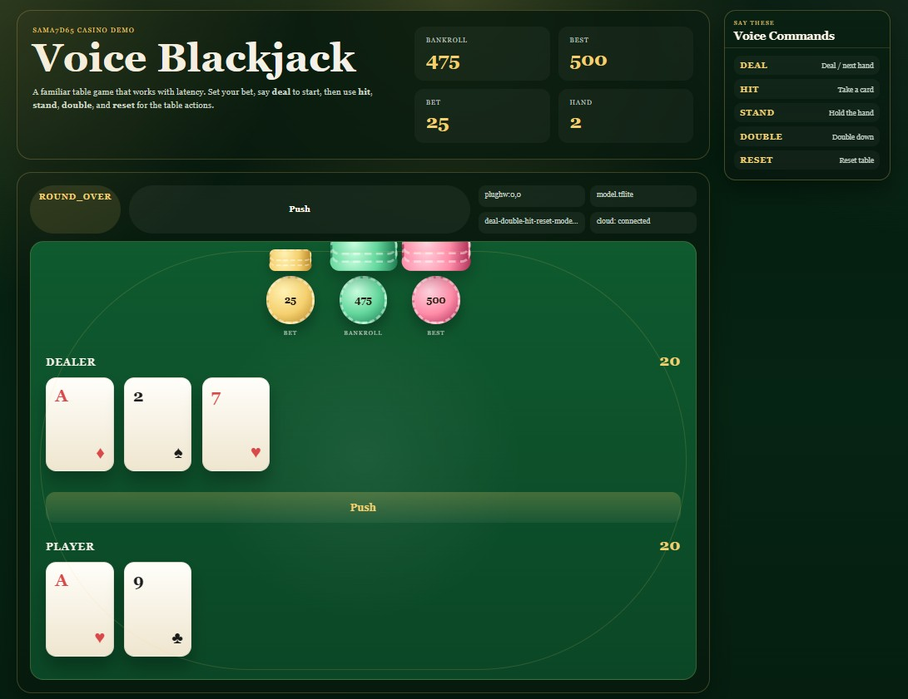
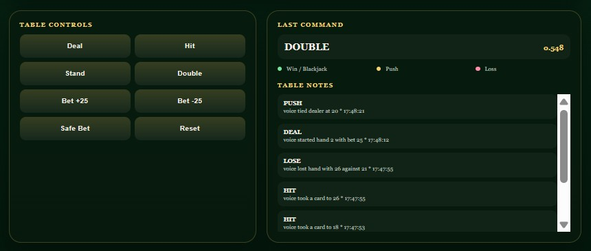
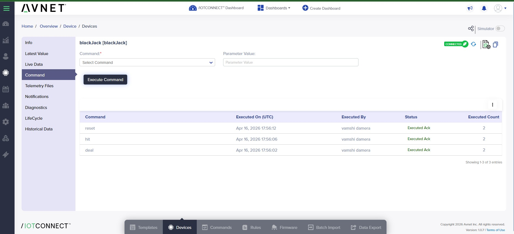
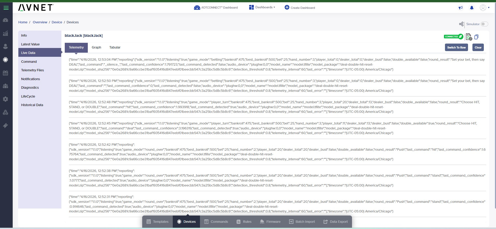
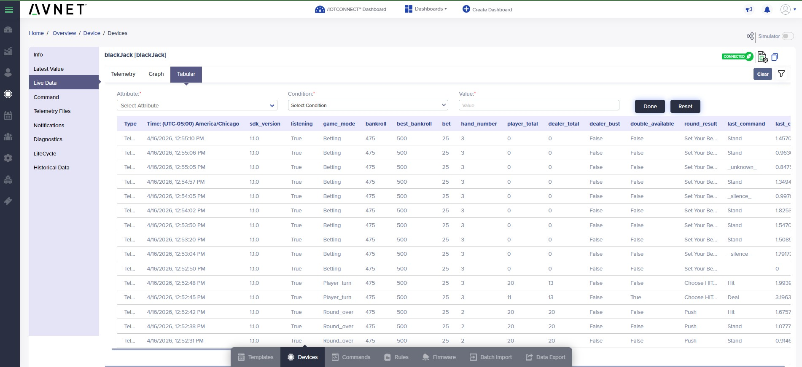
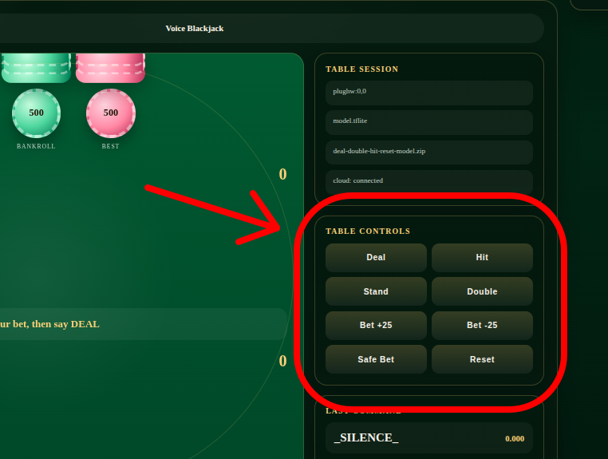

# Voice Blackjack (KWS Game)

Upgrades the /IOTCONNECT Starter Demo on the Microchip SAMA7D65-Curiosity Kit to a voice-controlled blackjack game
served from the board's browser UI and connected to /IOTCONNECT for telemetry and cloud commands.

> [!IMPORTANT]
> Complete
> the [/IOTCONNECT quickstart guide for the Microchip SAMA7D65-Curiosity Kit](https://github.com/avnet-iotconnect/iotc-python-lite-sdk-demos/blob/main/microchip-sama7d65-curiosity/README.md)
> before proceeding.

> [!NOTE]
> This demo uses the same USB microphone and keyword spotting pipeline as
> the [Keyword Spotting Demo](../kws-demo/README.md). The two demos cannot run at the same time — this game replaces the
> basic KWS demo on the device.

## 1. Introduction

This demo runs a blackjack game locally on the board, exposes a browser UI over the board's local network, and
uses a TensorFlow Lite keyword spotter to accept voice commands from a USB microphone. Game state, bankroll, and
inference results are published as telemetry to /IOTCONNECT and can also be controlled via cloud commands.

The recognized voice commands are: `deal`, `hit`, `stand`, `double`, `reset`

Bet control uses on-screen buttons, arrow keys, or `F` for a safe default bet.

## 2. Visual Tour

<table>
  <tr>
    <td width="50%">
      
      <br />
      <sub>Main game view with the active bankroll, bet, hand state, and current voice command list.</sub>
    </td>
    <td width="50%">
      
      <br />
      <sub>Table controls and the event log make it easy to test voice actions against keyboard and button fallbacks.</sub>
    </td>
  </tr>
  <tr>
    <td width="50%">
      
      <br />
      <sub>The Latest Value view shows the current game state, active model package, detection threshold, and last command outcome.</sub>
    </td>
    <td width="50%">
      
      <br />
      <sub>The Commands view lets operators trigger actions like <code>deal</code>, <code>hit</code>, and <code>reset</code> from the cloud.</sub>
    </td>
  </tr>
  <tr>
    <td width="50%">
      
      <br />
      <sub>Live Data shows the raw telemetry stream exactly as the board publishes it during gameplay.</sub>
    </td>
    <td width="50%">
      
      <br />
      <sub>The tabular view is useful when you want to scan game-mode, totals, bankroll, and command history as structured fields.</sub>
    </td>
  </tr>
</table>

## 3. Set Up Hardware and Template

1. Plug a USB microphone into one of the board's USB host ports.

> [!NOTE]
> **Microphone requirements:** For best performance, use a USB UAC (USB Audio Class) condenser microphone with a
> built-in pre-amp. Set the microphone's volume knob to between 50% and 75% — higher settings can cause clipping. A USB
> audio dongle with an analog mic jack will work but typically produces a weaker
> signal. [This microphone](https://www.amazon.com/dp/B06XCKGLTP) has been tested and works well with this demo; users
> are encouraged to purchase it or a similar USB UAC condenser mic.

2. Confirm the microphone is visible to ALSA:

```bash
arecord -l
```

3. Import the [kws-game-template.json](./kws-game-template.json) device template to /IOTCONNECT and in your device's
   page, set the template to `sama7d6Bj`.


The template exposes game state, bankroll, current command outcome, audio/model metadata, threshold, and telemetry
interval. Template commands include both game actions (`deal`, `hit`, `stand`, `double`, `reset`, `bet-up`, `bet-down`,
`safe-bet`) and runtime controls (`listen-start`, `listen-stop`, `set-threshold`, `set-interval`, `refresh-state`,
`file-download`).

## 4. Import the /IOTCONNECT Dashboard

1. Download the pre-made /IOTCONNECT dashboard template: [Microchip_Blackjack_Dash_dashboard_export.json](./dashboards/Microchip_Blackjack_Dash_dashboard_export.json)
2. On line 72 of the template file, change `192.168.10.155` to be the IP address of your Microchip SAMA7D65 Curiosity Kit.
   
> [!TIP]
> You can find the IP address of your board by executing the command `ip a` in the terminal and then under the `eth0` interface
> find the `192.168.XXX.XXX` number. That is your board's IP address.

3. In /IOTCONNECT, click on **Create Dashboard** at the top of the page.
4. Click on "Import Dashboard" and then upload `Microchip_Blackjack_Dash_dashboard_export.json`.
5. Select the `sama7d6Bj` device template.
6. Select your device unique ID for the device.
7. Give your dashboard a name of your choosing.
8. Click "Save"
9. After the dashboard widgets load, zoom out until you can comfortably view most of dashboard on your monitor.

> [!NOTE]
> The large widget on the right side of the dashboard will be populated with the blackjack web server
> once the program has been started. Until then it will look blank.

10. OPTIONAL: While the default layout is recommended, you can move the widgets around your dashboard by clicking-and-dragging them across the screen. 
11. Click the "Save" button at the top of the screen to leave edit mode and view the live dashboard.

## 5. Deploy and Run

### Download and Install

On the board, run:

```bash
cd /opt/demo
wget -O kws-game-package.zip https://raw.githubusercontent.com/avnet-iotconnect/iotc-python-lite-sdk-demos/main/microchip-sama7d65-curiosity/kws-game/packages/kws-game-package.zip
python3 -m zipfile -e kws-game-package.zip .
bash ./install.sh
```

### Run

After the installation is complete, execute this to start the program:

```bash
cd /opt/demo
python3 game_app.py
```

## 6. Playing the Game

### Game Flow

The game starts in **betting** mode with a $500 bankroll and a $25 default bet.

1. **Set your bet** using the on-screen **Bet +25**, **Bet -25**, or **Safe Bet** buttons, the keyboard arrow keys, or `F` for a safe $25 bet. If you are happy with the current bet, you can skip this step and proceed directly to dealing.
2. Say **"deal"** to start the hand. Your cards and the dealer's cards are dealt.
3. During your turn, choose one of:
   - Say **"hit"** to take another card.
   - Say **"stand"** to hold your hand and let the dealer play.
   - Say **"double"** to double your bet, receive exactly one more card, and stand (only available when your bankroll covers the doubled bet).
4. The dealer draws until reaching 17 or higher. The result is shown on screen and sent to /IOTCONNECT as telemetry.
5. Say **"deal"** again to start the next hand.
6. Say **"reset"** at any time to clear the current hand and return to the betting screen.

### Detection Threshold

The keyword spotter assigns a confidence score (0–1) to each recognized word. A command is only accepted if its score meets or exceeds the **detection threshold**. The default threshold is **0.25**.

**Tuning guidance:**

- If the **Last Command** section of the UI shows the word you said but no action was taken, the score was below the threshold. Try saying the word again more clearly.
- If this happens frequently, it is a sign that the threshold should be lowered to better match your voice and microphone.
- The right threshold varies from user to user depending on how closely your voice matches the training data and the characteristics of your microphone. Values between **0.15** and **0.50** are typical.

To change the threshold, set the `KWS_DETECTION_THRESHOLD` environment variable when you execute the app script:

```bash
KWS_DETECTION_THRESHOLD=0.20 python3 game_app.py
```

### Web Server UI Backup Controls

If your board is struggling to accept your voice commands evn after adjustment of the threshold, microphone pre-amp volume, and tone of voice, 
you can still progress the game via the "TABLE CONTROLS" buttons in the web server widget of the dashboard.



## 7. Telemetry

The game sends telemetry on startup, on a 60-second heartbeat, after an accepted voice detection, and after a cloud or
local control action.

| Field                                           | Description                                                 |
|-------------------------------------------------|-------------------------------------------------------------|
| `game_mode`                                     | Current game state (`betting`, `player_turn`, `round_over`) |
| `bankroll`                                      | Current chip total                                          |
| `best_bankroll`                                 | Highest bankroll reached this session                       |
| `bet`                                           | Current bet amount                                          |
| `hand_number`                                   | Hands played this session                                   |
| `player_total` / `dealer_total`                 | Current hand totals                                         |
| `round_result`                                  | Outcome of the last completed hand                          |
| `last_command` / `last_command_confidence`      | Most recent voice or cloud command and its confidence       |
| `audio_device`                                  | ALSA capture device in use                                  |
| `model_name` / `model_package` / `model_sha256` | Active model metadata                                       |
| `detection_threshold` / `telemetry_interval`    | Current runtime settings                                    |

## 8. Commands

**Game actions:** `deal`, `hit`, `stand`, `double`, `reset`, `bet-up`, `bet-down`, `safe-bet`

**Runtime controls:** `listen-start`, `listen-stop`, `set-threshold`, `set-interval`, `refresh-state`, `file-download`

## 9. Customize and Rebuild (Optional)

To modify the demo before deploying, edit files in `src/` and then rebuild:

```bash
bash ./create-package.sh
```

This regenerates `package.zip`, `packages/kws-game-package.zip`, and `../../common/package.zip`.

To deliver the updated package, use scp or OTA via /IOTCONNECT (see
the [kws-demo Customize and Rebuild section](../kws-demo/README.md#7-customize-and-rebuild-optional) for the general OTA
steps, substituting the `sama7d6Bj` template and the kws-game package file).

## 10. Environment Overrides

```bash
export KWS_AUTOSTART=1
export KWS_DETECTION_THRESHOLD=0.25
export KWS_COOLDOWN_SECS=1.2
export KWS_GAME_TELEMETRY_SECS=60
export KWS_ARECORD_DEVICE=plughw:0,0
export KWS_MODEL_DIR=/opt/demo/models
export KWS_CONFIG_DIR=/opt/demo
export KWS_GAME_PORT=8080
```

`KWS_CONFIG_DIR` points the app at the directory containing `iotcDeviceConfig.json`, `device-cert.pem`, and
`device-pkey.pem`. Defaults to the current working directory. `KWS_GAME_PORT` sets the Flask server port (default
`8080`).
