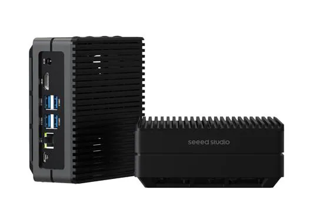
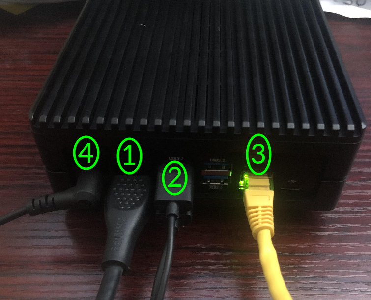

# NVIDIA Jetson Orin (Seeed Studio reComputer J4011) Quickstart
[Purchase the Seeed Studio reComputer J4011](https://www.newark.com/seeed-studio/110110144/recomputer-j4011-edge-ai-device/dp/74AK7856)

1. [Introduction](#1-introduction)
2. [Requirements](#2-requirements)
3. [Hardware Setup](#3-hardware-setup)
4. [/IOTCONNECT: Cloud Account Setup](#4-iotconnect-cloud-account-setup)
5. [Device Setup](#5-device-setup)
6. [Onboard Device](#6-onboard-device)
7. [Using the Demo](#7-using-the-demo)
8. [Resources](#8-resources)

# 1. Introduction

This guide is designed to walk through the steps to connect the Seeed Studio reComputer J4011 - Edge AI Computer with 
NVIDIA® Jetson™ Orin™ NX 8GB to the Avnet /IOTCONNECT platform and demonstrate the standard IoT function of telemetry collection.

<table>
  <tr>
    <td></td>
    <td>The reComputer J4011 is a hand-size edge AI box built with NVIDIA Jetson Orin™ NX 8GB module which delivers up to 
70 TOPS AI performance and has a rich set of IOs including USB 3.2 ports(4x), HDMI 2.1, M.2 key E for WIFI, M.2 Key M for 
SSD, RTC, CAN, Raspberry Pi GPIO 40-pin and more. It is also equipped with an aluminum case, a cooling fan with a heatsink, 
and a pre-installed JetPack System with NVIDIA JetPack™. As part of the NVIDIA Jetson ecosystem, reComputer J4011 is ready 
for your next AI application development and deployment.</td>
  </tr>
</table>

# 2. Requirements

## Hardware

* Seeed Studio reComputer J4011 [Purchase](https://www.newark.com/seeed-studio/110110144/recomputer-j4011-edge-ai-device/dp/74AK7856) | [Datasheet](https://files.seeedstudio.com/products/NVIDIA/reComputer-J401x-datasheet.pdf) | [All Resources](https://www.renesas.com/en/design-resources/boards-kits/rz-g3e-evkit?srsltid=AfmBOoqkLQfH7gyWHOem2U-duZ3bwaM7khGy20z2v4WJy6npgNdgVsm5)
* DC Power Adapter (included)
* AC Cloverleaf Power Cable (not included, but available separately from Seeed Studio [here](https://www.seeedstudio.com/AC-US-p-5122.html))
* HDMI Cable and Monitor (not included)
* Ethernet Cable
* USB Keyboard (not included)
* USB Mouse (not included)

# 3. Hardware Setup

See the reference image below for cable connections.
<details>
<summary>Reference Image with Connections</summary>

</details>

1. Connect the board to a monitor via HDMI shown as **#1**.
2. Connect a USB mouse and a USB keyboard to two of the USB ports on your board, shown as **#2**.
3. Connect an ethernet cable from your LAN (router/switch) to the ethernet port on the board shown as **#3**.
4. Connect the DC power cable to the board (and connect the AC cloverleaf cable to the DC adapter) shown as **#4**.
  
> [!NOTE]
> The board may take a few minutes to boot up after powering on for the first time.

# 4. /IOTCONNECT: Cloud Account Setup

An /IOTCONNECT account with AWS backend is required. If you need to create an account, a free trial subscription is
available.

[/IOTCONNECT Free Trial (AWS Version)](https://subscription.iotconnect.io/subscribe?cloud=aws)

> [!NOTE]
> Be sure to check any SPAM folder for the temporary password after registering.

See the /IOTCONNECT [Subscription Information](https://github.com/avnet-iotconnect/avnet-iotconnect.github.io/blob/main/documentation/iotconnect/subscription/subscription.md) for more details on the trial.

# 5. Device Setup

1. After the board boots up for the first time, users will go through a standard Ubuntu installation/configuration process 
including setting up a username and password, selecting timezone, etc. No special configuration is required for this QuickStart 
so users can keep default settings if desired.
2. Once the Ubuntu installation is complete, the user can log in and then open a terminal window by pressing the key combination 
`CTRL + ALT + T`.

> [!TIP]
> To connect to the board via SSH, users can acquire the IP address by executing the command `ip a` to get the 
> network connection info and then note the IP address listed under the `eth0` interface. 

3. The Python version on the board will be 3.8, but the /IOTCONNECT Python Lite SDK requires at least Python 3.9 so to 
upgrade the Python version to 3.9 and set it to be the default version, execute these commands:
```
sudo apt install software-properties-common
```

```
sudo add-apt-repository ppa:deadsnakes/ppa
```

```
sudo apt update
```

```
sudo apt install python3.9 python3.9-distutils python3.9-venv
```

```
sudo update-alternatives --install /usr/bin/python3 python3 /usr/bin/python3.8 1
```

```
sudo update-alternatives --install /usr/bin/python3 python3 /usr/bin/python3.9 2
```

4. Now execute these commands on your board to update the core board packages and install necessary /IOTCONNECT packages:

```
sudo apt-get install python3-pip -y
```

```
sudo python3 -m pip install iotconnect-sdk-lite
```

5. Run this command to create and move into a directory for your demo files:

```
sudo mkdir -p /home/weston/demo && cd /home/weston/demo
```

6. Run this command to ensure your user has ownership of the new directory (use your created username for `username`)

```
sudo chown -R username:username /home/weston/demo
```

For example if your username was `TestUser` your command would be

```
sudo chown -R TestUser:TestUser /home/weston/demo
```

# 6. Onboard Device

The next step is to onboard your device into /IOTCONNECT. This will be done via the online /IOTCONNECT user interface.

Follow [this guide](../common/general-guides/UI-ONBOARD.md) to walk you through the process.

# 7. Using the Demo

Run the basic demo with this command:

```
python3 app.py
```

> [!NOTE]
> Always make sure you are in the ```/home/weston/demo``` directory before running the demo. You can move to this
> directory with the command: ```cd /home/weston/demo```

View the random-integer telemetry data under the "Live Data" tab for your device on /IOTCONNECT.

# 8. Resources

* [Purchase the Seeed Studio reComputer J4011](https://www.newark.com/seeed-studio/110110144/recomputer-j4011-edge-ai-device/dp/74AK7856)
* [/IOTCONNECT Overview](https://www.iotconnect.io/)
* [/IOTCONNECT Knowledgebase](https://help.iotconnect.io/)
