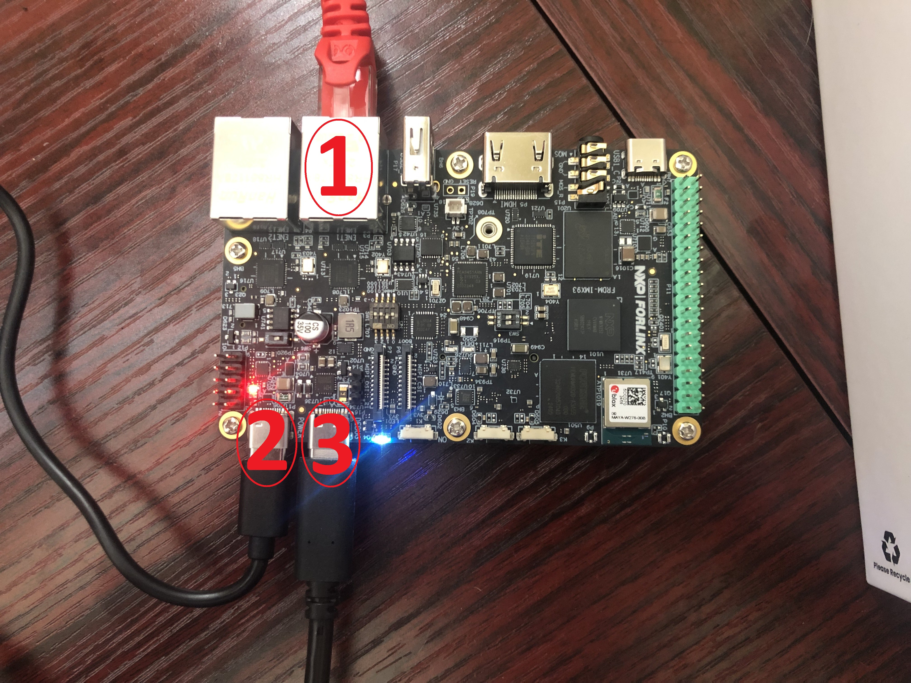

# NXP FRDM i.MX 93 Development Board QuickStart

1. [Introduction](#1-introduction)
2. [Hardware Requirements](#2-hardware-requirements)
3. [Hardware Setup](#3-hardware-setup)
4. [Cloud Account Setup](#4-cloud-account-setup)
5. [/IOTCONNECT Device Template Setup](#5-iotconnect-device-template-setup)
6. [Device Setup](#6-device-setup)
7. [Using the Demo](#7-using-the-demo)
8. [Resources](#8-resources)

# 1. Introduction
This guide is designed to walk through the steps to connect the NXP FRDM i.MX 93 to the Avnet /IOTCONNECT platform and demonstrate the standard IoT function of telemetry collection.

<table>
  <tr>
    <td></td>
    <td>The FRDM i.MX 93 development board is a low-cost and compact development board featuring the i.MX93 applications processor. Equipped with an onboard IW612 module, featuring NXP's Tri-Radio solution with Wi-Fi 6 + Bluetooth 5.4 + 802.15.4, the board is ideal for developing modern Industrial and IoT applications.</td>
  </tr>
</table>

# 2. Hardware Requirements
* NXP FRDM i.MX 93 Development Board [Purchase](https://www.avnet.com/shop/us/products/nxp/frdm-imx93-3074457345660216004/) | [User Manual & Kit Contents](https://docs.nxp.com/bundle/UM12181/page/topics/frdm-imx93_overview.html) | [All Resources](https://www.nxp.com/design/design-center/development-boards-and-designs/FRDM-IMX93)
* 2x USB Type-C Cables (included in kit)
* **OPTIONAL**: 1x Ethernet Cable (with a switch/router to connect to)

# 3. Hardware Setup
See the reference image below for cable connections.
<details>
<summary>Reference Image with Connections</summary>

</details>

1. **OPTIONAL**: Connect an Ethernet cable from your LAN (router/switch) to the port labeled **#1** in the reference image.
2. Connect a USB-C cable from a 5V power souce (such as your host machine) to the port labeled **#2** in the reference image.
3. Connect a USB-C cable from your host machine to the port labeled **#3** in the reference image.

# 4. Cloud Account Setup
An /IOTCONNECT account with AWS backend is required.  If you need to create an account, a free trial subscription is available.

[/IOTCONNECT Free Trial (AWS Version)](https://subscription.iotconnect.io/subscribe?cloud=aws)

> [!NOTE]
> Be sure to check any SPAM folder for the temporary password after registering.

See the /IOTCONNECT [Subscription Information](https://github.com/avnet-iotconnect/avnet-iotconnect.github.io/blob/main/documentation/iotconnect/subscription/subscription.md) for more details on the trial.

# 5. /IOTCONNECT Device Template Setup
A Device Template define the type of telemetery the platform should expect to recieve.
* Download the pre-made [Basic Device Template](https://raw.githubusercontent.com/avnet-iotconnect/iotc-python-lite-sdk/refs/heads/main/files/plitedemo-template.json) (**MUST** Right-Click and "Save-As" to get the raw json file)
* Import the template into your /IOTCONNECT instance. (A guide on [Importing a Device Template](https://github.com/avnet-iotconnect/avnet-iotconnect.github.io/blob/main/documentation/iotconnect/import_device_template.md) is available or for more information, please see the [/IOTCONNECT Documentation](https://docs.iotconnect.io/iotconnect/) website.)

# 6. Device Setup
1. With the board powered on and connected to your host machine, open your Device Manager and note the COM ports that are in use by a "USB Serial Device" (may be multiple).
2. Open a terminal emulator program such as Putty on your host machine.
3. Ensure that your serial settings in your terminal emulator are set to:
  - Baud Rate: 115200
  - Data Bits: 8
  - Stop Bits: 1
  - Parity: None
4. Starting with the lowest COM port value for "USB Serial Device" in the Device Manager list, attempt to connect to your board via the terminal emulator
>[!NOTE]
>A successful connection may result in just a blank terminal box. If you see a blank terminal box, press the ENTER key to get a login prompt. An unsuccessful connection attempt will usually result in an error window popping up.
5. When prompted for a login, type "root" followed by the ENTER key.
6. Wifi Setup (**OPTIONAL**): To set up your board to use a wifi internet connection instead of an ethernet connection, you can follow the [simple guide in this same directory](WIFI.md).
7. Run these commands to create and move into a directory for your demo files:
   ```
   mkdir /home/weston/demo
   cd /home/weston/demo
   ```
>[!TIP]
>To gain access to "copy" and "paste" functions inside of a Putty terminal window, you can CTRL+RIGHTCLICK within the window to utilize a dropdown menu with these commands. This is very helpful for copying/pasting between your borswer and the terminal.

8. Run this command to install the IoTConnect Python Lite SDK:
   ```
   python3 -m pip install iotconnect-sdk-lite
   ```
9. Run this command to download and run the Quickstart setup script:
   ```
   curl -sOJ 'https://raw.githubusercontent.com/avnet-iotconnect/iotc-python-lite-sdk/refs/heads/main/scripts/quickstart.sh' && bash ./quickstart.sh
   ```

>[!IMPORTANT]
>The device template upload step of the quickstart script can be skipped since it was already taken care of in Step 5.

>[!NOTE]
>This script primarily covers device and certificate creation in IoTConnect. It will require some copy/paste between your browser and the terminal window.

# 7. Using the Demo
1. Run the basic demo with this command:
```
python3 /home/weston/demo/quickstart.py
```
2. View the dummy telemetry data under the "Live Data" tab for your device on IoTConnect.

# 8. Resources
* [Purchase the STM32MP257-EV1 Board](https://www.avnet.com/shop/us/products/nxp/frdm-imx93-3074457345660216004/)
* [/IOTCONNECT Overview](https://www.iotconnect.io/)
* [/IOTCONNECT Knowledgebase](https://help.iotconnect.io/)
