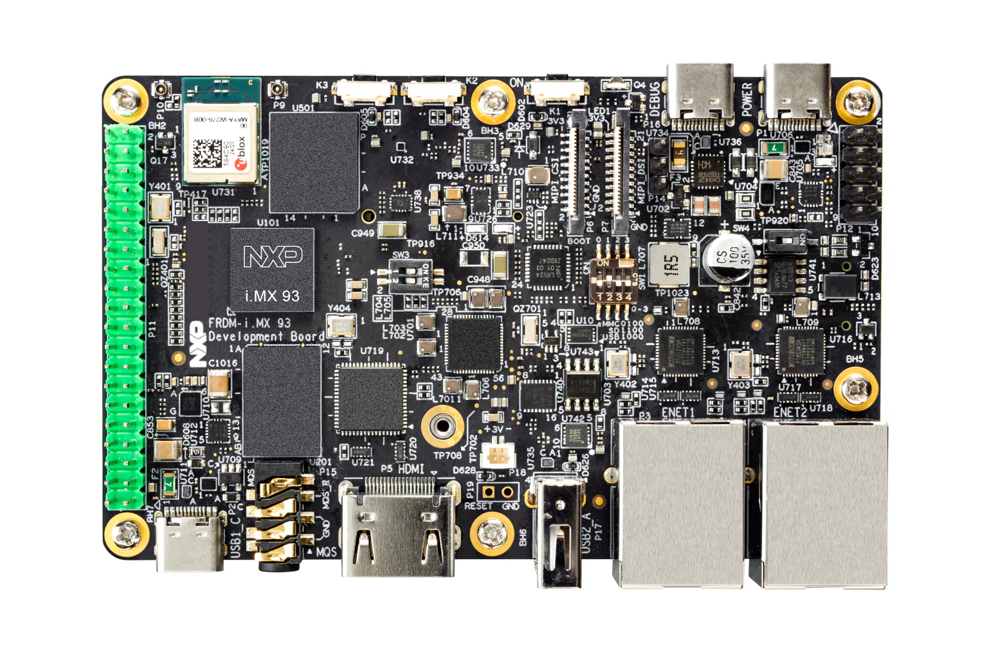
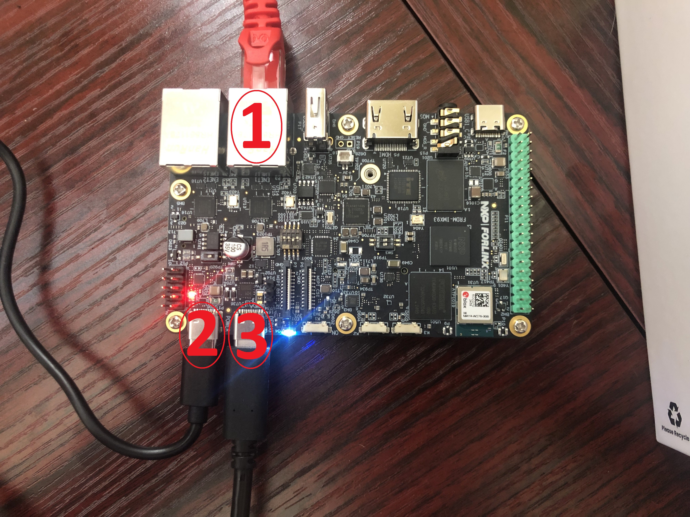

# NXP FRDM i.MX 93 Development Board QuickStart
[Purchase NXP FRDM i.MX 93 Development Board](https://www.newark.com/nxp/frdm-imx93/frdm-dev-board-arm-cortex-a55/dp/48AM1905)
> [!TIP]
> To set up and connect this device using the **AWS Greengrass Lite SDK**, refer to this [QuickStart Guide](https://github.com/avnet-iotconnect/iotc-python-greengrass-demos/blob/main/nxp-frdm-imx-93/)

1. [Introduction](#1-introduction)
2. [Requirements](#2-requirements)
3. [Hardware Setup](#3-hardware-setup)
4. [Device Setup](#4-device-setup)
5. [Onboard Device](#5-onboard-device)
6. [Using the Demo](#6-using-the-demo)
7. [EIQ Vision AI Driver Monitoring System Demo](#7-eiq-vision-ai-driver-monitoring-system-demo)
8. [Troubleshooting](#8-troubleshooting)
9. [Resources](#9-resources)

# 1. Introduction

This guide provides step-by-step instructions to set up the NXP FRDM i.MX 93 hardware and integrate it with /IOTCONNECT,
Avnet's robust IoT platform.

<table>
  <tr>
    <td></td>
    <td>The FRDM i.MX 93 development board is a low-cost and compact development board featuring the i.MX93 applications processor. Equipped with an onboard IW612 module, featuring NXP's Tri-Radio solution with Wi-Fi 6 + Bluetooth 5.4 + 802.15.4, the board is ideal for developing modern Industrial and IoT applications.</td>
  </tr>
</table>

# 2. Requirements

## Hardware

* NXP FRDM i.MX 93 Development Board [Purchase](https://www.newark.com/nxp/frdm-imx93/frdm-dev-board-arm-cortex-a55/dp/48AM1905) | [User Manual & Kit Contents](https://docs.nxp.com/bundle/UM12181/page/topics/frdm-imx93_overview.html) | [All Resources](https://www.nxp.com/design/design-center/development-boards-and-designs/FRDM-IMX93)
* 2x USB Type-C Cables (included in kit)
* (Optional) Ethernet Cable
* (Optional) WiFi Network SSID and Password

## Software

* A serial terminal such as [TeraTerm](https://github.com/TeraTermProject/teraterm/releases)
  or [PuTTY](https://www.putty.org/)

# 3. Hardware Setup

See the reference image below for cable connections.
<details>
<summary>Reference Image with Connections</summary>

</details>

Using the above image as reference, make the following connections:

1. Connect an Ethernet cable from your LAN (router/switch) to the Ethernet connector labeled **#1**. If you instead wish
   to use Wi-Fi, after booting your board refer to the [WIFI](WIFI.md) guide.
2. Connect one of the included USB cables from your PC to the USB-C connector labeled **#2**.
3. Connect the other included USB cable from your PC to the USB-C connector labeled **#3**.

# 4. Device Setup

1. Open a serial terminal emulator program such as TeraTerm.
2. Ensure that your serial settings in your terminal emulator are set to:

- Baud Rate: 115200
- Data Bits: 8
- Stop Bits: 1
- Parity: None

3. Starting with the lowest COM port value for "USB Serial Device" in the Device Manager list, attempt to connect to
   your board via the terminal emulator

> [!NOTE]
> A successful connection may result in just a blank terminal box. If you see a blank terminal box, press the ENTER key
> to get a login prompt. An unsuccessful connection attempt will usually result in an error window popping up.

4. When prompted for a login, type `root` followed by the ENTER key.
5. Run these commands to update the core board packages and install necessary /IOTCONNECT packages:

```
sudo apt-get update && python3 -m pip install iotconnect-sdk-lite requests
```

6. Run this command to create and move into a directory for your demo files:

```
mkdir -p /opt/demo && cd /opt/demo
```

> [!TIP]
> To gain access to "copy" and "paste" functions inside of a PuTTY terminal window, you can CTRL+RIGHTCLICK within the
> window to utilize a dropdown menu with these commands. This is very helpful for copying/pasting between your browser and
> the terminal.

# 5. Onboard Device

The next step is to onboard your device into /IOTCONNECT. This will be done via the online /IOTCONNECT user interface.

Follow [this guide](../common/general-guides/UI-ONBOARD.md) to walk you through the process.

> [!TIP]
> If you have obtained a solution key for your /IOTCONNECT account from Softweb Solutions, you can utilize the /IOTCONNECT 
> REST API to automate the device onboarding process via shell scripts. Check out [this guide](../common/general-guides/REST-API-ONBOARD.md) 
> for more info on that.

# 6. Using the Demo

Run the basic demo with this command:

```
python3 app.py
```

> [!NOTE]
> Always make sure you are in the ```/opt/demo``` directory before running the demo. You can move to this
> directory with the command: ```cd /opt/demo```

View the random-integer telemetry data under the "Live Data" tab for your device on /IOTCONNECT.

# 7. EIQ Vision AI Driver Monitoring System Demo

After completing the basic demo setup, you will be able to perform an OTA update to automatically install and begin
running the EIQ Vision AI Driver Monitoring System Demo on your NXP i.MX 93. Refer
to [this guide](./dms-demo/README.md).

# 8. Troubleshooting

To return the board to an out-of-box state, refer to the [flashing](FLASHING.md) guide.

# 9. Resources
* Explore connecting the NXP FRDM i.MX 93 through the AWS Greengrass Lite SDK [QuickStart](https://github.com/avnet-iotconnect/iotc-python-greengrass-demos/blob/main/nxp-frdm-imx-93/)
* [Webinar Slides](Avnet-NXP-iMX93-EdgeAI-Webinar-Feb2025.pdf) | [Webinar QuickStart](dms-demo/WEBINAR_QUICKSTART.md)
* [Purchase the FRDM i.MX 93 Board](https://www.newark.com/nxp/frdm-imx93/dev-brd-64bit-arm-cortex-a55-m33/dp/20AM9538)
* [More /IOTCONNECT NXP Guides](https://avnet-iotconnect.github.io/partners/nxp/)
* [/IOTCONNECT Overview](https://www.iotconnect.io/)
* [/IOTCONNECT Knowledgebase](https://help.iotconnect.io/)
