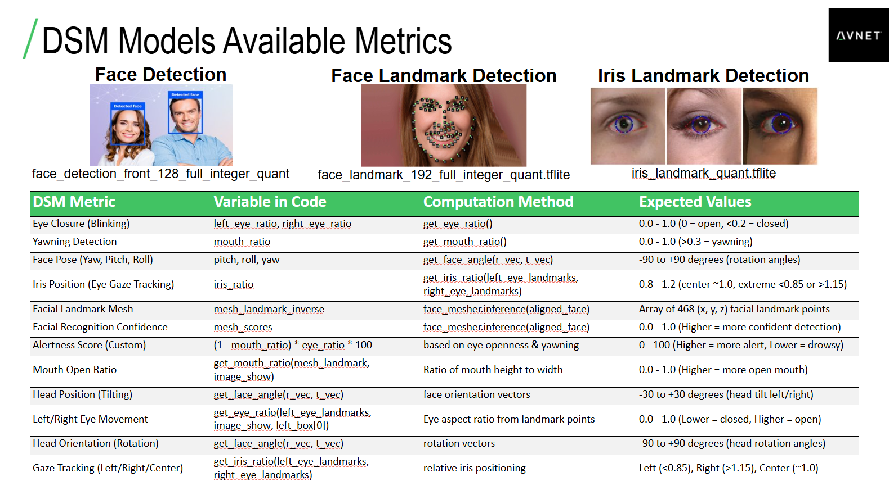

# EIQ Vision AI Driver Monitoring System (DMS) Demo: Package Creation and Deployment
This guide will help you upgrade the basic IoTConnect Quickstart Demo (random-integer telemetry) to the Driver Monitoring System AI Demo with a single update. The resulting demo will run default model files. After completing the steps in this guide, if you want to modify the demo to include custom model files, check out [this other guide](./UPDATE-MODELS.md).

>[!IMPORTANT]
> If you have not yet followed the [IoTConnect quickstart guide for this board](https://github.com/avnet-iotconnect/iotc-python-lite-sdk-demos/blob/main/nxp-frdm-imx-93/README.md), complete that first and then return here to pick up on Step 1

## 1. Clone This Git Repository to Your Host Machine
Clone a copy of this repo to your local PC. This is where you will make changes/additions to the demo files.
>[!NOTE]
>On a Linux machine this can simply be done in the terminal, but a Windows host machine will require Git Bash or WSL.

## 2. Customize Package
Inside of the cloned repo (```iotc-python-lite-sdk-demos```), navigate to the ```nxp-frdm-imx-93/dms-demo/src/``` directory:
```
cd ./nxp-frdm-imx-93/dms-demo/src/
```
By default, this directory contains the necessary files to upgrade from the basic quickstart application to the DMS demo. If this is all you wish to do with this package, you may skip to step 3

If you wish to achieve something other than the default demo installation, you will need to modify, add, and/or remove files to/from ```src``` accordingly.

**For example, if you wish to send new TFLITE models to your board and have the DMS application start using them, you would do the following:**

* Copy the new TFLITE models into the ```src``` directory
* Modify ```dms-processing.py``` with the new model filenames (lines 351-353)
* Modify ```install.sh``` to remove the unneccessary installation steps (change ```True`` in line 10 to ```False```)
* Delete these files from ```src``` so the existing copies on the board are not overwritten:
  *  ```download-models.py```
  *  ```app.py```

After those steps, all that will be contained in the package is:
* The new model files
* An updated ```dms-processing.py``` that knows to use the new model files
* An ```install.sh``` that has been modified to do nothing other than move the new model files into the appropriate directory on the board

## 3. Create Package
Navigate back to the ```dms-demo``` directory and then run this command to create ```package.tar.gz``` which includes the necessary demo files and installation script:
```
bash ./create-package.sh
```
>[!NOTE]
> At the end of the package creation script, ```package.tar.gz``` is automatically copied into the ```common``` directory so it can be readily accessed by the scripts used in optional steps 5B and 5C.
 
## 4. Prepare Device to Receive Package
The most basic way to deliver and run the install package is through a local file transfer. See step 5A below for instructions on this method.

For your board to receive the package through IoTConnect, it must be actively connected. Do this by running the main IoTConnect program on your board called ```app.py```:

From here, you have the option to push the package to your devices directly to your device in one of the following ways:
* From you host machine's console as an OTA (see step 5B)
* Through an API device command (see step 5C)
* Through the online IoTConnect platform as an OTA (see step 5D)

## 5A. Deliver Package Through Local File Transfer
To deliver your package to a device through a local file transfer, the recommended method is to use an ```scp``` (secure copy) command. 

First find the active IP address of your device and then use that IP address to copy ```package.tar.gz``` into the main application directory of the device (```/home/weston/demo```).  

After the file transfer is complete, open a terminal on your device, naviagte to the main application directory, and verify that there is a ```package.tar.gz``` present.

If ```package.tar.gz``` is there, run this command to decompress the file and overwrite existing files in the directory:

```
tar -xzf package.tar.gz --overwrite
```
Lastly, execute the ```install.sh``` script to perform any additional file movements/modifications that you programmed into your install package:
```
bash ./install.sh
```

## 5B. Push Package via OTA From Host Machine Console
Pushing an OTA from your local machine requires you to be logged into your IoTConnect account so it can utilize the IoTConnect REST API.

First make sure you install the IoTConnect REST API Python module to your host machine:
```
python3 -m pip install iotconnect-rest-api
```

Run this command to protect your IoTConnect credentials:
```
export HISTCONTROL=ignoreboth
```
Then run this IoTConnect REST API CLI command (with your credentials substituted in) to log into your IoTConnect account on the device:
```
iotconnect-cli configure -u my@email.com -p "MyPassword" --pf mypf --env myenv --skey=mysolutionkey
```
For example if these were your credentials:
* Email: john.doe@gmail.com
* Password: Abc123!
* Platform: aws
* Environment: technology
* Solution Key: AbCdEfGhIjKlMnOpQrStUvWxYz1234567890
     
Your login command would be:
```
iotconnect-cli configure -u john.doe@gmail.com -p "Abc123!" --pf aws --env technology --skey=AbCdEfGhIjKlMnOpQrStUvWxYz1234567890
```
>[!IMPORTANT]
>Notice that the password argument of the command is **the only arugment that is in quotes.** Make sure you pay attention to this detail. 

You will see this output in the console if your login succeeded:
```
Logged in successfully.
```

Navigate into the ```/common/scripts/``` directory of you cloned repo and run this command:
```
python3 ota-package-send.py
```
You will be prompted to enter the unique IDs of the devices you wish to send the OTA package to. If the firmware for your listed devices does not yet have an associated firmware, you will also be prompted for a name for the new firmware to be created.

The ```package.tar.gz``` file you generated previously will be automatically uploaded to an upgrade for the new/existing firmware, and the OTA package will be automatically pushed.

You should then see this output in your host machine console:
```
Successful OTA push!
```

## 5C. Push Package Through Command From Host Machine Console
Pushing an package from your local machine requires you to be logged into your IoTConnect account so it can utilize the IoTConnect REST API.

First make sure you install the IoTConnect REST API Python module to your host machine:
```
python3 -m pip install iotconnect-rest-api
```

Run this command to protect your IoTConnect credentials:
```
export HISTCONTROL=ignoreboth
```
Then run this IoTConnect REST API CLI command (with your credentials substituted in) to log into your IoTConnect account on the device:
```
iotconnect-cli configure -u my@email.com -p "MyPassword" --pf mypf --env myenv --skey=mysolutionkey
```
For example if these were your credentials:
* Email: john.doe@gmail.com
* Password: Abc123!
* Platform: aws
* Environment: technology
* Solution Key: AbCdEfGhIjKlMnOpQrStUvWxYz1234567890
     
Your login command would be:
```
iotconnect-cli configure -u john.doe@gmail.com -p "Abc123!" --pf aws --env technology --skey=AbCdEfGhIjKlMnOpQrStUvWxYz1234567890
```
>[!IMPORTANT]
>Notice that the password argument of the command is **the only arugment that is in quotes.** Make sure you pay attention to this detail. 

You will see this output in the console if your login succeeded:
```
Logged in successfully.
```

Navigate into the ```/common/scripts/``` directory of you cloned repo and run this command:
```
python3 cmd-package-send.py
```
You will be prompted to enter the unique IDs of the devices you wish to send the package to. All of the devices must use the same template. Any devices that use a template different from the first device entered will be rejected. 

After entering your device IDs, the ```package.tar.gz``` file you generated previously will be automatically uploaded and the command will be automatically pushed to all given devices.

For every device that receives the command, you should see this ouput in your host machine console:
```
Command successful!
```

After the command is sent to all given devices, you will see a tally of successful and failed commands in your host machine console as well.


## 5D. Upload and Push Package Through OTA in IoTConnect Online Platform
1) In the "Device" Page of the online IoTConnect platform, on the blue toolbar at the bottom of the page select "Firmware"
2) If a firmware has already been created for your device's template, skip to step 3. Otherwise:
   * Select the blue "Create Firmware" button in the top-right of the screen
   * Name your firmware (remember this name for later)
   * Select your device's template from the "Template" drop-down (if your device's template is not in the list, a firmware for it already exists in your IoTConnect instance)
   * Enter hardware and software version numbers (can be arbitrary such as 0, 0)
   * Select the "Browse" button in the "File" section and select your ```package.tar.gz```
   * Add descriptions if you desire
   * Select the "Save" button
3) Navigate back to the Firmware page and find your new firmware name in the list
4) Under the "Draft" column within the "Software Upgrades" column, click on the draft number (will be "1" for newly-created firmwares)
5) Select the black square with the black arrow under "Actions" to publish your firmware and make it available for OTA
6) In the "Firmware" page of IoTConnect, select the "OTA Updates" button in the top-right of the screen
7) For "Hardware Version" select your firmware's name with the hyphenated hardware version from the drop-down
8) Select the software version you chose for your firmware
9) For "Target" select "Devices" from the drop-down
10) Select your device's unique ID from the "Devices" drop-down
11) Click the blue "Update" button to initialize the OTA update

## 6. View Update in Device Console
Shortly after sending the update via any method, you should see an interruption in the telemetry printout on the console of your device informing you that an update package was received, downloaded and executed. 

The program is designed to re-start itself after the update files have been automatically decompressed and the ```install.sh``` script is executed (if included). There is no need for you to do any manual reboots or file manipulation. Your package installation is complete and the program is working again already!

Steps 7 and 8 will walk you through setting up and using a dashboard for the DMS demo on the online IoTConnect platform.

## 7. Import Dashboard Template

* Download the demo [Dashboard Template](templates/FRDM_i.MX_93_DSM_Demo_dashboard_template.json?raw=1) (**must** Right-Click, Save As)
* **Download** the template then select `Create Dashboard` from the top of the page
* **Select** the `Import Dashboard` option and click `browse` to select the template you just downloaded.
* **Select** `eiqIOTC` for **template** and `FRDMiMX93` for **device** 
* **Enter** a name (such as `FRDM i.MX 93 DSM Demo`) and click `Save` to complete the import

## 8. Using the Dashboard

The Driver Safety Monitor demo solution will look for a variety of facial attributes from the webcam and interpret attentiveness.
<details>
<summary>Table of Supported DSM Attributes</summary>

</details>

>[!TIP]
>You can find this slide and others on the demo in the [Webinar Slides](../Avnet-NXP-iMX93-EdgeAI-Webinar-Feb2025.pdf)

