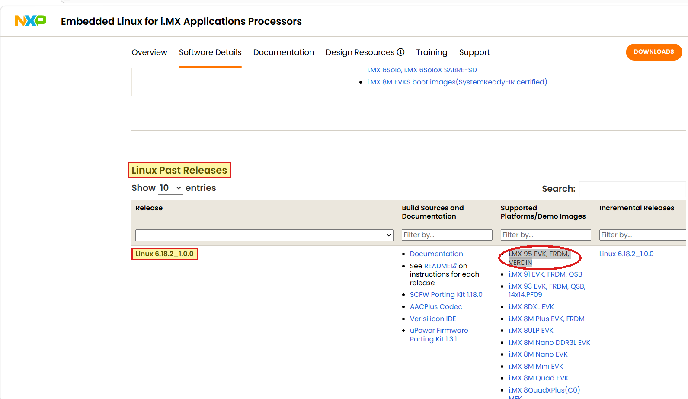

# Flashing the Default Image onto an NXP FRDM i.MX 95 Development Board

# 1. Introduction

This simple guide will help you download all the necessary files for flashing a fresh stock image to an NXP FRDM
i.MX 95, and then flash the image to the board.

The FRDM i.MX 95 ships pre-flashed with an NXP Linux demo image, so flashing is only required to get onto the BSP
release a demo needs or to return the board to an out-of-box state.

> [!WARNING]
> The [eIQ GenAI Flow demo](genai-flow-demo/README.md) runs **only** on BSP **LF6.18.2-1.0.0** ("whinlatter",
> kernel 6.18.2) — do **not** flash the newer LF6.18.20_2.0.0 ("wrynose") for it: that release ships Python 3.14
> only, which cannot load GenAI Flow's `cpython-313` compiled modules. Check a running board with `uname -r`
> (the whinlatter image reports `6.18.2-1.0.0`).

> [!NOTE]
> This guide is to be used with a Windows host machine. If you are using a Linux machine, the actual flashing utility
> step is likely similar but will not be exactly the same.

# 2. Download Universal Update Utility (UUU)

* Download the executable of the latest release of the Universal Update Utility (UUU) from
  the [mfgtools releases page](https://github.com/nxp-imx/mfgtools/releases) (download `uuu.exe`)

# 3. Download Image Files

The demo images come from NXP's
[Embedded Linux for i.MX Applications Processors](https://www.nxp.com/design/design-center/software/embedded-software/i-mx-software/embedded-linux-for-i-mx-applications-processors:IMXLINUX)
page — the source location for every i.MX Linux release.

1. Open that page and select the **Software Details** tab.
2. The eIQ GenAI Flow demo needs **LF6.18.2-1.0.0** (see the warning in the Introduction). It is *not* the
   newest release, so it is **not** behind the orange DOWNLOADS button — scroll down to the
   **Linux Past Releases** table instead.
3. In the **Linux 6.18.2_1.0.0** row, click the **i.MX 95 EVK, FRDM, VERDIN** link under
   "Supported Platforms/Demo Images" — exactly as marked here:

   

4. Accept the Software License Agreement and the download starts automatically.

> [!NOTE]
> Only restoring the board to out-of-box (no GenAI demo)? Any release works — use the newest via the
> **DOWNLOADS** button at the top of that same page.

> [!NOTE]
> These pre-built demo images are hosted on NXP's site, **not** on GitHub. If you would rather build the
> image from source with Yocto, the manifest is on GitHub at
> [nxp-imx/imx-manifest](https://github.com/nxp-imx/imx-manifest) — use the manifest matching your chosen release
> (e.g. `imx-6.18.2-1.0.0.xml` for whinlatter) with machine `imx95-15x15-lpddr4x-frdm` (confirm the exact
> `repo init -b <branch>` name against the release notes /
> the [Yocto User's Guide UG10164](https://www.nxp.com/docs/en/user-guide/UG10164.pdf)). Most users should just
> download the pre-built image above.

# 4. Organize Files for Flashing

* Unzip the zipped image folder you downloaded
* Copy the `uuu.exe` file you previously downloaded into the newly-unzipped image folder (you may need to navigate
  an additional layer into the folder after unzipping it to get to where the real files are)
* If the root filesystem image is compressed (`.wic.zst`), unzip it with 7-Zip (or another unzipping utility that
  supports ZST files), keeping the same destination directory
* Before proceeding to the next step, verify that the uncompressed `.wic` rootfs image, the `imx-boot-...` boot binary,
  and `uuu.exe` are all within the same folder. The exact file names depend on the image release, e.g.:
  ```imx-image-full-imx95frdm.rootfs.wic```
  ```imx-boot-imx95frdm-sd.bin-flash_all```
  ```uuu.exe```

# 5. Prepare Hardware for Flashing

* Power off the board
* Set the boot switch (SW1) to **Serial Download (SDP) mode** as described in the "Boot Switch Setup" section of
  NXP's [Getting Started with FRDM-IMX95](https://www.nxp.com/document/guide/getting-started-with-frdm-imx95:GS-FRDM-IMX95) guide
* Connect a USB-C cable from your host machine to the **USB1** port on the board

> [!IMPORTANT]
> Connecting to the POWER or DEBUG USB-C ports on the board **will not** work for flashing. You must connect to the
> USB1 port.

* Power the board with a second USB-C cable connected to the POWER port

# 6. Flash the Image

* Open a Windows Powershell window
* Move into the unzipped downloaded image folder containing the image files and uuu.exe
* Execute this command to start the flash (adjust the `.wic` filename if your image release uses a different name):
  ```
  .\uuu.exe -b emmc_all .\imx-image-full-imx95frdm.rootfs.wic
  ```
* Wait until the flash is complete (this can take several minutes)
* Power off the board and set the boot switch (SW1) back to **eMMC boot mode** (the factory-default position)
* Reboot the board by unplugging the power cable and plugging it back in
* Your FRDM i.MX 95 has now booted with a fresh default image on it
