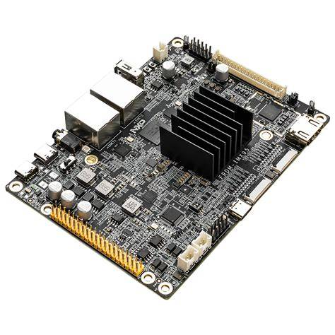
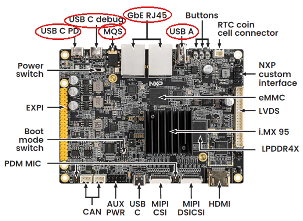

# Lab 1: Getting Started with the NXP FRDM i.MX 95 Development Platform

[Purchase NXP FRDM i.MX 95 Development Board](https://www.avnet.com/americas/product/nxp/frdm-imx95/evolve-122131125/)

- [Lab 1: Getting Started with the NXP FRDM i.MX 95 Development Platform](#lab-1-getting-started-with-the-nxp-frdm-imx-95-development-platform)
  - [1. Introduction](#1-introduction)
  - [2. Requirements](#2-requirements)
    - [Hardware](#hardware)
    - [Software](#software)
  - [3. Hardware Setup](#3-hardware-setup)
  - [4. Device Setup](#4-device-setup)
  - [5. Onboard Device](#5-onboard-device)
  - [6. Configure the NXP eIQ GenAI Flow](#6-configure-the-nxp-eai-genai-flow)
    - [Expand Storage](#expand-storage)
    - [Install the eIQ GenAI Flow Pipeline](#install-the-eiq-genai-flow-pipeline)
  - [7. Change Device Template](#7-change-device-template)
  - [8. Download, Install, and Run the GenAI Flow Demo](#8-download-install-and-run-the-genai-flow-demo)
    - [Download](#download)
    - [Install](#install)
    - [Run](#run)
  - [9. Import a Dashboard](#9-import-a-dashboard)
  - [10. Using the Demo](#10-using-the-demo)
  - [11. Continuing Your Journey](#11-continuing-your-journey)
  - [12. Troubleshooting](#12-troubleshooting)
  - [13. Resources](#13-resources)

## 1. Introduction

This guide provides step-by-step instructions to set up the NXP FRDM i.MX 95 Development Platform and integrate it with /IOTCONNECT,
Avnet's robust IoT platform. It is the first guide in a series which will progressively explore more features of the platform. This initial guide focuses on the NXP eIQ GenAI Flow pipeline, which enables on-device Generative AI and small language model capabilities. Subsequent guides will explore additional features of the FRDM i.MX 95 platform, including its vision capabilities and other NPU-powered applications.

<table>
  <tr>
    <td></td>
    <td>The FRDM i.MX 95 development board is a low-cost, compact development platform featuring the i.MX 95 applications
processor with 6x Arm Cortex-A55 cores, an Arm Cortex-M7 real-time core, an Arm Cortex-M33 safety core, and the
integrated <b>eIQ Neutron NPU (2 TOPS)</b> for on-device machine learning — including Generative AI / small language
models via NXP's eIQ GenAI Flow software pipeline. The board includes 8 GB LPDDR4X, 32 GB eMMC, a microSD slot, and an
onboard IW612 module featuring NXP's Tri-Radio solution with Wi-Fi 6 + Bluetooth 5.4 + 802.15.4, making it ideal for
modern industrial, IoT, and edge AI applications.</td>
  </tr>
</table>

## 2. Requirements

Note that this guide has been written and tested using the following hardware and software in a Windows environment to reach the widest possible audience. While it should work in Linux or MacOS, you may need to adapt some of the instructions.

### Hardware

- NXP FRDM i.MX 95 Development Board [Purchase](https://www.avnet.com/americas/product/nxp/frdm-imx95/evolve-122131125/) | [All Resources](https://www.nxp.com/design/design-center/development-boards-and-designs/FRDM-IMX95)
- 2x USB Type-C Cables (included in kit)
- Ethernet Cable OR WiFi Network SSID and Password

### Software

- A serial terminal such as [TeraTerm](https://github.com/TeraTermProject/teraterm/releases) or [PuTTY](https://www.putty.org/)

## 3. Hardware Setup

1. Connect an Ethernet cable from your network (router/switch) to one of the Ethernet connectors. For Wi-Fi, after booting your board, refer to the [WIFI](WIFI.md) guide.
2. Connect a USB cable from your PC to the **DEBUG** USB-C port.
3. Connect a USB cable from your PC (or a USB-C power supply) to the **POWER** USB-C port.

The connectors used in this guide are circled below: **GbE RJ45** is the Ethernet connector (step 1),
**USB C debug** is the DEBUG port (step 2), and **USB C PD** is the POWER port (step 3). For the GenAI demo's
optional voice/vision hardware, the **USB A** port takes the webcam or USB headset, and **MQS** is the 3.5 mm
audio jack that can optionally be utilized in a subsequent lab for the GenAI voice demo.



## 4. Device Setup

1. Open a serial terminal emulator program such as TeraTerm.
2. Ensure that your serial settings in your terminal emulator are set to:

   - Baud Rate: 115200
   - Data Bits: 8
   - Stop Bits: 1
   - Parity: None

3. The board's WCH USB-serial converter enumerates **four** serial ports on your PC. To find the Linux (Cortex-A55) console connect to each port and press ENTER until you get a login prompt.  
`imx95frdm login:`

4. When prompted for a login, type `root` followed by the ENTER key.
5. Verify the board is running the firmware compatible with the eIQ pipeline by running the following command:
   ```bash
   uname -r
   ```

   Ensure the version is `6.18.2-1.0.0`. If not, refer to the [flashing](FLASHING.md) guide to flash the correct firmware.

6. Run this command to install the necessary /IOTCONNECT packages:

    ```bash
    python3 -m pip install iotconnect-sdk-lite requests
    ```

7. Run this command to create and move into a directory for your demo files:

    ```bash
    mkdir -p /opt/demo && cd /opt/demo
    ```

## 5. Onboard Device

The next step is to onboard your device into /IOTCONNECT. This will be done via the online /IOTCONNECT user interface.

Follow [this guide](../common/general-guides/UI-ONBOARD.md) to walk you through the process.

## 6. Configure the NXP eIQ GenAI Flow

### Expand Storage

The stock NXP demo image only allocates ~11 GB of the 32 GB eMMC to the root filesystem, leaving too little free space for GenAI Flow. Expand the root partition to use the full eMMC first:

```bash
parted -s /dev/mmcblk0 resizepart 2 100%
resize2fs /dev/mmcblk0p2
```

Verify that the root filesystem has been expanded:

```bash
df -h /   # should now show ~28 GB total
```

### Install the eIQ GenAI Flow Pipeline

1. Fetch the demonstrator to stage both the `eiq_genai_flow` pipeline and its `vlm` vision submodule (the later of which will be explored in a subsequent lab):

   ```bash
   curl -sL https://raw.githubusercontent.com/avnet-iotconnect/iotc-python-lite-sdk-demos/main/nxp-frdm-imx-95/genai-flow-demo/src/get-genai-flow.sh | bash
   ```

 > [!NOTE]
 > It prints one `OK … MB … filename` line per file — 70 lines, about 1.5 GB (the 495 MB Danube LLM is the
 > largest) — and ends with *"all LFS files resolved"*. If it ends with `!!` instead, the board's internet
 > connection dropped: simply run the same line again.

2. Install both packages:

   ```bash
   cd /root/eiq_genai_flow && bash ./install.sh
   cd /root/vlm && bash ./install.sh
   ```

3. Verify that the pipeline is installed by running the `eiq_genai_flow.py` script with a small LLM:

   ```bash
   cd /root/eiq_genai_flow && python3 eiq_genai_flow.py -i keyb -o text -m danube-500M-q8
   ```

   Type a question at the prompt; an answer means the install is complete. Press `Ctrl+C` to quit. (The first
   `ask-vlm` later will download the SmolVLM2 vision model, ~1–2 minutes, one time only.)

## 7. Change Device Template

To facilitate the integration of the GenAI Flow pipeline outputs to /IOTCONNECT, we need to change the device template to inform the platform of the expected telemetry from the models and the available, supported, commands.

1. Download the [genai-flow-template.json](/genai-flow-demo/genai-floow-template.json) device template file to your PC.
2. Import it into your /IOTCONNECT instance via **Templates → Create Template → Import** (same process as the onboarding guide).
3. Find your device in the /IOTCONNECT **Devices** list and click on it to open the device details page.
4. Locate the **Template** field (mid-left on the page) and click the edit icon.
5. Select the `genaiflow` template just imported from the drop-down and save.

## 8. Download, Install, and Run the GenAI Flow Demo

### Download

Use `wget` to download the demo package and extract it into `/opt/demo`:

```bash
cd /opt/demo
wget -O package.tar.gz https://downloads.iotconnect.io/partners/nxp/packages/frdm-imx95-genai-flow-demo-v1.0.2.tgz
tar -xzf package.tar.gz --overwrite
```

### Install

Use the included `install.sh` script to install the demo's dependencies and set up the environment:

```bash
./install.sh
```

### Run

To run the demo, execute the `app.py` script:

```bash
python3 app.py
```

## 9. Import a Dashboard

/IOTCONNECT Dynamic Dashboards are an easy way to visualize data and interact with edge devices.  The demo dashbaord below is pre-configured to display the GenAI Flow pipeline outputs enabled in this guide.  It also has placeholders for the other models and NPU outputs that will be explored in subsequent labs.

1. Download the *FRDM i.MX 95 GenAI* demo dashboard: [FRDM_i.MX_95_GenAI_dashboard.json](genai-flow-demo/FRDM_i.MX_95_GenAI_dashboard.json)
2. Switch back to the /IOTCONNECT browser window and verify the device status is displaying as `Connected`
3. Click **Create Dashboard** from the top of the page
4. Select the **Import Dashboard** option and click **Browse** to select the dashboard template previously downloaded.
5. Select the **Template** `genaiflow` and your **Device Name**
6. Enter a name such as `My GenAI Dashboard` and click **Save** to finalize the import

You will now be in the dashboard edit mode. You can add/remove/rearrange widgets or just click **Save** in the upper-right corner to exit the edit mode.

## 10. Using the Demo

Once running, system telemetry streams to /IOTCONNECT every 10 seconds. Use the **Command** panel on your device page or the widgets on the dynamic dashboard to interact with the LLM:

| Command | Argument | What it does |
|---|---|---|
| `ask-llm` | prompt text, e.g. `What is the capital of France?` | Runs the prompt through the on-device LLM. The command is acknowledged immediately; the response arrives as `llm_response` telemetry along with `llm_ttft`, `llm_gen_time`, `llm_tps`, and `llm_token_count` |
| `ask-vlm` | *(optional)* question, e.g. `Is there a person in the room?` | Captures a frame from the USB camera and answers the question about it with SmolVLM2. Response arrives as `vlm_response` telemetry with `vlm_vision_time`, `vlm_ttft`, and `vlm_tps`. Defaults to "Describe what you see in this image." |
| `ask-agent` | request needing live data, e.g. `what time is it` | Function calling: the LLM picks a real board tool (time, temperature, memory, uptime, IP), the board executes it, and the grounded answer plus the full reasoning chain arrive as `agent_*` telemetry. See [Agent](#10-agent-llm-with-real-board-tools-ask-agent) |
| `agent-start` | — | Pre-warms the agent session (~1 min) so the first question answers in seconds — send at booth open |
| `agent-stop` | — | Stops the agent’s persistent LLM session (it also auto-stops after 60 idle minutes — `agent_idle_timeout_s`) |
| `voice-start` | *(optional)* `tts` (default) or `text` | Starts the wake-word voice assistant ("Hey NXP" → speech-to-text → LLM → text-to-speech). Each exchange publishes `voice_question`, `voice_response`, and `voice_exchanges`; session state is in `voice_status` |
| `voice-stop` | — | Stops the voice assistant session |
| `set-stt` | `moonshine-tiny`, `moonshine-base`, or `whisper-small.en` | Selects the voice transcriber (speed vs. accuracy). Applies on the next `voice-start` |
| `set-vlm` | `smolvlm-256M` or `smolvlm-500M`, optional precision `q8` (default) or `fp32` | Selects the vision model for `ask-vlm` — the 500M gives richer, more grounded descriptions at roughly half the decode speed. Applies on the next `ask-vlm`, which reloads the model (a first-ever load also downloads it) |
| `run-benchmark` | *(optional)* extra CLI args, e.g. `-i vasr -o tts` | Runs GenAI Flow's official benchmark mode (`-r -b`) and publishes `bench_*` metrics. Defaults to keyboard/text mode so no audio hardware is needed |
| `set-model` | `danube-500M-q8`, `danube-500M-q4`, any GGUF model name from `/opt/llama/models` (e.g. `qwen2.5-1.5b-instruct-q4_k_m`), or an Ara240 model served by the AAF connector | Selects the LLM used for subsequent commands. GGUF models run via llama.cpp on the CPU; picking an Ara240 model switches the backend to `ara2` automatically. An invalid name returns the list of available models |
| `set-backend` | `cpu`, `neutron`, or `ara2` | Selects where `ask-llm` runs: CPU, eIQ Neutron NPU, or the Kinara Ara-2 / Ara240 module (see the backend sections above/below) |
| `set-rag` | `on` or `off` | Toggles RAG grounding for `ask-llm`, the voice assistant, and `run-benchmark` (see [RAG](#9-rag-ground-answers-in-your-own-documentation-set-rag)) |
| `rag-add` | document URL, optional name | Downloads a document (IOTCONNECT's file upload provides a URL), chunks and embeds it into the on-device RAG database — watch `rag_status` |
| `rag-show` | document name | Publishes a preview of a document's chunks (`rag_preview` telemetry) |
| `rag-remove` | document name | Removes a document from the RAG database |
| `get-ip` | — | Returns the board's local IP address |
| `file-download` | package URL | Self-update with a new demo package |

> [!NOTE]
> The **first** `ask-llm` after boot takes noticeably longer while the model is loaded (and downloaded on first ever
> use) — watch `llm_load_time`. Subsequent prompts are faster. While a prompt or benchmark is running, `genai_status`
> reports `generating` / `benchmarking`.

## 11. Continuing Your Journey

- [Lab 2: Enable the NPU and Explore other NXP eIQ GenAI Flow Models](LAB2.md)
- [Lab 3: Enable the Kinara Ara-2 / NXP Ara240 discrete NPU module](LAB3.md)  

## 12. Troubleshooting

To return the board to an out-of-box state, or to update to the latest NXP demo image, refer to the [flashing](FLASHING.md) guide.

## 13. Resources

- [Purchase the FRDM i.MX 95 Board](https://www.avnet.com/americas/product/nxp/frdm-imx95/evolve-122131125/)
- [NXP FRDM-IMX95 Product Page](https://www.nxp.com/design/design-center/development-boards-and-designs/FRDM-IMX95)
- [NXP i.MX 95 Applications Processor Family](https://www.nxp.com/products/i.MX95)
- [NXP eIQ GenAI Flow](https://www.nxp.com/design/design-center/software/embedded-software/eiq-genai-flow-conversational-ai-software-pipeline-on-edge-devices:GEN-AI-FLOW)
- [eIQ GenAI Flow Demonstrator (GitHub)](https://github.com/nxp-appcodehub/dm-eiq-genai-flow-demonstrator)
- [More /IOTCONNECT NXP Guides](https://avnet-iotconnect.github.io/partners/nxp/)
- [/IOTCONNECT Overview](https://www.iotconnect.io/)
- [/IOTCONNECT Knowledgebase](https://help.iotconnect.io/)
