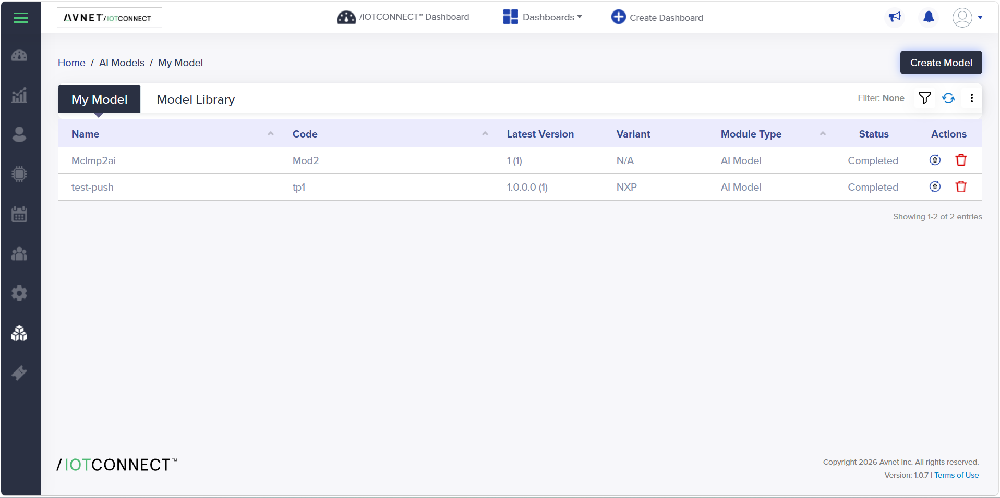
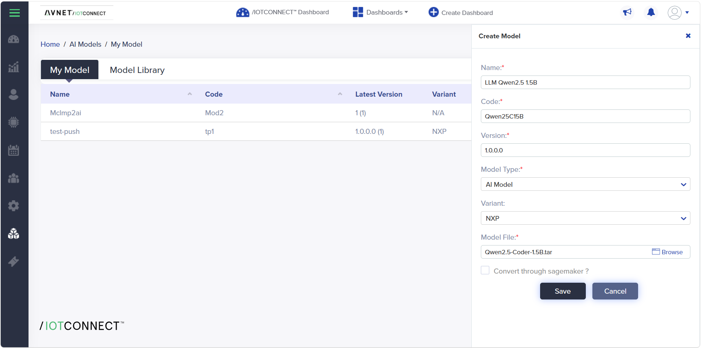
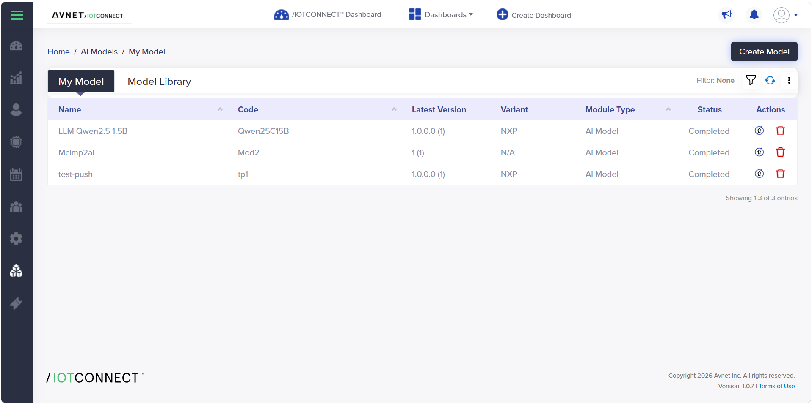
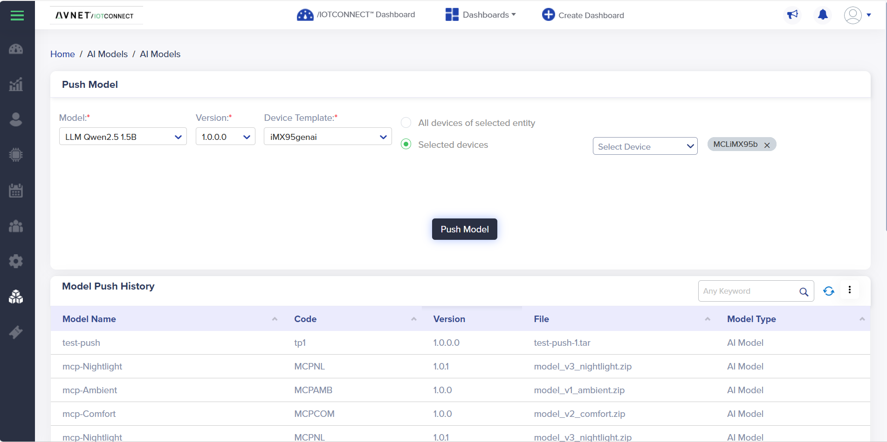

# Cloud → edge model push: deploy an LLM to the board from IOTCONNECT

IOTCONNECT can **store a model in the cloud and push it to a device**: the demo app downloads it, installs it,
switches `ask-llm` to it, and reports progress as telemetry — no SSH, no manual file copy. It is IOTCONNECT's
model-management layer on top of the on-device AI: manage models centrally, deploy to one device or a fleet
with a click.

Two kinds of model can be pushed; the board sorts out which one it received:

| You push | Runs on | Where it lands | Needs |
|---|---|---|---|
| a **GGUF** file (`*.gguf`, any llama.cpp model from Hugging Face) | **any FRDM i.MX 95** — CPU via llama.cpp | `/opt/llama/models/<name>.gguf`, then `set-model` selects it | llama.cpp built once (README section 11, *One-time setup*) |
| an **Ara240 bundle** (`model.dvm` + `config.json` + `tokenizer/`, tarred) | boards with the Kinara Ara-2 / NXP Ara240 module | `/usr/share/llm/<Code>/`, served by the eIQ AAF Connector | the Ara240 runtime + connector (README, *Enabling the Ara240 backend*) |

A mismatch is refused, not half-installed: an Ara240 bundle pushed to a board without the module, or a GGUF
pushed to a board without llama.cpp, ends in `model_deploy_status = error` with a one-line reason, the current
model unchanged, and the download cleaned up.

The walkthrough below uses the Ara240 bundle (`Qwen2.5-Coder-1.5B` to booth board `MCLiMX95b`); the GGUF path is
identical except for step 1, where you simply upload the `.gguf` file. Retraining is a separate IOTCONNECT feature
and is out of scope here.

---

## 1. Package the model

**GGUF:** nothing to package — download the `.gguf` file to your PC and upload it as-is as the model file in
step 2 (IOTCONNECT wraps it in its own `.tar` for delivery; the board unwraps it). Any llama.cpp GGUF works, but
for an 8 GB, CPU-only FRDM stay at **≤ 2 GB on disk** (Q4_K_M or Q8_0 quantizations of 0.5–3B models). These are
the ones measured on this board — click to download:

| GGUF (direct download) | Size | Measured on FRDM-IMX95 CPU | Good for |
|---|---|---|---|
| [qwen2.5-0.5b-instruct-q8_0.gguf](https://huggingface.co/Qwen/Qwen2.5-0.5B-Instruct-GGUF/resolve/main/qwen2.5-0.5b-instruct-q8_0.gguf) | 644 MB | **12.9 tok/s**, 5.6 s load | Fast, noticeably better facts than Danube — the quick-win push |
| [qwen2.5-1.5b-instruct-q4_k_m.gguf](https://huggingface.co/Qwen/Qwen2.5-1.5B-Instruct-GGUF/resolve/main/qwen2.5-1.5b-instruct-q4_k_m.gguf) | 1.07 GB | **5.7 tok/s**, 7.1 s load | Best reasoning of the measured set |
| [qwen2.5-coder-1.5b-instruct-q4_k_m.gguf](https://huggingface.co/Qwen/Qwen2.5-Coder-1.5B-Instruct-GGUF/resolve/main/qwen2.5-coder-1.5b-instruct-q4_k_m.gguf) | 1.07 GB | **~5.6 tok/s** (pushed from IOTCONNECT, this exact path) | Code-flavoured answers; the GGUF twin of the Ara240 `Qwen25C15B` |
| [qwen2.5-3b-instruct-q4_k_m.gguf](https://huggingface.co/Qwen/Qwen2.5-3B-Instruct-GGUF/resolve/main/qwen2.5-3b-instruct-q4_k_m.gguf) | 2.0 GB | *not measured* — expect roughly half the 1.5B's speed | The largest sensible CPU push; try it only if answer quality matters more than speed |

The filename (minus `.gguf`) becomes the model's `set-model` name on the board, and the board keeps it under
`/opt/llama/models/` alongside any GGUFs you installed by hand in README section 11.

**Ara240 bundle:** IOTCONNECT delivers whatever file you upload, so package the **whole model directory** (its
`model.dvm` plus `config.json` and the `tokenizer/` folder) into a single `.tar`. From your host, stream it
straight off a board that already has it (no board disk used):

```bash
ssh root@<board-ip> "tar -cf - -C /usr/share/llm/Qwen2.5-Coder-1.5B ." > Qwen2.5-Coder-1.5B.tar
```

The tar's top level must contain `model.dvm`, `config.json`, `tokenizer/` (the device extracts it straight into
the model folder). Any Ara240 `model.dvm` bundle works the same way.

## 2. Create the model in IOTCONNECT

**AI Models → My Model → Create Model.**



Fill in the details and choose your `.gguf` (or `.tar`) as the **Model File**:



| Field | Value | Notes |
|---|---|---|
| **Name** | e.g. `LLM Qwen2.5 1.5B` | Free text — this is what `model_deploy_name` telemetry shows |
| **Code** | e.g. `Qwen25C15B` | ⚠️ **3–10 chars, alphanumeric only, must start with a letter** (no `-` or `.`). For an **Ara240** bundle the device uses this as the model's name — it deploys to `/usr/share/llm/<Code>/` and serves it under `<Code>`. A **GGUF** keeps its own filename as the `set-model` name |
| **Version** | e.g. `1.0.0.0` | |
| **Model Type** | `AI Model` | |
| **Variant** | `NXP` | |
| **Model File** | your `.gguf` or `.tar` | From step 1 |
| **Convert through sagemaker?** | **unchecked** | Leave off — the file is already a runnable model; conversion would break it |

Save. The model appears in **My Model** with status **Completed**:



## 3. Push the model to the device

**AI Models → Push Model.** Select the model + version, pick the device template your device is on —
**`genaiflow`** if you imported this repo's template (the screenshots show our booth account's `iMX95genai`) —
choose **Selected devices → your device**, and click **Push Model**.



## 4. Watch it land (the device does the rest)

The demo app receives the push (a `ct:2` module command carrying a presigned S3 URL) and deploys it
automatically. Follow **`model_deploy_status`** on the dashboard:

```
idle → downloading → deploying → loading → ready
```

- **downloading** – pulls the package from S3
- **deploying** – unpacks it (handles IOTCONNECT's tar wrapping) and works out which kind of model it is
- **loading** – GGUF: installs it into `/opt/llama/models/` for llama.cpp · Ara240: unpacks into
  `/usr/share/llm/<Code>/` and restarts the eIQ AAF Connector so the model loads onto the module
- **ready** – the model is serving and **`ask-llm` now uses it**: a GGUF is selected as the current `set-model`
  (`llm_backend` reads `cpu-llama.cpp`); an Ara240 model becomes `ara2_model` with `backend = ara2`. The board
  sends an **`OTA_DOWNLOAD_DONE`** ack back to IOTCONNECT (`OTA_DOWNLOAD_FAILED` with the reason on error)

Measured on a FRDM‑IMX95: **~54 s** from *Push* to *ready* for the Ara240 bundle (the connector reloads the
resident 7B alongside the new model); a 1.5B GGUF pushed to a plain FRDM lands in about the time its ~1 GB
download takes, then answers at **~5.6 tok/s** on the CPU. Either way `ask-llm` then answers on the freshly
pushed model:

> **ask-llm** *"In one sentence, what is edge AI?"* →
> *"Edge AI is the use of artificial intelligence technology to process and analyze data at the edge of a
> network, enabling real-time decision-making and analysis."* — served by `Qwen25C15B` on the Ara240.

`model_deploy_*` are telemetry attributes; add **`model_deploy_status`**, **`model_deploy_name`**, and
**`model_deploy_detail`** to your device's template (`genaiflow` in this repo) to show the deploy progress on a
dashboard. `llm_models` telemetry lists every model the board can `set-model` to, so a pushed GGUF shows up there.

---

## How it works (device side)

`app.py` registers a handler for the IOTCONNECT model push and deploys whatever arrives:

- **Receiving the push.** IOTCONNECT sends the model as a module command (`ct:2`) with a download URL. The
  `iotconnect-sdk-lite` maps `ct:2` to message type `UNKNOWN` (the `MODULE_COMMAND` id isn't in its type map), so
  the handler is registered under `C2dMessage.UNKNOWN` via `generic_message_callbacks` and filters on `ct == 2`.
- **Deploying.** It downloads the `urls[].Url` file and un-tars it recursively (IOTCONNECT wraps the upload in
  its own `.tar`). If the payload contains a **`.gguf`** it is installed into `/opt/llama/models/` and selected
  (refused if llama.cpp isn't built). Otherwise it looks for **`model.dvm`** (refused on a board without an
  Ara240), unpacks into `/usr/share/llm/<Code>/`, enables `<Code>` in the connector's `server_config.json`,
  restarts the connector, and waits for the model to report `ready` on `/v1/models`. A failed deploy removes its
  half-extracted directory so nothing is left behind.
- **Activating + acking.** It switches `ask-llm` to the new model (GGUF: `set-model`; Ara240: `ara2_model` +
  `backend = ara2`), publishes `model_deploy_status = ready`, and acks the module command back to IOTCONNECT.

See `on_module_command` / `deploy_model` in [`src/app.py`](../src/app.py).
