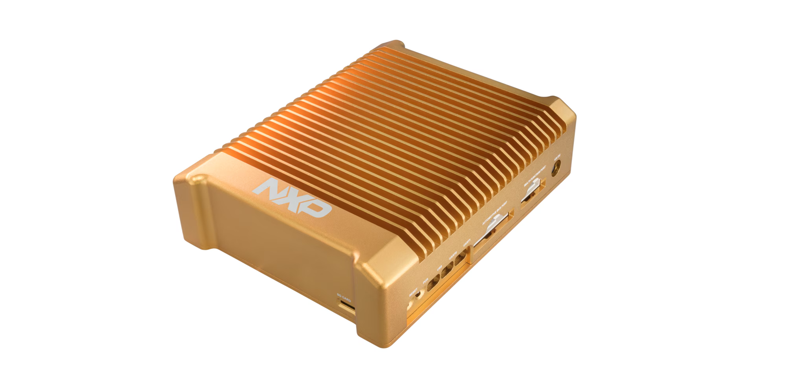
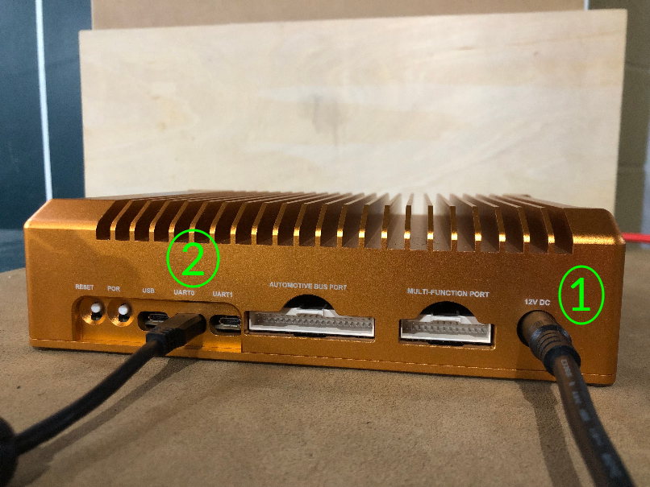
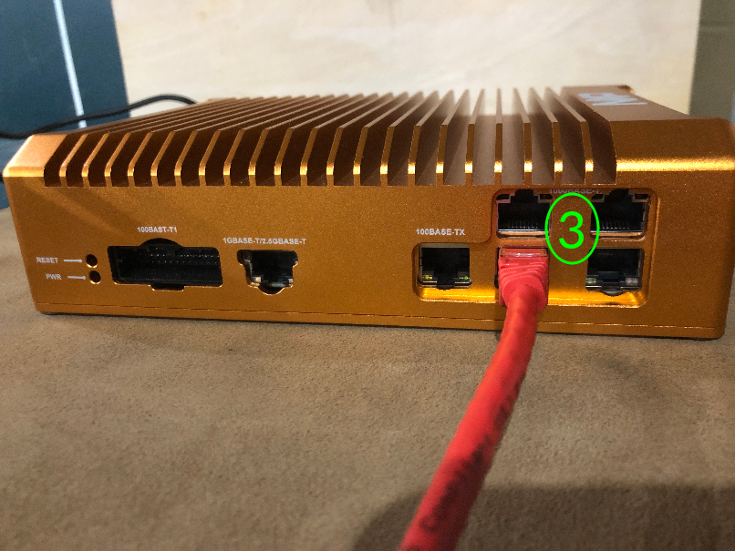

# NXP GoldBox 3 Vehicle Networking Development Platform QuickStart
[Purchase NXP GoldBox 3](https://www.newark.com/nxp/s32g-vnp-gldbox/ref-design-board-vehicle-n-w-processor/dp/37AJ9124)
1. [Introduction](#1-introduction)
2. [Requirements](#2-requirements)
3. [Hardware Setup](#3-hardware-setup)
4. [/IOTCONNECT: Cloud Account Setup](#4-iotconnect-cloud-account-setup)
5. [Device Setup](#5-device-setup)
6. [Onboard Device](#6-onboard-device)
7. [Using the Demo](#7-using-the-demo)
8. [Resources](#8-resources)

# 1. Introduction

This guide provides step-by-step instructions to set up the NXP GoldBox 3 Vehicle Networking Development Platform
hardware and integrate it with /IOTCONNECT, Avnet's robust IoT platform.

<table>
  <tr>
    <td></td>
    <td>The NXP GoldBox 3 is a compact, highly optimized and integrated reference design engineered for vehicle computer, service-oriented gateway (SoG), domain control applications, high-performance processing, safety and security applications.

The NXP GoldBox 3 highlights the S32G3 network processor by offering high-performance computing capacity, real-time
network performance, multi-Gigabit packet acceleration and security and rich input/output (I/O) targeting central
gateway, domain controller, firmware over-the-air (FOTA), secure key management, smart antenna and high-performance
central compute nodes.

Based on the S32G-VNP-RDB3, the GoldBox 3 is an excellent form-factor for customer or project demonstrations and
evaluations, as well as in-vehicle testing and rapid prototyping.</td>
  </tr>
</table>

# 2. Requirements

## Hardware

* NXP GoldBox 3 Vehicle Networking Development
  Platform [Purchase](https://www.avnet.com/americas/product/nxp/s32g-vnp-gldbox3/evolve-64413515/) | [User Manual & Kit Contents](https://www.nxp.com/webapp/Download?colCode=S32G-VNP-GLDBOX3UG) | [All Resources](https://www.nxp.com/design/design-center/development-boards-and-designs/GOLDBOX-3)
* Power Adapter and Cable (included in kit)
* Micro-USB Cable (included in kit)
* Ethernet Cable (included in kit)

## Software

* A serial terminal such as [TeraTerm](https://github.com/TeraTermProject/teraterm/releases)
  or [PuTTY](https://www.putty.org/)
* [USB-to-UART Driver](https://ftdichip.com/drivers/d2xx-drivers/) for FTDI devices

# 3. Hardware Setup

See the reference images below for cable connections.
<details>
<summary>Reference Image with Front Connections</summary>

</details>

<details>
<summary>Reference Image with Rear Connections</summary>

</details>

Using the above images as reference, make the following connections:

1. Connect the power cable to the 12V DC port labeled **#1**.
2. Connect the included micro-USB cable to the UART0 port labeled **#2**.
3. Lastly, connect an ethernet cable to the middle port on the bottom row shown as **#3** in the rear connections
   reference image
   (the default image for this device is configured to use this specific port for internet connectivity).

# 4. /IOTCONNECT: Cloud Account Setup

An /IOTCONNECT account with AWS backend is required. If you need to create an account, a free trial subscription is
available.
The free subscription may be obtained directly from iotconnect.io or through the AWS Marketplace.

* Option #1 (
  Recommended) [/IOTCONNECT via AWS Marketplace](https://github.com/avnet-iotconnect/avnet-iotconnect.github.io/blob/main/documentation/iotconnect/subscription/iotconnect_aws_marketplace.md) -
  60 day trial; AWS account creation required
* Option #2 [/IOTCONNECT via iotconnect.io](https://subscription.iotconnect.io/subscribe?cloud=aws) - 30 day trial; no
  credit card required

> [!NOTE]
> Be sure to check any SPAM folder for the temporary password after registering.

# 5. Device Setup

1. Open a serial terminal emulator program such as TeraTerm or PuTTY.
2. Ensure that your serial settings in your terminal emulator are set to:

- Baud Rate: 115200
- Data Bits: 8
- Stop Bits: 1
- Parity: None

3. Starting with the lowest COM port value for "USB Serial Port" in the Device Manager list, attempt to connect to your
   board via the terminal emulator

> [!NOTE]
> A successful connection may result in just a blank terminal box. If you see a blank terminal box, press the ENTER key
> to get a login prompt. An unsuccessful connection attempt will usually result in an error window popping up.

4. When prompted for a login, type `bluebox` followed by the ENTER key, and then `bluebox` again for the password,
   followed by the ENTER key.
5. Run these commands to update the core board packages and install necessary /IOTCONNECT packages:

```
sudo apt-get update
```

```
python3 -m pip install iotconnect-sdk-lite
```

```
python3 -m pip install requests
```

6. Run these commands to create and move into a directory for your demo files:

```
mkdir /home/weston/demo
```

```
cd /home/weston/demo
```

> [!TIP]
> To gain access to "copy" and "paste" functions inside of a PuTTY terminal window, you can CTRL+RIGHTCLICK within the
> window to utilize a dropdown menu with these commands. This is very helpful for copying/pasting between your browser and
> the terminal.

# 6. Onboard Device

The next step is to onboard your device into /IOTCONNECT. This will be done via the online /IOTCONNECT user interface.

Follow [this guide](../common/general-guides/UI-ONBOARD.md) to walk you through the process.

> [!TIP]
> If you have obtained a solution key for your /IOTCONNECT account from Softweb Solutions, you can utilize the /IOTCONNECT 
> REST API to automate the device onboarding process via shell scripts. Check out [this guide](../common/general-guides/REST-API-ONBOARD.md) 
> for more info on that.

# 7. Using the Demo

Run the basic demo with this command:

```
python3 app.py
```

> [!NOTE]
> Always make sure you are in the ```/home/weston/demo``` directory before running the demo. You can move to this
> directory with the command: ```cd /home/weston/demo```

View the random-integer telemetry data under the "Live Data" tab for your device on /IOTCONNECT.

# 8. Resources

* [Purchase the NXP GoldBox 3 Vehicle Networking Development Platform](https://www.newark.com/nxp/s32g-vnp-gldbox/ref-design-board-vehicle-n-w-processor/dp/37AJ9124)
* [More /IOTCONNECT NXP Guides](https://avnet-iotconnect.github.io/partners/nxp/)
* [/IOTCONNECT Overview](https://www.iotconnect.io/)
* [/IOTCONNECT Knowledgebase](https://help.iotconnect.io/)
