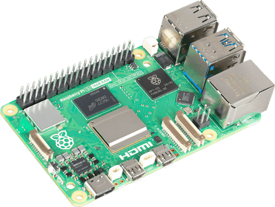
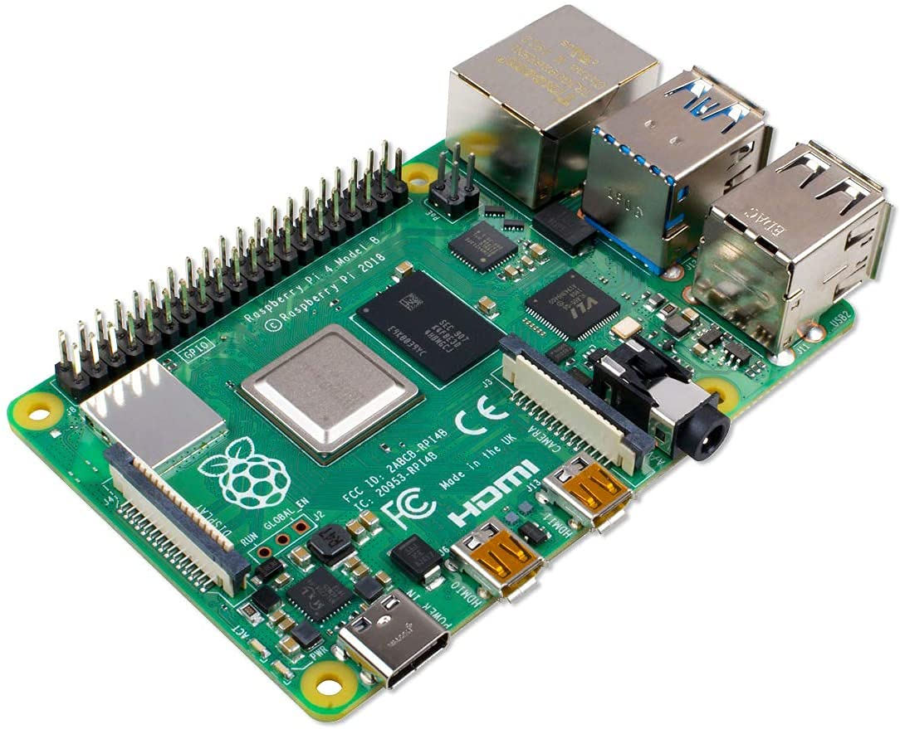
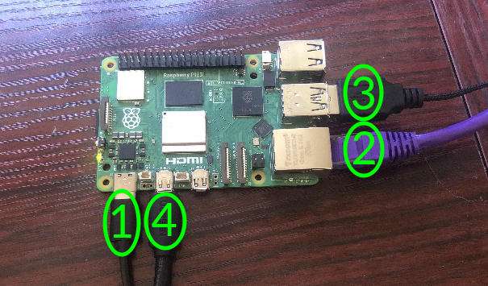

# Raspberry Pi QuickStart
[Purchase your Raspberry Pi Kit](https://www.newark.com/raspberry-pi/rpi5-8gb-single/rpi-5-board-2-4ghz-8gb-arm-cortex/dp/81AK1348)
> [!TIP]
> To set up and connect this device using the **AWS Greengrass Lite SDK**, refer to this [QuickStart Guide](https://github.com/avnet-iotconnect/iotc-python-greengrass-demos/blob/main/raspberry-pi/)

1. [Introduction](#1-introduction)
2. [Requirements](#2-requirements)
3. [Hardware Setup](#3-hardware-setup)
4. [Image Flashing](#4-image-flashing)
5. [/IOTCONNECT: Cloud Account Setup](#5-iotconnect-cloud-account-setup)
6. [Device Setup](#6-device-setup)
7. [Onboard Device](#7-onboard-device)
8. [Using the Demo](#8-using-the-demo)
9. [Resources](#9-resources)

# 1. Introduction

This guide is designed to walk through the steps to connect the Raspberry Pi (4 or 5) to the Avnet /IOTCONNECT platform
and demonstrate the standard IoT function of telemetry collection.

<table>
  <tr>
    <td></td>
    <td>Raspberry Pi 5 model is the latest release of Raspberry Pi range. In comparison with its predecessor, it comes 
with a faster 2.4GHz Broadcom BCM2712, ARM Cortex-A76 CPU and VideoCore VII GPU supporting OpenGL ES 3.1, Vulkan 1.2 and 
better heat dissipation. There is significant improvement to camera, display, and USB interfacing also. The power-management 
IC used on Raspberry Pi 5 integrates a real-time clock, and charging circuitry for a button cell which can power the clock 
while main power is disconnected. Raspberry Pi 5 provides two four-lane MIPI connectors, each of which can support either 
a camera or a display. These interfacing improvements are delivered by the RP1 I/O controller chip. For the first time, 
we have Raspberry Pi silicon on a flagship product! The Raspberry Pi 5 is versatile and powerful single board computer 
that could be used for wide range of applications like DIY projects, educational tool, media center, server, desktop 
computer and many more IOT application.</td>
  </tr>
</table>

<table>
  <tr>
    <td></td>
    <td>Raspberry Pi 4 Model B offers ground-breaking increases in processor speed, multimedia performance, memory, and 
connectivity compared to the prior-generation Raspberry Pi 3 Model B+, while retaining backwards compatibility and similar 
power consumption. For the end user, Raspberry Pi 4 Model B provides desktop performance comparable to entry-level x86 PC 
systems. This product’s key features include a high-performance 64-bit quad-core processor, dual-display support at 
resolutions up to 4K via a pair of micro-HDMI ports, hardware video decode at up to 4Kp60, dual-band 2.4/5.0 GHz wireless LAN, 
Bluetooth 5.0, Gigabit Ethernet, USB 3.0, and PoE capability (via a separate PoE HAT add-on). The dual-band wireless LAN 
and Bluetooth have modular compliance certification, allowing the board to be designed into end products with significantly 
reduced compliance testing, improving both cost and time to market.</td>
  </tr>
</table>

# 2. Requirements

## Hardware
Any of these Raspberry Pi variants will work for this demo:
* Raspberry Pi 5 (4GB RAM) [Purchase](https://www.newark.com/raspberry-pi/rpi5-4gb-single/rpi-5-board-2-4ghz-4gb-arm-cortex/dp/81AK1346) | [User Manual](https://www.raspberrypi.com/documentation/) | [All Resources](https://www.raspberrypi.com/products/raspberry-pi-5/)
* Raspberry Pi 5 (8GB RAM) [Purchase](https://www.newark.com/raspberry-pi/rpi5-8gb-single/rpi-5-board-2-4ghz-8gb-arm-cortex/dp/81AK1348) | [User Manual](https://www.raspberrypi.com/documentation/) | [All Resources](https://www.raspberrypi.com/products/raspberry-pi-5/)
* Raspberry Pi 4 (4GB RAM) [Purchase](https://www.newark.com/raspberry-pi/rpi4-modbp-4gb/rpi-computer-rpi-4-mod-b-4gb-1/dp/02AH3164) | [User Manual](https://www.raspberrypi.com/documentation/) | [All Resources](https://www.raspberrypi.com/products/raspberry-pi-4-model-b/)
* Raspberry Pi 4 (8GB RAM) [Purchase](https://www.newark.com/raspberry-pi/rpi4-modbp-8gb/raspberry-pi-4-model-b-8gb/dp/64AH2041) | [User Manual](https://www.raspberrypi.com/documentation/) | [All Resources](https://www.raspberrypi.com/products/raspberry-pi-4-model-b/)

* 1x Micro-HDMI to HDMI Cable (must be purchased separately, this is [the cable used by Avnet's engineer](https://www.amazon.com/UGREEN-Adapter-Ethernet-Compatible-Raspberry/dp/B06WWQ7KLV/ref=sr_1_11?crid=1TH13X5Y1YHBZ&dib=eyJ2IjoiMSJ9.Mxpt9hit71eZekjWI9mRds98E7pKD35UG43wO21LWRTPYmGBSwhj7AC2cqCoyv1X5So4KAI7XaRB_kHFlXg45Y2tIk-hO0gHThY-TxGvc2Eq-ceg23-Ili3CWlwD8lcXuz5fCMzjKRuQnt7T6Pz6uRwFfE2setaaqY-R6m3653i-W0pBBe8POGE9BzvrX_WX8qPertWLw8Yu1ez33psm9L2v6MIYe86TlI6aAxQGgVc.iFVzGkVGI9y_1i6mgCtaeTHi4RySOuKB7VqFEQp0qfI&dib_tag=se&keywords=micro%2Bhdmi%2Bto%2Bhdmi&qid=1761159999&sprefix=micro%2Bhmdi%2Caps%2C123&sr=8-11&th=1)
* 1x USB Type-C Cable
* 1x Micro-SD card (16GB+ recommended) and hardware to connect the Micro-SD card to your PC for image flashing
* 1x Ethernet Cable **or** Wi-Fi Network SSID and Password
* 1x USB Keyboard


## Software

* A serial terminal such as [TeraTerm](https://github.com/TeraTermProject/teraterm/releases) or [PuTTY](https://www.putty.org/)
* [Raspberry Pi Imager](https://www.raspberrypi.com/software/) for image flashing to Micro-SD card

# 3. Hardware Setup

See the reference image below for cable connections (image shows a Raspberry Pi 5 but the connections are the same on the 
Raspberry Pi 4).
<details>
<summary>Reference Image with Connections</summary>

</details>

1. Connect a USB-C cable from a 5V power source (such as your PC) to the USB-C port on your board.
2. (OPTIONAL) Connect an ethernet cable from your LAN (router/switch) to the ethernet port on the board.
3. Connect a USB keyboard to one of the USB ports on your board.
4. Connect the HDMI0 port of your Raspberry Pi to an external monitor using a Micro-HDMI to HDMI cable

# 4. Image Flashing

1. Insert the Micro-SD card into your computer (use an adapter if your computer does not have an SD card port).
2. Open the Raspberry Pi Imager application.
3. Select the version of your Raspberry Pi.
4. Click "Choose OS" and select "Other general-purpose OS", "Ubuntu" then **"Ubuntu Server 24.04.3 LTS"**
5. Select the Micro-SD card for storage and click "Next"
6. When prompted, select the option for "OS Customisation"
7. Set a non-root username eg `demo` and password eg `demo`
  
> [!IMPORTANT]
> The username must be something other than `root` or else you will face login issues.

8. Optionally, set your wireless LAN information with your Wi-Fi SSID and password.
9. On the "Services" tab, enable SSH and "Use password authentication"
10. Accept the warning prompts and flash the image.
11. After the flash is complete, insert the Micro-SD card into the Micro-SD card slot on the board.

# 5. Cloud Account Setup

An /IOTCONNECT account with AWS backend is required. If you need to create an account, a free trial subscription is
available.

[/IOTCONNECT Free Trial (AWS Version)](https://subscription.iotconnect.io/subscribe?cloud=aws)

> [!NOTE]
> Be sure to check any SPAM folder for the temporary password after registering.

See the /IOTCONNECT [Subscription Information](https://github.com/avnet-iotconnect/avnet-iotconnect.github.io/blob/main/documentation/iotconnect/subscription/subscription.md) for more details on the trial.

# 6. Device Setup

1. After plugin in your Raspberry Pi, you should see a login prompt on your monitor. Enter the username and then the password 
that you created before the image flashing.
2. Execute the command `ip a` to get the network connection info. Note the IP address listed under the `eth0` interface.

> [!NOTE]
> If you only have one keyboard between your Raspberry Pi and your host PC, to avoid having to repeatedly connect and 
> disconnect it you can just connect to the Raspberry Pi via SSH from your host PC using the `eth0` IP address with the 
> command `ssh username@x.x.x.x` where `username` is the username you created for your Raspberry Pi and x.x.x.x` is the 
> `eth0` IP address.

6. Run these commands on your Raspberry Pi to update the core board packages and install necessary /IOTCONNECT packages:

```
sudo apt-get update
```

```
python3 -m pip install iotconnect-sdk-lite requests --break-system-packages
```

7. Run this command to create and move into a directory for your demo files:

```
sudo mkdir -p /home/weston/demo && cd /home/weston/demo
```

8. Run this command to ensure your user has ownership of the new directory (use your created username for `username`)

```
sudo chown -R username:username /home/weston/demo
```

For example if your username was `TestUser` your command would be

```
sudo chown -R TestUser:TestUser /home/weston/demo
```

> [!TIP]
> To gain access to "copy" and "paste" functions inside of a PuTTY terminal window, you can CTRL+RIGHTCLICK within the
> window to utilize a dropdown menu with these commands. This is very helpful for copying/pasting between your browser and
> the terminal.

# 7. Onboard Device

The next step is to onboard your device into /IOTCONNECT. This will be done via the online /IOTCONNECT user interface.

Follow [this guide](../common/general-guides/UI-ONBOARD.md) to walk you through the process.

# 8. Using the Demo

Run the basic demo with this command:

```
python3 app.py
```

> [!NOTE]
> Always make sure you are in the ```/home/weston/demo``` directory before running the demo. You can move to this
> directory with the command: ```cd /home/weston/demo```

View the random-integer telemetry data under the "Live Data" tab for your device on /IOTCONNECT.

# 9. Resources
* Explore connecting the Raspberry Pi through the AWS Greengrass Lite SDK [QuickStart](https://github.com/avnet-iotconnect/iotc-python-greengrass-demos/blob/main/raspberry-pi/)
* Purchase the Raspberry Pi:
  * [Raspberry Pi 5 (4GB RAM)](https://www.newark.com/raspberry-pi/rpi5-4gb-single/rpi-5-board-2-4ghz-4gb-arm-cortex/dp/81AK1346)
  * [Raspberry Pi 5 (8GB RAM)](https://www.newark.com/raspberry-pi/rpi5-8gb-single/rpi-5-board-2-4ghz-8gb-arm-cortex/dp/81AK1348)
  * [Raspberry Pi 4 (4GB RAM)](https://www.newark.com/raspberry-pi/rpi4-modbp-4gb/rpi-computer-rpi-4-mod-b-4gb-1/dp/02AH3164) 
  * [Raspberry Pi 4 (8GB RAM)](https://www.newark.com/raspberry-pi/rpi4-modbp-8gb/raspberry-pi-4-model-b-8gb/dp/64AH2041)
* [/IOTCONNECT Overview](https://www.iotconnect.io/)
* [/IOTCONNECT Knowledgebase](https://help.iotconnect.io/)
