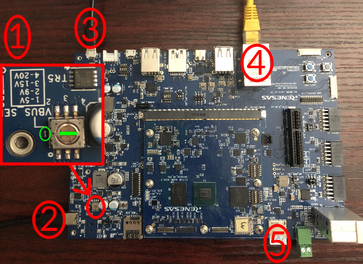

# Renesas RZ/G3E Evaluation Board Kit QuickStart
 [Purchase the Renesas RZ/G3E Evaluation Board Kit](https://www.renesas.com/en/design-resources/boards-kits/rz-g3e-evkit?srsltid=AfmBOoqkLQfH7gyWHOem2U-duZ3bwaM7khGy20z2v4WJy6npgNdgVsm5#parametric_options)
1. [Introduction](#1-introduction)
2. [Requirements](#2-requirements)
3. [Hardware Setup](#3-hardware-setup)
4. [Software Setup](#4-software-setup)
5. [/IOTCONNECT: Cloud Account Setup](#5-iotconnect-cloud-account-setup)
6. [Device Setup](#6-device-setup)
7. [Onboard Device](#7-onboard-device)
8. [Using the Demo](#8-using-the-demo)
9. [Resources](#9-resources)

# 1. Introduction

This guide provides step-by-step instructions to set up the **Renesas RZ/G3E Evaluation Board Kit hardware** and integrate
it with **/IOTCONNECT**, Avnet's robust IoT platform. The Renesas RZ/G3E Evaluation Board Kit hardware platform provides flexible options
for IoT application development, enabling secure device onboarding, telemetry collection, and over-the-air (OTA) updates.

<table>
  <tr>
    <td></td>
    <td>This open-source development kit features a quad-core, 64-bit CPU cluster based on the RISC-V application-class 
processor that supports Linux® and real-time applications, a rich set of peripherals and 95K of low-power, high-performance 
FPGA logic elements. The kit is ready for rapid testing of applications in an easy-to-use hardware development platform and 
offers a mikroBUS™ expansion header for Click boards™, a 40-pin Raspberry Pi™ connector, and a MIPI® video connector. 
The expansion boards can be controlled using protocols like I2C and SPI. One GB of DDR4 memory is available as well as 
a microSD® card slot for booting Linux. Communication interfaces include one Gigabit Ethernet connector and three UART 
connections via the USB type C connector. An on-board FlashPro5 programmer is available to program and debug the PolarFIre 
FPGA through USB-to-JTAG channel.</td>
  </tr>
</table>

# 2. Requirements

This guide has been written and tested to work on a Windows 10/11 PC. However, there is no reason this can't be
replicated in other environments.

## Hardware

* Renesas RZ/G3E Evaluation Board Kit [Purchase](https://www.renesas.com/en/design-resources/boards-kits/rz-g3e-evkit?srsltid=AfmBOoqkLQfH7gyWHOem2U-duZ3bwaM7khGy20z2v4WJy6npgNdgVsm5#parametric_options) | [User Manual](https://www.renesas.com/en/document/mah/rz-smarc-series-carrier-board-ii-users-manual-hardware?r=25574801) | [All Resources](https://www.renesas.com/en/design-resources/boards-kits/rz-g3e-evkit?srsltid=AfmBOoqkLQfH7gyWHOem2U-duZ3bwaM7khGy20z2v4WJy6npgNdgVsm5)
* Micro-USB Cable (included)
* Ethernet Cable (not included)
* 5V 3A+ Power Supply with USB-C Cable (not included, available [here](https://www.amazon.com/GeeekPi-Power-Supply-Raspberry-Adapter/dp/B0CQ2DL2RW/ref=sr_1_1?crid=1HVAMOTDQVQIA&dib=eyJ2IjoiMSJ9.54Hy6_AH2LRHKVp1qP3yruFT6h-yJhMyQ1fLB57xI8EPno1RK8bqOvyMSa1MB6ZxlWGMcWabsS50biNBzs9gyUu4HCQkJxDXxa0fzkJS8HowmIoaXPRmsl8_qnpaj8Z8BSZzkqAjjCmUGDEyrW2ozuUmzLDJbx7WXInW_ejGGwqXVtxPexzQCf5Q9NlYDTZi9JUplqFyamUnHbgtzOGSMR_jH0EvWeFpR61PZV_4B-4.dmo7FF4m94Q1Kcg7coHunypWQkkQTnk5OIViaC4DtoU&dib_tag=se&keywords=geeekpi+27w&qid=1766181206&sprefix=geeekpi+27w%2Caps%2C150&sr=8-1))
* SanDisk 8GB (or more) UHS-1 Class 10 Micro-SD card (not included, available [here](https://www.amazon.com/SanDisk-Industrial-MicroSD-SDSDQAF3-008G-I-Adapter/dp/B07BZ5SY18/ref=sr_1_4?crid=360H9A81QLNK9&dib=eyJ2IjoiMSJ9.fJWARiyPCzdh0zksHaXihTpM4ELLohYxpV4AVAFi107f7TjrzADYC7tr8UjvghCwfCAk7BLTzbgn6_jTNMDv6lSkED8zjlCYBMLxpwgqLUOmEPb0XXTc0rMbt9MHx7kkFJdKpZ_iFFE7b9XGyvPxElLRvzl7s4GYW7ThzZP2kj1-bcvZg6vp6EDKNBm5NdvW-AlQmk1BfYPHz2-6xyUgP2VTI4HknDTHhY1kUqp9JB4.hOOSnRKZmLV0wJdTT4qFKMg413rz5AnPpEFy07uLurk&dib_tag=se&keywords=sandisk+8gb+micro+sd+card&qid=1759769517&sprefix=sandisk+8gb+micro+sd+card%2Caps%2C147&sr=8-4))

## Software

* [TeraTerm](https://github.com/TeraTermProject/teraterm/releases)
> [!IMPORTANT]
> The bootloader setup process specifically requires TeraTerm. Other serial communication software like PuTTy will not 
> be sufficient for this device.

* An SD-Card flashing utility such as [Balena Etcher](https://etcher.balena.io/)

# 3. Hardware Setup

See the reference image below for hardware configuration and connections.
<details>
<summary>Reference Image with Connections</summary>

</details>

Using the above image as reference, make the following connections:

1. Using a small flathead screwdriver, *gently* turn the dial labeled **#1** counter-clockwise until the groove of the 
dial is facing the "1" (selects 5V).
> [!IMPORTANT]
> Turning this dial does require force. If you face any significant resistance, do not continue attempting to turn it.

2. Connect the USB-C power supply to the USB-C connector on the board labeled **#2**.
> [!TIP]
> After connecting power to the board, two green LEDs should illuminate on the board above the connector. If a red LED 
> illuminates, that means that the voltage selector dial (labeled #1 in the diagram) is not set to 5V.

3. Connect the micro-USB cable from your host PC to the micro-USB connector labeled **#3**.
4. Connect an Ethernet cable from your LAN (router/switch) to the Ethernet connector labeled **#4**.
5. (After the software setup is complete) Insert the micro-SD card into the slot labeled **#5**.

# 4. Software Setup

## Flash Linux Image and Bootloader

Renesas provides thorough instructions [here](https://www.renesas.com/en/document/qsg/rzg3e-evaluation-board-kit-quick-start-guide?r=25574801) 
for flashing a pre-built image to an SD card, flashing the bootloader files to the board, and then booting up the board 
with the image for the first time.

Complete all the steps from that guide (except for "2.2 Build the Linux Environment) and then resume here at step 5.

# 5. /IOTCONNECT: Cloud Account Setup

An /IOTCONNECT account with AWS backend is required. If you need to create an account, a free trial subscription is
available.
The free subscription may be obtained directly from iotconnect.io or through the AWS Marketplace.

* Option #1 (
  Recommended) [/IOTCONNECT via AWS Marketplace](https://github.com/avnet-iotconnect/avnet-iotconnect.github.io/blob/main/documentation/iotconnect/subscription/iotconnect_aws_marketplace.md) -
  60 day trial; AWS account creation required
* Option #2 [/IOTCONNECT via iotconnect.io](https://subscription.iotconnect.io/subscribe?cloud=aws) - 30 day trial; no
  credit card required

> [!NOTE]
> Be sure to check any SPAM folder for the temporary password after registering.

# 6. Device Setup

1. With the board powered on (3 green LEDs should be illuminated), connect serially again in TeraTerm.
2. Ensure that your serial settings in your session are set to:

- Baud Rate: 115200
- Data Bits: 8
- Stop Bits: 1
- Parity: None

> [!NOTE]
> A successful connection may result in just a blank terminal box. If you see a blank terminal box, press the ENTER key
> to get a login prompt. An unsuccessful connection attempt will usually result in an error window popping up.

3. When prompted for a login, type `root` followed by the ENTER key.

4. The image for the RZ/G3E does not include the necessary repositories to download the Python Lite SDK and its dependencies 
so instead you will download the required packages to your host PC, transfer them to the board, and then install them. First 
execute the command `ip a` and note the `inet` IP address of your board under the `end0` network interface.

5. In a Git Bash or WSL terminal **on your host PC** (or just standard terminal if using Linux), run this command (replacing 
`<IP-ADDRESS>` at the very end with the IP address from sub-step 4) to download and execute a script that will gather the needed packages 
and transfer them to your RZ/G3E:

```
wget https://raw.githubusercontent.com/avnet-iotconnect/iotc-python-lite-sdk-demos/refs/heads/main/renesas-rzg3e-evk/scripts/deps-download.sh && bash ./deps-download.sh <IP-ADDRESS>
```
6. Now **back in a terminal on the RZ/G3E** run this command to download and execute a script that will install the transferred packages:

```
wget https://raw.githubusercontent.com/avnet-iotconnect/iotc-python-lite-sdk-demos/refs/heads/main/renesas-rzg3e-evk/scripts/deps-install.sh && bash ./deps-install.sh
```

7. Then run this command to create and move into a directory for your demo files:

```
mkdir -p /home/weston/demo && cd /home/weston/demo
```

> [!TIP]
> To gain access to "copy" and "paste" functions inside of a Putty terminal window, you can CTRL+RIGHTCLICK within the
> window to utilize a dropdown menu with these commands. This is very helpful for copying/pasting between your browser and
> the terminal.


# 7. Onboard Device

The next step is to onboard your device into /IOTCONNECT. This will be done via the online /IOTCONNECT user interface.

Follow [this guide](../common/general-guides/UI-ONBOARD.md) to walk you through the process.

# 8. Using the Demo

Run the basic demo with this command:

```
python3 app.py
```

> [!NOTE]
> Always make sure you are in the ```/home/weston/demo``` directory before running the demo. You can move to this
> directory with the command: ```cd /home/weston/demo```

View the random-integer telemetry data under the "Live Data" tab for your device on /IOTCONNECT.

# 9. Resources

* [Purchase the Renesas RZ/G3E Evaluation Board Kit](https://www.renesas.com/en/design-resources/boards-kits/rz-g3e-evkit?srsltid=AfmBOoqkLQfH7gyWHOem2U-duZ3bwaM7khGy20z2v4WJy6npgNdgVsm5#parametric_options)
* [/IOTCONNECT Overview](https://www.iotconnect.io/)
* [/IOTCONNECT Knowledgebase](https://help.iotconnect.io/)
