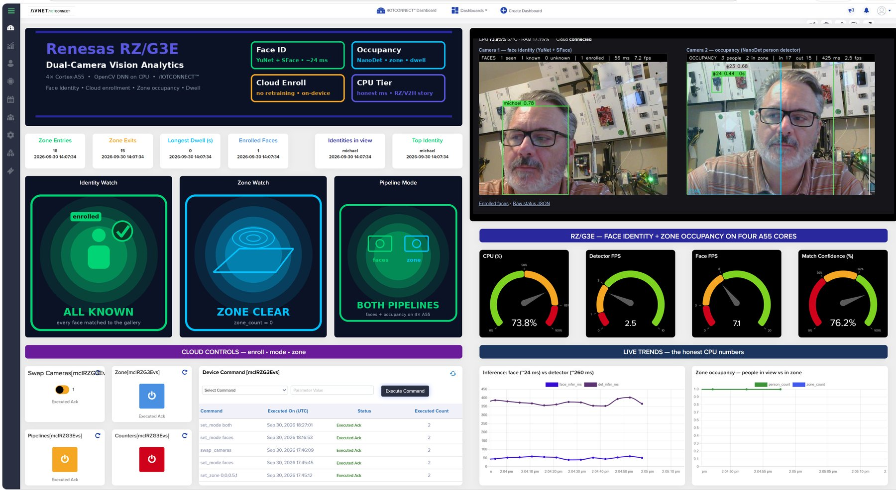

# Renesas RZ/G3E EVK — /IOTCONNECT Vision Demo

Two USB cameras, two CPU vision pipelines, one cloud connection. No HDMI monitor, no
accelerator, no extra Python packages: everything runs through the OpenCV 4.13 DNN module
that ships on the RZ/G3E Yocto image.

| Camera | Pipeline | Models (OpenCV Zoo) | What the cloud sees |
|---|---|---|---|
| 1 | **Face identity** | YuNet (detect) + SFace (recognise) | who is in view, unknown-person alert, enrolment from a cloud command |
| 2 | **Occupancy** | NanoDet-Plus-m (person detector) + centroid tracker | people in view / in zone, entries, exits, dwell time |

```
  Camera 1 ──► YuNet + SFace ──► /faces  MJPEG ─┐
                    │  identities, unknown flag   ├──► http://<board-ip>:8080/
  Camera 2 ──► NanoDet + tracker ──► /occupancy ─┘
                    │  counts, entries/exits, dwell
                    ▼ telemetry every 5 s                 ▲ commands (enroll, set_zone,
              MQTT over TLS ──────► /IOTCONNECT ◄──────────┘ set_mode, reset_counts ...)
```

1. [Requirements](#1-requirements)
2. [Install on the board](#2-install-on-the-board)
3. [Onboard the device](#3-onboard-the-device)
4. [Run](#4-run)
5. [Commands](#5-commands)
6. [Telemetry](#6-telemetry)
7. [Web feeds](#7-web-feeds)
8. [Updating over the air](#8-updating-over-the-air)
9. [Troubleshooting](#9-troubleshooting)

In a hurry? Follow [QUICKSTART.md](QUICKSTART.md). See [DEMO.md](DEMO.md) for a presenter
walkthrough and the measured performance numbers.



The /IOTCONNECT dashboard above is included as [rzg3e-vision-dashboard.json](rzg3e-vision-dashboard.json)
(import it via **Create Dashboard → Import Dashboard** and map it to your device).

# 1. Requirements

* RZ/G3E EVK booted from the Renesas Yocto image, set up through
  [the board QuickStart](../README.md) up to and including section 5 (the /IOTCONNECT
  Lite SDK is installed from source there — the image has no `pip`).
* Two UVC USB cameras (one works too: both pipelines then share it). Logitech C920/C270
  class cameras are known good. Plug them into the **USB 2.0 Type-A ports on the carrier
  board's 4-port hub**.
* Internet access from the board (to fetch the ~42 MB of model files once).
* Root partition with a few hundred MB free. The stock SD image ships a 1.1 GB root
  partition that is mostly full — see [Troubleshooting](#9-troubleshooting) to grow it.

# 2. Install on the board

From this folder on your PC (Git Bash / WSL / Linux):

```bash
bash create-package.sh
scp package.tar.gz root@<board-ip>:/opt/demo/
```

On the board:

```bash
mkdir -p /opt/demo && cd /opt/demo
tar -xzf package.tar.gz && bash install.sh
```

`install.sh` checks the SDK and OpenCV, downloads the three models into `/opt/demo/models`,
loads the `uvcvideo` driver (and makes it load at boot), and installs a systemd service
(`iotc-demo`) that starts the demo at boot and restarts it on failure. The service only
starts once the device credentials from the next step are in place.

# 3. Onboard the device

1. In /IOTCONNECT create a template by importing
   [rzg3e-vision-template.json](rzg3e-vision-template.json) (**Device → Templates → Import**).
2. Create a device from that template, following
   [the UI onboarding guide](../../common/general-guides/UI-ONBOARD.md). Download the
   device's `iotcDeviceConfig.json` and its certificate/key.
3. Copy the three files to the board as `/opt/demo/iotcDeviceConfig.json`,
   `/opt/demo/device-cert.pem` and `/opt/demo/device-pkey.pem`.

# 4. Run

```bash
systemctl start iotc-demo          # background, at every boot
tail -f /opt/demo/app.log
```

or, to watch it in the foreground:

```bash
systemctl stop iotc-demo
cd /opt/demo && python3 app.py
```

Open `http://<board-ip>:8080/` in a browser for both live feeds and a status strip. The
console prints one line per telemetry sample:

```
cpu=41.2% 47.0C | faces=1 known=1 unknown=0 [Michael] 26.3ms 14.8fps | people=2 zone=1 in=3 out=2 dwell=12.0s 262.0ms 3.7fps
```

Cameras are hot-plugged: the first camera (by USB port) feeds the face pipeline, the second
feeds occupancy. With a single camera both pipelines share it. Use `swap_cameras` if they
are the wrong way round.

# 5. Commands

Send from the device's **Command** tab in /IOTCONNECT. Every command acks with a status message.

| Command | Parameter | Effect |
|---|---|---|
| `enroll` | `<name>` | Look at camera 1 for ~3 s; five samples of the largest face are stored under that name. Ack reports the sample count. |
| `forget` | `<name>` or `all` | Remove an identity from the on-device gallery. |
| `list_faces` | — | Ack lists the enrolled identities. |
| `set_mode` | `both` \| `faces` \| `occupancy` \| `off` | Choose which pipelines run. |
| `set_zone` | `x1,y1,x2,y2` (0..1) | Occupancy zone as a fraction of the frame. Default `0.3,0.05,0.7,0.95` (centre band). |
| `set_confidence` | `0.05`–`0.95` | Person detector confidence threshold (default 0.4). |
| `set_face_threshold` | `0.1`–`0.9` | Face match cosine-similarity threshold (default 0.363). Raise to reduce false matches. |
| `set_mirror` | `on` \| `off` | Flip the camera frames horizontally so the feeds behave like a mirror (default on). Applies to both pipelines and the zone. |
| `reset_counts` | — | Zero the entry/exit counters. |
| `swap_cameras` | — | Swap which camera feeds which pipeline. |
| `file-download` | `<url>` | Download a `.tar.gz` package, run its `install.sh`, restart. |

Settings changed by command persist in `/opt/demo/config.json`; the face gallery lives in
`/opt/demo/faces/` (`gallery.json` plus one thumbnail per identity).

# 6. Telemetry

Sent every 5 seconds. The interesting fields:

| Field | Meaning |
|---|---|
| `identities` | Who is in view right now, e.g. `Michael, unknown` |
| `unknown_present` | An unrecognised face was seen since the previous sample. Sticky for one interval so a rule can fire on it. |
| `known_seen` | Enrolled identities seen since the previous sample |
| `top_identity`, `top_confidence` | Best match and its cosine similarity (%) |
| `face_count`, `known_count`, `unknown_count`, `enrolled_count` | Face pipeline counts |
| `person_count`, `zone_count` | People tracked in view / inside the zone |
| `entries_total`, `exits_total` | Cumulative zone crossings |
| `dwell_max_s`, `dwell_avg_s` | How long people currently in the zone have been there |
| `face_infer_ms`, `face_fps`, `det_infer_ms`, `det_fps` | Per-pipeline inference time and frame rate |
| `cpu_percent`, `cpu_temp_c`, `memory_percent`, `load_1m` | Board health |
| `mode`, `cameras_connected`, `faces_active`, `occupancy_active`, `zone`, `det_confidence` | Current configuration |

Suggested rule: `unknown_present == true` → notification. The bundled dashboard
([rzg3e-vision-dashboard.json](rzg3e-vision-dashboard.json)) shows identities in view,
zone entries/exits and dwell, gauges for CPU, detector FPS, face FPS and match confidence,
inference-time trends, and command buttons for swap/zone/mode/reset.

# 7. Web feeds

| URL | Content |
|---|---|
| `http://<board-ip>:8080/` | Both feeds with a live status strip |
| `/faces`, `/occupancy` | MJPEG streams (embed in any ``) |
| `/faces.jpg`, `/occupancy.jpg` | Latest single frame |
| `/status` | Current telemetry as JSON |
| `/gallery` | Enrolled face thumbnails |

Frames are only JPEG-encoded while someone is watching, so the streams cost nothing when idle.

# 8. Updating over the air

`bash create-package.sh` builds `package.tar.gz` from `src/` (models, gallery, config and
credentials are excluded). Host it anywhere the board can reach and send
`file-download <url>`, or use the /IOTCONNECT OTA flow with the same package. The board
extracts it into `/opt/demo`, runs `install.sh`, and restarts the app.

# 9. Troubleshooting

* **No cameras detected** (`cameras_connected` is 0, feeds show *no camera assigned*): run
  `lsusb` — the camera must appear. If it does not, move it to the USB 2.0 Type-A ports on
  the carrier board's hub. If it appears but there is no `/dev/video*`, run
  `modprobe uvcvideo` (install.sh makes this permanent).
* **Root partition full** (`df -h /` shows a 1.1 GB root): the stock image ends the root
  partition at 1.1 GB regardless of card size. To grow it in place (root stays mounted):
  ```bash
  printf "d\n2\nn\np\n2\n44880\n\nw\n" | fdisk /dev/mmcblk1   # keep start sector 44880
  reboot
  resize2fs /dev/mmcblk1p2
  ```
  Check the start sector of partition 2 with `fdisk -l /dev/mmcblk1` first and use that
  value if it differs.
* **Face never recognised / too many false matches**: enrol in the lighting you will demo
  in, enrol twice from slightly different angles (samples accumulate), and tune
  `set_face_threshold` (higher is stricter).
* **Occupancy misses people**: lower `set_confidence` (0.3), give the camera a wide view
  of full bodies, and make the zone cover where people actually stand.
* **Slow**: both pipelines share four Cortex-A55 cores. With both running, the face
  pipeline is capped at 8 fps (~60 ms per frame) and the person detector runs at ~2.7 fps
  (~350 ms), which is plenty for counting. `set_mode faces` or `set_mode occupancy` frees
  the CPU for one pipeline (~24 ms and ~260 ms respectively).
* **SDK missing** (`ModuleNotFoundError: avnet`): finish section 5 of
  [the board QuickStart](../README.md).
