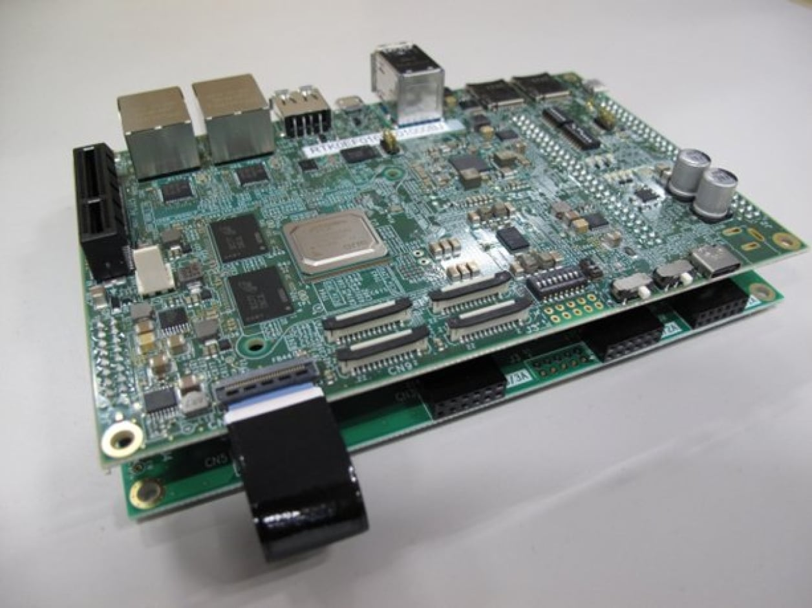

# Renesas RZ/V2H EVK Quickstart

[Purchase the Renesas RZ/V2H EVK](https://www.renesas.com/en/design-resources/boards-kits/rz-v2h-evk)

1. [Introduction](#1-introduction)
2. [Requirements](#2-requirements)
3. [Hardware Setup](#3-hardware-setup)
4. [Device Setup](#4-device-setup)
5. [Onboard Device](#5-onboard-device)
6. [Using the Demo](#6-using-the-demo)
7. [Going Further: Expansion Demos](#7-going-further-expansion-demos)
8. [Resources](#8-resources)

# 1. Introduction

This guide is designed to walk through the steps to connect the Renesas RZ/V2H EVK to the Avnet /IOTCONNECT platform and
periodically send general telemetry data.

<table>
  <tr>
    <td></td>
    <td>The RZ/V2H EVK is a high-performance evaluation platform built around Renesas' RZ/V2H SoC, featuring Arm Cortex-A55 and A76 CPU clusters alongside a dedicated **DRP-AI** (Dynamically Reconfigurable Processor for AI) hardware accelerator designed for efficient deep-learning inference at the edge.</td>
  </tr>
</table>

# 2. Requirements

## Hardware

* Renesas RZ/V2H EVK
* 100W USB PD power
  adapter ([this model](https://www.amazon.com/USB-C-Laptop-Charger-Charging-ThinkPad-Computer-Compatible/dp/B0BVM6ZPWK/ref=sr_1_3?crid=6PCNFHSB3RGZ&dib=eyJ2IjoiMSJ9.UrOHdPZvVxYtk7X2faa7kfzMpV3kW5xMiZGXxXT0xFBzixXM0w_ksBaBaY_XOIHVL-wEtUAAdItLfbjeMj3sKnnnEmUr1WejO5UvW1te7urFuabkr_YcfvInCQ0C6WyrZHVQY0Qs4wQiQP0LopxHc5KKChRsMh7L5o8HxIn82AQebgLJzuikLN_T206scGMO4-5gL7uQiPO8KSwgoDnd4K-Ki1ysCySRaS14CVdCGvk.2e6NJfr_sSztz1xIYL9LFY4rPA5io5E-D_PB3CYGrDw&dib_tag=se&keywords=100w+usbc+pd+charger+yenyoh&qid=1778724175&sprefix=100w+usbc+pd+charger+yenyo%2Caps%2C172&sr=8-3)
  is what Avnet's engineer used for testing)
* 16GB+ microSD card
* microSD card mounting port (or USB adapter) on host PC
* HDMI monitor and cable
* Ethernet cable
* USB keyboard and mouse
* (Optional) USB hub

## Software

* Linux host PC for flashing the microSD card (Ubuntu 22.04 recommended)

# 3. Hardware Setup

1. In
   the [Renesas RZ/V AI SDK Getting Started Guide](https://renesas-rz.github.io/rzv_ai_sdk/7.10/getting_started.html),
   follow Steps 3 and 4 to download and extract the RZ/V2H version of the AI SDK to your host PC.

2. In
   the [Renesas RZ/V2H Getting Started Guide](https://renesas-rz.github.io/rzv_ai_sdk/latest/getting_started_v2h.html),
   follow the eSD Bootloader version of "Step 7: Deploy AI Application":
    - **Step 7.1** (Setup RZ/V2H EVK) — required: flashes the board OS image to the microSD card.
    - **Step 7.2** (Deploy Application to the Board) — skip. The [AI Inference expansion demo](./ai-demo) covers deploying the DRP-AI binaries to the running board directly via SSH.
    - **Step 7.3** (Boot RZ/V2H EVK) — required: inserts the card, sets the boot switches, and powers on the board.

   When you reach Step 8 (Run AI Application), stop and return here.

# 4. Device Setup

With the board powered on and the HDMI display showing the desktop:

1. Using the connected USB mouse, open a terminal window on the board.
2. Run this command and note the `inet` IP address under the `end0` interface (typically `192.168.X.X`):

```bash
ip a
```

3. On your host PC, SSH into the board as root (no password required):

```bash
ssh root@192.168.X.X
```

4. Run this command to install the necessary /IOTCONNECT packages:

```bash
python3 -m pip install iotconnect-sdk-lite requests
```

5. Run this command to create and move into a directory for your demo files:

```bash
mkdir -p /opt/demo && cd /opt/demo
```

# 5. Onboard Device

The next step is to onboard your device into /IOTCONNECT. This will be done via the online /IOTCONNECT user interface.

Follow [this guide](../common/general-guides/UI-ONBOARD.md) to walk you through the process.

# 6. Using the Demo

Run the basic demo with this command:

```
python3 app.py
```

> [!NOTE]
> Always make sure you are in the ```/opt/demo``` directory before running the demo. You can move to this
> directory with the command: ```cd /opt/demo```

View the random-integer telemetry data under the "Live Data" tab for your device on /IOTCONNECT.

# 7. Going Further: Expansion Demos

Now that you have completed the basic quickstart, you can patch a specialized expansion demo on top of it using an OTA
software package. The following expansion demos are available for this board:

* **[System Monitor Demo](system-monitor-demo/README.md)**: Upgrades the starter demo to stream real-time system
  performance telemetry — CPU utilisation, RAM usage, and CPU temperatures — read directly from the Linux kernel.
* **[AI Inference Demo](ai-demo/README.md)**: Upgrades the starter demo to run Python computer-vision detection on a USB
  camera, launch any of the Renesas DRP-AI hardware-accelerated demos on an HDMI display via cloud commands, and stream
  detection counts, inference timing, and system performance metrics to /IOTCONNECT.

# 8. Resources

* [Purchase the Renesas RZ/V2H EVK](https://www.renesas.com/en/design-resources/boards-kits/rz-v2h-evk)
* [Renesas RZ/V2H AI SDK](https://www.renesas.com/en/software-tool/rzv2h-ai-software-development-kit)
* [Renesas RZ/V2H Getting Started Guide](https://renesas-rz.github.io/rzv_ai_sdk/latest/getting_started_v2h.html)
* [Renesas AI Applications GitHub](https://github.com/renesas-rz/rzv_ai_sdk)
* [Renesas RZ GitHub](https://github.com/renesas-rz)
* [/IOTCONNECT Overview](https://www.iotconnect.io/)
* [/IOTCONNECT Knowledgebase](https://help.iotconnect.io/)
