# STM32MP135F-DK Board Setup

 

## Step 1: Flash Updated Image to Board
* Download the zipped image folder containing the latest STM32MP1 image from the [STM32MP1 OpenSTLinux Starter Package page](https://www.st.com/en/embedded-software/stm32mp1starter.html).
>[!NOTE]
>You may have to create an ST account (it's free) to get access to software downloads.

* Unzip the folder to a known location.
* Download and Install the [STM32CubeProgrammer](https://www.st.com/en/development-tools/stm32cubeprog.html) software (the utility for flashing the image to the device).
* Set up the STM32MP135F-DK board for flashing:
   * Set all 4 of the the dip-switches to "OPEN" for flashing
  
      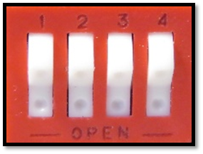
      
   * Power the board with a USB-C cable connected to the "PWR_IN" USB-C port connected to a 5VDC supply with at least 1.0A of output.
   
      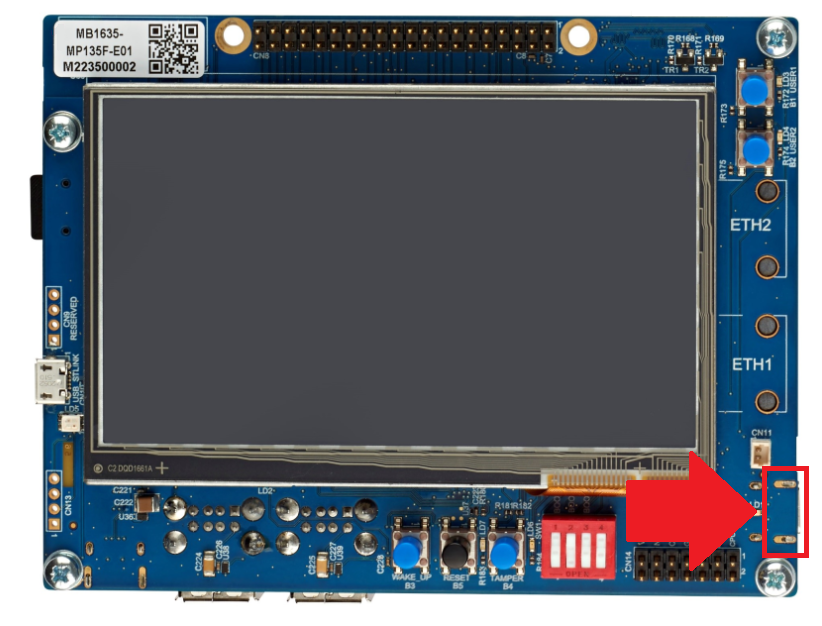
      
   * Connect the USB-C "USB" port of your board to your PC with the included USB-C cable.
      * If your PC does not have a USB-C port, you may use a USB-A to USB-C cable and connect it to a normal USB-A port on your PC.
   
      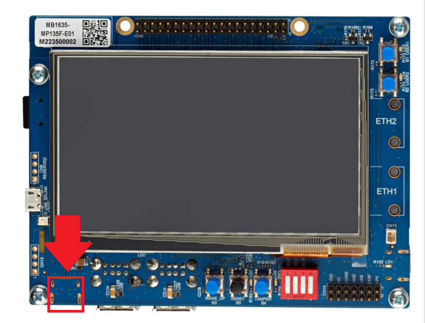
   
   * Insert the included SD card into the SD card slot on the board.
      
   * Push the "RESET" button on your board to ensure it boots into flashing mode (the LCD display of the board should be black when it has booted into flashing mode).

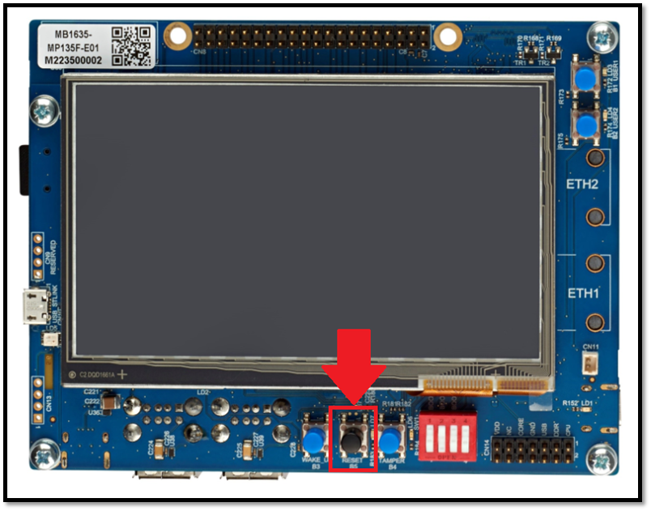
      
* Run the STM32CubeProgrammer software and click on the "Open file" tab.

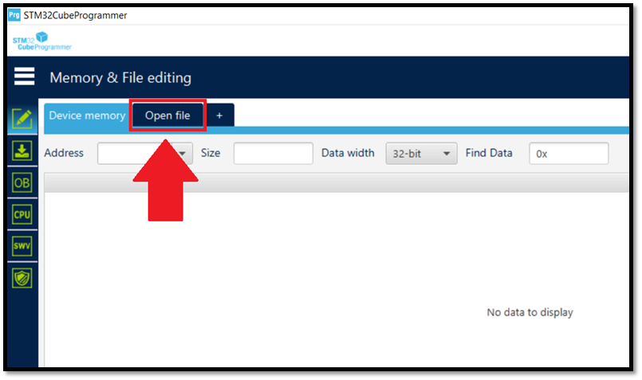
      
* Navigate to the directory where you have the unzipped image folder, and then navigate through the folder to get to this directory: {Your preliminary directory}\{downloaded image name}\images\stm32mp1\flashlayout_st-image-weston\optee
   * Select the FlashLayout_sdcard_stm32mp135F-dk-optee.tsv file and then click "Open." 
   
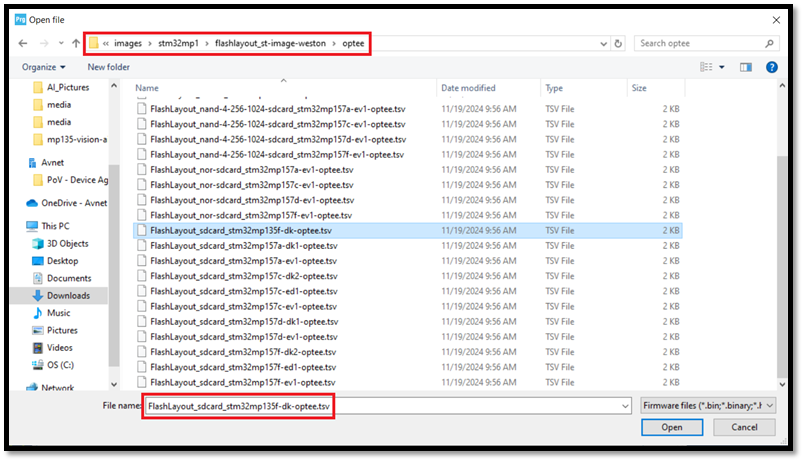
      
* Next, click on the "Browse" button to select the binaries path.
   
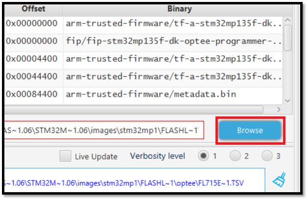
   
* Navigate once again to the directory where you have the unzipped image folder, and then navigate through the folder to get to this directory: {Your preliminary directory}\{downloaded image name}\images\stm32mp1
   * Select the stm32mp1 folder and then click "Select folder."

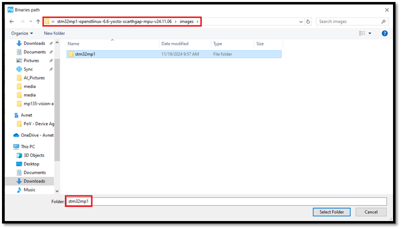
      
* Back in the STM32CubeProgrammer window, on the right-hand side of the screen, if the "Port" is listed as "No DFU...," make sure your USB cable is connected both to your PC and the board, and then click the revolving arrows icon.

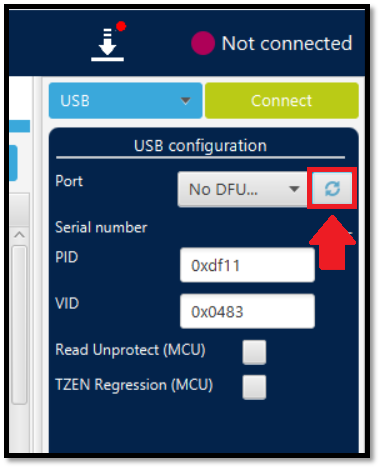
     
* When the device is recognized by the software, the port listing will be "USB" followed by a number, such as 1. The serial number of your board should also be listed beneath the port name.

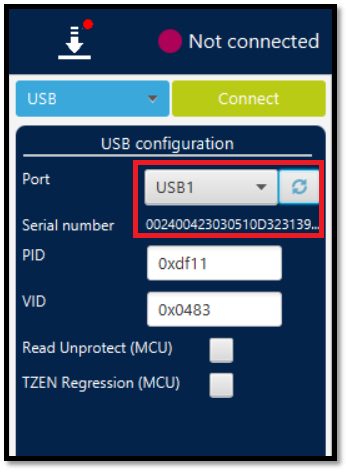
    
* You are ready to flash. Click the "Download" button to begin the flashing process.

>[!NOTE]
>The STM32MP135F-DK will turn off and on several times throughout the flashing process. It is important to not unplug or disturb it during the process.
>Given the size of the image it will usually take several minutes to flash.
>It is worth noting that the LCD screen on the board will turn on with some output text during the flash process, so do not be alarmed.

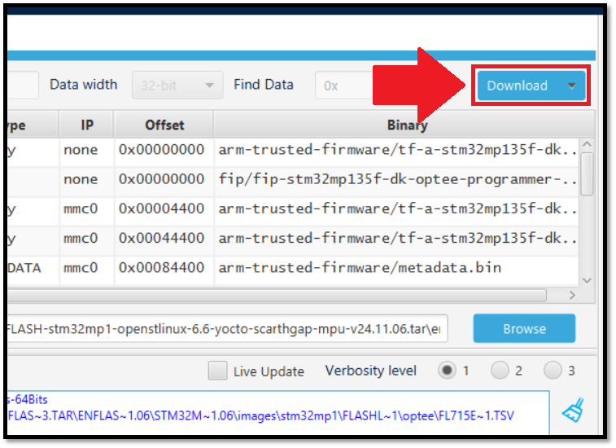
   
* When the flash has completed successfully, this pop-up in the STM32CubeProgrammer window will appear.


   
* Flip dipswitches 1 and 3 to the "closed" position while leaving dipswitches 2 and 4 in the "OPEN" position. Push the reset button to properly boot the new image from the SD card.

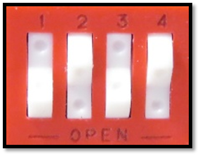
   
>[!NOTE]
>For the first boot after flashing, the board may take a few minutes to turn on.

## Step 2: Serially Connect to the STM32MP135F-DK

* Using a USB-A to micro-USB cable, connect your board to your PC at the ST-LINK connector.

     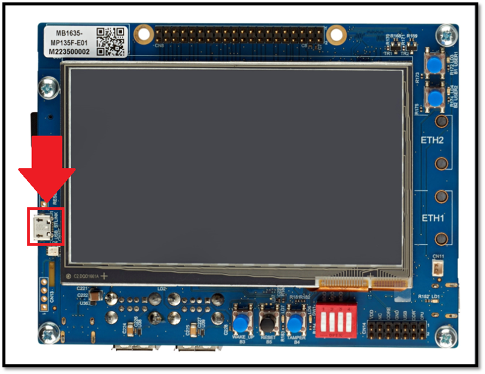

* Check and note which COM port the board is utilizing
  * On Windows computers this can be seen by using the Device Manager
 
     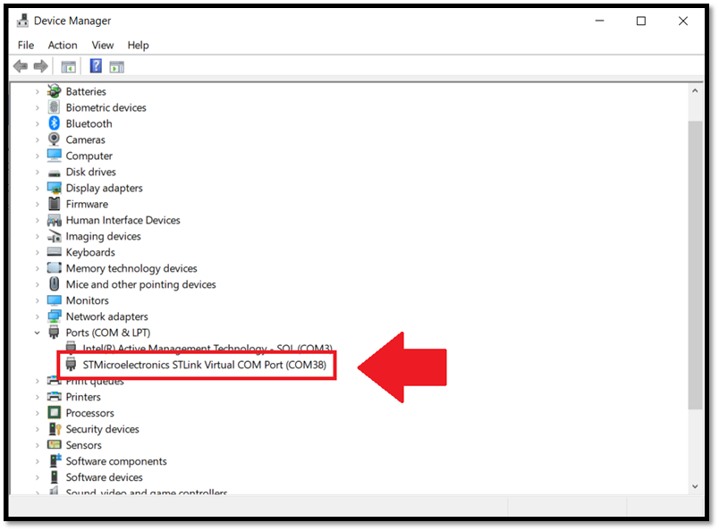

* Connect to the STM32MP135F-DK in a terminal emulator using these serial settings (your COM port number may be different):

     
     
>[!NOTE]
>After connecting to the board over serial, you may need to press ENTER in the terminal window to get the actual terminal prompt text.

## Step 3: Set Up and Run the Python Lite SDK Demo
* Connect the board to the internet using an Ethernet connection

* Execute ```sudo apt-get update``` to check for and install updates for the system

* Execute ```sudo apt-get install python3-pip -y``` to install the pip python3 package manager

* Navigate to the "/home/weston" directory with the command ```cd /home/weston```

* For the rest of the basic demo setup and execution processes, follow the instructions in the [Python Lite SDK Quickstart Guide](https://github.com/avnet-iotconnect/iotc-python-lite-sdk/blob/main/QUICKSTART.md)
>[!IMPORTANT]
>If planning to use the Vision AI demo, make sure to create your device using the AIMP1 template, as detailed in Step 4

## Step 4: Add Vision AI Functionality
* The STM32MP135F-DK supports the X-LINUX-AI expansion package, and a basic IoTConnect connect demo has been created to showcase this capability. The demo detects objects held/placed in front of the camera and periodcially sends information (object names, confidence percentage, and confidence rankings) regarding the detected objects to IoTConnect.

* Download the vision-ai-expansion.zip folder in this directory and extract it to a known location

* Within the unzipped folder, locate the AIMP1_template.JSON file and use it as the template when creating your device in IoTConnect

* Next, execute these commands to install and set up the X-LINUX-AI packages:
```
sudo apt-get install x-linux-ai-tool -y
sudo apt-get update
x-linux-ai -i packagegroup-x-linux-ai-demo
systemctl restart weston-graphical-session.service
```

* Using SCP (or a Windows equivalent utility like WinSCP), copy these 2 files from the expansion folder into the "/usr/local/x-linux-ai/object-detection' directory:
```
launch-vision-program.sh
iotc-vision-program.py
```

* Using the same method, copy these 3 files from the expansion folder into the "/home/weston" directory:
```
MP135-vision-demo.py
ack.txt
objects-detected.txt
```

* Next, make the launching script executable with this command:

```sudo chmod +x /usr/local/x-linux-ai/object-detection/launch-vision-program.sh```

* Plug your USB camera into a USB port on the STM32MP135F-DK, and position the camera to be looking at your designated detection area.

>[!IMPORTANT]
>The AI Vision Demo requires a USB UVC-Compliant Camera (such as [this](https://www.amazon.com/ALPCAM-Distortion-Compliant-Embedded-Industrial/dp/B0B1WTV1KB/ref=sr_1_40?crid=1Y64R6N37I2DW&dib=eyJ2IjoiMSJ9.09vlNQuRgZXBCOJltq5NAHjwkF3xrkD_IO8iIPnTgmM656JhZdERupdaYL29K-WbqLGgdkCchkhjMGFCFpy7D4Ng5LfWuSsYX1jMf8HFDXXsuqE96PFQrpwZszNnYEAkgDOKVRYky4lgiGU4S8NZZEcnmANwxdgvAOnkQCDQWIYxf2Tau45lZyN0ZjY5Otk6.TwrVuCH8OFqthDivTQqbOEPSUYAmvtH5LiE27DyAm7A&dib_tag=se&keywords=usb%2Bcamera%2Buvc&qid=1732315805&sprefix=usb%2Bcamera%2Buvc%2Caps%2C148&sr=8-40&th=1)). Using a non-UVC camera (most modern webcams, for example) will cause the vision program to crash due to image format incompatibilities.

>[!NOTE]
> The detection program works best with good lighting and non-glossy objects against a non-glossy background with good color-contrast versus the colors of the objects being detected. Ideally the objects are between 6 and 24 inches away from the camera lens (depends on size of object). To maintain a consistent and controlled background, it is recommended to position the camera above a tabletop secured to a boom arm (such as [this](https://www.amazon.com/dp/B0BV2SBWVD?ref=cm_sw_r_apan_dp_XVFHFPZQA55SFZY5S988&ref_=cm_sw_r_apan_dp_XVFHFPZQA55SFZY5S988&social_share=cm_sw_r_apan_dp_XVFHFPZQA55SFZY5S988&peakEvent=1&starsLeft=1&skipTwisterOG=1&th=1)), looking down at objects on the table.

>[!TIP]
>The minimum confidence threshold can be lowered to accomodate non-ideal conditions, but could result in false-positive detections.
