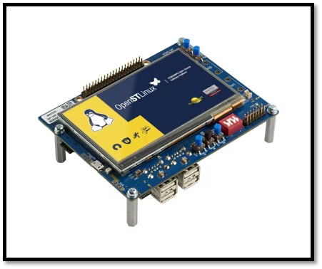

# STM32MP135F-DK QuickStart

1. [Introduction](#1-introduction)
2. [Requirements](#2-requirements)
3. [Hardware Setup](#3-hardware-setup)
4. [/IOTCONNECT: Cloud Account Setup](#4-iotconnect-cloud-account-setup)
5. [Device Setup](#5-device-setup)
6. [Using the Demo](#6-using-the-demo)
7. [Troubleshooting](#7-troubleshooting)
8. [Resources](#8-resources)

# 1. Introduction
This guide is designed to walk through the steps to connect the STM32MP135F-DK to the Avnet /IOTCONNECT platform and periodically send general telemetry data.

<table>
  <tr>
    <td></td>
    <td>The STM32MP135 Discovery kit (STM32MP135F-DK) leverages the capabilities of the 1 GHz STM32MP135 microprocessors to allow users to develop easily applications using STM32 MPU OpenSTLinux Distribution software. It includes an ST-LINK embedded debug tool, LEDs, push-buttons, two 10/100 Mbit/s Ethernet (RMII) connectors, one USB Type-C® connector, four USB Host Type-A connectors, and one microSD™ connector. To expand the functionality of the STM32MP135 Discovery kit, one GPIO expansion connector is also available for third-party shields.
Additionally, the STM32MP135 Discovery kit features an LCD display with a touch panel, Wi‑Fi® and Bluetooth® Low Energy capability, and a 2-megapixel CMOS camera module.
It also provides secure boot and cryptography features.</td>
  </tr>
</table>

# 2. Requirements
This guide has been written and tested to work on a Windows 10/11 PC. However, there is no reason this can't be replicated in other environments.

## Hardware 
* STM32MP135F-DK [Purchase](https://www.avnet.com/shop/us/products/stmicroelectronics/stm32mp135f-dk-3074457345651659229/?srsltid=AfmBOopijKmQ00ko1YYwjONN5cRH9akfAf_aqdRSphwy7iE1XhpDUiG0) | [User Manual & Kit Contents](https://www.st.com/resource/en/user_manual/um2993-discovery-kit-with-1-ghz-stm32mp135fa-mpu-stmicroelectronics.pdf) | [All Resources](https://www.st.com/en/evaluation-tools/stm32mp135f-dk.html)
* 1 USB Type-C Cable
* 1 Micro-USB Cable
* Ethernet Cable **or** WiFi Network SSID and Password

## Software
* A serial terminal such as [TeraTerm](https://github.com/TeraTermProject/teraterm/releases) or [PuTTY](https://www.putty.org/)

>[!NOTE]
>STM32MP135F-DK must be running a Scarthgap (the newest) image release for the X-LINUX-AI expansion demo. Follow [this flashing guide](FLASHING.md) to download and flash the most up-to-date image to your board. 

# 3. Hardware Setup
See the reference image below for cable connections.
<details>
<summary>Reference Image with Connections</summary>

</details>

Using the above image as reference, make the following connections:
1. (OPTIONAL) Connect an Ethernet cable from your LAN (router/switch) to the Ethernet connector labeled **#1**. If you instead wish to use Wi-Fi, after booting your board refer to the [WIFI](WIFI.md) guide.
2. Connect the USB-C cable from a 5V/2.4A (up to 3A) power supply to the PWR USB-C connector on the board, labeled **#2**.
3. Connect the Micro-USB cable from your PC to the Micro-USB connector labeled **#3** on the reference image.

# 4. /IOTCONNECT: Cloud Account Setup
An /IOTCONNECT account with AWS backend is required.  If you need to create an account, a free trial subscription is available.
The free subscription may be obtained directly from iotconnect.io or through the AWS Marketplace.


* Option #1 (Recommended) [/IOTCONNECT via AWS Marketplace](https://github.com/avnet-iotconnect/avnet-iotconnect.github.io/blob/main/documentation/iotconnect/subscription/iotconnect_aws_marketplace.md) - 60 day trial; AWS account creation required
* Option #2 [/IOTCONNECT via iotconnect.io](https://subscription.iotconnect.io/subscribe?cloud=aws) - 30 day trial; no credit card required


> [!NOTE]
> Be sure to check any SPAM folder for the temporary password after registering.

# 5. Device Setup
1. Open a serial terminal emulator program such as TeraTerm.
2. Ensure that your serial settings in your terminal emulator are set to:
  - Baud Rate: 115200
  - Data Bits: 8
  - Stop Bits: 1
  - Parity: None
3. Noting the COM port value for "STMicroelectronics STLink Virtual COM Port" in the Device Manager list, attempt to connect to your board via the terminal emulator
>[!NOTE]
>A successful connection may result in just a blank terminal box. If you see a blank terminal box, press the ENTER key to get a login prompt. An unsuccessful connection attempt will usually result in an error window popping up.
4. When prompted for a login, type `root` followed by the ENTER key.
5. Run these commands to update the core board packages and install necessary IoTConnect packages:
   ```
   su
   ```
   ```
   apt-get update
   ```
   ```
   apt-get install python3-pip -y
   ```
   ```
   python3 -m pip install iotconnect-sdk-lite
   ```
   ```
   python3 -m pip install requests
   ```
6. Run these commands to create and move into a directory for your demo files:
   ```
   mkdir /home/weston/demo
   ```
   ```
   cd /home/weston/demo
   ```
>[!TIP]
>To gain access to "copy" and "paste" functions inside of a Putty terminal window, you can CTRL+RIGHTCLICK within the window to utilize a dropdown menu with these commands. This is very helpful for copying/pasting between your borswer and the terminal.

7. In a web browser, navigate to console.iotconnect.io and log into your account.
8. In the blue toolbar on the left edge of the page, hover over the "processor" icon and then in the resulting dropdown select "Device."
9. Now in the resulting Device page, click on the "Templates" tab of the blue toolbar at the bottom of the screen.
10. Right-click and then click "save as" on [this link to the default device template](https://raw.githubusercontent.com/avnet-iotconnect/iotc-python-lite-sdk-demos/refs/heads/main/common/templates/plitedemo-template.json) to download the raw template file.
11. Back in IoTConnect, click on the "Create Template" button in the top-right of the screen.
12. Click on the "Import" button in the top-right of the resulting screen.
13. Select your downloaded copy of the plitedemo template from sub-step 4 and then click "save".
14. Click on the "Devices" tab of the blue toolbar at the bottom of the screen.
15. In the resulting page, click on the "Create Device" button in the top-right of the screen.
16. Customize the "Unique ID" and "Device Name" fields to your needs.
17. Select the most appropriate option for your device from the "Entity" dropdown (only for organization, does not affect connectivity).
18. Select "plitedemo" from the "Template" dropdown.
19. In the resulting "Device Certificate" field, make sure "Auto-generated" is selected.
20. Click the "Save and View" buton to go to the page for your new device.
21. Click on "Connection Info" on the right side of the device page above the processor icon.
22. In the resulting pop-up, click on the yellow/green certificate icon to download a zip file containing your device's certificates, and then close the pop-up.
23. Extract the zip folder and then rename the ```.pem``` file to ```device-pkey.pem``` and the ```.crt``` file to ```device-cert.crt```.
24. Still on your host machine, use this command within the unzipped certificates folder to convert the ```.crt``` file to another ```.pem``` file (application is expecting ```.pem``` files):
```
openssl x509 -in device-cert.crt -out device-cert.pem -outform PEM
```
>[!NOTE]
>If you are using a Windows host machine, this command is most easily performed via Git Bash. Using CMD or Powershell may require additional configuration of openssl.
    
25. Back in your device's page in IoTConnect, click on the black/white/green paper-and-cog icon in the top-right of the device page (just above "Connection Info") to download your device's configuration file.
26. Using SCP (or WinSCP) copy these 3 files into the ```/home/weston/demo``` directory of your board:
    * device-cert.pem
    * device-pkey.pem
    * iotcDeviceConfig.json
      
>[!IMPORTANT]
>These files must be copied **individually** into the ```/home/weston/demo``` directory. They cannot be wrapped inside of another folder.

27. In the terminal of your board, navigate to the ```/home/weston/demo``` directory and then run this command to download the basic quickstart IoTConnect application called ```app.py```:
```
wget https://raw.githubusercontent.com/avnet-iotconnect/iotc-python-lite-sdk-demos/refs/heads/main/stm32mp157f-dk2/starter-demo/src/app.py -O app.py
```

# 6. Using the Demo
1. Run the basic demo with this command:
```
python3 app.py
```
>[!NOTE]
>Always make sure you are in the ```/home/weston/demo``` directory before running the demo. You can move to this directory with the command: ```cd /home/weston/demo```

2. View the random-integer telemetry data under the "Live Data" tab for your device on /IOTCONNECT.

# 7. Troubleshooting

To return the board to an out-of-box state, refer to the [FLASHING.md](FLASHING.md) guide.

# 8. Resources
* [Purchase the STM32MP135F-DK](https://www.avnet.com/shop/us/products/stmicroelectronics/stm32mp135f-dk-3074457345659849803/?srsltid=AfmBOopquBKia0rOHMSNs21TNvnk7RXm224OmsFITHs0A9LhuKjX4zHK)
* [More /IOTCONNECT ST Guides](https://avnet-iotconnect.github.io/partners/st/)
* [/IOTCONNECT Overview](https://www.iotconnect.io/)
* [/IOTCONNECT Knowledgebase](https://help.iotconnect.io/)
