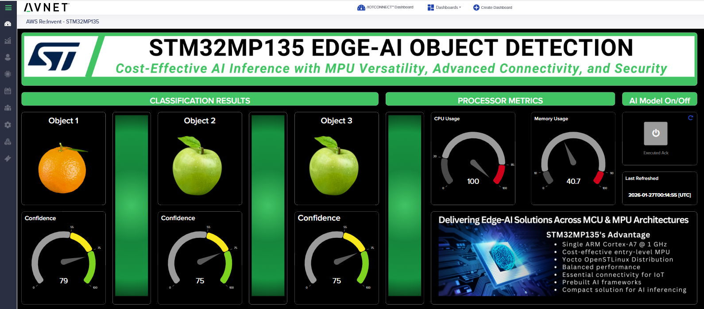

# X-LINUX-AI Vision Demo: Package Creation and Deployment

This guide will help you upgrade the basic /IOTCONNECT Starter Demo to the X-LINUX-AI Vision Demo with a single update.

> [!IMPORTANT]
> If you have not yet followed
> the [/IOTCONNECT quickstart guide for this board](https://github.com/avnet-iotconnect/iotc-python-lite-sdk-demos/blob/main/stm32mp135f-dk/README.md),
> complete that first and then return here to pick up on Step 1

## 1. Add AIMP1 Template to /IOTCONNECT

Log into your /IOTCONNECT account at [awspoc.iotconnect.io](https://awspoc.iotconnect.io) and navigate to the Device
page, and then to the Templates page. Check to see if the **AIMP1** template is present in the list.

If it is not present, download the template by
right-clicking [this link](https://raw.githubusercontent.com/avnet-iotconnect/iotc-python-lite-sdk-demos/refs/heads/main/common/templates/AIMP1-template.json)
and then clicking "save link as" to save it to your PC.

Back in the online /IOTCONNECT Templates page, click the "Create Template" button in the top-right.

In the resulting page, click "Import" and then browse to find the downloaded template file on your PC.

After making the selection, click "Save" to finalize the template import.

## 2. Clone This Git Repository to Your Host Machine

Clone a copy of this repo to your local PC. This is where you will make changes/additions to the demo files.
> [!NOTE]
> On a Linux machine this can simply be done in the terminal, but a Windows host machine will require Git Bash or WSL.

## 3. Customize Package

Inside of the cloned repo (```iotc-python-lite-sdk-demos```), navigate to the ```stm32mp135f-dk/ai-vision/src/```
directory:

```
cd ./stm32mp135f-dk/ai-vision/src
```

By default, this directory contains the necessary files to upgrade from the basic quickstart application to the AI
Vision demo.

## 4. Create Package

Navigate back to the ```ai-vision``` directory and then run this command to create ```package.tar.gz``` which includes
the necessary demo files and installation script:

```
bash ./create-package.sh
```

> [!NOTE]
> At the end of the package creation script, ```package.tar.gz``` is automatically copied into the ```common```
> directory so it can be readily accessed by the scripts used in optional steps 7B and 7C.

## 5. Physically Set Up Demo Equipment

* Using a stand, adhesive, zip-ties, or some other type of binding utility, secure your USB camera in a position to be
  looking at your designated detection area.

> [!TIP]
> To maintain a consistent and controlled background, it is recommended to position the camera above a tabletop secured
> to a boom arm (such
> as [this](https://www.amazon.com/dp/B0BV2SBWVD?ref=cm_sw_r_apan_dp_XVFHFPZQA55SFZY5S988&ref_=cm_sw_r_apan_dp_XVFHFPZQA55SFZY5S988&social_share=cm_sw_r_apan_dp_XVFHFPZQA55SFZY5S988&peakEvent=1&starsLeft=1&skipTwisterOG=1&th=1)),
> looking down at objects on the table.

> [!IMPORTANT]
> The AI Vision Demo requires a USB UVC-Compliant Camera (such
> as [this](https://www.amazon.com/ALPCAM-Distortion-Compliant-Embedded-Industrial/dp/B0B1WTV1KB/ref=sr_1_40?crid=1Y64R6N37I2DW&dib=eyJ2IjoiMSJ9.09vlNQuRgZXBCOJltq5NAHjwkF3xrkD_IO8iIPnTgmM656JhZdERupdaYL29K-WbqLGgdkCchkhjMGFCFpy7D4Ng5LfWuSsYX1jMf8HFDXXsuqE96PFQrpwZszNnYEAkgDOKVRYky4lgiGU4S8NZZEcnmANwxdgvAOnkQCDQWIYxf2Tau45lZyN0ZjY5Otk6.TwrVuCH8OFqthDivTQqbOEPSUYAmvtH5LiE27DyAm7A&dib_tag=se&keywords=usb%2Bcamera%2Buvc&qid=1732315805&sprefix=usb%2Bcamera%2Buvc%2Caps%2C148&sr=8-40&th=1)).
> Using a non-UVC camera (most modern webcams, for example) will cause the vision program to crash due to image format
> incompatibilities.

> [!NOTE]
> The detection program works best with good lighting and non-glossy objects against a non-glossy background with good
> color-contrast versus the colors of the objects being detected. Ideally the objects are between 6 and 24 inches away
> from the camera lens (depends on size of object).

* Plug your USB camera into a USB port on the STM32MP135F-DK

## 6. Prepare Device to Receive Package

For your board to receive the package through /IOTCONNECT, it must be actively connected. Do this by running the main
/IOTCONNECT program on your board called ```app.py```:

From here, you have the option to push the package to your devices directly to your device in one of the following ways:

### 7A. Deliver Package Through Local File Transfer

To deliver your package to a device through a local file transfer, the recommended method is to use an ```scp``` (secure
copy) command.

First find the active IP address of your device and then use that IP address to copy ```package.tar.gz``` into the main
application directory of the device (```/home/weston/demo```).

After the file transfer is complete, open a terminal on your device, navigate to the main application directory, and
verify that there is a ```package.tar.gz``` present.

If ```package.tar.gz``` is there, run this command to decompress the file and overwrite existing files in the directory:

```
tar -xzf package.tar.gz --overwrite
```

Navigate to your device in the "Device" page of /IOTCONNECT in your browser and locate the "Template" selection (
mid-left on the page)

Click the "pen and paper" icon next to the template name to open a dropdown where you select a new template.

Select the "AIMP1" template.

Lastly, back in your device terminal, execute the ```install.sh``` script to perform any additional file
movements/modifications that you programmed into your install package:

```
bash ./install.sh
```

### 7B. Upload and Push Package Through OTA in /IOTCONNECT Online Platform

1) In the "Device" Page of the online /IOTCONNECT platform, on the blue toolbar at the bottom of the page select "
   Firmware"
2) If a firmware has already been created for your device's template, skip to step 3. Otherwise:
    * Select the blue "Create Firmware" button in the top-right of the screen
    * Name your firmware (remember this name for later)
    * Select your device's template from the "Template" drop-down (if your device's template is not in the list, a
      firmware for it already exists in your /IOTCONNECT instance)
    * Enter hardware and software version numbers (can be arbitrary such as 0, 0)
    * Select the "Browse" button in the "File" section and select your ```package.tar.gz```
    * Add descriptions if you desire
    * Select the "Save" button
3) Navigate back to the Firmware page and find your new firmware name in the list
4) Under the "Draft" column within the "Software Upgrades" column, click on the draft number (will be "1" for
   newly-created firmwares)
5) Select the black square with the black arrow under "Actions" to publish your firmware and make it available for OTA
6) Navigate to your device back in the "Device" page and locate the "Template" selection (mid-left on the page)
7) Click the "pen and paper" icon next to the template name to open a dropdown where you select a new template.
8) Select the "AIMP1" template.
9) Back in the "Firmware" page of /IOTCONNECT, select the "OTA Updates" button in the top-right of the screen
10) For "Hardware Version" select your firmware's name with the hyphenated hardware version from the drop-down
11) Select the software version you chose for your firmware
12) For "Target" select "Devices" from the drop-down
13) Select your device's unique ID from the "Devices" drop-down
14) Click the blue "Update" button to initialize the OTA update

> [!NOTE]
> If you have obtained a solution key for your /IOTCONNECT account from Softweb Solutions, you can utilize the
> /IOTCONNECT REST API to automate the OTA deployment via 2 other methods outlined in [this guide](../../common/general-guides/REST-API-OTA.md)

## 8. View Update in Device Console

Shortly after sending the update via any method, you should see an interruption in the telemetry printout on the console
of your device informing you that an update package was received, downloaded and executed.

The program is designed to re-start itself after the update files have been automatically decompressed and the
```install.sh``` script is executed (if included). There is no need for you to do any manual reboots or file
manipulation. Your package installation is complete and the program is working again already!

## 9. Monitor Object Detection Data in /IOTCONNECT

* Approximately once per second while the demo program is active, a data packet will be sent to /IOTCONNECT containing
  this information:
    * Attribute Name: objects_detected
        * Attribute Type: string
        * Attribute Description: A string containing comma-separated label names of all objects currently detected,
          including their confidence percentages in parentheses. String is ordered from highest percentage confidence to
          lowest percentage.
    * Attribute Name: detection_data
        * Attribute Type: object
        * Attribute Description: An object that breaks down the detected object information into individual string and
          decimal values to be used in more robust dashboards.

* To view the live data, go to your device in /IOTCONNECT, verify it is connected, and click on the "Live Data" tab.

* The vision program is trained to recognize any object in [this list](object-labels.txt) but from our experimentation,
  some of the most consistently-detected and conveniently-sized objects to use are:

```
apple
orange
banana
donut
remote
scissors
cell phone
```

> [!NOTE]
> Instead of the physical objects, printing out decent-quality images of the objects onto paper (not glossy photograph
> paper) and putting those in front of the camera can result in detections of objects that typically would not be feasible
> for the demo (such as airplane, stop sign, giraffe, etc.). There have been mixed results with this, usually dependent on
> how life-like the images are.

> [!TIP]
> Adjusting the lighting, distance from the camera, background, and confidence threshold can help with more-consistent
> detection

## 10. Import Dashboard Template

A customizable /IOTCONNECT dashboard can be implemented in the online /IOTCONNECT UI to help visualize the telemetry
data
and device state in real time.



To create an AI-Vision /IOTCONNECT dashboard for your device:

1) Download the demo [Dashboard Template](./STM32MP135-objectDet-dashboard_export.json?raw=1) (**must** Right-Click,
   Save As)
2) **Download** the template then select `Create Dashboard` from the top of the page
3) **Select** the `Import Dashboard` option and click `browse` to select the template you just downloaded.
4) **Select** `AIMP1` for **template** and your device's unique ID for **device**
5) **Enter** a name (such as `STM32MP135F-DK AI Vision Demo`) and click `Save` to complete the import