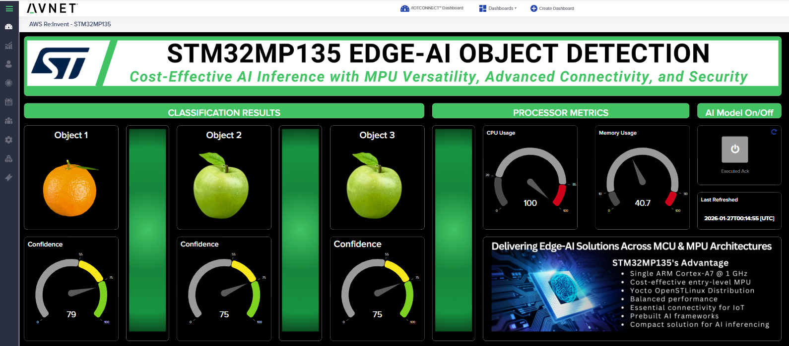

# X-LINUX-AI Vision Expansion Demo

Upgrades the /IOTCONNECT Starter Demo on the STM32MP135F-DK to the X-LINUX-AI object detection vision demo.

> [!IMPORTANT]
> Complete the [/IOTCONNECT quickstart guide for the STM32MP135F-DK](https://github.com/avnet-iotconnect/iotc-python-lite-sdk-demos/blob/main/stm32mp135f-dk/README.md) before proceeding.

## 1. Introduction

This demo runs an on-device object detection model via X-LINUX-AI and streams detection results to /IOTCONNECT approximately once per second. The demo recognizes 80 common object categories and reports detected object names with confidence percentages.

## 2. Import AIMP1 Template

The `AIMP1` template must be present in your /IOTCONNECT instance before installing.

1. Log into [awspoc.iotconnect.io](https://awspoc.iotconnect.io) and go to **Devices → Templates**.
2. If `AIMP1` is already listed, skip to step 5.
3. Right-click [this link](https://raw.githubusercontent.com/avnet-iotconnect/iotc-python-lite-sdk-demos/refs/heads/main/stm32mp135f-dk/ai-vision/AIMP1-template.json) and choose **Save link as** to download the template file.
4. Click **Create Template** (top-right), then **Import**, browse to the downloaded file, and click **Save**.
5. Navigate to your device's page, click the edit icon next to the **Template** field, select `AIMP1`, and save.

## 3. Set Up Hardware

> [!IMPORTANT]
> This demo requires a USB UVC-compliant camera (such as [this one](https://www.amazon.com/ALPCAM-Distortion-Compliant-Embedded-Industrial/dp/B0B1WTV1KB/)). Using a non-UVC camera (most modern webcams) will cause the vision program to crash due to image format incompatibilities.

- Secure your USB camera in a position looking at your designated detection area.
- Plug the USB camera into a USB port on the STM32MP135F-DK.

> [!TIP]
> Position the camera above a tabletop looking down at objects. Good lighting, a non-glossy background with good color contrast, and objects 6–24 inches from the lens give the most consistent detections.

## 4. Deploy and Run

### Download and Install

On the board, run:

```bash
cd /opt/demo
wget https://raw.githubusercontent.com/avnet-iotconnect/iotc-python-lite-sdk-demos/main/stm32mp135f-dk/ai-vision/package.tar.gz
tar -xzf package.tar.gz --overwrite
bash ./install.sh
```

### Run

```bash
python3 app.py
```

## 5. Using the Demo

Approximately once per second, a data packet is sent to /IOTCONNECT containing:

| Attribute | Type | Description |
|---|---|---|
| `objects_detected` | string | Comma-separated detected object names with confidence percentages, ordered highest to lowest |
| `detection_data` | object | Detected object information broken into individual string and decimal values for dashboard use |

To view live data, go to your device in /IOTCONNECT and click the **Live Data** tab.

The vision model recognizes any object in [this list](object-labels.txt). Some of the most consistently detected, conveniently sized objects are:

```
apple, orange, banana, donut, remote, scissors, cell phone
```

> [!NOTE]
> Printing decent-quality images of objects onto non-glossy paper and placing them in front of the camera can produce detections for objects that would otherwise be impractical (e.g., airplane, stop sign, giraffe). Results vary by image quality.

### Import Dashboard Template

A customizable /IOTCONNECT dashboard is available to visualize detection data in real time.



To import the dashboard:
1. Download the [Dashboard Template](./STM32MP135-objectDet-dashboard_export.json?raw=1) (**must** Right-Click, Save As).
2. In /IOTCONNECT, select **Create Dashboard** from the top of the page.
3. Select **Import Dashboard** and browse to the downloaded template file.
4. Select `AIMP1` for **template** and your device's unique ID for **device**.
5. Enter a name (e.g., `STM32MP135F-DK AI Vision Demo`) and click **Save**.

## 6. Customize and Rebuild (Optional)

To modify the demo files before deploying:

1. Clone the repository to your host machine:
   ```bash
   git clone https://github.com/avnet-iotconnect/iotc-python-lite-sdk-demos.git
   ```

2. Edit files in `stm32mp135f-dk/ai-vision/src/` as needed.

3. Rebuild the package:
   ```bash
   cd stm32mp135f-dk/ai-vision
   bash ./create-package.sh
   ```

4. Deliver the new package to the board:

   **Option A — Direct copy (scp):**
   ```bash
   # On host:
   scp package.tar.gz root@<board-ip>:/opt/demo/
   # On board:
   cd /opt/demo && tar -xzf package.tar.gz --overwrite && bash ./install.sh
   ```

   **Option B — OTA via /IOTCONNECT platform:**
   1. In the **Device** page, select **Firmware** on the bottom toolbar.
   2. Create a new firmware if needed: click **Create Firmware** (top-right), name it, select the `AIMP1` template, set version numbers (e.g., `0`, `0`), browse to `package.tar.gz`, and click **Save**.
   3. Back on the Firmware page, click the draft number under **Software Upgrades → Draft**.
   4. Click the publish icon (black square with arrow) under **Actions**.
   5. Select **OTA Updates** (top-right), choose your firmware's hardware and software versions, set **Target** to **Devices**, select your device, and click **Update**.

   Shortly after, the running `app.py` will receive the package, decompress it, execute `install.sh`, and restart automatically.
