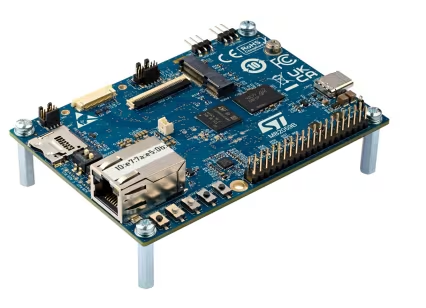
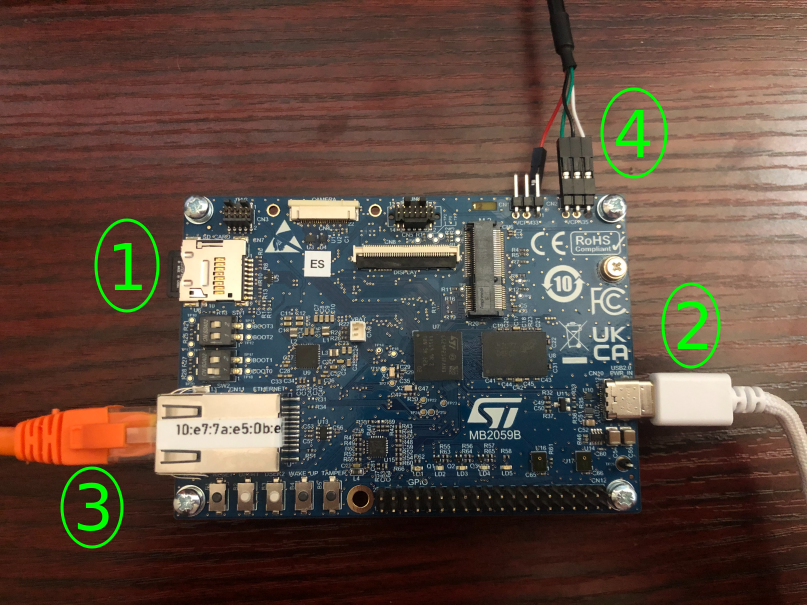

# STM32MP215F-DK QuickStart
[Purchase STM32MP215F-DK](https://www.avnet.com/americas/product/stmicroelectronics/stm32mp215f-dk/evolve-151041109/)

1. [Introduction](#1-introduction)
2. [Requirements](#2-requirements)
3. [Hardware Setup](#3-hardware-setup)
4. [/IOTCONNECT: Cloud Account Setup](#4-iotconnect-cloud-account-setup)
5. [Device Setup](#5-device-setup)
6. [Onboard Device](#6-onboard-device)
7. [Using the Demo](#7-using-the-demo)
8. [Troubleshooting](#8-troubleshooting)
9. [Resources](#9-resources)

# 1. Introduction

This guide is designed to walk through the steps to connect the STM32MP215F-DK to the Avnet /IOTCONNECT platform and
periodically send general telemetry data.

<table>
  <tr>
    <td></td>
    <td>The STM32MP215F-DK Discovery Kit is designed as a complete demonstration and development platform for the 
STMicroelectronics STM32MP215F based on the Arm® Cortex®-A35 and Cortex®-M33. The product leverages the capabilities of 
STM32MP2 series microprocessors to allow users to develop applications using STM32 MPU OpenSTLinux Distribution software 
for the main processor (Arm® Cortex®-A35) and STM32CubeMP2 software for the coprocessor (Arm® Cortex®-M33).</td>
  </tr>
</table>

# 2. Requirements

This guide has been written and tested to work on a Windows 10/11 PC. However, there is no reason this can't be
replicated in other environments.

## Hardware

* STM32MP215F-DK [Purchase](https://www.avnet.com/americas/product/stmicroelectronics/stm32mp215f-dk/evolve-151041109/) | [User Manual & Kit Contents](https://www.st.com/resource/en/user_manual/um3571-discovery-kit-with-stm32mp215f-mpu-stmicroelectronics.pdf) | [All Resources](https://www.st.com/en/evaluation-tools/stm32mp215f-dk.html#overview)
* MicroSD Card (minimum 8GB, not included in kit)
* USB-C Power Cable (not included in kit)
* Ethernet Cable (not included in kit)
* USB to TTL Serial 3.3V Adapter Cable (must be purchased separately,
  click [here](https://www.amazon.com/Serial-Adapter-Signal-Prolific-Windows/dp/B07R8BQYW1/ref=sr_1_1_sspa?dib=eyJ2IjoiMSJ9.FmD0VbTCaTkt1T0GWjF9bV9JG8X8vsO9mOXf1xuNFH8GM1jsIB9IboaQEQQBGJYV_o_nruq-GD0QXa6UOZwTpk1x_ISqW9uOD5XoQcFwm3mmgmOJG--qv3qo5MKNzVE4aKtjwEgZcZwB_d7hWTgk11_JJaqLFd1ouFBFoU8aMUWHaEGBbj5TtX4T6Z_8UMSFS4H1lh2WF5LRprjLkSLUMF656W-kCM4MGU5xLU5npMw.oUFW_sOLeWrhVW0VapPsGa03-dpdq8k5rL4asCbLmDs&dib_tag=se&keywords=detch+usb+to+ttl+serial+cable&qid=1740167263&sr=8-1-spons&sp_csd=d2lkZ2V0TmFtZT1zcF9hdGY&psc=1)
  to see the cable used by Avnet's engineer)

> [!NOTE]
> The USB to TTL Serial 3.3V Adapter Cable may require you to install a specific driver onto your host machine. The
> example cable linked above requires a [PL2303 driver](https://www.prolific.com.tw/us/showproduct.aspx?p_id=225&pcid=41).

## Software

* A serial terminal such as [TeraTerm](https://github.com/TeraTermProject/teraterm/releases)
  or [PuTTY](https://www.putty.org/)

> [!NOTE]
> Before using this board, a Yocto Linux image must be flashed to the microSD card. See
> [step 1 of Device Setup](#5-device-setup) for instructions on populating the SD card using STM32CubeProgrammer.

# 3. Hardware Setup

See the reference image below for cable connections.
<details>
<summary>Reference Image with Connections</summary>

</details>

Using the above image as reference, make the following connections:

1. Insert a microSD card (minimum 8GB, not included in kit) into the microSD card slot labeled **#1** on the board.
2. Connect a USB-C power cable (not included in kit) from your PC to the USB-C power connector on the board, labeled **#2**.
3. Connect an Ethernet cable (not included in kit) from your LAN (router/switch) to the Ethernet connector on the
   board, labeled **#3**.
4. Connect your USB to TTL Serial 3.3V Adapter Cable to the CN2 serial connector on the board, labeled **#4**.

> [!NOTE]
> The pin order on the CN2 connector is TX-GND-RX, so the corresponding connections on the cable should be RX-GND-TX.
> If you have trouble connecting to the board via the serial terminal, try swapping the TX and RX connections, as it is
> easy to get confused with the labeling.

# 4. /IOTCONNECT: Cloud Account Setup

An /IOTCONNECT account with AWS backend is required. If you need to create an account, a free trial subscription is
available.
The free subscription may be obtained directly from iotconnect.io or through the AWS Marketplace.

* Option #1 (Recommended) [/IOTCONNECT via AWS Marketplace](https://github.com/avnet-iotconnect/avnet-iotconnect.github.io/blob/main/documentation/iotconnect/subscription/iotconnect_aws_marketplace.md) - 60 day trial; AWS account creation required
* Option #2 [/IOTCONNECT via iotconnect.io](https://subscription.iotconnect.io/subscribe?cloud=aws) - 30 day trial; no credit card required

> [!NOTE]
> Be sure to check any SPAM folder for the temporary password after registering.

# 5. Device Setup

1. **Image Flashing**: Before continuing, the STM32MP215F-DK requires a Yocto Linux image to be flashed to the
   microSD card using the STM32CubeProgrammer software. Ensure you are using the latest release of STM32CubeProgrammer.
   Follow [ST's guide on populating the target and booting the image](https://wiki.st.com/stm32mpu/wiki/Getting_started/STM32MP2_boards/STM32MP215x-DK/Let%27s_start/Populate_the_target_and_boot_the_image)
   before continuing with the steps below.

2. Open a serial terminal emulator program such as TeraTerm.
3. Ensure that your serial settings in your terminal emulator are set to:

- Baud Rate: 115200
- Data Bits: 8
- Stop Bits: 1
- Parity: None

4. Noting the COM port value for "STMicroelectronics STLink Virtual COM Port" in the Device Manager list, attempt to
   connect to your board via the terminal emulator

> [!NOTE]
> A successful connection may result in just a blank terminal box. If you see a blank terminal box, press the ENTER key
> to get a login prompt. An unsuccessful connection attempt will usually result in an error window popping up.

5. If prompted for a login, type `root` followed by the ENTER key.
6. Run these commands to update the core board packages and install necessary /IOTCONNECT packages:

```
su
```

```
apt-get update
```

```
apt-get install python3-pip -y
```

```
python3 -m pip install iotconnect-sdk-lite requests
```

7. Run this command to create and move into a directory for your demo files:

```
mkdir -p /opt/demo && cd /opt/demo
```

> [!TIP]
> To gain access to "copy" and "paste" functions inside of a PuTTY terminal window, you can CTRL+RIGHTCLICK within the
> window to utilize a dropdown menu with these commands. This is very helpful for copying/pasting between your browser and
> the terminal.

# 6. Onboard Device

The next step is to onboard your device into /IOTCONNECT. This will be done via the online /IOTCONNECT user interface.

Follow [this guide](../common/general-guides/UI-ONBOARD.md) to walk you through the process.

> [!TIP]
> If you have obtained a solution key for your /IOTCONNECT account from Softweb Solutions, you can utilize the /IOTCONNECT
> REST API to automate the device onboarding process via shell scripts. For the STM32MP215F-DK, you will first need to run
> `apt-get install python3-cffi -y` and then you can check out [this guide](../common/general-guides/REST-API-ONBOARD.md)
> for more info on the rest of that process.

# 7. Using the Demo

Run the basic demo with this command:

```
python3 app.py
```

> [!NOTE]
> Always make sure you are in the ```/opt/demo``` directory before running the demo. You can move to this
> directory with the command: ```cd /opt/demo```

View the random-integer telemetry data under the "Live Data" tab for your device on /IOTCONNECT.

# 8. Troubleshooting

To return the board to an out-of-box state, you can re-flash a fresh Yocto image to the SD card. For instructions on
this process, refer to [ST's guide on populating the target and booting the image](https://wiki.st.com/stm32mpu/wiki/Getting_started/STM32MP2_boards/STM32MP215x-DK/Let%27s_start/Populate_the_target_and_boot_the_image).

# 9. Resources
* [Purchase the STM32MP215F-DK](https://www.avnet.com/americas/product/stmicroelectronics/stm32mp215f-dk/evolve-151041109/)
* [More /IOTCONNECT ST Guides](https://avnet-iotconnect.github.io/partners/st/)
* [/IOTCONNECT Overview](https://www.iotconnect.io/)
* [/IOTCONNECT Knowledgebase](https://help.iotconnect.io/)
