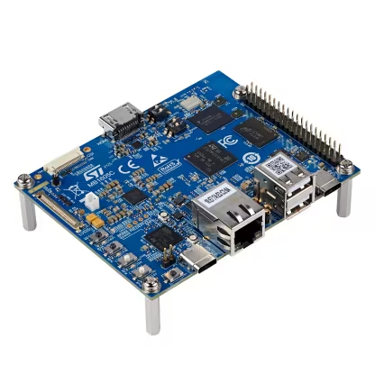

# STM32MP257F-DK Quickstart

1. [Introduction](#1-introduction)
2. [Requirements](#2-requirements)
3. [Hardware Setup](#3-hardware-setup)
4. [/IOTCONNECT: Cloud Account Setup](#4-iotconnect-cloud-account-setup)
5. [Device Setup](#5-device-setup)
6. [Using the Demo](#6-using-the-demo)
7. [Troubleshooting](#7-troubleshooting)
8. [Resources](#8-resources)

# 1. Introduction
This guide is designed to walk through the steps to connect the STM32MP257F-DK to the Avnet /IOTCONNECT platform and periodically send general telemetry data.

<table>
  <tr>
    <td></td>
    <td>The STM32MP257F-DK Discovery kit is designed as a complete demonstration and development platform for the STMicroelectronics STM32MP257FAK3 based on the Arm® Cortex® A35 and M33. The product leverages the capabilities of STM32MP2 series microprocessors to allow users to develop applications using STM32 MPU OpenSTLinux Distribution software for the main processor (Arm® dual core Cortex®‑A35) and STM32CubeMP2 software for the coprocessor (Arm® Cortex®‑M33).</td>
  </tr>
</table>

# 2. Requirements
This guide has been written and tested to work on a Windows 10/11 PC. However, there is no reason this can't be replicated in other environments.

## Hardware 
* STM32MP257F-DK [Purchase](https://www.avnet.com/americas/product/stmicroelectronics/stm32mp257f-dk/EVOLVE-115914011/) | [User Manual & Kit Contents](https://www.st.com/resource/en/user_manual/um3385-discovery-kit-with-stm32mp257f-mpu-stmicroelectronics.pdf) | [All Resources](https://www.st.com/en/evaluation-tools/stm32mp257f-dk.html)
* 1 USB Type-C Cable
* Ethernet Cable **or** WiFi Network SSID and Password

## Software
* A serial terminal such as [TeraTerm](https://github.com/TeraTermProject/teraterm/releases) or [PuTTY](https://www.putty.org/)

# 3. Hardware Setup
See the reference image below for cable connections.
<details>
<summary>Reference Image with Connections</summary>

</details>

Using the above image as reference, make the following connections:
1. (OPTIONAL) Connect an Ethernet cable from your LAN (router/switch) to the Ethernet connector labeled **#1**. If you instead wish to use Wi-Fi, after booting your board refer to the [WIFI](WIFI.md) guide.
2. Connect the USB-C cable from a your host machine to the "USB_PWR STLINK" USB-C connector on the board, labeled **#2**.
3. Install the included micro-SD card into the micro-SD slot labeled **#3** on the underside of the board (make sure it clicks into place).

# 4. /IOTCONNECT: Cloud Account Setup
An /IOTCONNECT account with AWS backend is required.  If you need to create an account, a free trial subscription is available.
The free subscription may be obtained directly from iotconnect.io or through the AWS Marketplace.


* Option #1 (Recommended) [/IOTCONNECT via AWS Marketplace](https://github.com/avnet-iotconnect/avnet-iotconnect.github.io/blob/main/documentation/iotconnect/subscription/iotconnect_aws_marketplace.md) - 60 day trial; AWS account creation required
* Option #2 [/IOTCONNECT via iotconnect.io](https://subscription.iotconnect.io/subscribe?cloud=aws) - 30 day trial; no credit card required


> [!NOTE]
> Be sure to check any SPAM folder for the temporary password after registering.


# 5. Device Setup
1. Open a serial terminal emulator program such as TeraTerm.
2. Ensure that your serial settings in your terminal emulator are set to:
  - Baud Rate: 115200
  - Data Bits: 8
  - Stop Bits: 1
  - Parity: None
3. Noting the COM port value for "STMicroelectronics STLink Virtual COM Port" in the Device Manager list, attempt to connect to your board via the terminal emulator
>[!NOTE]
>A successful connection may result in just a blank terminal box. If you see a blank terminal box, press the ENTER key to get a login prompt. An unsuccessful connection attempt will usually result in an error window popping up.
4. If prompted for a login, type `root` followed by the ENTER key.
5. Run these commands to update the core board packages and install necessary IoTConnect packages:
   ```
   sudo apt-get update
   ```
   ```
   sudo apt-get install python3-pip -y
   ```
   ```
   python3 -m pip install iotconnect-sdk-lite
   ```
   ```
   python3 -m pip install iotconnect-rest-api
   ```
6. Run these commands to create and move into a directory for your demo files:
   ```
   mkdir /home/weston/demo
   ```
   ```
   cd /home/weston/demo
   ```
>[!TIP]
>To gain access to "copy" and "paste" functions inside of a Putty terminal window, you can CTRL+RIGHTCLICK within the window to utilize a dropdown menu with these commands. This is very helpful for copying/pasting between your borswer and the terminal.

7. Run this command to first protect your IoTConnect credentials:
   ```
   export HISTCONTROL=ignoreboth
   ```
   Then run this IoTConnect REST API CLI command (with your credentials substituted in) to log into your IoTConnect account on the device:
   ```
   iotconnect-cli configure -u my@email.com -p "MyPassword" --pf mypf --env myenv --skey=mysolutionkey
   ```
   For example if these were your credentials:
   * Email: `john.doe@gmail.com`
   * Password: Abc123!
   * Platform: aws
   * Environment: technology
   * Solution Key: AbCdEfGhIjKlMnOpQrStUvWxYz1234567890
     
   Your login command would be:
   ```
   iotconnect-cli configure -u john.doe@gmail.com -p "Abc123!" --pf aws --env technology --skey=AbCdEfGhIjKlMnOpQrStUvWxYz1234567890
   ```
   You will see this output in the console if your login succeeded:
   ```
   Logged in successfully.
   ```

8. Run this command to download and run the device setup script:
   ```
   curl -sOJ 'https://raw.githubusercontent.com/avnet-iotconnect/iotc-python-lite-sdk-demos/refs/heads/main/common/scripts/device-setup.py' && python3 device-setup.py
   ```

# 6. Using the Demo
1. Run the basic demo with this command:
```
python3 app.py
```
>[!NOTE]
>Always make sure you are in the ```/home/weston/demo``` directory before running the demo. You can move to this directory with the command: ```cd /home/weston/demo```

2. View the random-integer telemetry data under the "Live Data" tab for your device on /IOTCONNECT.

# 7. Troubleshooting

To return the board to an out-of-box state, you can flash a fresh image onto the SD card. For instructions on this process, refer to the "Populate the target and boot the image" [page on the STM32MP257x-DK section of ST's wiki](https://wiki.st.com/stm32mpu/wiki/Getting_started/STM32MP2_boards/STM32MP257x-DK/Let%27s_start/Populate_the_target_and_boot_the_image).


# 8. Resources
* [Purchase the STM32MP257F-DK](https://www.avnet.com/americas/product/stmicroelectronics/stm32mp257f-dk/EVOLVE-115914011/)
* [More /IOTCONNECT ST Guides](https://avnet-iotconnect.github.io/partners/st/)
* [/IOTCONNECT Overview](https://www.iotconnect.io/)
* [/IOTCONNECT Knowledgebase](https://help.iotconnect.io/)
