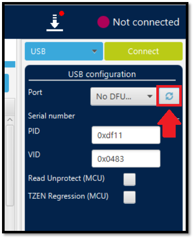
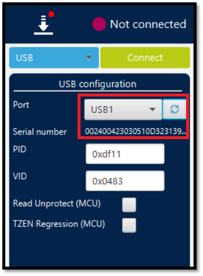
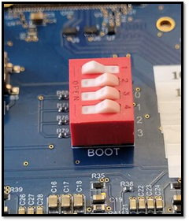

# Flashing a Fresh Yocto Image to the STM32MP257F-EV1

# Introduction

This simple guide will help you download all the necessary files for flashing a fresh stock image to a STM32MP257F-EV1,
and then flash the image to the board.

# Guide

* Download the zipped image folder containing the latest STM32MP2 image from
  the [STM32MP2 OpenSTLinux Starter Package page](https://www.st.com/en/embedded-software/stm32mp2starter.html).

> [!NOTE]
> You may have to create an ST account (it's free) to get access to software downloads.

* Unzip the folder to a known location.
* Download and Install the [STM32CubeProgrammer](https://www.st.com/en/development-tools/stm32cubeprog.html) software (
  the utility for flashing the image to the device).
* Set up the STM32MP257F-EV1 board for flashing:
    * Set all 4 of the the dip-switches to "OPEN" for flashing

       

    * Power the board from your host PC with a USB-C cable connected to the "USB_PWR STLINK" USB-C port.

       

    * Serially connect your board to your host PC with a USB-C cable connected to the "USB_DRD" USB-C port.

       

    * Insert a micro-SD (at least 8GB) card into the micro-SD card slot on the board.

       

    * Push the "RESET" button on your board to ensure it boots into flashing mode.

* Run the STM32CubeProgrammer software and click on the "Open file" tab.

* Navigate to the directory where you have the unzipped image folder, and then navigate through the folder to get to
  this directory: {Your preliminary directory}\{downloaded image name}\images\stm32mp2\flashlayout_st-image-weston\optee
    * Select the FlashLayout_sdcard_stm32mp257f-ev1-optee.tsv file and then click "Open."

* Next, click on the "Browse" button to select the binaries path.

* Navigate once again to the directory where you have the unzipped image folder, and then navigate through the folder to
  get to this directory: {Your preliminary directory}\{downloaded image name}\images\stm32mp2
    * Select the stm32mp2 folder and then click "Select folder."

* Back in the STM32CubeProgrammer window, on the right-hand side of the screen, if the "Port" is listed as "No DFU...,"
  make sure your USB cable is connected both to your PC and the board, and then click the revolving arrows icon.

* When the device is recognized by the software, the port listing will be "USB" followed by a number, such as 1. The
  serial number of your board should also be listed beneath the port name.

* You are ready to flash. Click the "Download" button to begin the flashing process.

> [!NOTE]
> Given the size of the image it will usually take several minutes to flash.

* When the flash has completed successfully, this pop-up in the STM32CubeProgrammer window will appear.

* Flip dipswitch 1 to the "closed" position while leaving the other dipswitches in the "OPEN" position. Push the reset
  button to properly boot the new image from the SD card.

> [!NOTE]
> For the first boot after flashing, the board may take a few minutes to turn on.
