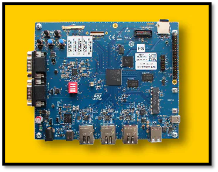

# STM32MP257F-EV1 QuickStart
[Purchase STM32MP257F-EV1](https://www.newark.com/stmicroelectronics/stm32mp257f-ev1/eval-brd-arm-cortex-a35-m33-m0/dp/13AM6530)
> [!TIP]
> To set up and connect this device using the **AWS Greengrass Lite SDK**, refer to this [QuickStart Guide](https://github.com/avnet-iotconnect/iotc-python-greengrass-demos/blob/main/stm32mp257f-ev1/)

1. [Introduction](#1-introduction)
2. [Requirements](#2-requirements)
3. [Hardware Setup](#3-hardware-setup)
4. [/IOTCONNECT: Cloud Account Setup](#4-iotconnect-cloud-account-setup)
5. [Device Setup](#5-device-setup)
6. [Onboard Device](#6-onboard-device)
7. [Using the Demo](#7-using-the-demo)
8. [Troubleshooting](#8-troubleshooting)
9. [Resources](#9-resources)

# 1. Introduction

This guide is designed to walk through the steps to connect the STM32MP257F-EV1 to the Avnet /IOTCONNECT platform and
periodically send general telemetry data.

<table>
  <tr>
    <td></td>
    <td>The STM32MP257F-EV1 Evaluation board is designed as a complete demonstration and development platform for the STMicroelectronics STM32MP257FAI3 based on the Arm® Cortex® A35 and M33. The product leverages the capabilities of STM32MP2 series microprocessors to allow users to develop applications using STM32 MPU OpenSTLinux distribution software for the main processor (Arm® dual core Cortex®‑A35) and STM32CubeMP2 software for the coprocessor (Arm® Cortex®‑M33). The product includes an ST-LINK embedded debug tool, LEDs, push-buttons, three 1 Gbit/s Ethernet, two CAN FD, one USB Type-C® DRD connector, two USB Host Type-A connectors, one mini PCIE connector, one LCD LVDS display connector, one LCD DSI connector, one camera connector, microSD™ card, eMMC, and NOR flash memory. To expand the functionality of the STM32MP257F-EV1 Evaluation board, one GPIO expansion connector is also available for Raspberry Pi® shields, and one mikroBUS™ expansion connector.</td>
  </tr>
</table>

# 2. Requirements

This guide has been written and tested to work on a Windows 10/11 PC. However, there is no reason this can't be
replicated in other environments.

## Hardware

* STM32MP257F-EV1 [Purchase](https://www.newark.com/stmicroelectronics/stm32mp257f-ev1/eval-brd-arm-cortex-a35-m33-m0/dp/13AM6530) | [User Manual & Kit Contents](https://www.st.com/resource/en/user_manual/um3359-evaluation-board-with-stm32mp257f-mpu-stmicroelectronics.pdf) | [All Resources](https://www.st.com/en/evaluation-tools/stm32mp257f-ev1.html)
* 1 USB Type-C Cable
* Ethernet Cable **or** Wi-Fi Network SSID and Password

## Software

* A serial terminal such as [TeraTerm](https://github.com/TeraTermProject/teraterm/releases)
  or [PuTTY](https://www.putty.org/)

> [!NOTE]
> STM32MP257F-EV1 must be running a Scarthgap (the newest) image release for the X-LINUX-AI expansion demo.
> Follow [this flashing guide](FLASHING.md) to download and flash the most up-to-date image to your board.

# 3. Hardware Setup

See the reference image below for cable connections.
<details>
<summary>Reference Image with Connections</summary>

</details>

Using the above image as reference, make the following connections:

1. (OPTIONAL) Connect an Ethernet cable from your LAN (router/switch) to the Ethernet connector labeled **#1**. If you
   instead wish to use Wi-Fi, after booting your board refer to the [WIFI](WIFI.md) guide.
2. Connect the USB-C cable from a your host machine to the "USB_PWR STLINK" USB-C connector on the board, labeled **#2
   **.

# 4. /IOTCONNECT: Cloud Account Setup

An /IOTCONNECT account with AWS backend is required. If you need to create an account, a free trial subscription is
available.
The free subscription may be obtained directly from iotconnect.io or through the AWS Marketplace.

* Option #1 (
  Recommended) [/IOTCONNECT via AWS Marketplace](https://github.com/avnet-iotconnect/avnet-iotconnect.github.io/blob/main/documentation/iotconnect/subscription/iotconnect_aws_marketplace.md) -
  60 day trial; AWS account creation required
* Option #2 [/IOTCONNECT via iotconnect.io](https://subscription.iotconnect.io/subscribe?cloud=aws) - 30 day trial; no
  credit card required

> [!NOTE]
> Be sure to check any SPAM folder for the temporary password after registering.

# 5. Device Setup

1. Open a serial terminal emulator program such as TeraTerm.
2. Ensure that your serial settings in your terminal emulator are set to:

- Baud Rate: 115200
- Data Bits: 8
- Stop Bits: 1
- Parity: None

3. Noting the COM port value for "STMicroelectronics STLink Virtual COM Port" in the Device Manager list, attempt to
   connect to your board via the terminal emulator

> [!NOTE]
> A successful connection may result in just a blank terminal box. If you see a blank terminal box, press the ENTER key
> to get a login prompt. An unsuccessful connection attempt will usually result in an error window popping up.

4. If prompted for a login, type `root` followed by the ENTER key.
5. Run these commands to update the core board packages and install necessary /IOTCONNECT packages:

```
su
```

```
apt-get update
```

```
apt-get install python3-pip -y
```

```
python3 -m pip install iotconnect-sdk-lite requests
```

6. Run this command to create and move into a directory for your demo files:

```
mkdir -p /home/weston/demo && cd /home/weston/demo
```

> [!TIP]
> To gain access to "copy" and "paste" functions inside of a PuTTY terminal window, you can CTRL+RIGHTCLICK within the
> window to utilize a dropdown menu with these commands. This is very helpful for copying/pasting between your browser and
> the terminal.

# 6. Onboard Device

The next step is to onboard your device into /IOTCONNECT. This will be done via the online /IOTCONNECT user interface.

Follow [this guide](../common/general-guides/UI-ONBOARD.md) to walk you through the process.

> [!TIP]
> If you have obtained a solution key for your /IOTCONNECT account from Softweb Solutions, you can utilize the /IOTCONNECT 
> REST API to automate the device onboarding process via shell scripts. For the STM32MP257F-EV1, you will first need to run
> `apt-get install python3-cffi -y` and then you can check out [this guide](../common/general-guides/REST-API-ONBOARD.md) 
> for more info on the rest of that process.

# 7. Using the Demo

Run the basic demo with this command:

```
python3 app.py
```

> [!NOTE]
> Always make sure you are in the ```/home/weston/demo``` directory before running the demo. You can move to this
> directory with the command: ```cd /home/weston/demo```

View the random-integer telemetry data under the "Live Data" tab for your device on /IOTCONNECT.

# 8. Troubleshooting

To return the board to an out-of-box state, refer to the [FLASHING.md](FLASHING.md) guide.

# 9. Resources
* Explore connecting the STM32MP257F-EV1 through the AWS Greengrass Lite SDK [QuickStart](https://github.com/avnet-iotconnect/iotc-python-greengrass-demos/blob/main/stm32mp257f-ev1/)
* [Purchase the STM32MP257F-EV1](https://www.newark.com/stmicroelectronics/stm32mp257f-ev1/eval-brd-arm-cortex-a35-m33-m0/dp/13AM6530)
* [More /IOTCONNECT ST Guides](https://avnet-iotconnect.github.io/partners/st/)
* [/IOTCONNECT Overview](https://www.iotconnect.io/)
* [/IOTCONNECT Knowledgebase](https://help.iotconnect.io/)
