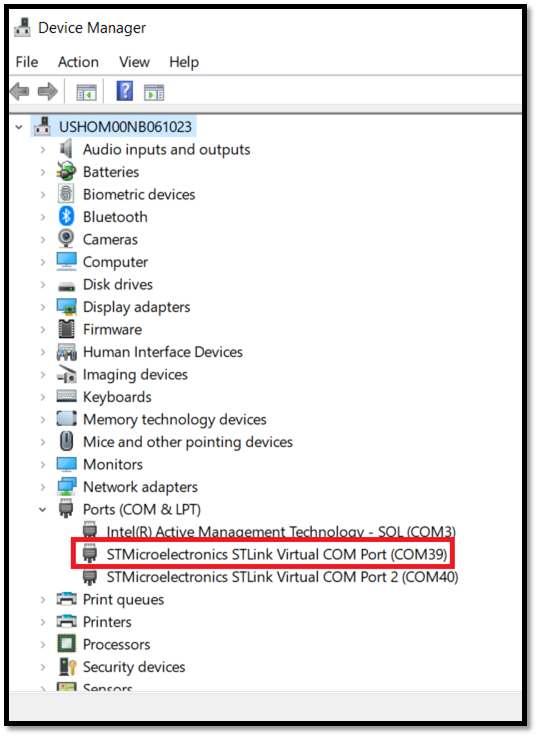

# STM32MP257F-EV1 Quickstart

1. [Introduction](#1-introduction)
2. [Requirements](#2-requirements)
3. [Hardware Setup](#3-hardware-setup)
4. [/IOTCONNECT: Cloud Account Setup](#4-iotconnect-cloud-account-setup)
5. [Device Setup](#5-device-setup)
6. [Using the Demo](#6-using-the-demo)
7. [Troubleshooting](#7-troubleshooting)
8. [Resources](#8-resources)

 

# 1. Introduction
This guide is designed to walk through the steps to connect the STM32MP257F-EV1 to the Avnet /IOTCONNECT platform and periodically send general telemetry data.

<table>
  <tr>
    <td></td>
    <td>The STM32MP257F-EV1 Evaluation board is designed as a complete demonstration and development platform for the STMicroelectronics STM32MP257FAI3 based on the Arm® Cortex® A35 and M33.he product leverages the capabilities of STM32MP2 series microprocessors to allow users to develop applications using STM32 MPU OpenSTLinux distribution software for the main processor (Arm®dual core Cortex®‑A35) and STM32CubeMP2 software for the coprocessor (Arm® Cortex®‑M33). The product includes an ST-LINK embedded debug tool, LEDs, push-buttons, three 1 Gbit/s Ethernet, two CAN FD, one USB Type-C® DRD connector, two USB Host Type-A connectors, one mini PCIE connector, one LCD LVDS display connector, one LCD DSI connector, one camera connector, microSD™ card, eMMC, and NOR flash memory. To expand the functionality of the STM32MP257F-EV1 Evaluation board, one GPIO expansion connector is also available for Raspberry Pi® shields, and one mikroBUS™ expansion connector.</td>
  </tr>
</table>

# 2. Requirements
This guide has been written and tested to work on a Windows 10/11 PC. However, there is no reason this can't be replicated in other environments.

## Hardware 
* STM32MP257F-EV1 [Purchase](https://www.avnet.com/americas/product/stmicroelectronics/stm32mp257f-ev1/EVOLVE-115913010?srsltid=AfmBOooi8P39Xi7OPSW1CMYH3uWdvLvtFk_jceqzKMmL64x2kRm2Roxa&srsltid=AfmBOooi8P39Xi7OPSW1CMYH3uWdvLvtFk_jceqzKMmL64x2kRm2Roxa) | [User Manual & Kit Contents](https://www.st.com/resource/en/user_manual/um3359-evaluation-board-with-stm32mp257f-mpu-stmicroelectronics.pdf) | [All Resources](https://www.st.com/en/evaluation-tools/stm32mp257f-ev1.html)
* 1 USB Type-C Cable
* Ethernet Cable **or** WiFi Network SSID and Password

## Software
* A serial terminal such as [TeraTerm](https://github.com/TeraTermProject/teraterm/releases) or [PuTTY](https://www.putty.org/)

# 3. Hardware Setup
See the reference image below for cable connections.
<details>
<summary>Reference Image with Connections</summary>

</details>

Using the above image as reference, make the following connections:
1. (OPTIONAL) Connect an Ethernet cable from your LAN (router/switch) to the Ethernet connector labeled **#1**. If you instead wish to use Wi-Fi, after booting your board refer to the [WIFI](WIFI.md) guide.
2. Connect the USB-C cable from a your host machine to the "USB_PWR STLINK" USB-C connector on the board, labeled **#2**.

# 4. /IOTCONNECT: Cloud Account Setup
An /IOTCONNECT account with AWS backend is required.  If you need to create an account, a free trial subscription is available.
The free subscription may be obtained directly from iotconnect.io or through the AWS Marketplace.


* Option #1 (Recommended) [/IOTCONNECT via AWS Marketplace](https://github.com/avnet-iotconnect/avnet-iotconnect.github.io/blob/main/documentation/iotconnect/subscription/iotconnect_aws_marketplace.md) - 60 day trial; AWS account creation required
* Option #2 [/IOTCONNECT via iotconnect.io](https://subscription.iotconnect.io/subscribe?cloud=aws) - 30 day trial; no credit card required


> [!NOTE]
> Be sure to check any SPAM folder for the temporary password after registering.


## Step 1: Serially Connect to the STM32MP257F-EV1

* Using a USB-A to micro-USC cable, connect your board to your PC at the USB_PWR/ST-LINK connector.

     

>[!NOTE]
>This USB connection also serves as a power source for the board.

* Check and note which COM port the board is utilizing
  * On Windows computers this can be seen by using the Device Manager
 
     

* Connect to the STM32MP257F-EV1 in a terminal emulator using these serial settings (your COM port number may be different):

     
     
>[!NOTE]
>After connecting to the board over serial, you may need to press ENTER in the terminal window to get the actual terminal prompt text.

## Step 2: Set Up and Run the Python Lite SDK Demo
* Connect the board to the internet using an ethernet connection on the ETH2 port

   

* Execute ```sudo apt-get update``` to check for and install updates for the system

* For the rest of the demo setup and execution processes, follow the instructions in the [Python Lite SDK Quickstart Guide](https://github.com/avnet-iotconnect/iotc-python-lite-sdk/blob/main/QUICKSTART.md)

      
