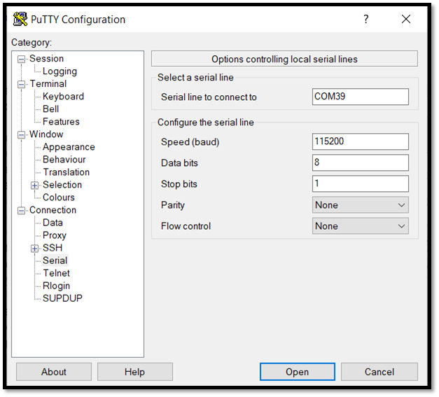

# STM32MP257F-EV1 Board Setup

 

## Step 1: Serially Connect to the STM32MP257F-EV1

* Using a USB-A to micro-USC cable, connect your board to your PC at the USB_PWR/ST-LINK connector.

     

>[!NOTE]
>This USB connection also serves as a power source for the board.

* Check and note which COM port the board is utilizing
  * On Windows computers this can be seen by using the Device Manager
 
     

* Connect to the STM32MP257F-EV1 in a terminal emulator using these serial settings (your COM port number may be different):

     
     
>[!NOTE]
>After connecting to the board over serial Termina, you may need to press ENTER in the terminal window to get the actual terminal prompt text.

## Step 2: Set Up and Run the Python Lite SDK Demo
* Connect the board to the internet using an ethernet connection on the ETH2 port

   

* Execute ```sudo apt-get update``` to check for and install updates for the system

* For the rest of the demo setup and execution processes, follow the instructions in the [Python Lite SDK Quickstart Guide](https://github.com/avnet-iotconnect/iotc-python-lite-sdk/blob/main/QUICKSTART.md)

      
