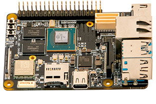

# TRIA Maaxboard 8M QuickStart

1. [Introduction](#1-introduction)
2. [Requirements](#2-requirements)
3. [Hardware Setup](#3-hardware-setup)
4. [/IOTCONNECT: Cloud Account Setup](#4-iotconnect-cloud-account-setup)
5. [Device Setup](#5-device-setup)
6. [Onboard Device](#6-onboard-device)
7. [Using the Demo](#7-using-the-demo)
8. [Resources](#8-resources)

# 1. Introduction

This guide is designed to walk through the steps to connect the TRIA Maaxboard 8ULP to the Avnet /IOTCONNECT platform
and demonstrate the standard IoT function of telemetry collection.

<table>
  <tr>
    <td></td>
    <td>The MaaXBoard is a low-cost, NXP i.MX 8M processor-based, single board computer ideal for embedded computing and smart edge IoT applications. The i.MX 8M family of application processors are based on the Arm® Cortex®-A53 and Cortex-M4 cores which provide industry-leading audio, voice, and video processing for applications that scale from consumer home audio to industrial building automation and embedded computers.</td>
  </tr>
</table>

# 2. Requirements

## Hardware

* TRIA MaaXBoard 8M [Purchase](https://www.avnet.com/americas/product/avnet-engineering-services/aes-mc-sbc-imx8m-g/evolve-47976882/) | [User Manual](https://www.avnet.com/wcm/connect/3cb1a777-3aa8-4394-9ba8-135d9ffa1470/MaaXBoard-Linux-Yocto-UserManual-V2.1.pdf?MOD=AJPERES&CACHEID=ROOTWORKSPACE-3cb1a777-3aa8-4394-9ba8-135d9ffa1470-oPqIZjK) | [All Resources](https://www.avnet.com/americas/products/avnet-boards/avnet-board-families/maaxboard/maaxboard/?srsltid=AfmBOopeNzX_SULx91T_mZ4G3i89BZBufmM_6u_ZXKRWNVNT9a6Bm2Px?srsltid=AfmBOopeNzX_SULx91T_mZ4G3i89BZBufmM_6u_ZXKRWNVNT9a6Bm2Px)
* 1x USB Type-C Cable
* 1x USB to TTL Serial 3.3V Adapter Cable (must be purchased separately, this
  is [the cable used by Avnet's engineer](https://www.amazon.com/Serial-Adapter-Signal-Prolific-Windows/dp/B07R8BQYW1/ref=sr_1_1_sspa?dib=eyJ2IjoiMSJ9.FmD0VbTCaTkt1T0GWjF9bV9JG8X8vsO9mOXf1xuNFH8GM1jsIB9IboaQEQQBGJYV_o_nruq-GD0QXa6UOZwTpk1x_ISqW9uOD5XoQcFwm3mmgmOJG--qv3qo5MKNzVE4aKtjwEgZcZwB_d7hWTgk11_JJaqLFd1ouFBFoU8aMUWHaEGBbj5TtX4T6Z_8UMSFS4H1lh2WF5LRprjLkSLUMF656W-kCM4MGU5xLU5npMw.oUFW_sOLeWrhVW0VapPsGa03-dpdq8k5rL4asCbLmDs&dib_tag=se&keywords=detch+usb+to+ttl+serial+cable&qid=1740167263&sr=8-1-spons&sp_csd=d2lkZ2V0TmFtZT1zcF9hdGY&psc=1))

> [!NOTE]
> The USB to TTL Serial 3.3V Adapter Cable may require you to install a specific driver onto your host machine. The
> example cable linked above requires a [PL2303 driver](https://www.prolific.com.tw/us/showproduct.aspx?p_id=225&pcid=41).

* Ethernet Cable **or** WiFi Network SSID and Password
* Micro-SD card (at least 8GB) and hardware to connect the Micro-SD card to your PC for image flashing

## Software

* A serial terminal such as [TeraTerm](https://github.com/TeraTermProject/teraterm/releases)
  or [PuTTY](https://www.putty.org/)

* Flash Yocto Image to SD Card:
    1. [Click here](https://downloads.iotconnect.io/partners/nxp/disk-images/maaxboard/avnet-image-full-maaxboard-20231215021741.rootfs.zip)
       to download a zipped Yocto image file for the MaaXBoard
    3. Extract the zipped image file to get access to the actual ```.wic``` image file
    4. Use an SD-card flashing software such as [Balena Etcher](https://etcher.balena.io/) to flash the ```.wic``` file
       onto the micro-SD card
    5. After the flash is complete, insert the micro-SD card into the micro-SD card slot on the MaaXBoard until it
       clicks into place
    6. Power on (or reboot) the MaaXBoard with a USB-C cable and it will boot from the micro-SD card

# 3. Hardware Setup

See the reference image below for cable connections.
<details>
<summary>Reference Image with Connections</summary>

</details>

1. (OPTIONAL) Connect an ethernet cable from your LAN (router/switch) to the ethernet port on the board.
2. Connect a USB-C cable from a 5V power source (such as your PC) to the USB-C port on your board.
3. Connect your USB to TTL Serial 3.3V Adapter Cable to the appropriate pins (see image below) on the J10 40-pin GPIO
   header.


> [!IMPORTANT]
> When connecting the wires of your USB to TTL Serial 3.3V Adapter Cable, the "TXD" pin of the board should connect to
> the "RXD" wire of your cable. Similarly, the "RXD" pin of the board should connect to the "TXD" wire of your cable. 
> "GND" connects to "GND".

# 4. /IOTCONNECT: Cloud Account Setup

An /IOTCONNECT account with AWS backend is required. If you need to create an account, a free trial subscription is
available.

[/IOTCONNECT Free Trial (AWS Version)](https://subscription.iotconnect.io/subscribe?cloud=aws)

> [!NOTE]
> Be sure to check any SPAM folder for the temporary password after registering.

See the
/IOTCONNECT [Subscription Information](https://github.com/avnet-iotconnect/avnet-iotconnect.github.io/blob/main/documentation/iotconnect/subscription/subscription.md)
for more details on the trial.

# 5. Device Setup

1. With the board powered on and connected to your host machine, open your Device Manager list and note the COM port
   being utilized by your adapter cable.

> [!TIP]
> If you do not see your cable in the COM port list, check for it in the "Other devices" section. You may need to
> install/select the driver for the cable to get it to be recognized as a COM port connection.

2. Open a terminal emulator program such as TeraTerm or PuTTY on your host machine.
3. Ensure that your serial settings in your terminal emulator are set to:

- Baud Rate: 115200
- Data Bits: 8
- Stop Bits: 1
- Parity: None

4. Use that COM port from sub-step 1 to connect to your board via the terminal emulator.

> [!NOTE]
> A successful connection may result in just a blank terminal box. If you see a blank terminal box, press the ENTER key
> to get a login prompt. An unsuccessful connection attempt will usually result in an error window popping up.

5. When prompted for a login, type `root` for the username. You should not be prompted for a password as long as you use
   the provided image.
6. Run these commands to update the core board packages and install necessary /IOTCONNECT packages:

```
sudo apt-get update
```

```
python3 -m pip install iotconnect-sdk-lite requests
```

7. Run this command to create and move into a directory for your demo files:

```
mkdir -p /home/weston/demo && cd /home/weston/demo
```

> [!TIP]
> To gain access to "copy" and "paste" functions inside of a PuTTY terminal window, you can CTRL+RIGHTCLICK within the
> window to utilize a dropdown menu with these commands. This is very helpful for copying/pasting between your browser and
> the terminal.

# 6. Onboard Device

The next step is to onboard your device into /IOTCONNECT. This will be done via the online /IOTCONNECT user interface.

Follow [this guide](../common/general-guides/UI-ONBOARD.md) to walk you through the process.

> [!TIP]
> If you have obtained a solution key for your /IOTCONNECT account from Softweb Solutions, you can utilize the /IOTCONNECT 
> REST API to automate the device onboarding process via shell scripts. Check out [this guide](../common/general-guides/REST-API-ONBOARD.md) 
> for more info on that.

# 7. Using the Demo

Run the basic demo with this command:

```
python3 app.py
```

> [!NOTE]
> Always make sure you are in the ```/home/weston/demo``` directory before running the demo. You can move to this
> directory with the command: ```cd /home/weston/demo```

View the random-integer telemetry data under the "Live Data" tab for your device on /IOTCONNECT.

# 8. Resources
* [Purchase the TRIA Maaxboard 8M](https://www.avnet.com/americas/product/avnet-engineering-services/aes-mc-sbc-imx8m-g/evolve-47976882/)
* [/IOTCONNECT Overview](https://www.iotconnect.io/)
* [/IOTCONNECT Knowledgebase](https://help.iotconnect.io/)
