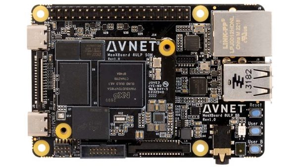

# TRIA Maaxboard 8ULP QuickStart

1. [Introduction](#1-introduction)
2. [Hardware Requirements](#2-hardware-requirements)
3. [Hardware Setup](#3-hardware-setup)
4. [Cloud Account Setup](#4-cloud-account-setup)
5. [/IOTCONNECT Device Template Setup](#5-iotconnect-device-template-setup)
6. [Device Setup](#6-device-setup)
7. [Using the Demo](#7-using-the-demo)
8. [Resources](#8-resources)

# 1. Introduction
This guide is designed to walk through the steps to connect the TRIA Maaxboard 8ULP to the Avnet /IOTCONNECT platform and demonstrate the standard IoT function of telemetry collection.

<table>
  <tr>
    <td></td>
    <td>MaaXBoard 8ULP features the NXP i.MX 8ULP processor to achieve ultra-low power, EdgeLock® secured intelligent edge applications. The i.MX 8ULP device is architected with 3 separate processing domains:

* The application domain includes two Arm® Cortex®-A35 (800 MHz) cores plus 3D/2D GPUs for GUI-enabled Linux applications.
* The Real Time domain includes an Arm Cortex-M33 (216 MHz) core, plus Fusion DSP (200 MHz) core for low-power audio/voice use cases.
* The LPAV domain (Low Power Audio Video) has a HiFi 4 DSP (475 MHz) core to support advanced audio, ML and sensor applications.</td>
  </tr>
</table>

# 2. Hardware Requirements
* TRIA Maaxboard 8ULP [Purchase](https://www.avnet.com/shop/us/products/avnet-engineering-services/aes-maaxb-8ulp-sk-g-3074457345648110677/) | [User Manual](https://www.avnet.com/wps/wcm/connect/onesite/60e2bb73-e479-4f76-821f-0b811ae52643/MaaXBoard-8ULP-User-Guide-v1.0.pdf?MOD=AJPERES&CACHEID=ROOTWORKSPACE.Z18_NA5A1I41L0ICD0ABNDMDDG0000-60e2bb73-e479-4f76-821f-0b811ae52643-oHYri7w) | [All Resources](https://www.avnet.com/wps/portal/us/products/avnet-boards/avnet-board-families/maaxboard/maaxboard-8ulp/?srsltid=AfmBOorNz2jO8e5kEJa7Yn3Qh_B-iuEQiawLVqTFyOsdT7U1ry41Dt_b)
* 2x USB Type-C Cables
* (Optional) 1x Ethernet Cable (and a local router/switch with Internet connectivity)
* (Optional) WiFi Network SSID and Password (more configuration is required for this method)

# 3. Hardware Setup
See the reference image below for cable connections.
<details>
<summary>Reference Image with Connections</summary>

</details>

1. (Optional) Connect an Ethernet cable from your LAN (router/switch) to the "ETH_A" port on the board.
2. Connect a USB-C cable from a 5V power souce (such as your host machine) to the "USB0/POWER" port on your board.
3. Connect a USB-C cable to your host machine for connection to the console

# 4. Cloud Account Setup
An /IOTCONNECT account with AWS backend is required.  If you need to create an account, a free trial subscription is available.

[/IOTCONNECT Free Trial (AWS Version)](https://subscription.iotconnect.io/subscribe?cloud=aws)

> [!NOTE]
> Be sure to check any SPAM folder for the temporary password after registering.

See the /IOTCONNECT [Subscription Information](https://github.com/avnet-iotconnect/avnet-iotconnect.github.io/blob/main/documentation/iotconnect/subscription/subscription.md) for more details on the trial.

# 5. /IOTCONNECT Device Template Setup
A Device Template define the type of telemetry the platform should expect to receive.
* Download the pre-made [Device Template](https://raw.githubusercontent.com/avnet-iotconnect/iotc-python-lite-sdk/refs/heads/main/files/plitedemo-template.json) (**MUST** Right-Click and "Save-As" to get the raw json file)
* Import the template into your /IOTCONNECT instance. (A guide on [Importing a Device Template](https://github.com/avnet-iotconnect/avnet-iotconnect.github.io/blob/main/documentation/iotconnect/import_device_template.md) is available or for more information, please see the [/IOTCONNECT Documentation](https://docs.iotconnect.io/iotconnect/) website.)

# 6. Device Setup
1. With the board powered on and connected to your host machine, open your Device Manager and note the COM ports that are in use by a "USB Serial Device" (may be multiple).
2. Open a terminal emulator program such as TeraTerm or PuTTY on your host machine.
3. Ensure that your serial settings in your terminal emulator are set to:
  - Baud Rate: 115200
  - Data Bits: 8
  - Stop Bits: 1
  - Parity: None
4. Open your Device Manager list, note the COM port being utilized by your adapter cable, and use that COM port to connect to your board via the terminal emulator.
>[!TIP]
>If you do not see your cable in the COM port list, check for it in the "Other devices" section. You may need to install/select the driver for the cable to get it to be recognized as a COM port connection.

>[!NOTE]
>A successful connection may result in just a blank terminal box. If you see a blank terminal box, press the ENTER key to get a login prompt. An unsuccessful connection attempt will usually result in an error window popping up.

5. When prompted for a login, type `root` followed by the ENTER key.
6. Wifi Setup (**OPTIONAL**): To set up your board to use a wifi internet connection instead of an ethernet connection, you can follow the [simple guide in this same directory](WIFI.md).
7. Run these commands to create and move into a directory for your demo files:
   ```
   mkdir /home/weston/demo
   cd /home/weston/demo
   ```
>[!TIP]
>To gain access to "copy" and "paste" functions inside of a Putty terminal window, you can CTRL+RIGHTCLICK within the window to utilize a dropdown menu with these commands. This is very helpful for copying/pasting between your borswer and the terminal.

8. Run this command to install the /IOTCONNECT Python Lite SDK:
   ```
   python3 -m pip install iotconnect-sdk-lite
   ```
9. Run this command to download and run the Quickstart setup script:
   ```
   curl -sOJ 'https://raw.githubusercontent.com/avnet-iotconnect/iotc-python-lite-sdk/refs/heads/main/scripts/quickstart.sh' && bash ./quickstart.sh
   ```

>[!IMPORTANT]
>The device template upload step of the quickstart script can be skipped since it was already taken care of in Step 5.

>[!NOTE]
>This script primarily covers device and certificate creation in /IOTCONNECT. It will require some copy/paste between your browser and the terminal window.

# 7. Using the Demo
1. Move into the correct directory and run the basic demo with these commands (can be copy and pasted as one):
```
cd /home/weston/demo
python3 /home/weston/demo/quickstart.py
```
2. View the dummy telemetry data under the "Live Data" tab for your device on /IOTCONNECT.

# 8. Resources
* [Purchase the TRIA Maaxboard OSM93](https://www.avnet.com/wps/portal/us/products/avnet-boards/avnet-board-families/maaxboard/maaxboard-osm93/?srsltid=AfmBOooL0Urtjf-giP8lPzs6dEfdVctJvArptaDqgqr9XMGEeMTIqkF_)
* [/IOTCONNECT Overview](https://www.iotconnect.io/)
* [/IOTCONNECT Knowledgebase](https://help.iotconnect.io/)
