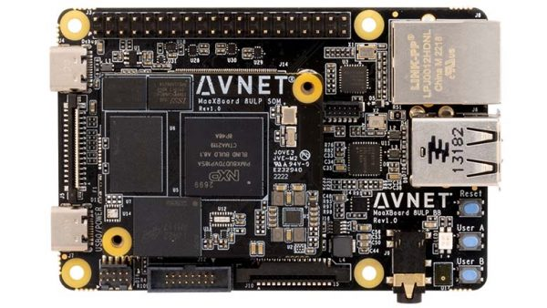

# TRIA MaaXBoard 8ULP QuickStart
[Purchase TRIA MaaXBoard 8ULP](https://www.newark.com/avnet/aes-maaxb-8ulp-sk-g/maaxboard-8ulp-sbc-arm-cortex/dp/87AK5106)
1. [Introduction](#1-introduction)
2. [Requirements](#2-requirements)
3. [Hardware Setup](#3-hardware-setup)
4. [Device Setup](#4-device-setup)
5. [Onboard Device](#5-onboard-device)
6. [Using the Demo](#6-using-the-demo)
7. [Resources](#7-resources)

# 1. Introduction

This guide is designed to walk through the steps to connect the TRIA MaaXBoard 8ULP to the Avnet /IOTCONNECT platform
and demonstrate the standard IoT function of telemetry collection.

<table>
  <tr>
    <td></td>
    <td>MaaXBoard 8ULP features the NXP i.MX 8ULP processor to achieve ultra-low power, EdgeLock® secured intelligent edge applications. The i.MX 8ULP device is architected with 3 separate processing domains:

* The application domain includes two Arm® Cortex®-A35 (800 MHz) cores plus 3D/2D GPUs for GUI-enabled Linux
  applications.
* The Real Time domain includes an Arm Cortex-M33 (216 MHz) core, plus Fusion DSP (200 MHz) core for low-power
  audio/voice use cases.
* The LPAV domain (Low Power Audio Video) has a HiFi 4 DSP (475 MHz) core to support advanced audio, ML and sensor
  applications.</td>
  </tr>

</table>

# 2. Requirements

## Hardware

* TRIA MaaXBoard 8ULP [Purchase](https://www.avnet.com/americas/product/avnet-engineering-services/aes-maaxb-8ulp-sk-g/evolve-57290182/) | [User Manual](https://www.avnet.com/wps/wcm/connect/onesite/60e2bb73-e479-4f76-821f-0b811ae52643/MaaXBoard-8ULP-User-Guide-v1.0.pdf?MOD=AJPERES&CACHEID=ROOTWORKSPACE.Z18_NA5A1I41L0ICD0ABNDMDDG0000-60e2bb73-e479-4f76-821f-0b811ae52643-oHYri7w) | [All Resources](https://www.avnet.com/wps/portal/us/products/avnet-boards/avnet-board-families/maaxboard/maaxboard-8ulp/?srsltid=AfmBOorNz2jO8e5kEJa7Yn3Qh_B-iuEQiawLVqTFyOsdT7U1ry41Dt_b)
* 2x USB Type-C Cables
* 1x Ethernet Cable (and a local router/switch with Internet connectivity)

## Software

* A serial terminal such as [TeraTerm](https://github.com/TeraTermProject/teraterm/releases)
  or [PuTTY](https://www.putty.org/)

# 3. Hardware Setup

See the reference image below for cable connections.
<details>
<summary>Reference Image with Connections</summary>

</details>

1. Connect an Ethernet cable from your LAN (router/switch) to the "ETH_A" port on the board.
2. Connect a USB-C cable from a 5V power source (such as your host machine) to the "USB0/POWER" port on your board.
3. Connect a USB-C cable from your host machine to the "Debug" port for connection to the console.

# 4. Device Setup

1. With the board powered on and connected to your host machine, open your Device Manager and note the COM ports that
   are in use by a "USB Serial Port" (should be 4 of them). You will use the **2nd-highest port number**. For example,
   if the 4 ports listed are COM46, COM47, COM48, and COM49, you will connect to COM48.
2. Open a terminal emulator program such as TeraTerm or PuTTY on your host machine.
3. Ensure that your serial settings in your terminal emulator are set to:

- Baud Rate: 115200
- Data Bits: 8
- Stop Bits: 1
- Parity: None

4. Connect to the port specified from sub-step 1 (2nd-highest port number)

> [!NOTE]
> A successful connection may result in just a blank terminal box. If you see a blank terminal box, press the ENTER key
> to get a login prompt. An unsuccessful connection attempt will usually result in an error window popping up.

5. When prompted for a login, type `root` followed by the ENTER key.
6. Run these commands to update the core board packages and install necessary /IOTCONNECT packages:

```
sudo apt-get update
```

```
python3 -m pip install iotconnect-sdk-lite requests
```

7. Run this command to create and move into a directory for your demo files:

```
mkdir -p /opt/demo && cd /opt/demo
```

> [!TIP]
> To gain access to "copy" and "paste" functions inside of a PuTTY terminal window, you can CTRL+RIGHTCLICK within the
> window to utilize a dropdown menu with these commands. This is very helpful for copying/pasting between your browser and
> the terminal.

# 5. Onboard Device

The next step is to onboard your device into /IOTCONNECT. This will be done via the online /IOTCONNECT user interface.

Follow [this guide](../common/general-guides/UI-ONBOARD.md) to walk you through the process.

> [!TIP]
> If you have obtained a solution key for your /IOTCONNECT account from Softweb Solutions, you can utilize the /IOTCONNECT 
> REST API to automate the device onboarding process via shell scripts. Check out [this guide](../common/general-guides/REST-API-ONBOARD.md) 
> for more info on that.

# 6. Using the Demo

Run the basic demo with this command:

```
python3 app.py
```

> [!NOTE]
> Always make sure you are in the ```/opt/demo``` directory before running the demo. You can move to this
> directory with the command: ```cd /opt/demo```

View the random-integer telemetry data under the "Live Data" tab for your device on /IOTCONNECT.

# 7. Resources
* [Purchase the TRIA MaaXBoard 8ULP](https://www.newark.com/avnet/aes-maaxb-8ulp-sk-g/maaxboard-8ulp-sbc-arm-cortex/dp/87AK5106)
* [/IOTCONNECT Overview](https://www.iotconnect.io/)
* [/IOTCONNECT Knowledgebase](https://help.iotconnect.io/)
