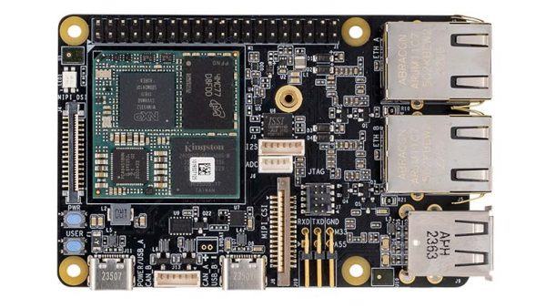
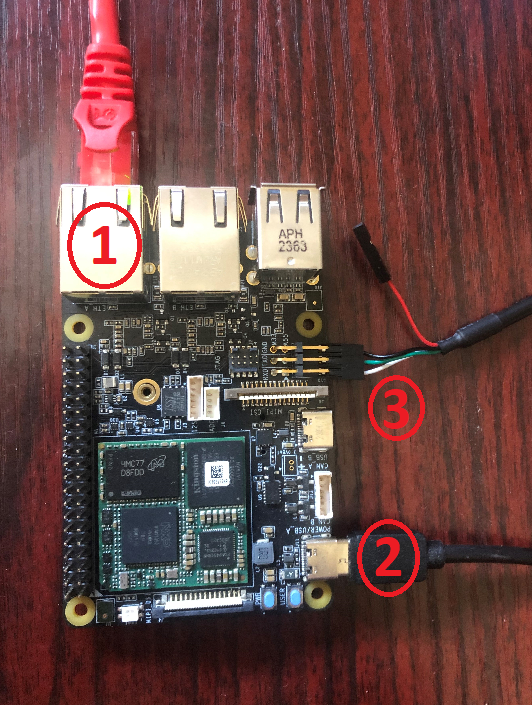

# Tria MaaXBoard OSM93 QuickStart

1. [Introduction](#1-introduction)
2. [Hardware Requirements](#2-hardware-requirements)
3. [Hardware Setup](#3-hardware-setup)
4. [Cloud Account Setup](#4-cloud-account-setup)
5. [Device Setup](#5-device-setup)
6. [Using the Demo](#6-using-the-demo)
7. [Resources](#7-resources)

# 1. Introduction
This guide is designed to walk through the steps to connect the Tria MaaXBoard OSM93 to the Avnet /IOTCONNECT platform and demonstrate the standard IoT function of telemetry collection.

<table>
  <tr>
    <td></td>
    <td>The MaaXBoard OSM93 features an energy-efficient, combination CPU/MPU/NPU, high-performance OSM compute system based on the NXP i.MX93 processor. The i.MX 93 device is architected with 3 separate processing domains: An application domain that includes two Arm® Cortex®-A55 (2.7 GHz) cores,
a real time domain includes an Arm® Cortex®-M33 (250 MHz) core, and an on-board AI accelerator, Arm® Ethos-U65 MicroNPU for machine learning and computer vision applications.</td>
  </tr>
</table>

# 2. Requirements
## Hardware
* Tria MaaXBoard OSM93 [Purchase](https://www.avnet.com/wps/portal/us/products/avnet-boards/avnet-board-families/maaxboard/maaxboard-osm93/?srsltid=AfmBOooL0Urtjf-giP8lPzs6dEfdVctJvArptaDqgqr9XMGEeMTIqkF_) | [User Manual](https://www.avnet.com/wps/wcm/connect/onesite/80927648-7b98-4063-b91e-a8cb2e51e8a6/MaaXBoard+OSM93+User+Guide+v1.0.pdf?MOD=AJPERES&CACHEID=ROOTWORKSPACE.Z18_NA5A1I41L0ICD0ABNDMDDG0000-80927648-7b98-4063-b91e-a8cb2e51e8a6-pf2HBHv) | [All Resources](https://www.avnet.com/wps/portal/us/products/avnet-boards/avnet-board-families/maaxboard/maaxboard-osm93/?srsltid=AfmBOooL0Urtjf-giP8lPzs6dEfdVctJvArptaDqgqr9XMGEeMTIqkF_)
* 1x USB Type-C Cables (included in kit)
* 1x USB to TTL Serial 3.3V Adapter Cable (must be purchased separately, this is [the cable used by Avnet's engineer](https://www.amazon.com/Serial-Adapter-Signal-Prolific-Windows/dp/B07R8BQYW1/ref=sr_1_1_sspa?dib=eyJ2IjoiMSJ9.FmD0VbTCaTkt1T0GWjF9bV9JG8X8vsO9mOXf1xuNFH8GM1jsIB9IboaQEQQBGJYV_o_nruq-GD0QXa6UOZwTpk1x_ISqW9uOD5XoQcFwm3mmgmOJG--qv3qo5MKNzVE4aKtjwEgZcZwB_d7hWTgk11_JJaqLFd1ouFBFoU8aMUWHaEGBbj5TtX4T6Z_8UMSFS4H1lh2WF5LRprjLkSLUMF656W-kCM4MGU5xLU5npMw.oUFW_sOLeWrhVW0VapPsGa03-dpdq8k5rL4asCbLmDs&dib_tag=se&keywords=detch+usb+to+ttl+serial+cable&qid=1740167263&sr=8-1-spons&sp_csd=d2lkZ2V0TmFtZT1zcF9hdGY&psc=1))
>[!NOTE]
>The USB to TTL Serial 3.3V Adapter Cable may require you to install a specific driver onto your host machine. The example cable linked above requires a [PL2303 driver](https://www.prolific.com.tw/us/showproduct.aspx?p_id=225&pcid=41).
* 1x Ethernet Cable (and a local router/switch with Internet connectivity)

## Software
* A serial terminal such as [TeraTerm](https://github.com/TeraTermProject/teraterm/releases) or [PuTTY](https://www.putty.org/)

# 3. Hardware Setup
See the reference image below for cable connections.
<details>
<summary>Reference Image with Connections</summary>

</details>

1. Connect an Ethernet cable from your LAN (router/switch) to the "ETH_A" port on the board.
2. Connect a USB-C cable from a 5V power souce (such as your host machine) to the "POWER/USB_A" port on your board.
3. Connect your USB to TTL Serial 3.3V Adapter Cable to the appropriate pins on the A55 debug header.
>[!NOTE]
>The A55 debug header is the **lower** row of 3 pins, the upper row should be left open.

>[!IMPORTANT]
>When connecting the wires of your USB to TTL Serial 3.3V Adapter Cable, the "TXD" pin of the board should connect to the "RXD" wire of your cable. Similarly, the "RXD" pin of the board should connect to the "TXD" wire of your cable. "GND" connects to "GND".

# 4. Cloud Account Setup
An /IOTCONNECT account with AWS backend is required.  If you need to create an account, a free trial subscription is available.
The free subscription may be obtained directly from iotconnect.io or through the AWS Marketplace.


* Option #1 (Recommended) [/IOTCONNECT via AWS Marketplace](https://github.com/avnet-iotconnect/avnet-iotconnect.github.io/blob/main/documentation/iotconnect/subscription/iotconnect_aws_marketplace.md) - 60 day trial; AWS account creation required
* Option #2 [/IOTCONNECT via iotconnect.io](https://subscription.iotconnect.io/subscribe?cloud=aws) - 30 day trial; no credit card required


> [!NOTE]
> Be sure to check any SPAM folder for the temporary password after registering.

# 5. Device Setup
1. With the board powered on and connected to your host machine, open your Device Manager list and note the COM port being utilized by your adapter cable.
>[!TIP]
>If you do not see your cable in the COM port list, check for it in the "Other devices" section. You may need to install/select the driver for the cable to get it to be recognized as a COM port connection.

2. Open a terminal emulator program such as TeraTerm or PuTTY on your host machine.
3. Ensure that your serial settings in your terminal emulator are set to:
  - Baud Rate: 115200
  - Data Bits: 8
  - Stop Bits: 1
  - Parity: None
4. Use that COM port from sub-step 1 to connect to your board via the terminal emulator.

>[!NOTE]
>A successful connection may result in just a blank terminal box. If you see a blank terminal box, press the ENTER key to get a login prompt. An unsuccessful connection attempt will usually result in an error window popping up.

5. When prompted for a login, type `root` followed by the ENTER key.
6. Run these commands to update the core board packages and install necessary IoTConnect packages:
   ```
   sudo apt-get update
   python3 -m pip install iotconnect-sdk-lite
   python3 -m pip install iotconnect-rest-api
   ```
>[!TIP]
>To gain access to "copy" and "paste" functions inside of a PuTTY terminal window, you can CTRL+RIGHTCLICK within the window to utilize a dropdown menu with these commands. This is very helpful for copying/pasting between your borswer and the terminal.

7. Run these commands to create and move into a directory for your demo files:
   ```
   mkdir /home/weston/demo
   cd /home/weston/demo
   ```
8. Run this command to first protect your IoTConnect credentials:
   ```
   export HISTCONTROL=ignoreboth
   ```
   Then run this IoTConnect REST API CLI command (with your credentials substituted in) to log into your IoTConnect account on the device:
   ```
   iotconnect-cli configure -u my@email.com -p "MyPassword" --pf mypf --env myenv --skey=mysolutionkey
   ```
   For example if these were your credentials:
   * Email: `john.doe@gmail.com`
   * Password: Abc123!
   * Platform: aws
   * Environment: technology
   * Solution Key: AbCdEfGhIjKlMnOpQrStUvWxYz1234567890
     
   Your login command would be:
   ```
   iotconnect-cli configure -u john.doe@gmail.com -p "Abc123!" --pf aws --env technology --skey=AbCdEfGhIjKlMnOpQrStUvWxYz1234567890
   ```
   You will see this output in the console if your login succeeded:
   ```
   Logged in successfully.
   ```
Run this command to download and run the device setup script:
   ```
   curl -sOJ 'https://raw.githubusercontent.com/avnet-iotconnect/iotc-python-lite-sdk-demos/refs/heads/main/common/scripts/device-setup.py' && python3 device-setup.py
   ```

# 6. Using the Demo
1. Run the basic demo with this command:
```
python3 app.py
```
>[!NOTE]
>Always make sure you are in the ```/home/weston/demo``` directory before running the demo. You can move to this directory with the command: ```cd /home/weston/demo```

2. View the random-integer telemetry data under the "Live Data" tab for your device on /IOTCONNECT.

# 7. Resources
* [Purchase the Tria MaaXBoard OSM93](https://www.avnet.com/wps/portal/us/products/avnet-boards/avnet-board-families/maaxboard/maaxboard-osm93/?srsltid=AfmBOooL0Urtjf-giP8lPzs6dEfdVctJvArptaDqgqr9XMGEeMTIqkF_)
* [/IOTCONNECT Overview](https://www.iotconnect.io/)
* [/IOTCONNECT Knowledgebase](https://help.iotconnect.io/)
