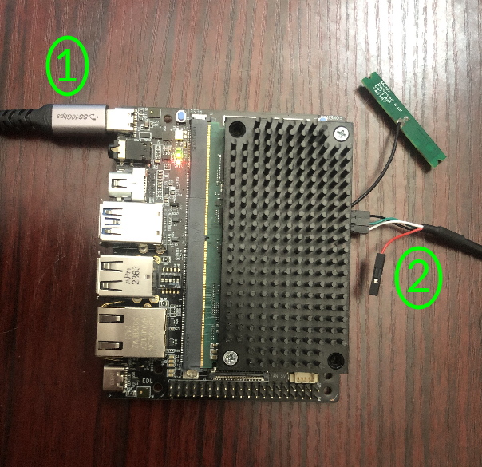

# Tria Vision AI-KIT 6490 Quickstart

1. [Introduction](#1-introduction)
2. [Requirements](#2-hardware-requirements)
3. [Hardware Setup](#3-hardware-setup)
4. [Cloud Account Setup](#4-cloud-account-setup)
5. [Device Setup](#5-device-setup)
6. [Using the Demo](#6-using-the-demo)
7. [Resources](#7-resources)

# 1. Introduction

This guide is designed to walk through the steps to connect the Tria Vision AI-KIT 6490 to the Avnet /IOTCONNECT platform
and demonstrate the standard IoT function of telemetry collection.

<table>
  <tr>
    <td></td>
    <td>The Vision AI-KIT 6490 features an energy-efficient, multi-camera, SMARC 2.1.1 compute module, based on the 
Qualcomm QCS6490 SOC device</td>
  </tr>
</table>

# 2. Requirements

## Hardware

* Tria Vision AI-KIT 6490 (Available for purchase from Avnet soon!) | [Product Brief](https://d7rh5s3nxmpy4.cloudfront.net/CMP7377/files/FY26_1712_Qualcomm_Vision-AI_Dev_Board_Product_Brief.pdf) | [All Resources](https://www.tria-technologies.com/product/vision-ai-kit-6490/)
* USB to TTL Serial 3.3V Adapter Cable (must be purchased separately, click [here](https://www.amazon.com/Serial-Adapter-Signal-Prolific-Windows/dp/B07R8BQYW1/ref=sr_1_1_sspa?dib=eyJ2IjoiMSJ9.FmD0VbTCaTkt1T0GWjF9bV9JG8X8vsO9mOXf1xuNFH8GM1jsIB9IboaQEQQBGJYV_o_nruq-GD0QXa6UOZwTpk1x_ISqW9uOD5XoQcFwm3mmgmOJG--qv3qo5MKNzVE4aKtjwEgZcZwB_d7hWTgk11_JJaqLFd1ouFBFoU8aMUWHaEGBbj5TtX4T6Z_8UMSFS4H1lh2WF5LRprjLkSLUMF656W-kCM4MGU5xLU5npMw.oUFW_sOLeWrhVW0VapPsGa03-dpdq8k5rL4asCbLmDs&dib_tag=se&keywords=detch+usb+to+ttl+serial+cable&qid=1740167263&sr=8-1-spons&sp_csd=d2lkZ2V0TmFtZT1zcF9hdGY&psc=1)
* Wi-Fi (ethernet not enabled in default device state)

## Software

* A serial terminal such as [TeraTerm](https://github.com/TeraTermProject/teraterm/releases)
  or [PuTTY](https://www.putty.org/)

# 3. Hardware Setup

See the reference images below for cable connections.
<details>
<summary>General Reference Image for Cable Connections</summary>

</details>

<details>
<summary>Reference Image for Serial Connection Pinout</summary>

</details>

1. Connect your 9V USB-C power supply to the USB-C connector of the board labeled **#1**.
2. Connect the serial adapter cable from your PC to the appropriate pins on the rear of the kit labeled **#2**. (See the
second reference image for pinout help)

After all connections have been made, press the S1 button (shown below) in the corner of the board to power-on the board. 
You will see additional LED activity as the board boots up.


# 4. Cloud Account Setup

An /IOTCONNECT account with AWS backend is required. If you need to create an account, a free trial subscription is
available.
The free subscription may be obtained directly from iotconnect.io or through the AWS Marketplace.

* Option #1 (
  Recommended) [/IOTCONNECT via AWS Marketplace](https://github.com/avnet-iotconnect/avnet-iotconnect.github.io/blob/main/documentation/iotconnect/subscription/iotconnect_aws_marketplace.md) -
  60 day trial; AWS account creation required
* Option #2 [/IOTCONNECT via iotconnect.io](https://subscription.iotconnect.io/subscribe?cloud=aws) - 30 day trial; no
  credit card required

> [!NOTE]
> Be sure to check any SPAM folder for the temporary password after registering.

# 5. Device Setup

1. With the board powered on and connected to your host machine, open your Device Manager list and note the COM port
   being utilized by your adapter cable.
2. Open a terminal emulator program such as TeraTerm or PuTTY on your host machine.
3. Ensure that your serial settings in your terminal emulator are set to:

- Baud Rate: 115200
- Data Bits: 8
- Stop Bits: 1
- Parity: None

4. Use that COM port from sub-step 1 to connect to your board via the terminal emulator.

> [!NOTE]
> A successful connection may result in just a blank terminal box. If you see a blank terminal box, press the ENTER key
> to get a login prompt. An unsuccessful connection attempt will usually result in an error window popping up.

5. When prompted for a login, type `root` followed by the ENTER key. For the default image, the password should be `oelinux123`.

6. Run these commands to begin to configure your board for /IOTCONNECT:

```
opkg update
```

```
python3 -m pip install iotconnect-sdk-lite requests
```

```
mkdir -p /home/weston/demo && cd /home/weston/demo
```

> [!TIP]
> To gain access to "copy" and "paste" functions inside of a PuTTY terminal window, you can CTRL+RIGHTCLICK within the
> window to utilize a dropdown menu with these commands. This is very helpful for copying/pasting between your browser
> and
> the terminal.

The next step will be to onboard your ZUBoard-1CG into /IOTCONNECT.

# 6. Onboard Device via Online /IOTCONNECT Platform

1. In a web browser, navigate to console.iotconnect.io and log into your account.
2. In the blue toolbar on the left edge of the page, hover over the "processor" icon and then in the resulting dropdown
   select "Device."
3. Now in the resulting Device page, click on the "Templates" tab of the blue toolbar at the bottom of the screen.
4. Right-click and then click "save link as"
   on [this link to the default device template](https://raw.githubusercontent.com/avnet-iotconnect/iotc-python-lite-sdk-demos/refs/heads/main/common/templates/plitedemo-template.json)
   to download the raw template file.
5. Back in the /IOTCONNECT browser tab, click on the "Create Template" button in the top-right of the screen.
6. Click on the "Import" button in the top-right of the resulting screen.
7. Select your downloaded copy of the plitedemo template from sub-step 4 and then click "save".
8. Click on the "Devices" tab of the blue toolbar at the bottom of the screen.
9. In the resulting page, click on the "Create Device" button in the top-right of the screen.
10. Customize the "Unique ID" and "Device Name" fields to your needs.
11. Select the most appropriate option for your device from the "Entity" dropdown (only for organization, does not
    affect connectivity).
12. Select "plitedemo" from the "Template" dropdown.
13. In the resulting "Device Certificate" field, make sure "Auto-generated" is selected.
14. Click the "Save and View" buton to go to the page for your new device.
15. Click on "Connection Info" on the right side of the device page above the processor icon.
16. In the resulting pop-up, click on the yellow/green certificate icon to download a zip file containing your device's
    certificates, and then close the pop-up.
17. Extract the zip folder and then rename the ```.pem``` file to ```device-pkey.pem``` and the ```.crt``` file to
    ```device-cert.crt```.
18. Still on your host machine, use this command within the unzipped certificates folder to convert the ```.crt``` file
    to another ```.pem``` file (application is expecting ```.pem``` files):

```
openssl x509 -in device-cert.crt -out device-cert.pem -outform PEM
```

> [!NOTE]
> If you are using a Windows host machine, this command is most easily performed via Git Bash. Using CMD or Powershell
> may require additional configuration of openssl.

19. Back in your device's page in /IOTCONNECT, click on the black/white/green paper-and-cog icon in the top-right of the
    device page (just above "Connection Info") to download your device's configuration file.
20. Using SCP (or WinSCP) copy these 3 files into the ```/home/weston/demo``` directory of your board:
    * device-cert.pem
    * device-pkey.pem
    * iotcDeviceConfig.json

> [!IMPORTANT]
> These files must be copied **individually** into the ```/home/weston/demo``` directory. They cannot be wrapped inside
> of another folder.

21. In the terminal of your board, navigate to the ```/home/weston/demo``` directory and then run this command to
    download the basic quickstart /IOTCONNECT application called ```app.py```:

```
wget https://raw.githubusercontent.com/avnet-iotconnect/iotc-python-lite-sdk-demos/refs/heads/main/stm32mp157f-dk2/starter-demo/src/app.py -O app.py
```

# 7. Using the Demo

1. Run the basic demo with this command:

```
python3 app.py
```

> [!NOTE]
> Always make sure you are in the ```/home/weston/demo``` directory before running the demo. You can move to this
> directory with the command: ```cd /home/weston/demo```

2. View the random-integer telemetry data under the "Live Data" tab for your device on /IOTCONNECT.

# 8. Resources
* Available for purchase from Avnet soon!
* [/IOTCONNECT Overview](https://www.iotconnect.io/)
* [/IOTCONNECT Knowledgebase](https://help.iotconnect.io/)
