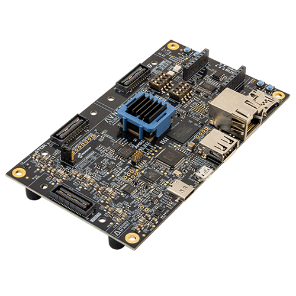
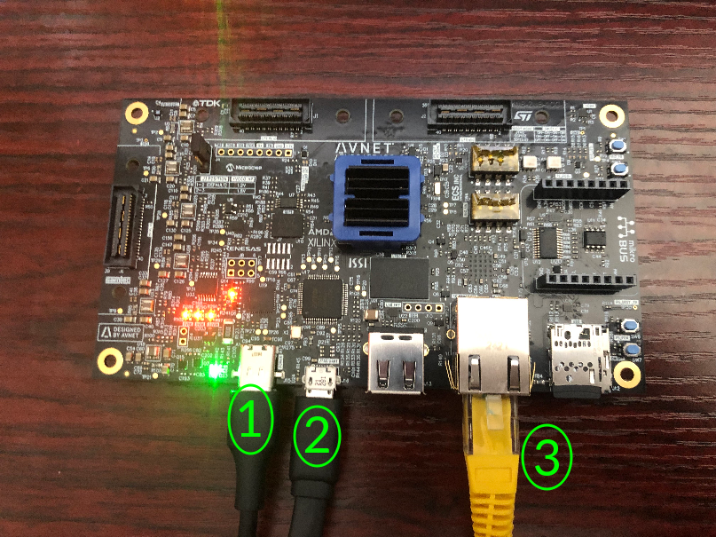
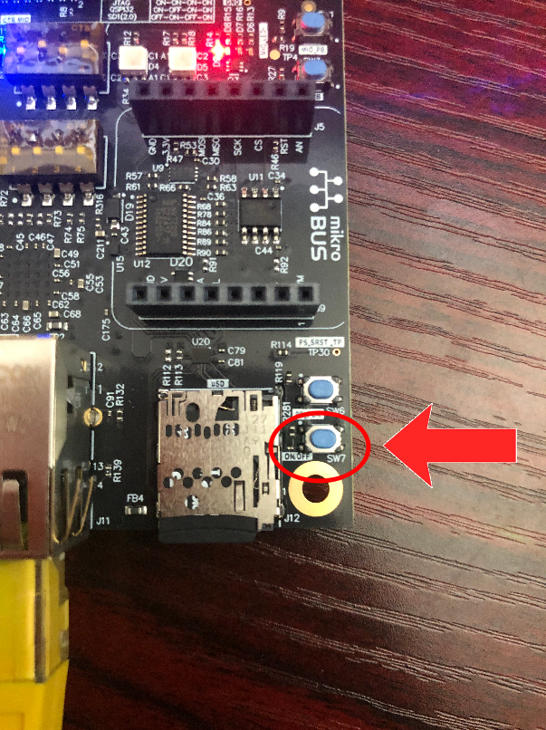

# Tria ZUBOARD-1CG QuickStart

1. [Introduction](#1-introduction)
2. [Requirements](#2-requirements)
3. [Linux Image Flashing](#3-linux-image-flashing)
4. [Hardware Setup](#4-hardware-setup)
5. [/IOTCONNECT: Cloud Account Setup](#5-iotconnect-cloud-account-setup)
6. [Device Setup](#6-device-setup)
7. [Onboard Device via Online /IOTCONNECT Platform](#7-onboard-device-via-online-iotconnect-platform)
8. [Using the Demo](#8-using-the-demo)
9. [Resources](#9-resources)

# 1. Introduction

This guide is designed to walk through the steps to connect the Tria ZUBOARD-1CG to the Avnet /IOTCONNECT platform
and demonstrate the standard IoT function of telemetry collection.

<table>
  <tr>
    <td></td>
    <td>The ZUBOARD-1CG provides the flexibility and versatility for engineers to experiment with and learn the AMD 
Zynq® UltraScale+™ architecture. The affordable ZU1CG device features 81K programmable logic cells with a Dual-core Arm® 
Cortex®-A53 MPCore™ and Dual-core Arm Cortex-R5F MPCore, as well as cache and on-chip memory. The board also features 1GB 
of ISSI LPDDR4 with non-volatile boot options in the 256Mb ISSI QSPI Flash or a microSD card slot.</td>
  </tr>
</table>

# 2. Requirements

## Hardware

* Tria ZUBOARD-1CG [Purchase](https://www.avnet.com/americas/product/avnet-engineering-services/aes-zub-1cg-dk-g/evolve-54822506/) | [Product Guide](https://www.avnet.com/opasdata/d120001/medias/docus/298/FY25_1574_Tria_ZUBoard_1CG_Product_Brief-2_vp.pdf) | [All Resources](https://www.tria-technologies.com/product/zuboard-1cg/)
* 15V/3A USB-C Power Supply (not included in kit, click [here](https://www.amazon.com/dp/B09LTV8XLC?ref=cm_sw_r_cso_cp_apin_dp_DA3J2KXP34BX7WYTTDAJ&ref_=cm_sw_r_cso_cp_apin_dp_DA3J2KXP34BX7WYTTDAJ&social_share=cm_sw_r_cso_cp_apin_dp_DA3J2KXP34BX7WYTTDAJ&titleSource=true) to see the supply used by Avnet's engineer)
* Micro-USB cable (for serial communication)
* Ethernet Cable (and a local router/switch with Internet connectivity)

## Software

* A serial terminal such as [TeraTerm](https://github.com/TeraTermProject/teraterm/releases)
  or [PuTTY](https://www.putty.org/)

# 3. Linux Image Flashing

Download the compressed publicly-available Linux image for the ZUBoard-1CG available [here](https://downloads.iotconnect.io/partners/avnet/disk-images/tria_zub1cg_2023_2_sdimage_20241029.img.gz)
and flash the image to a Micro-SD card using a software program such as Balena Etcher. After flashing, insert the Micro-SD
card into the Micro-SD card slot on the board before proceeding to the next step.

# 4. Hardware Setup

See the reference image below for cable connections.
<details>
<summary>Reference Image with Connections</summary>

</details>

1. Connect your 15V/3A USB-C power supply to the USB-C connector of the board labeled **#1**.
2. Connect the micro-USB cable from your PC to the micro-USB connector on the board labeled **#2**.
3. Connect an ethernet cable from your router/switch to the ethernet connector on the board labeled **#3**.

After all connections have been made, press the SW7 button (shown below) in the corner of the board closest to the Micro-SD 
card slot to power-on the board. You will see additional LEDs illuminate as the board boots up.

> [!NOTE]
> You do not need to hold down the SW7 power button, a quick click is sufficient.



# 5. /IOTCONNECT: Cloud Account Setup

An /IOTCONNECT account with AWS backend is required. If you need to create an account, a free trial subscription is
available.
The free subscription may be obtained directly from iotconnect.io or through the AWS Marketplace.

* Option #1 (
  Recommended) [/IOTCONNECT via AWS Marketplace](https://github.com/avnet-iotconnect/avnet-iotconnect.github.io/blob/main/documentation/iotconnect/subscription/iotconnect_aws_marketplace.md) -
  60 day trial; AWS account creation required
* Option #2 [/IOTCONNECT via iotconnect.io](https://subscription.iotconnect.io/subscribe?cloud=aws) - 30 day trial; no
  credit card required

> [!NOTE]
> Be sure to check any SPAM folder for the temporary password after registering.

# 6. Device Setup

1. With the board powered on and connected to your host machine, open your Device Manager list and note the COM port
   being utilized by your adapter cable.
2. Open a terminal emulator program such as TeraTerm or PuTTY on your host machine.
3. Ensure that your serial settings in your terminal emulator are set to:

- Baud Rate: 115200
- Data Bits: 8
- Stop Bits: 1
- Parity: None

4. Use that COM port from sub-step 1 to connect to your board via the terminal emulator.

> [!NOTE]
> A successful connection may result in just a blank terminal box. If you see a blank terminal box, press the ENTER key
> to get a login prompt. An unsuccessful connection attempt will usually result in an error window popping up.

5. When prompted for a login, type `root` followed by the ENTER key.
6. Run these commands to begin to configure your board for /IOTCONNECT:

```
sudo opkg update
```

```
python3 -m pip install iotconnect-sdk-lite requests
```

```
mkdir -p /home/weston/demo && cd /home/weston/demo
```

> [!TIP]
> To gain access to "copy" and "paste" functions inside of a PuTTY terminal window, you can CTRL+RIGHTCLICK within the
> window to utilize a dropdown menu with these commands. This is very helpful for copying/pasting between your browser
> and the terminal.

# 7. Onboard Device

The next step is to onboard your device into /IOTCONNECT. This will be done via the online /IOTCONNECT user interface.

Follow [this guide](../common/general-guides/UI-ONBOARD.md) to walk you through the process.

# 8. Using the Demo

Run the basic demo with this command:

```
python3 app.py
```

> [!NOTE]
> Always make sure you are in the ```/home/weston/demo``` directory before running the demo. You can move to this
> directory with the command: ```cd /home/weston/demo```

View the random-integer telemetry data under the "Live Data" tab for your device on /IOTCONNECT.

# 9. Resources

* [Purchase the Tria ZUBOARD-1CG](https://www.avnet.com/americas/product/avnet-engineering-services/aes-zub-1cg-dk-g/evolve-54822506/)
* [/IOTCONNECT Overview](https://www.iotconnect.io/)
* [/IOTCONNECT Knowledgebase](https://help.iotconnect.io/)
